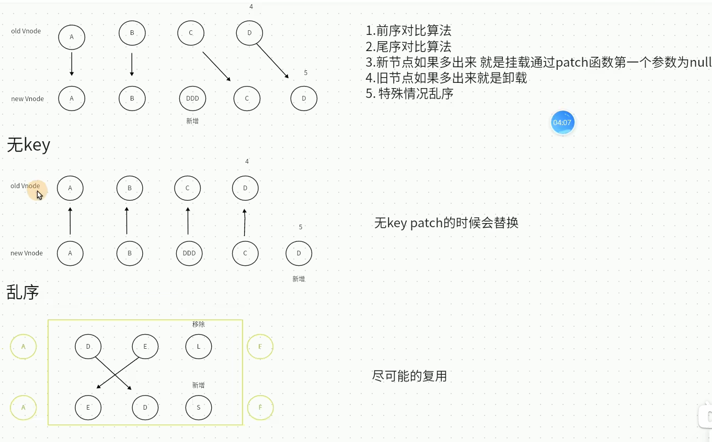
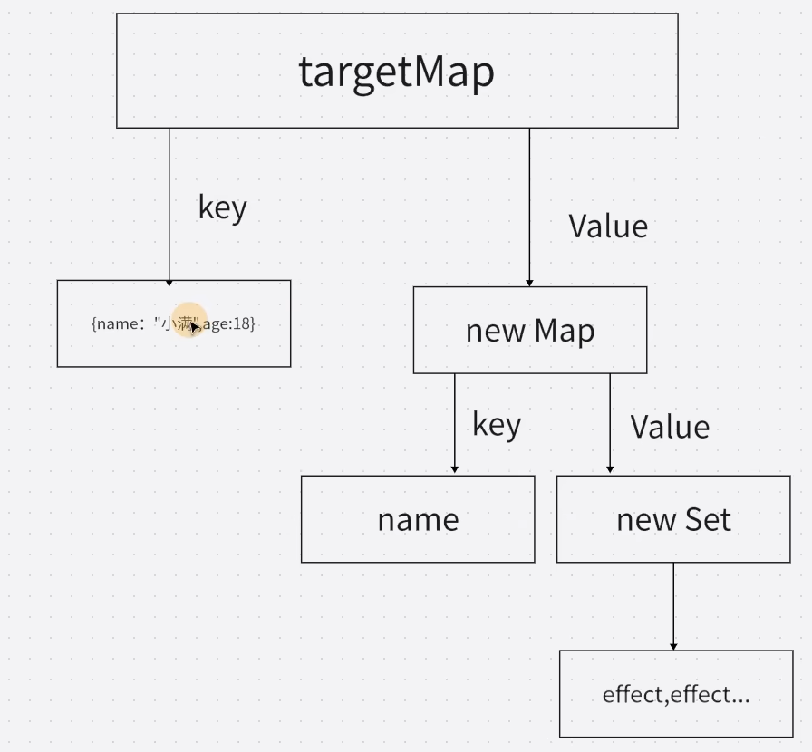
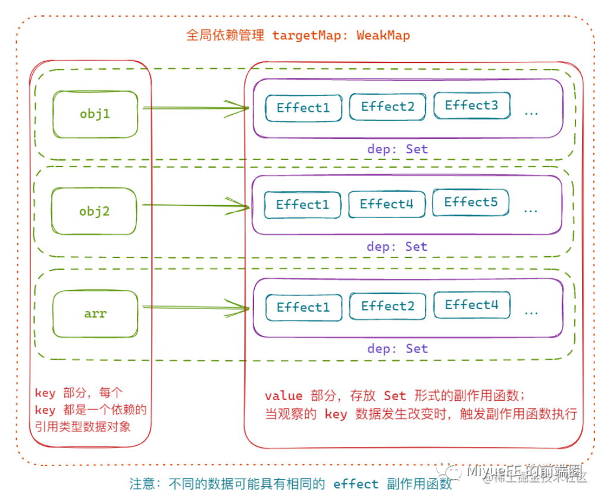
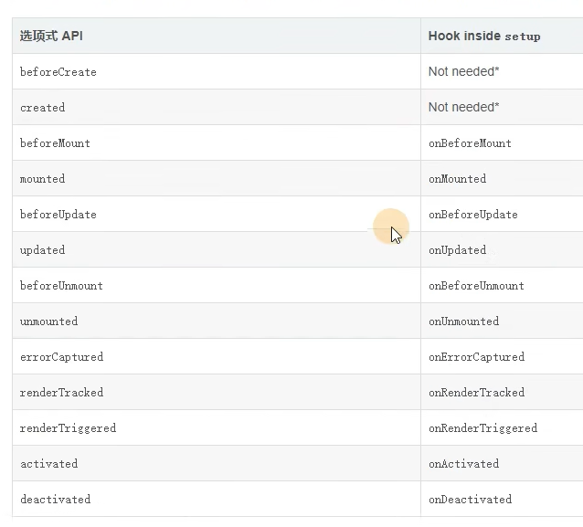
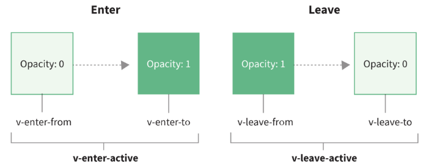
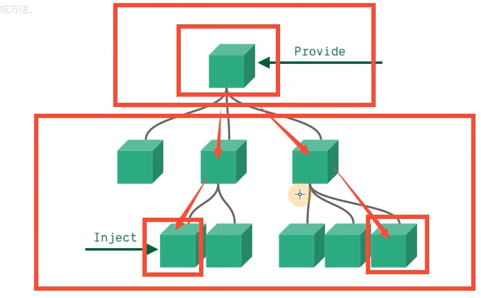

### composition API

#### setup

```javascript
export default {
  setup() {
    const prop = ref('')
    const fn = () => {

    }
    return { prop, fn }
  }
}
```

- <script steup>语法糖

#### ref、reactive等

- ref

  - 可以获取dom

    ```javascript
    <div ref="dom">我是DOM</dov>
    
    <script setup>
      //必须跟上面的名字一样
      const dom = ref()
      console.log(dom.value)
    </script>
    ```


  - isRef、shallowRef...

  - reactive

    - shallowReactive

    - script里不需要再使用value

      ```javascript
        <script setup lang="js">
        let obj = reactive({a: '1'})
      const handleChangeObj = () => {
        //以下非响应式
        obj = reactive({...obj, b: '2'})
        obj = {...obj, b: '2'}
        //以下响应式
        obj.b = '2'
        Object.assign(obj, {b: '2'})
      }
      </script>
      ```

  - 以上两个区别

    - ref支持所有类型，reactive引用类型(Array、Object、Map、Set、Function...)
    - ref取值或复制都需要加value，reactive不需要
    - reactive通过proxy实现，不能直接赋值，否则破坏响应式
      - 数组通过push加解构`arr.push[...res]`
      - reactive添加一个对象，把数组作为一个属性去解决
      - reactive是对象的话可以使用Object.assign

#### toRef全家桶

- toRef

  - 只能修改响应式对象的值，非响应式视图毫无变化

    ```javascript
    //const man = {name:'Jack', age: 33}
    const man = reactive({name:'Jack', age: 33})
    //使用场景是传递个key和响应式的对象
    const like = toRef(man, 'name')
  
    const change = () => {
      like.value = 'Iori-yagami'
      console.log(like)
    }
  
    {{ man }} | {{ like }}

- toRefs

  - 解构响应式对象时使用

    ```javascript
    const man = reactive({name:'Jack', age: 33})
  
    let {name, age} = toRefs(man)
  
    const change = () => {
      name.value = 'Iori-yagami'
      console.log(name, age)
    }
    ```

- toRaw

#### computed

```javascript
import { ref, computed } from 'vue'

const firstName = ref('')
const lastName = ref('')

//way1
const fullName = computed(() => {
  return firstName.value + lastName.value
})

//way2
const fullName = computed(() => {
  get() {
    return firstName.value + lastName.value
  },
  set() {
    firstName.value + lastName.value
  },
})


//千万不要修改源数据！
const characterCount = computed(() => {
  return [...newItem.value].reverse()
})

{{ characterCount }}
```

#### watch

```javascript
<script setup>
import { ref, reactive, watch } from 'vue'

const message = ref('Jack')
const message2 = ref('Jack')

watch(message, (newVal, oldValue) => {
  console.log(newVal, oldValue)
})

//侦听多个数据源，cb的参数也变成数组，顺序与前面一致
watch([message, message2], (([message, message2], [prevMessage, prevMessage2])) => {
  console.log(newVal, oldValue)
})


//监听对象
//需要注意newVal和oldVal是一样的
//使用reactive返回的响应式对象不需要设置deep
const message = ref({name: 'Jack', age: 33})
watch(message, (newVal, oldVal) => {
  console.log(newVal, oldValue)
}, {
  deep: true
  //immediate
  //flush: "pre"组件更新前 / "async" / "post"
})

const message = ref({name: 'Jack', age: 33})
watch(message, (newVal, oldVal) => {
  console.log(newVal, oldValue)
}, {
  deep: true
})

//回调函数监听专门的属性
watch(() => message.age, (newVal, oldValue) => {
  console.log(newVal, oldValue)
})

//停止
const stop = watch(() => message.age, (newVal, oldValue) => {
  console.log(newVal, oldValue)
})

stop()

//onTrigger
const stop = watch(() => message.age, (newVal, oldValue) => {
  console.log(newVal, oldValue)
}), {
  onTrigger(e) {
  	debugger
  }
})
</script>
```

##### watchEffect

```javascript
<script setup>
import { ref, watchEffect } from 'vue'

const message = ref('Jack')
const message2 = ref('Jack')

//自动会调一下
watchEffect((cb) => {
  console.log(message.value)
})

watchEffect((cb) => {
  console.log(message.value)
  //先执行cb，再监听
  cb(() => {
    console.log('before')
  })
})


//停止
//也有flush
//onTrigger
</script>
```

### key-diff解析

- 为什么要虚拟DOM

  

### Vue3响应式简易实现

- Vue2 使用的是Object.defineProperty(), Vue3 Proxy
- Object.defineProperty()只能设置提前设置好的值，新增需要$set，数组是重写额7个原型方法，修改某一项值是无法劫持

```html
<script type="module">
export const reactive = (target) => {
	return new Proxy(target, {
		get(target, key, receiver) {
			let res = Reflect.get(target, key, receiver)
			track(target, key)
			return res
		},
		set(target, key, value, receiver) {
			let res = Reflect.set(target, key, value, receiver)
			trigger(target, key)
			return res
		},
	})
}

//收集起来，当依赖发生变化后执行副作用函数，即实现依赖收集和依赖更新
let activeEffect
export const effect = (fn) => {
	const _effect = function () {
		activeEffect = _effect
		fn()
	}
	_effect()
}

const targetMap = new WeakMap()
export const track = (target, key) => {
	if (!activeEffect) return
	let depsMap = targetMap.get(target)
	if (!depsMap) {
		depsMap = new Map()
		targetMap.set(target, depsMap)
	}
	let deps = depsMap.get(key)
	if (!deps) {
		deps = new Set()
		depsMap.set(key, deps)
	}
	deps.add(activeEffect)
}

export const trigger = (target, key) => {
	const depsMap = targetMap.get(target)
	if (!depsMap) return
	const deps = depsMap.get(key)
	deps.forEach((effect) => effect())
}

const user = reactive({
  name: 'Jack',
  age: 33,
})

effect(() => {
  document.querySelector('#app').innerText = `${user.name}-${user.age}`
})

setTimeout(()=> {
  user.name = 'Iori'
}, 2000)
</script>
```





### 生命周期



### 组件

#### 父传子defineProps

```javascript
<template>
  <div>{{ title }}</div>
</template>

<script setup>
const props = defineProps({
  title: {
    type: String,
    default: '默认值'
  }
})
console.log(props.title)
</script>
```

#### 子传父

```javascript
<template>
  <div>{{ title }}</div>
  <button @click="send"></button>
</template>

<script setup>
//const emit = defineEmits('on-click')
const emit = defineEmits(['on-click'])
const send = () => {
  emit('on-click', 'Jack')
}
</script>
```

#### defineExpose

```javascript
选择暴露给父组件的属性
defineEmits({
  name:xxx
  ...
})

//parent
<Child ref="xxxx"></Child>

xxxx.name
```

#### 递归组件

```javascript
<template>
  <div class="tree" v-for="item in data" @click.stop="click(item, $event)">
    <input v-model="item.checked" type="checkbox" /><span>{{ item.name }}</span>
    //组件文件名
    <Tree v-if="item?.children?.length" :date="item?.children"><Tree>
  </div>
</template>

<script setup>
defineProps({
  data: Tree
})
</script>
```

#### 动态组件

```javascript
<template>
  <div style="display:flex">
    <div @click="switch" class="tab" :class="[active === index ? 'active' : '']" v-for="(item, index) in data">
    	<div>{{ item.name }}</div>
    </div>
  </div>
  <component :is=""></component>
</template>

<script setup>
import {ref, reactive, markRaw, shallowRed} from 'vue'
import A from 'xxx'
import B from 'xxx'

const curCom = shallowRed(ref(A))
const active = ref(0)

//还有一种字符串写法，但性能不如对象方式
const data = reactive({
  {name: 'A组件', com: markRaw(A)}
  {name: 'B组件', com: markRaw(B)}
})

const switch = (item, index) => {
  curCom.value = item.com
  active.value = index
}
</script>
```

#### slot

- 匿名插槽
- 具名插槽
- 作用域插槽(父组件获取子组件数据)
- 动态插槽

#### 内置组件

##### 异步组件+Suspense

```javascript
<template>
  <Suspense>
  	<template #default>
    	<SyncVue></SyncVue>
    </template>
		<template #fallback>
    	<skeletonVue></skeletonVue>
    </template>
  </Suspense>
</template>

<script setup>
import {defineAsyncComponent} from 'vue'
import skeletonVue from 'xxxx'
//还有一种方式是defineAsyncComponent传对象
const SyncVue = defineAsyncComponent(() => import('xxxx'))
</script>
```

##### Teleport

```javascript
<Teleport to="body" :disabled="false">
  <A></A>
</Teleport>
```

##### keep-alive

```javascript
//exclude
<keep-alive :include="['A']" :max="10">
	<A v-if="flag"></A>
  <B></B>
</keep-alive>


<script setup>
import {onMounted, onActivated, onDeactivated, onUnmounted} from 'vue'
import skeletonVue from 'xxxx'
//还有一种方式是defineAsyncComponent传对象
const SyncVue = defineAsyncComponent(() => import('xxxx'))

onMounted(() => {
  console.log('onMounted')
})
onActivated(() => {
  console.log('onActivated')
})
onDeactivated(() => {
  console.log('onDeactivated')
})
onUnmounted(() => {
  console.log('onUnmounted')
})
</script>
```

##### transition



````javascript
<transition name="fade">
	<A v-if="flag" class="box"></A>
</transition>
<button @click="flag = !flag">switch</button>


<style scoped>
.fade-enter-active,
.fade-leave-active {
  transition: opacity 0.5s linear;
}

.fade-enter-from,
.fade-leave-to {
  opacity: 0;
}
</style>
</style>
````

- 自定义类名，可结合第三方类库，比如Animite.css

- duration=50  or  duration="{enter:50,leave:500}"

- 8个生命周期,可结合gsap

  ```javascript
  <transition
  	@before-enter="EnterFrom"
  	@enter="EnterActive"
  	@after-enter="EnterTo"
  	@enter-cancelled="EnterCancel"
    @before-leave="LeaveFrom"
    @leave="LeaveActive"
    @after-leave="LeaveTo"
  	@leave-cancelled="LeaveCancel"
    >
  	<A v-if="flag" class="box"></A>
  </transition>

  <script setup>
  const EnterFrom = (el) => {
    console.log('进入之前')
  }
  const EnterActive = (el, done) => {
    console.log('过渡曲线')
    setTimeout(() => {
      done()
    })
  }
  const EnterTo = (el) => {
    console.log('过渡完成')
  }
  const EnterCancel = (el) => {
    console.log('过渡被打断')
  }
  const LeaveFrom = (el) => {
    console.log('离开之前')
  }
  const LeaveActive = (el, done) => {
    console.log('过渡取现')
    setTimeout(() => {
      done()
    })
  }
  const LeaveTo = (el) => {
    console.log('过渡完成')
  }
  const LeaveCancel = (el) => {
    console.log('进入之前')
  }
  </script>
  ```

- appear 首次动画

  ```javascript
  <transition
  	appear
    appear-from-class="from"
  	appear-active-class="active"
  	appear-to-class="to"
    >
  	<A v-if="flag" class="box"></A>
  </transition>
  //写对应的css
  ```

##### transition-group过渡列表

- 其他用法同transition
- 多一个v-move类

```javascript
//多渲染一层节点
<transition tab="section">
	<A v-if="flag" class="box"></A>
</transition>
```

- 平移过渡
- 状态过渡

##### provide/inject



```javascript
//提供provide的组件
<script setup>
import {ref , reactive, provide, readonly} from 'vue'
const colorVal = ref('red')
provide('color', readonly(colorVal))
</script>

//inject组件
<script setup>
import {ref , reactive, inject} from 'vue'
const color = inject('color')
</script>
<style scoped>
  .box {
    //Vue3特有的可以绑定setup里面的变量
    background: v-bind(color)
  }
</style>
```

##### 兄弟组件传参

- 通过父组件
- EventBus

### v-model

- 在Vue3 v-model 是破坏性更新的

- v-model在组件里面也是很重要的

- v-model 其实是一个语法糖 通过props 和 emit组合而成的

- 默认值的改变

  > prop：value -> modelValue
  > 事件：input -> update:modelValue
  > v-bind 的 .sync 修饰符和组件的 model 选项已移除
  > 新增 支持多个v-model
  > 新增 支持自定义 修饰符 Modifiers

```javascript
//子组件
let props = defineProps({
    modelValue: Number,
    theme:{type:String,default:'orange'}
})
let emits = defineEmits(['update:modelValue'])
//父组件
<template>
	<h1>你的评分是 {{score}}</h1>
	<Rate v-model="score"></Rate>
</template>


//父组件
<template>
  <button @click="show = !show">开关{{show}}</button>
  <Dialog v-model="show"></Dialog>
</template>

<script setup>
import Dialog from "./components/Dialog/index.vue";
import {ref} from 'vue'
const show = ref(false)
</script>

//子组件
<template>
     <div v-if='propData.modelValue ' class="dialog">
         <div class="dialog-header">
             <div>标题</div><div @click="close">x</div>
         </div>
         <div class="dialog-content">
            内容
         </div>

     </div>
</template>

<script setup lang='ts'>
const props = defineProps({
  title: {
    type: String,
    default: '默认值'
  }
})
const emit = defineEmits(['update:modelValue'])
const close = () => {
     emit('update:modelValue',false)
}
</script>

<style lang='less'>
.dialog{
    width: 300px;
    height: 300px;
    border: 1px solid #ccc;
    position: fixed;
    left:50%;
    top:50%;
    transform: translate(-50%,-50%);
    &-header{
        border-bottom: 1px solid #ccc;
        display: flex;
        justify-content: space-between;
        padding: 10px;
    }
    &-content{
        padding: 10px;
    }
}
</style>
```

### Directive

#### 自定义指令

- Vue3指令的钩子函数

  > created 元素初始化的时候
  > beforeMount 指令绑定到元素后调用 只调用一次
  > mounted 元素插入父级dom调用
  > beforeUpdate 元素被更新之前调用
  > update 这个周期方法被移除 改用updated
  > beforeUnmount 在元素被移除前调用
  > unmounted 指令被移除后调用 只调用一次

- Vue2指令 bind inserted update componentUpdated unbind

```javascript
//限制：必须以 vNameOfDirective 的形式来命名本地自定义指令，以使得它们可以直接在模板中使用
<template>
  <button @click="show = !show">开关{{show}} ----- {{title}}</button>
  <Dialog  v-move-directive="{background:'green',flag:show}"></Dialog>
</template>

const vMoveDirective  = {
  created: () => {
    console.log("初始化====>");
  },
  beforeMount(...args) {
    // 在元素上做些操作
    console.log("初始化一次=======>");
  },
  /*
  钩子参数：
    el当前绑定的DOM 元素
    binding
      instance：使用指令的组件实例
      value：传递给指令的值。例如，在 v-my-directive="1 + 1" 中，该值为 2
  		oldValue：先前的值，仅在 beforeUpdate 和 updated 中可用。无论值是否有更改都可用
  		arg：传递给指令的参数(如果有的话)。例如在 v-my-directive:foo 中，arg 为 "foo"
  		modifiers：包含修饰符(如果有的话) 的对象。例如在 v-my-directive.foo.bar 中，修饰符对象为 {foo: true，bar: true}。
  	dir：一个对象，在注册指令时作为参数传递
    vnode
    prevNode 上一个虚拟节点，仅在 beforeUpdate 和 updated 钩子中可用
*/
  mounted(el, binding) {
    el.style.background = dir.value.background;
    console.log("初始化========>");
  },
  beforeUpdate() {
    console.log("更新之前");
  },
  updated() {
    console.log("更新结束");
  },
  beforeUnmount(...args) {
    console.log("======>卸载之前");
  },
  unmounted(...args) {
    console.log("======>卸载完成");
  },
};
```

- 在 `mounted` 和 `updated` 时触发相同行为，而不关心其他的钩子函数

  ```javascript
  <template>
     <div>
        <input v-model="value" type="text" />
        <A v-move="{ background: value }"></A>
     </div>
  </template>
  
  <script setup lang='ts'>
  import A from './components/A.vue'
  import { ref, Directive, DirectiveBinding } from 'vue'
  let value = ref<string>('')
  type Dir = {
     background: string
  }
  const vMove: Directive = (el, binding: DirectiveBinding<Dir>) => {
     el.style.background = binding.value.background
  }
  </script>
  ```

### 自定义Hooks

- 主要用来处理复用代码逻辑的一些封装

- Vue2里面是Mixins

- 除了生命周期，组件的data、methods、filters会覆盖mixins里的同名data、methods、filters


### 全局函数、变量

```javascript
Vue.prototype.$http = () => {} //Vue2

//Vue3
const app = createApp()
app.config.globalProperties.$http = () => {}
```

### css Style

#### 属性穿透

```java
:deep(.xxx) {}
```

#### 插槽选择器

```javascript
:slotted(.a) {}
```

#### 全局选择器

```javascript
:global(div) {}
```

#### 动态css

```javascript
const color = ref('red')
const style = ref({
  color: 'red'
})

.div {
  color: v-bind(color)
}
.div2 {
  color: v-bind('style.color')
}
```

#### css module

### others

- [unplugin-auto-import](https://github.com/antfu/unplugin-auto-import)
- TSX（学React写法）
