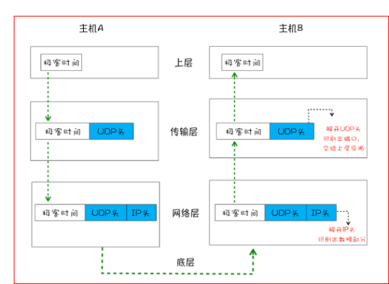
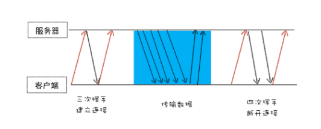
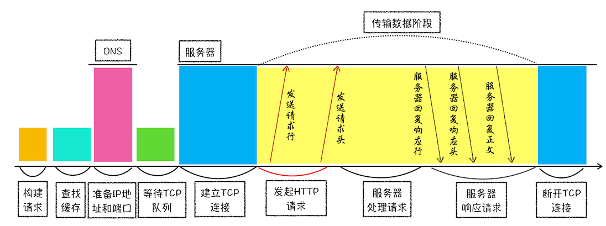
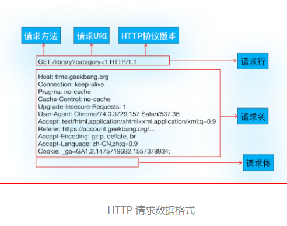
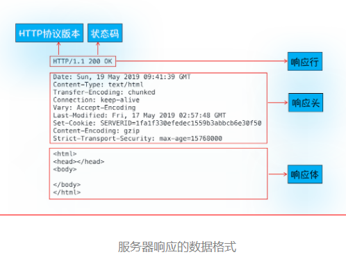
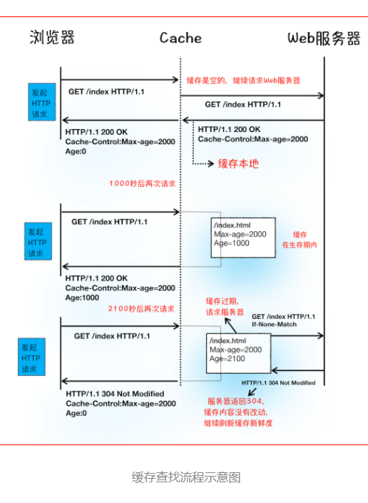
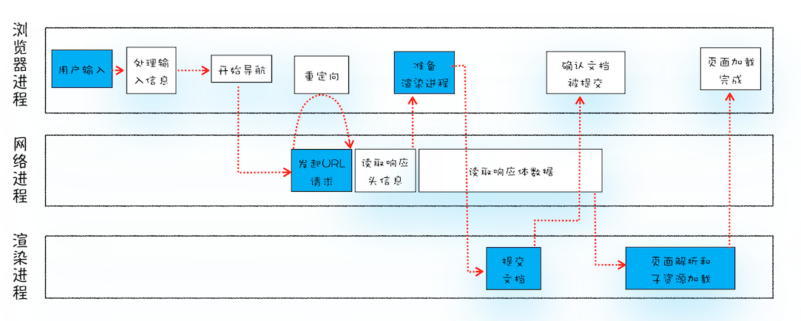
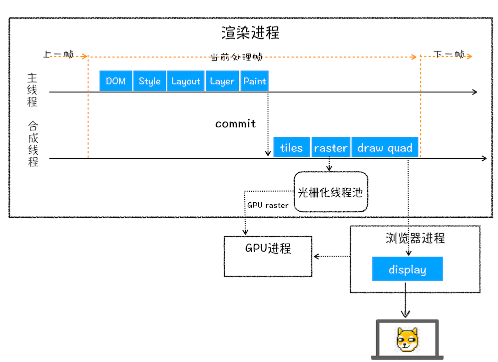
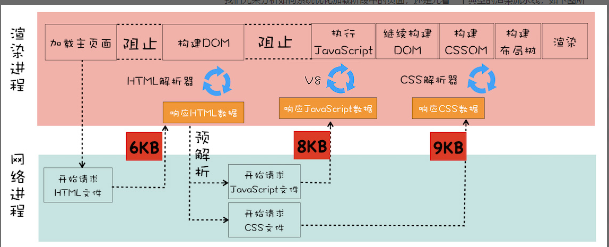

#### 前置知识

- 进程：一个进程就是一个程序的运行实例。详细解释就是，启动一个程序的时候，操作系统会为该程序创建一块内存，用来存放代码、运行中的数据和一个执行任务的主线程，我们把这样的一个运行环境叫进程。
- 线程：线程是不能单独存在的，它是由进程来启动和管理的。线程是依附于进程的，而进程中使用多线程并行处理能提升运算效率

> 1. 进程中的任意一线程执行出错，都会导致整个进程的崩溃
> 2. 线程之间共享进程中的数据
> 3. 当一个进程关闭之后，操作系统会回收进程所占用的内存
> 4. 进程之间的内容相互隔离

- IP（Internet Protocol）：计算机的地址就称为 IP 地址，访问任何网站实际上只是你的计算机向另外一台计算机请求信息，通过 IP 地址信息把数据包发送给指定的主机

- UDP(User Datagram Protocol)：通过端口号把数据包分发给正确的程序。UDP 不能保证数据可靠性，但是传输速度却非常快

    - 数据包在传输过程中容易丢失
    - 大文件会被拆分成很多小的数据包来传输，这些小的数据包会经过不同的路由，并在不同的时间到达接收端，而 UDP 协议并不知道如何组装这些数据包，从而把这些数据包还原成完整的文件

    

- TCP（Transmission Control Protocol）：传输控制协议，是一种面向连接的、可靠的、基于字节流的传输层通信协议

    - 对于数据包丢失的情况，TCP 提供重传机制

    - TCP 引入了数据包排序机制，用来保证把乱序的数据包组合成一个完整的文件

        

- HTTP：是一种允许浏览器向服务器获取资源的协议，是 Web 的基础。HTTP 协议作为应用层协议，TCP/IP 作传输层协议，HTTP 的内容是通过 TCP 的传输数据阶段来实现的

    > HTTP1.1 缺点：
    >
    > 1. TCP 的慢启动
    > 2. 同时开启了多条 TCP 连接，那么这些连接会竞争固定的带宽
    > 3. HTTP/1.1 队头阻塞的问题
    >
    > HTTP2
    >
    > 1. 多路复用（一个域名只使用一个 TCP 长连接和消除队头阻塞问题）
    > 2. 可以设置请求的优先级
    > 3. 服务器推送
    > 4. 头部压缩

#### Chrome

- 浏览器进程：主要负责界面显示、用户交互、子进程管理，同时提供存储等功能
- 渲染进程：核心任务是将 HTML、CSS 和 JavaScript 转换为用户可以与之交互的网页，排版引擎 Blink 和 JavaScript 引擎 V8 都是运行在该进程中，默认情况下，Chrome 会为每个 Tab 标签创建一个渲染进程。出于安全考虑，渲染进程都是运行在沙箱模式下
- GPU 进程：其实，Chrome 刚开始发布的时候是没有 GPU 进程的。而 GPU 的使用初衷是为了实现 3D CSS 的效果，只是随后网页、Chrome 的 UI 界面都选择采用 GPU 来绘制，这使得 GPU 成为浏览器普遍的需求。最后，Chrome 在其多进程架构上也引入了 GPU 进程
- 网络进程：主要负责页面的网络资源加载，之前是作为一个模块运行在浏览器进程里面的，直至最近才独立出来，成为一个单独的进程
- 插件进程。主要是负责插件的运行，因插件易崩溃，所以需要通过插件进程来隔离，以保证插件进程崩溃不会对浏览器和页面造成影响

#### HTTP请求示意图

> 通用头： Connection: Keep-Alive  保持 TCP 连接可以省去下次请求时需要建立连接的时间，提升资源加载速度
>
> 重定向：响应头 Status Code：301、 Location: xxxxx
>
> 响应头Set-Cookie: UID=3431uad;  再次请求头Cookie: UID=3431uad;服务器判断是否登录，并响应
>
> 通用头Content-Type 数据是什么类型

#### 浏览器缓存

> 响应头：Cache-Control:Max-age=2000
>
> 再次请求头：If-None-Match:"4f80f-13c-3a1xb12a" ，若无更新304

#### 在浏览器里，从输入 URL 到页面展示，这中间发生了什么

1. 用户输入

    - 如果是搜索内容，地址栏会使用浏览器设置的默认搜索引擎，来合成新的带搜索关键字的 URL
    - 如果输入为合法的URL，那么地址栏会根据规则，把这段内容加上协议，合成为完整的 URL
    - beforeunload

2. URL请求过程

    - 重定向
    - 响应类型处理

3. 准备渲染进程

4. 提交文档

5. 渲染阶段

    - 构建DOM：渲染进程将 HTML 内容转换为能够读懂的 DOM 树结构

    - 样式计算（Recalculate Style）：渲染引擎将 CSS 样式表转化为浏览器可以理解的 styleSheets，计算出 DOM 节点的样式

        1. 把 CSS 转换为浏览器能够理解的结构（3种来源 -> styleSheets）
        2. 转换样式表中的属性值，使其标准化
        3. 计算出 DOM 树中每个节点的具体样式（CSS继承规则和层叠规则）

    - 布局阶段

        1. 创建布局树，并计算元素的布局信息
        2. 对布局树进行分层，并生成分层树
        3. 图层绘制：为每个图层生成绘制列表，并将其提交到合成线程
        4. 合成线程将图层分成图块，并在光栅化线程池中将图块转换成位图
        5. 合成线程发送绘制图块命令 DrawQuad 给浏览器进程
        6. 浏览器进程根据 DrawQuad 消息生成页面，并显示到显示器上

        > 重排：更新了元素的几何属性
        >
        > 重绘：更新元素的绘制属性
        >
        > 合成：transform:translate(xxx,xxx)

        

#### performance

- Queuing阶段（域名分片 or HTTP2）

    1. 首先，页面中的资源是有优先级的，比如 CSS、HTML、JavaScript 等都是页面中的核心文件，所以优先级最高；而图片、视频、音频这类资源就不是核心资源，优先级就比较低。通常当后者遇到前者时，就需要“让路”，进入待排队状态
    2. 其次，我们前面也提到过，浏览器会为每个域名最多维护 6 个 TCP 连接，如果发起一个 HTTP 请求时，这 6 个 TCP 连接都处于忙碌状态，那么这个请求就会处于排队状态
    3. 最后，网络进程在为数据分配磁盘空间时，新的 HTTP 请求也需要短暂地等待磁盘分配结束

- TTFB

    1. 服务器生成页面数据的时间过久
    2. 网络的原因
    3. 发送请求头时带上了多余的用户信息

- Content Download 时间过久

- JavaScript 文件的下载过程会阻塞 DOM 解析，如果 JavaScript 文件中没有操作 DOM 相关代码，设置为异步加载，通过 async 或 defer 来标记代码。async 和 defer 虽然都是异步的，不过还有一些差异，使用 async 标志的脚本文件一旦加载完成，会立即执行；而使用了 defer 标记的脚本文件，需要在 DOMContentLoaded 事件之前执行

- 通过内联 JavaScript、内联 CSS

- 减少请求文件大小

- 对于大的 CSS 文件，可以通过媒体查询属性，将其拆分为多个不同用途的 CSS 文件，这样只有在特定的场景下才会加载特定的 CSS 文件

- 交互阶段

    - 减少 JavaScript 脚本执行时间（分解任务、Web Workers）
    - 避免强制同步布局
    - 虚拟DOM

    

#### 安全

1. XSS（Cross Site Scripting）
    1. 服务器对输入脚本进行过滤或转码
    2. 充分利用 CSP
    3. 使用 HttpOnly 属性
2. CSRF（CSRF 攻击就是黑客利用了用户的登录状态，并通过第三方的站点来做一些坏事）
    1. 充分利用好 Cookie 的 SameSite 属性
    2. 验证请求的来源站点（Referer 是 HTTP 请求头中的一个字段，记录了该 HTTP 请求的来源地址、Origin）
    3. CSRF Token
3. CROS
4. CSP