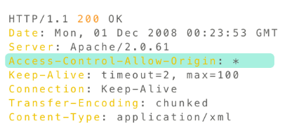
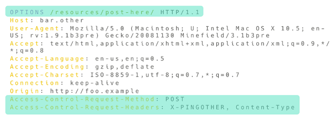
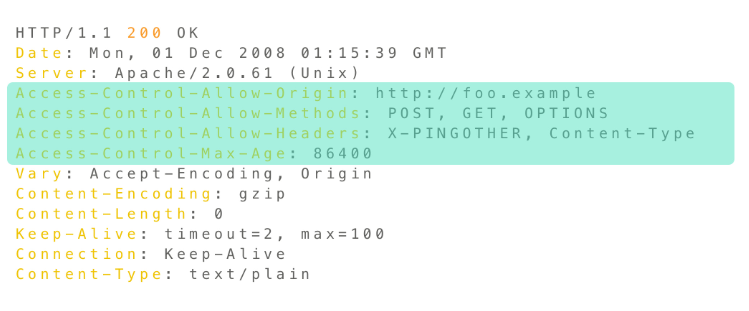
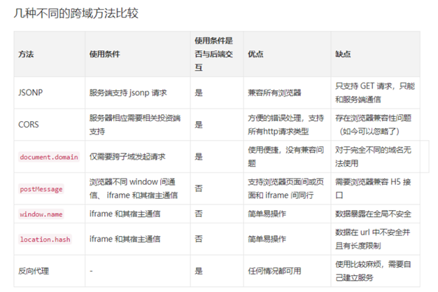
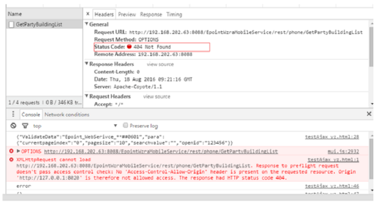
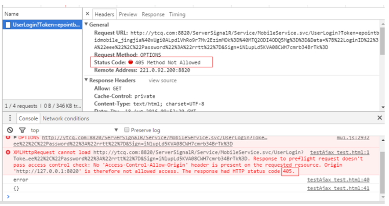

###  什么是跨域请求

简单来说，当一台服务器资源从另一台服务器（不同的域名或者端口）请求一个资源时，就会发起一个跨域 HTTP 请求。

举个简单的例子，http://example-a.com/index.html 这个 HTML 页面请求了 http://example-b.com/resource/image.jpg 这个图片资源时（发起 Ajax 请求，非  标签），就是发起了一个跨域请求。

在不做任何处理的情况下，这个跨域请求是无法被成功请求的，因为浏览器基于同源策略会对跨域请求做一定的限制


### 浏览器同源策略

浏览器的同源策略（Same-origin policy），同源策略限制了从同一个源加载的文档或者脚本如何与来自另一个源的资源进行交互。这是一个用于隔离潜在恶意文件的重要安全机制

同源需要同时满足三个条件：

1. 协议（例如同为http协议）
2. 域名（例如同为www.example.com）
3. 端口（例如同为80端口）

如果不同时满足这上面三个条件，那就不符合浏览器的同源策略

**必须是域名完全相同，比如说`blog.example.com`和`mail.example.com`这两个域名，虽然它们的顶级域名和二级域名（均为 example.com）都相同，但是三级域名（blog 和 mail）不相同，所以也不能算作域名相同**

#### 修改域名只能往上修改

```javascript
//from blog.example.com -> example.com
document.domain = 'example.com'

//不能修改成foo.com,因不是 `blog.example.com`的超级域
```

#### 例外

下面两种交互就不会触发同源策略：

- 跨域写操作（Cross-origin writes），例如超链接、重定向以及表单的提交操作，特定少数的`HTTP`请求需要添加预检请求（preflight）
- 跨域资源嵌入（Cross-origin embedding）
    - `<script>`标签嵌入的跨域脚本,可以使用 CDN，CDN 基本都是其他域的链接,还可以实现JSONP
    - `<link>`标签嵌入的 CSS 文件,可以使用 CDN，CDN 基本都是其他域的链接
    - ``标签嵌入图片,可以做打点统计，因为统计方并不一定是同域的，除了能跨域之外，``几乎没有浏览器兼容问题，它是一个非常古老的标签
    - `<video>`和`<audio>`标签嵌入多媒体资源
    - `<object>`, `<embed>`, `<applet>`的插件
    - `@font-face`引入的字体，一些浏览器允许跨域字体（cross-origin fonts），一些需要同源字体（same-origin fonts）
    - `<frame>`和`<iframe>`载入的任何资源，站点可以使用 X-Frame-Options 消息头来组织这种形式的跨域交互

> 如果浏览器缺失同源策略这种安全机制会怎么样呢？设想一下，当你登陆了`www.bank.com`银行网站进行操作时，浏览器保存了你登录时的`Cookie`信息，如果没有同源策略，在访问其他网站时，其他网站就可以读取还未过期的`Cookie`信息，从而伪造登陆进行操作，造成财产损失

#### 同源页面通信方式

1. ### BroadCast Channel

2. ### Service Worker

3. ### LocalStorage

4. ### Shared Worker

5. ###  IndexedDB

6. ### window.open + window.opener

### ==CORS（Cross-origin resource sharing，跨域资源共享）==

常见的方法有四种：
1. JSONP （script、img、link）
2. **CORS（Cross-origin resource sharing，跨域资源共享）**
3. `<iframe> `
   1. postMessage
   2. document.domain
   3.  window.name
   4. location.hash

4. web socket(双通)
5. 代理服务器(webpack、Nginx)

> `postMessage`和`iframe`本质上是利用浏览器同源策略的漏洞来进行跨域请求，不是推荐的做法，只能作为低版本浏览器的缓兵之计
>
> 代理服务器的做法是让浏览器访问同源服务器，再由同源服务器去访问目标服务器，这样虽然可以避免跨域请求的问题，但是原本只需要一次的请求被请求了两次，无疑增加了时间的开销

#### 什么是 CORS
CORS 其实是浏览器制定的一个规范，它的实现则主要在服务端，它通过一些`HTTP Header`来限制可以访问的域，例如页面`A`需要访问`B`服务器上的数据，如果`B`服务器上声明了允许`A`的域名访问，那么从`A`到`B`的跨域请求就可以完成

对于那些会对服务器数据产生副作用的`HTTP`请求，浏览器会使用`OPTIONS`方法发起一个预检请求（preflight request），从而可以获知服务器端是否允许该跨域请求，服务器端确认允许后，才会发起实际的请求。在预检请求的返回中，服务器端也可以告知客户端是否需要身份认证信息

#### 简单请求（Simple requests）

- GET, HEAD, POST 方法之一
- Header不带自定义的请求头
- Content-Type以下三者之一
    - text/plain
    - multipart/form-data
    - application / x-www-form-urlencoded
- 。。。

举例请求报文：


响应报文：


> 在请求报文中，`Origin`字段表明该请求来源于
>
> 在响应报文中，`Access-Control-Allow-Origin`字段被设置为`*`，表明该资源可以被任意的域访问，若服务端仅允许来自 http://foo.example 域的访问`Access-Control-Allow-Origin: http://foo.example`

#### 负责请求

```javascript
//复杂请求
document.querySelector('.contact-us-form').addEventListener('submit', (e) => {
	e.preventDefault()
	var data = {
		email: 'test@test.com',
		source: 'search',
	}
	fetch('http://localhost:3000/form', {
		method: 'POST',
		headers: {
			'Content-Type': 'application/json',
		},
		body: JSON.stringify(data),
	})
		.then((res) => res.json())
		.then((res) => console.log(res))
})

//后端需加，讓 preflight 通過
app.options('/form', (req, res) => {
  res.header('Access-Control-Allow-Origin', '*')
  //多个自定义header
  //res.header('Access-Control-Allow-Headers', 'X-App-Version, content-type')
  res.header('Access-Control-Allow-Headers', 'content-type')
  res.end()
})
```

```javascript
//带cookie
//backend
const VALID_ORIGIN = 'http://localhost:8080'
app.post('/form', (req, res) => {
  res.header('Access-Control-Allow-Origin', VALID_ORIGIN) // 此时需明確指定
  res.header('Access-Control-Allow-Credentials', true) // 新增這個
  res.json({
    success: true
  })
})

app.options('/form', (req, res) => {
  res.header('Access-Control-Allow-Origin', VALID_ORIGIN) // 此时需明確指定
  res.header('Access-Control-Allow-Credentials', true) // 新增這個
  res.header('Access-Control-Allow-Headers', 'content-type')
  res.end()
})


//frontend
fetch('http://localhost:3000/form', {
  method: 'POST',
  credentials: 'include', // 新增這個
  headers: {
    'Content-Type': 'application/json'
  },
  body: JSON.stringify(data)
}).then(res => res.json())
  .then(res => console.log(res))
```

```javascript
//存取后端自定义header
app.get('/', (req, res) => {
  res.header('Access-Control-Allow-Origin', '*')
  res.header('Access-Control-Expose-Headers', 'X-List-Version') // 加這個前端才能取到
  res.header('X-List-Version', '1.3')
  res.json({
    data: [
      {name: '1/10 活動', id: 1},
      {name: '2/14 特別活動', id: 2}
    ]
  })
})
```

#### 预检请求（Preflight Request）

和简单请求不同，「需预检的请求」要求必须先使用 OPTIONS 方法发送一个预检请求到服务器，以获知服务器是否允许该请求，或者是否需要携带身份认证信息。「预检请求」的使用，可以避免跨域请求对服务器的用户数据产生未预期的影响

满足以下条件任一条件时，该请求需要首先发送预检请求

- 使用了下面任一`HTTP`方法：PUT、DELETE、CONNECT、OPTIONS、TRACE、PATCH
- Header中设置了自定义请求头
- Content-Type 的值不属于以上三者之一
- 。。。

OPTIONS 请求报文：`Access-Control-Request-Method`和`Access-Control-Request-Headers`是浏览器自动加的


OPTIONS 响应报文：


预检请求完成之后，再发送实际的请求
##### OPTIONS预检的优化
`Access-Control-Max-Age`

这个头部加上后，可以缓存此次请求的秒数，在这个时间范围内，所有同类型的请求都将不再发送预检请求而是直接使用此次返回的头作为判断依据

#### 服务器端实现
##### Node.js后台配置(express)
```javascript
app.all('*', function(req, res, next) {
  res.header("Access-Control-Allow-Origin", "*");
  res.header("Access-Control-Allow-Headers", "X-Requested-With");
  res.header("Access-Control-Allow-Methods", "PUT,POST,GET,DELETE,OPTIONS");
  res.header("X-Powered-By", ' 3.2.1')
  res.header("Content-Type", "application/json;charset=utf-8");
  if(req.method == 'OPTIONS') {
    res.sendStatus(200)
  } else {
    next();
  }
});
```

```javascript
var express=require('express');
var url=require('url');
var app=express();
var allowCrossDomain = function(req, res, next) {
  res.header('Access-Control-Allow-Origin', 'http://localhost:63342');
  res.header('Access-Control-Allow-Methods', 'GET,PUT,POST,DELETE');
  res.header('Access-Control-Allow-Headers', 'Content-Type');
  res.header('Access-Control-Allow-Credentials','true');
  next();
};
app.use(allowCrossDomain);
app.get('/getData',function (req,res,next) {
  var queryValue=url.parse(req.url).query;
  if(queryValue==='fortunewheel@sina.com'){
    res.send(true);
  }else {
    res.send(false);
  }
})
app.listen(3000)
```

##### JAVA后台配置
1. 获取依赖jar包 (下载 cors-filter-1.7.jar, java-property-utils-1.9.jar 这两个库文件放到lib目录下。(放到对应项目的webContent/WEB-INF/lib/下))
2. 如果项目用了Maven构建的,添加如下依赖到pom.xml中:(非maven请忽视)

```xml
<dependency>
  <groupId>com.thetransactioncompany</groupId>
  <artifactId>cors-filter</artifactId>
  <version>[ version ]</version>
</dependency>
```

3. 添加CORS配置到项目的web.xml中( App/WEB-INF/web.xml)

```xml
<!-- 以下配置放到web.xml的前面,作为第一个filter存在(可以有多个filter) -->
<!-- 跨域配置-->
<filter>
  <!-- The CORS filter with parameters -->
  <filter-name>CORS</filter-name>
  <filter-class>com.thetransactioncompany.cors.CORSFilter</filter-class>

  <!-- Note: All parameters are options, if omitted the CORS
       Filter will fall back to the respective default values.
    -->
  <init-param>
    <param-name>cors.allowGenericHttpRequests</param-name>
    <param-value>true</param-value>
  </init-param>

  <init-param>
    <param-name>cors.allowOrigin</param-name>
    <param-value>*</param-value>
  </init-param>

  <init-param>
    <param-name>cors.allowSubdomains</param-name>
    <param-value>false</param-value>
  </init-param>

  <init-param>
    <param-name>cors.supportedMethods</param-name>
    <param-value>GET, HEAD, POST, OPTIONS</param-value>
  </init-param>

  <init-param>
    <param-name>cors.supportedHeaders</param-name>
    <param-value>Accept, Origin, X-Requested-With, Content-Type, Last-Modified</param-value>
  </init-param>

  <init-param>
    <param-name>cors.exposedHeaders</param-name>
    <!--这里可以添加一些自己的暴露Headers   -->
    <param-value>X-Test-1, X-Test-2</param-value>
  </init-param>

  <init-param>
    <param-name>cors.supportsCredentials</param-name>
    <param-value>true</param-value>
  </init-param>

  <init-param>
    <param-name>cors.maxAge</param-name>
    <param-value>3600</param-value>
  </init-param>
</filter>

<filter-mapping>
  <!-- CORS Filter mapping -->
  <filter-name>CORS</filter-name>
  <url-pattern>/*</url-pattern>
</filter-mapping>
```

4. 可能的安全模块配置错误(注意，某些框架中-譬如公司私人框架，有安全模块的，有时候这些安全模块配置会影响跨域配置，这时候可以先尝试关闭它们)

##### JAVA Spring Boot配置
```java
@Configuration
public class CorsConfig {
  private CorsConfiguration buildConfig() {
    CorsConfiguration corsConfiguration = new CorsConfiguration();
    // 可以自行筛选
    corsConfiguration.addAllowedOrigin("*");
    corsConfiguration.addAllowedHeader("*");
    corsConfiguration.addAllowedMethod("*");
    return corsConfiguration;
  }

  @Bean
  public CorsFilter corsFilter() {
    UrlBasedCorsConfigurationSource source = new UrlBasedCorsConfigurationSource();
    source.registerCorsConfiguration("/**", buildConfig());
    return new CorsFilter(source);
  }
}
```
### 其他跨域解决方案



#### ==JSONP==（只支持GET、XSS攻击）
客户端代码
```javascript
const cb = (data) => console.log(res)
const fn = () => {
  let xmlhttp = new XMLHttpRequest()
  let url = "xxx"
  xmlhttp.onreadystatechange = function(){
    if(xmlhttp.readyState==4){
      if(xmlhttp.status==200){
        callbackFn(xmlhttp.responseText)
      }
    }
  }
  xmlhttp.open('GET',url,true)
  xmlhttp.send(null)
}
fn()
```

```javascript
//jquery ajax请求实现
const callbackFn = (data) => console.log('callback:'+ data)

const jsonpFn = () => {
  $.ajax({
    type:"get",
    dataType:"jsonp",
    url:"http://localhost:9393/ccy_server/server.jsp",
    jsonpCallback:"callbackFn",
    success:function(data){
      data = typeof data != 'string' ? JSON.stringify(data) : data
      console.log('success.data:'+ data)
    }
  })
}
jsonpFn()
```

```javascript
function addScriptTag(url, cb) {
  let script = document.createElement('script')
  script.setAttribute("type","text/javascript")
  url = url + '?callback=' + cb
  script.src = url
  //document.body.appendChild(script)
  document.getElementsByTagName('head')[0].appendChild(script)
}

window.onload = function () {
  addScriptTag({
    'url': 'xx',
    'callback': 'foo'
  })
}

const foo = (data) => console.log('response data: ' + JSON.stringify(data))
```

```javascript
//promise
const jsonp = ({url, cb, params, timer = 300}) => {
  return new Promise((resolve, reject) => {
		let scriptNode, timer
    //define global cb
    window[cb] = (data) => {
			resolve(data)
			delete window[cb]
       document.body.removeChild(script)
    }
    params = {...params, cb}
    let arr = []
    for(let key in params) {
      arr.push(`${key}=${params[key]}`)
    }
    scriptNode = document.createElement('script')
    scriptNode.src = `${url}?${arr.join('&')}`
    document.body.appendChild(script)
    timer = setTimeout(() => {
			reject('network issue')
		}, timeout)
		scriptNode.onerror = function (e) {
			reject(e)
		}
  })
}

jsonp({
    url: 'http://localhost:3000/',
    cb: 'show',
    params: {name: 'jack'}
}).then((data) => {
    console.log(data)
})
```

服务端Node.js为例：（服务端对应的接口在返回参数外面添加函数包裹层）

```javascript
//express
const express = require('express')
const app = express()
const port = 3000

app.get('/show', (req, res) => {
  let result = '{"name":"Jack","age":18,"info":{"address":"xian","interest":"JS"}}'
  res.send(`show(${result})`)
})

app.listen(port, () => console.log(`express is listening on ${port}`))
```

```javascript
const Koa = require('koa')
const app = new Koa()

app.use(async (ctx) => {
	if (ctx.method === 'GET' && ctx.url.indexOf('?callback') === 1) {
		let callbackFun = ctx.query.callback || 'callback'
		let body = {
			msg: 'jsonp请求成功',
		}
		ctx.type = 'text/javascript'
		ctx.body = `;${callbackFun}(${JSON.stringify(body)})`
	} else {
		ctx.body = '测试'
	}
})

app.on('error', (err) => {
	log.error('server error', err)
})

app.listen(3000, () => {
	console.info('node server start...')
})
```

#### postMessage

- iframe嵌套页面跨域通信
- 页面和其打开的新窗口的通信
- 多窗口之间消息传递

`window.postMessage(data,origin)`

- data：需要传递的数据，html5规范支持任意基本类型或可复制的对象，但部分浏览器只支持字符串，所以传参时最好用JSON.stringify()序列化
- origin：协议+主机+端口号，也可以设置为"*"，表示可以传递给任意窗口，如果要指定和当前窗口同源的话设置为"/"

```html
<iframe id="iframe" src="http://www.b.com/b.html" style="display:none;"></iframe>
<script>
  var iframe = document.getElementById('iframe');
  iframe.onload = function() {
    var data = {
      name: 'Jack'
    };
    // 向http://www.b.com传送跨域数据
    iframe.contentWindow.postMessage(JSON.stringify(data),'http://www.b.com');
  };
  // 接受http://www.b.com返回数据
  window.addEventListener('message', function(e) {
    alert('data from http://www.b.com---> ' + e.data);
  }, false);
</script>
```

```html
<script>
  // 接收http://www.a.com/a.html的数据
  window.addEventListener('message', function(e) {
    alert('data from http://www.a.com/a.html---> ' + e.data);

    var data = JSON.parse(e.data);
    if (data) {
      data.number = 16;
      // 处理后再发回http://www.a.com/a.html
      //e.source.postMessage(JSON.stringify(data), 'http://www.a.com');
      window.parent.postMessage(JSON.stringify(data), 'http://www.a.com');
    }
  }, false);
</script>
```

chrome打印信息


成功获取非同源数据，将非同源地址嵌入获取数据页面窗口

#### window.name

在客户端浏览器中每个页面都有一个独立的窗口对象window，默认情况下window.name为空，在窗口的生命周期中，载入的所有页面共享一个window.name并且每个页面都有对此读写的权限，window.name会一直存在当前窗口，但存储的字符串不超过2M

```html
//http://localhost:8383/ccy_client/window_name.html
<!DOCTYPE html>
<html>
<head>
<meta charset="UTF-8">
<title>window.name-跨域</title>
<script type="text/javascript">
    window.name = "我是 window.name 字符串";
    setTimeout(function(){
        window.location = "http://localhost:9393/ccy_server/window_name.html";
    },2000);
</script>
</head>
<body>

</body>
</html>
```

```html
//http://localhost:9393/ccy_server/window_name.html
<!DOCTYPE html>
<html>
<head>
<meta charset="UTF-8">
<title>window.name-跨域</title>
<script type="text/javascript">
    var str = window.name;
    console.log('ccy_server.window_name:'+str);
</script>
</head>
<body>

</body>
</html>
```

chrome打印信息


上面是以window.location跳转的方式获取window.name字符串信息，平时开发中经常需要异步获取

```html
<!DOCTYPE html>
<html>
<head>
<meta charset="UTF-8">
<title>window.name-跨域</title>
</head>
<body>
<script type="text/javascript">
  var boo = false;
  var iframe = document.createElement('iframe');
  var loadData = function() {
    if (boo) {
      var data = iframe.contentWindow.name;    //获取window.name
      console.log(data);
      //销毁数据
      iframe.contentWindow.document.write('');
      iframe.contentWindow.close();
      document.body.removeChild(iframe);
    } else {
      boo = true;
      iframe.contentWindow.location = "";    // 设置的代理文件,iframe重新载入
    }
  };
  iframe.src = 'http://localhost:9393/ccy_server/window_name_iframe.html';
  if (iframe.attachEvent) {
    iframe.attachEvent('onload', loadData);
  } else {
    iframe.onload  = loadData;
  }
  document.body.appendChild(iframe);
</script>

</body>
</html>
```

```html
<!DOCTYPE html>
<html>
<head>
<meta charset="UTF-8">
<title>window.name-跨域</title>
<script type="text/javascript">
  window.name = '我是 http://localhost:9393/ccy_server/window_name_iframe.html';
</script>
</head>
<body>

</body>
</html>
```

chrome打印信息

成功获取非同源地址的数据信息，主要是通过iframe的src属性，类似含有src属性的标签都可以成功处理跨域问题img,script


#### location.hash

- 路径后面的hash可以用来通信

- 目的a访问c

- a给c传个hash，c收到hash后，c把新的ash传递给b，b将结果放到a的hash中

    `window.parent.parent.location.hash`

#### document.domain

**这种方式只适合主域名相同，但子域名不同的iframe跨域**
实现原理：两个页面都通过js强制设置document.domain为基础主域，就实现了同域。

```javascript
//http://www.a.com/a.html
<iframe id="iframe" src="http://www.child.a.com/b.html" style="display:none;"></iframe>
<script>
    document.domain = 'a.com';
    var a = 'hello world';
</script>
```

```javascript
//http://www.child.a.com/b.html
<script>
    document.domain = 'a.com';
    var b = window.parent.a;
    console.log(b);
</script>
```

#### Web Socket

```html
//front
<script type="text/javascript">
  let socket = new WebSocket('ws://localhost:3000')
  socket.onopen = function() {
    socket.send('from front')
  }
  socket.onmessage = function(e) {
    console.log(e.data)
  }
</script>
```

```javascript
//backend
const WebSocket = require('ws')

let wss = new WebSocket.Server({port:3000})

wss.on('connection', (ws) => {
  ws.on('message', (data) => {
    console.log(data)
    ws.send('from backend')
  })
})
```

#### nginx代理跨域

配置之后就不需要前端做什么修改了，一般我们在前后端分离项目中开发阶段会采用这种方式，但不是所有场景都能这样做，例如后端接口是一个公共的API，比如一些公共服务获取天气什么的

```properties
server{
    # 监听8080端口
    listen 8080;
    # 域名是localhost
    server_name localhost;
    #凡是localhost:8080/api这个样子的，都转发到真正的服务端地址http://www.b.com:8080
    location ^~ /api {
        proxy_pass http://www.b.com:8080;
    }
    //~忽略大小写  其它是正则
    location ~.*\.json {
        root json;
        add_header "Access-Control-Allow-Origin" "*";
    }
}
```

### 常见跨域问题



> 后端允许OPTIONS请求



> 后台方法允许OPTIONS请求,但是一些配置文件中(如安全配置),阻止了OPTIONS请求，后端关闭对应安全配置


> 后端增加对应的头部支持


> 响应头重复