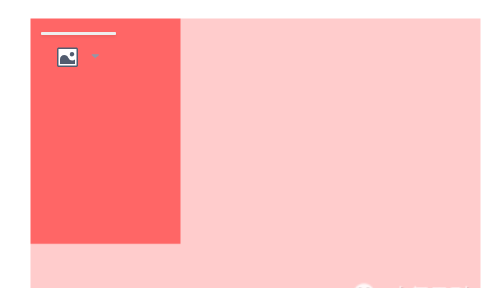
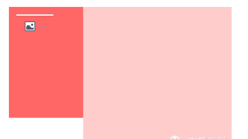
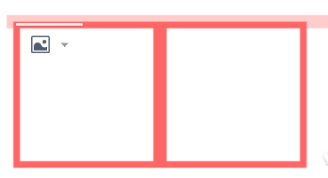
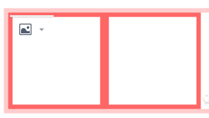
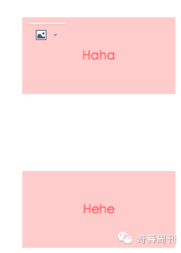
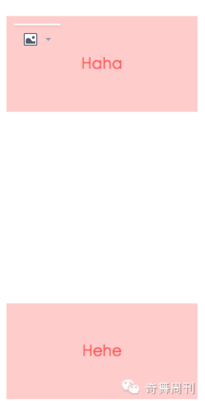

### BFC是什么
BFC(Block formatting context)直译为"块级格式化上下文"。它是一个独立的渲染区域，只有Block-level box参与， 它规定了内部的Block-level Box如何布局，并且与这个区域外部毫不相干。

### 三种文档流的定位方案
**常规流(Normal flow)**
-在常规流中，盒一个接着一个排列;
-在块级格式化上下文里面， 它们竖着排列；
-在行内格式化上下文里面， 它们横着排列;
-当position为static或relative，并且float为none时会触发常规流；
-对于静态定位(static positioning)，position: static，盒的位置是常规流布局里的位置；
-对于相对定位(relative positioning)，position: relative，盒偏移位置由top、bottom、left、right属性定义。即使有偏移，仍然保留原有的位置，其它常规流不能占用这个位置。

**浮动(Floats)**
- 左浮动元素尽量靠左、靠上，右浮动同理
- 这导致常规流环绕在它的周边，除非设置 clear 属性
- 浮动元素不会影响块级元素的布局
- 但浮动元素会影响行内元素的布局，让其围绕在自己周围，撑大父级元素，从而间接影响块级元素布局
- 最高点不会超过当前行的最高点、它前面的浮动元素的最高点
- 不超过它的包含块，除非元素本身已经比包含块更宽
- 行内元素出现在左浮动元素的右边和右浮动元素的左边，左浮动元素的左边和右浮动元素的右边是不会摆放浮动元素的

**绝对定位(Absolute positioning)**
- 绝对定位方案，盒从常规流中被移除，不影响常规流的布局；
- 它的定位相对于它的包含块，相关CSS属性：top、bottom、left、right；
- 如果元素的属性position为absolute或fixed，它是绝对定位元素；
- 对于position: absolute，元素定位将相对于上级元素中最近的一个relative、fixed、absolute，如果没有则相对于body；


### BFC布局规则
- 内部的Box会在垂直方向，一个接一个地放置。
- Box垂直方向的距离由margin决定。属于同一个BFC的两个相邻Box的margin会发生重叠,不同BFC不会发生重叠
- 每个元素的margin box的左边， 与包含块border box的左边相接触(对于从左往右的格式化，否则相反)。即使存在浮动也是如此。（这说明BFC中子元素不会超出他的包含块，而position为absolute的元素可以超出他的包含块边界）
- BFC的区域不会与float box重叠。
- BFC就是页面上的一个隔离的独立容器，容器里面的子元素不会影响到外面的元素。反之也如此。
- 计算BFC的高度时，浮动元素也参与计算

### 哪些元素会生成BFC
- 根元素，即HTML标签
- float属性不为none,为`left、right`
- position为`absolute、fixed`
- display为`inline-block、table、inline-table、table-cell、table-caption、flex, inline-flex、grid、inline-grid`
- overflow值不为 visible，为 `auto、scroll、hidden`

### BFC的作用及原理
#### 自适应两栏布局
```css
body {
        width: 300px;
        position: relative;
    }

    .aside {
        width: 100px;
        height: 150px;
        float: left;
        background: #f66;
    }

    .main {
        height: 200px;
        background: #fcc;
    }</style><body>
    <div class="aside"></div>
    <div class="main"></div></body>
```



根据BFC布局规则第3条：
每个元素的margin box的左边， 与包含块border box的左边相接触(对于从左往右的格式化，否则相反)。即使存在浮动也是如此。

因此，虽然存在浮动的元素aslide，但main的左边依然会与包含块的左边相接触。


根据BFC布局规则第四条：

BFC的区域不会与float box重叠。

我们可以通过通过触发main生成BFC， 来实现自适应两栏布局。
```css
.main {
    overflow: hidden;

}
```
当触发main生成BFC后，这个新的BFC不会与浮动的aside重叠。因此会根据包含块的宽度，和aside的宽度，自动变窄。效果如下：


#### 清除内部浮动
```css
.par {
        border: 5px solid #fcc;
        width: 300px;
    }

    .child {
        border: 5px solid #f66;
        width:100px;
        height: 100px;
        float: left;
    }</style><body>
    <div class="par">
        <div class="child"></div>
        <div class="child"></div>
    </div></body>
```


根据BFC布局规则第六条：

计算BFC的高度时，浮动元素也参与计算

为达到清除内部浮动，我们可以触发par生成BFC，那么par在计算高度时，par内部的浮动元素child也会参与计算。
```css
.par {
    overflow: hidden;

}
```


#### 防止垂直margin重叠
```css
p {
        color: #f55;
        background: #fcc;
        width: 200px;
        line-height: 100px;
        text-align:center;
        margin: 100px;
    }</style><body>
    <p>Haha</p>
    <p>Hehe</p></body>
```



两个p之间的距离为100px，发送了margin重叠。

根据BFC布局规则第二条：

Box垂直方向的距离由margin决定。属于同一个BFC的两个相邻Box的margin会发生重叠

我们可以在p外面包裹一层容器，并触发该容器生成一个BFC。那么两个P便不属于同一个BFC，就不会发生margin重叠了。
```css
 .wrap {
        overflow: hidden;
    }
    p {
        color: #f55;
        background: #fcc;
        width: 200px;
        line-height: 100px;
        text-align:center;
        margin: 100px;
    }</style><body>
    <p>Haha</p>
    <div class="wrap">
        <p>Hehe</p>
    </div></body>
```


### 总结

其实以上的几个例子都体现了BFC布局规则第五条：

BFC就是页面上的一个隔离的独立容器，容器里面的子元素不会影响到外面的元素。反之也如此。

因为BFC内部的元素和外部的元素绝对不会互相影响，因此， 当BFC外部存在浮动时，它不应该影响BFC内部Box的布局，BFC会通过变窄，而不与浮动有重叠。同样的，当BFC内部有浮动时，为了不影响外部元素的布局，BFC计算高度时会包括浮动的高度。避免margin重叠也是这样的一个道理。
