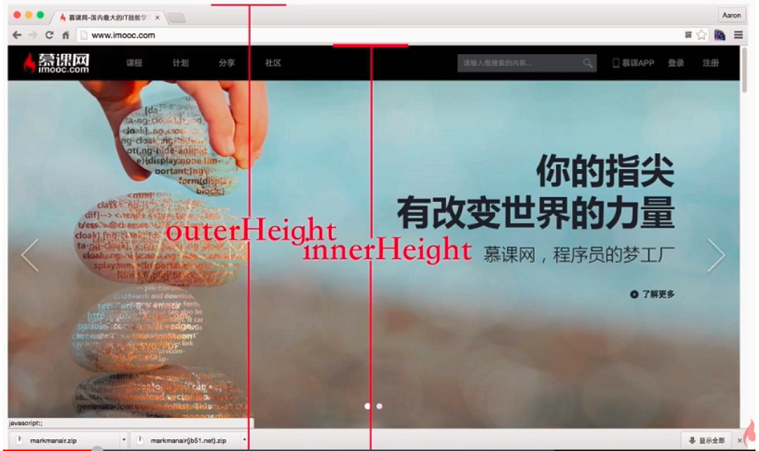
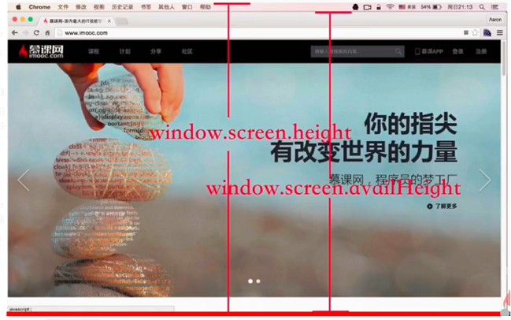
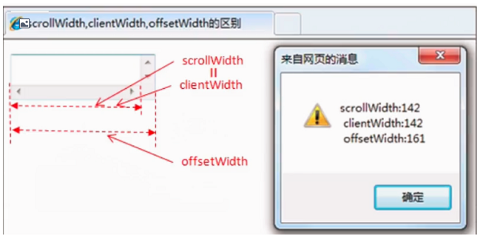
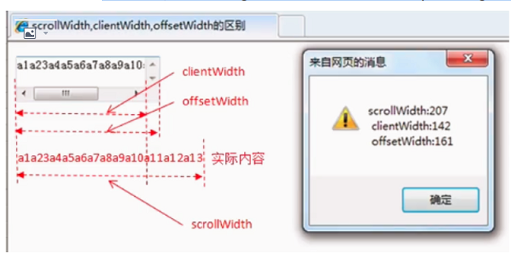
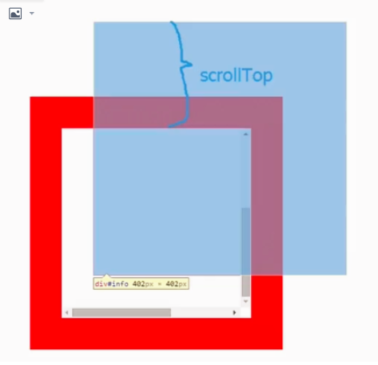
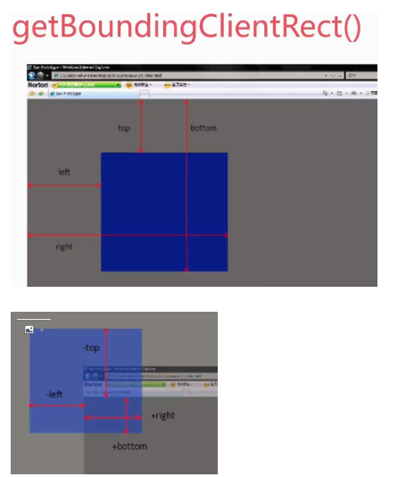

### window

window.innerWidth / window.innerHeight （do not support IE 8及其以下）



window.outerWidth / window.outerHeight（do not support IE 8及其以下）


```javascript
//获取可视区宽高
const w = window.innerWidth || document.documentElement.clientWidth || document.body.clientWidth
const h = window.innerHeight || document.documentElement.clientHeight || document.body.clientHeight


window.screen.height / window.screen.width   （）
window.screen.availHeight / window.screen.availWidth
window.screenTop  /  window.screenLeft
```



### document
1. client
    - document.body.clientWidth
        1. 无左右padding无滚动 `clientWidth = style.width`
        2. 有左右padding无滚动 `clientWidth = style.width + style.padding * 2`
        3. 有左右padding有滚动 `clientWidth = style.width + style.padding * 2 - 滚动轴宽度`
    - document.body.clientHeight  `上下padding + content height`
    - document.body.clientTop `clientTop = border-top的border-width`
    - document.body.clientLeft  `clientLeft = border-left的border-width`
2. offset
    - document.body.offsetWidth
        1. 无左右padding无滚动无border  `offsetWidth= clientWidth = style.width`
        2. 有左右padding无滚动有border  `offsetWidth= style.width + style.padding * 2 + border * 2`  ` offsetWidth= clientWidth + border * 2`
        3. 有左右padding有滚动,且滚动是显示的,有border `offsetWidth= style.width + style.padding * 2 + border * 2`  `offsetWidth= clientWidth  + 滚动轴宽度 + border * 2`
    - document.body.offsetHeight(同document.body.offsetWidth)
    - document.body.offsetTop(兼容问题 基于offsetParent) `offsetParent：父级有定位则是最近的父级,否则是body`
    - document.body.offsetLeft(兼容问题 基于offsetParent)
        1. IE6/7  offsetLeft= (offsetParent的padding-left) +(当前元素的margin-left)
        2. IE8/9/10及Chrome  offsetLeft= (offsetParent的margin-left) + (offsetParent的border) + (offsetParent的padding-left) + (当前元素的margin-left)
        3. FF offsetLeft= (offsetParent的margin-left) +(当前元素的margin-left) + (offsetParent的padding-left)
3. scroll(**document.body情况下和与div是不一样的，测试是基于Chrome，针对body的scrollWidth/scrollHeight各浏览器解析不一样**)
    - document.body
        1. 给定宽高小于浏览器窗口 `scrollWidth通常是浏览器的宽度  scrollHeight通常是浏览器的高度`
        2. 给定宽高大于浏览器窗口,且内容小于给定宽高 `scrollWidth给定的宽度+所有padding、margin、border
        scrollHeight给定的高度+所有padding、margin、border`
        3. 给定宽高大于浏览器窗口,且内容大于给点宽高 `scrollWidth内容的宽度+所有padding、margin、border
        scrollHeight内容的高度+所有padding、margin、border`
    - div
        - 无滚动轴 `scrollWidth = clientWidth = style.width + style.padding * 2`
        - 
        - 有滚动轴`scrollWidth = 实际内容宽度 + padding * 2  scrollHeight = 实际内容高度 + padding * 2`
        - 
    - scrollTop  scrollLeft(元素被卷起的高度和宽度)
    - 
4. Event
- clientX clientY  相对于浏览器可视区左上角
- screenX screenY   相对于屏幕设备左上角
- offsetX  offsetY     相对于事件源左上角
- pageX pageY    相对于整个网页左上角
- X Y    相对于css动态定位的最内层包容元素
- 