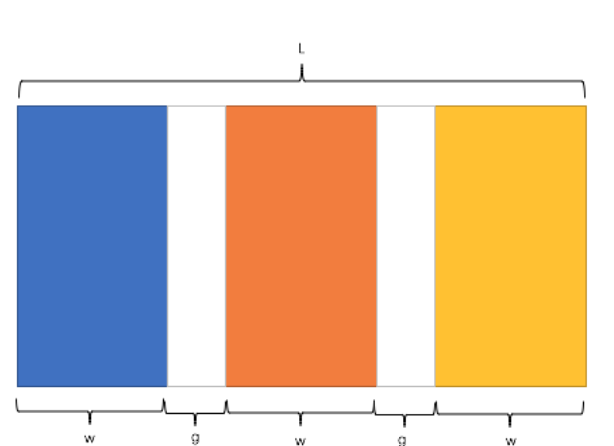
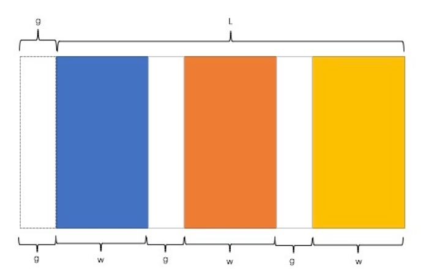
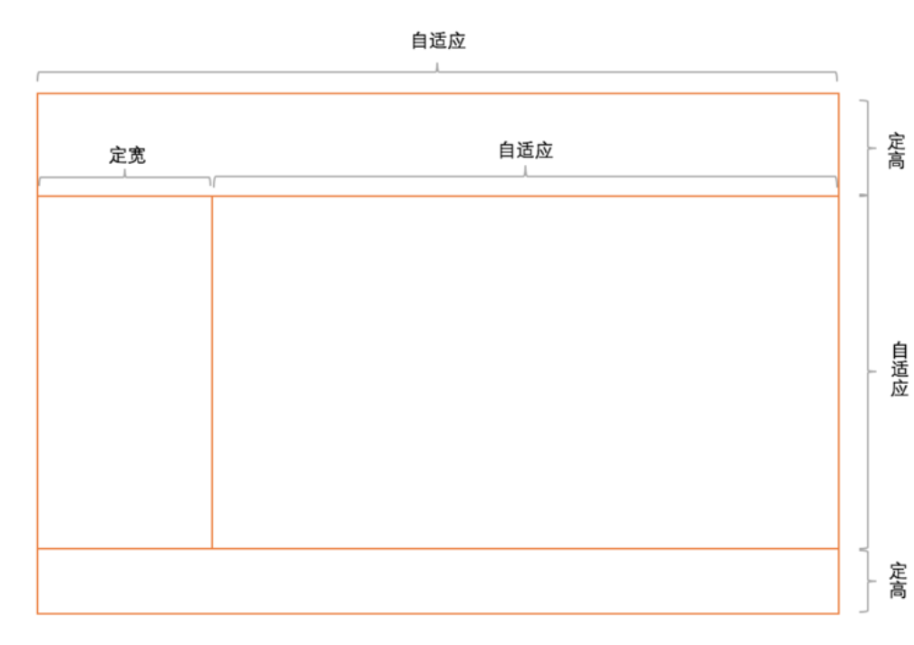
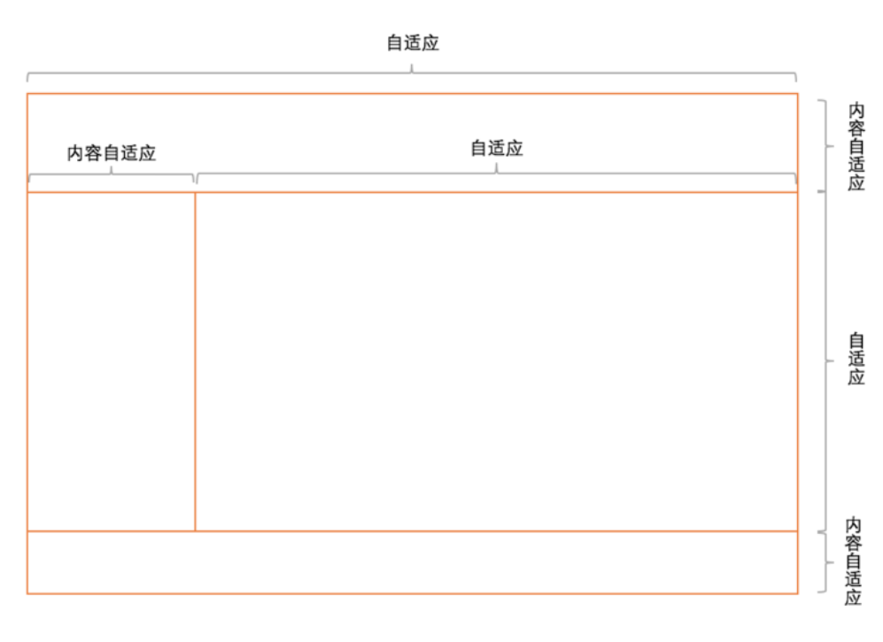

### 居中布局
#### 水平居中
1. 使用inline-block+text-align
（1）原理、用法

- 原理：先将子框由块级元素改变为行内块元素，再通过设置行内块元素居中以达到水平居中。
- 用法：对子框设置display:inline-block，对父框设置text-align:center。
（2）代码实例
```html
<div class="parent">
    <div class="child>DEMO</div>
</div>
```

```css
.child{
    display:inline-block;
}
.parent{
    text-align:center;
}
```
（3）优缺点

- 优点:兼容性好，甚至可以兼容ie6、ie7
- 缺点:child里的文字也会水平居中，可以在.child添加text-align:left;还原

2. 使用table+margin
（1）原理、用法

- 原理：先将子框设置为块级表格来显示（类似 <table>），再设置子框居中以达到水平居中。
- 用法：对子框设置display:table，再设置margin:0 auto。
（2）代码实例

```html
<div class="parent">
    <div class="child>DEMO</div>
</div>
```

```css
.child {
    display:table;
    margin:0 auto;
}
```
（3）优缺点：

- 优点：只设置了child，ie8以上都支持
- 缺点：不支持ie6、ie7,将div换成table

3. 使用absolute+transform
（1）原理、用法

- 原理：将子框设置为绝对定位，移动子框，使子框左侧距离相对框左侧边框的距离为相对框宽度的一半，再通过向左移动子框的一半宽度以达到水平居中。当然，在此之前，我们需要设置父框为相对定位，使父框成为子框的相对框。
- 用法：对父框设置position:relative，对子框设置position:absolute，left:50%，transform:translateX(-50%)。
（2）代码实例
```html
<div class="parent">
    <div class="child>DEMO</div>
</div>
```

```css
.parent {
    position:relative;
}
.child {
    position:absolute;
    left:50%;
    transform:translateX(-50%);
}
```

（3）优缺点

- 优点:居中元素不会对其他的产生影响
- 缺点:transform属于css3内容，兼容性存在一定问题，高版本浏览器需要添加一些前缀

4. 使用flex+margin
（1）原理、用法

- 原理：通过CSS3中的布局利器flex将子框转换为flex item，再设置子框居中以达到居中。
- 用法：先将父框设置为display:flex，再设置子框margin:0 auto。
（2）代码实例
```html
<div class="parent">
    <div class="child>DEMO</div>
</div>
```

```css
.parent {
    display:flex;
}
.child {
    margin:0 auto;
}
```
（3）优缺点

- 缺点:低版本浏览器(ie6 ie7 ie8)不支持

5. 使用flex+justify-content
（1）原理、用法

- 原理：通过CSS3中的布局利器flex中的justify-content属性来达到水平居中。
- 用法：先将父框设置为display:flex，再设置justify-content:center。
（2）代码实例
```html
<div class="parent">
    <div class="child>DEMO</div>
</div>
```

```css
.parent {
    display:flex;
    justify-content:center;
}
```
（3）优缺点

- 优点:设置parent即可
- 缺点:低版本浏览器(ie6 ie7 ie8)不支持

#### 垂直居中
1. 使用table-cell+vertical-align
（1）原理、用法

- 原理：通过将父框转化为一个表格单元格显示（类似 <td\> 和 <th\>），再通过设置属性，使表格单元格内容垂直居中以达到垂直居中。
- 用法：先将父框设置为display:table-cell，再设置vertical-align:middle。
（2）代码实例
```html
<div class="parent">
    <div class="child>DEMO</div>
</div>
```

```css
.parent {
    display:table-cell;
    vertical-align:middle;
}
```
（3）优缺点

- 优点:兼容性较好，ie8以上均支持

2. 使用absolute+transform
（1）原理、用法

- 原理：类似于水平居中时的absolute+transform原理。将子框设置为绝对定位，移动子框，使子框上边距离相对框上边边框的距离为相对框高度的一半，再通过向上-移动子框的一半高度以达到垂直居中。当然，在此之前，我们需要设置父框为相对定位，使父框成为子框的相对框。
- 用法：先将父框设置为position:relative，再设置子框position:absolute，top:50%，transform:translateY(-50%)。
（2）代码实例
```html
<div class="parent">
    <div class="child>DEMO</div>
</div>
```

```css
.parent {
    position:relative;
}
.child {
    position:absolute;
    top:50%;
    transform:translateY(-50%);
}
```
（3）优缺点

- 优点:居中元素不会对其他的产生影响
- 缺点:transform属于css3内容，兼容性存在一定问题，高版本浏览器需要添加一些前缀

3. 使用flex+align-items
（1）原理、用法

- 原理：通过设置CSS3中的布局利器flex中的属性align-times，使子框垂直居中。
- 用法：先将父框设置为position:flex，再设置align-items:center。
（2）代码实例
```html
<div class="parent">
    <div class="child>DEMO</div>
</div>
```

```css
.parent {
    position:flex;
    align-items:center;
}
```
（3）优缺点

- 优点:只设置parent
- 缺点:兼容性存在一定问题

#### 水平垂直居中
1. 使用absolute+transform
（1）原理、用法

- 原理：将水平居中时的absolute+transform和垂直居中时的absolute+transform相结合。详见：水平居中的3）和垂直居中的2）。
- 见水平居中的3）和垂直居中的2）。
（2）代码实例
```html
<div class="parent">
    <div class="child>DEMO</div>
</div>
```

```css
.parent {
    position:relative;
}
.child {
    position:absolute;
    left:50%;
    top:50%;
    transform:tranplate(-50%,-50%);
}
```
（3）优缺点

- 优点:child元素不会对其他元素产生影响
- 缺点:兼容性存在一定问题

2. 使用inline-block+text-align+table-cell+vertical-align
（1）原理、用法

- 原理：使用inline-block+text-align水平居中，再用table-cell+vertical-align垂直居中，将二者结合起来。详见：水平居中的1）和垂直居中的1）。
- 见水平居中的1）和垂直居中的1）。
（2）代码实例
```html
<div class="parent">
    <div class="child>DEMO</div>
</div>
```

```css
.parent {
    text-align:center;
    display:table-cell;
    vertical-align:middle;
}
.child {
    display:inline-block;
}
```
（3）优缺点

- 优点:兼容性较好

3. 使用flex+justify-content+align-items
（1）原理、用法

- 原理：通过设置CSS3布局利器flex中的justify-content和align-items，从而达到水平垂直居中。详见：水平居中的4）和垂直居中的3）。
- 见水平居中的4）和垂直居中的3）。
（2）代码实例
```html
<div class="parent">
    <div class="child>DEMO</div>
</div>
```

```css
.parent {
    display:flex;
    justify-content:center;
    align-items:center;
}
```
（3）优缺点

- 优点:只设置了parent
- 缺点:兼容性存在一定问题

### 多列布局
1. 使用float+overflow
（1）原理、用法

- 原理：通过将左边框脱离文本流，设置右边规定当内容溢出元素框时发生的事情以达到多列布局。
- 用法：先将左框设置为float:left、width、margin-left，再设置实际的右框overflow:hidden。
（2）代码实例
```html
<div class="parent">
    <div class="left">
        <p>left</p>
    </div>
    <div class="right">
        <p>right</p>
        <p>right</p>
    </div>
</div>
```

```css
.left {
    float:left;
    width:100px;
    margin-right:20px;
}
.right {
    overflow:hidden;
}
```
（3）优缺点

- 优点:简单
- 缺点:不支持ie6

2. 使用float+margin
（1）原理、用法

- 原理：通过将左框脱离文本流，加上右框向右移动一定的距离，以达到视觉上的多列布局。
- 用法：先将左框设置为float:left、margin-left，再设置右框margin-left。
（2）代码实例
```html
<div class="parent">
    <div class="left">
        <p>left</p>
    </div>
    <div class="right">
        <p>right</p>
        <p>right</p>
    </div>
</div>
```

```css
.left {
    float:left;
    width:100px;
}
.right {
    margin-left:120px;
}
```
（3）优缺点

- 优点:简单，易理解
- 缺点:兼容性存在一定问题，ie6下有3px的bug。right下的p清除浮动将产生bug

3. 使用float+margin（改良版）
（1）原理、用法

- 原理：在1）的基础之上，通过向右框添加一个父框，再加上设置左、右父框属性使之产生BFC以去除bug。
- 用法：先将左框设置为float:left、margin-left、position:relative，再设置右父框float:right、width:100%、margin-left，最后设置实际的右框margin-left。
（2）代码实例
```html
<div class="parent">
    <div class="left">
        <p>left</p>
    </div>
    <div class="rigth-fix">
        <div class="right">
            <p>right</p>
            <p>right</p>
        </div>
    </div>
</div>
```

```css
.left {
    float:left;
    width:100px;
    position:relative;
}
.right-fix {
    float:right;
    width:100%;
    margin-left:-100px;
}
.right {
    margin-left:120px;
}
```
（3）优缺点

- 优点:简单，易理解

4. 使用table
（1）原理、用法

- 原理：通过将父框设置为表格，将左右边框转化为类似于同一行的td，从而达到多列布局。
- 用法：先将父框设置为display:table、width:100%、table-layout:fixed，再设置左右框display:table-cell，最后设置左框width、padding-right。
（2）代码实例
```html
<div class="parent">
    <div class="left">
        <p>left</p>
    </div>
    <div class="right">
        <p>right</p>
        <p>right</p>
    </div>
</div>
```

```css
.parent {
    display:table;
    width:100%;
    table-layout:fixed;
}
.left {
    width:100px;
    padding-right:20px;
}
.right,.left {
    display:table-cell;
}
```

5. 使用flex
（1）原理、用法

- 原理：通过设置CSS3布局利器flex中的flex属性以达到多列布局。
- 用法：先将父框设置为display:flex，再设置左框flex:1，最后设置左框width、margin-right。
（2）代码实例
```html
<div class="parent">
    <div class="left">
        <p>left</p>
    </div>
    <div class="right">
        <p>right</p>
        <p>right</p>
    </div>
</div>
```

```css
.parent {
    display:flex;
}
.left {
    width:100px;
    margin-right:20px;
}
.right {
    flex:1;
}
```
（3）优缺点

- 优点:flex很强大
- 缺点:兼容性存在一定问题，性能存在一定问题

#### 两列定宽+一列自适应
（1）原理、用法

- 原理：这种情况与两列定宽查不多。
- 用法：先将左、中框设置为float:left、width、margin-right，再设置右框overflow:hidden。
（2）代码实例
```html
<div class="parent">
    <div class="left">
        <p>left</p>
    </div>
    <div class="center">
        <p>center</p>
    </div>
    <div class="right">
        <p>right</p>
        <p>right</p>
    </div>
</div>
```
```css
.left,.center {
    float:left;
    width:100px;
    margin-right:20px;
}
.right {
    overflow:hidden;
}
```

#### 不定宽+自适应
1. 使用float+overflow
（1）原理、用法

- 原理：这种情况与两列定宽查不多。
- 用法：先将左框设置为float:left、margin-right，再设置右框overflow: hidden，最后设置左框中的内容width。
（2）代码实例
```html
<div class="parent">
    <div class="left">
        <p>left</p>
    </div>
    <div class="right">
        <p>right</p>
        <p>right</p>
    </div>
</div>
```
```css
.left{
        float: left;
        margin-right: 20px;
    }
.right{
    overflow: hidden;
}
.left p{
    width: 200px;
}
```
3）优缺点

- 优点:简单
- 缺点:ie6下兼容性存在一定问题

2. 使用table
（1）原理、用法

- 原理：通过将父框改变为表格，将左右框转换为类似于同一行的td以达到多列布局，设置父框宽度100%，给左框子元素一个固定宽度从而达到自适应。
- 用法：先将父框设置为display: table、width: 100%，再设置左、右框display: table-cell，最后设置左框width: 0.1%、padding-right以及左框中的内容width。
（2）代码实例
```html
<div class="parent">
    <div class="left">
        <p>left</p>
    </div>
    <div class="right">
        <p>right</p>
        <p>right</p>
    </div>
</div>
```
```css
.parent{
    display: table; width: 100%;
    }
.left,.right{
    display: table-cell;
}
.left{
    width: 0.1%;
    padding-right: 20px;
}
.left p{
    width:200px;
}
```
（3）优缺点

- 缺点:ie6 ie7不支持

3. 使用flex
（1）原理、用法

- 原理：通过设置CSS3布局利器flex中的flex属性以达到多列布局，加上给左框中的内容定宽、给右框设置flex达到不定款+自适应。
- 用法：先将父框设置为display:flex，再设置右框flex:1，最后设置左框margin-right:20px、左框中的内容width。
（2）代码实例
```html
<div class="parent">
    <div class="left">
        <p>left</p>
    </div>
    <div class="right">
        <p>right</p>
        <p>right</p>
    </div>
</div>
```
```css
.parent {
    display:flex;
}
.left {
    margin-right:20px;
}
.right {
    flex:1;
}
.left p{
    width: 200px;
}
```
（3）优缺点

- 优点:flex很强大
- 缺点:兼容性存在一定问题，性能存在一定问题

#### 两列不定宽+一列自适应
（1）原理、用法

- 原理：这个情况与一列不定宽+一列自适应查不多。
- 用法：先将左、中框设置为float:left、margin-right，再设置右框overflow:hidden，最后给左中框中的内容设置width。
（2）代码实例
```html
<div class="parent">
    <div class="left">
        <p>left</p>
    </div>
    <div class="center">
        <p>center</p>
    </div>
    <div class="right">
        <p>right</p>
        <p>right</p>
    </div>
</div>
```
```css
.left,.center{
    float: left;
    margin-right: 20px;
}
.right{
    overflow: hidden;
}
.left p,.center p{
    width: 100px;
}
```

#### 等分布局
- 

`公式转化:
l = w * n + g * (n-1) -> l = w * n + g * n - g -> l + g = （w + g） * n`

- 

因此，我们需要解决两个问题：

- 如何让总宽度增加g(即：L+g)
- 如何让每个宽包含g（即：w+g）

1. 使用float
（1）原理、用法

- 原理：增大父框的实际宽度后，使用CSS3属性box-sizing进行布局的辅助。
- 用法：先将父框设置为margin-left: -*px，再设置子框float: left、width: 25%、padding-left、box-sizing: border-box。
（2）代码实例
```html
<div class="parent">
    <div class="column"><p>1</p></div>
    <div class="column"><p>2</p></div>
    <div class="column"><p>3</p></div>
    <div class="column"><p>4</p></div>
</div>
```

```css
.parent{
    margin-left: -20px;//l增加g
}
.column{
    float: left;
    width: 25%;
    padding-left: 20px;
    box-sizing: border-box;//包含padding区域 w+g
}
```
（3）优缺点

- 优点：兼容性较好
- 缺点：ie6 ie7百分比兼容存在一定问题

2. 使用table
（1）原理、用法

- 原理：通过增加一个父框的修正框，增大其宽度，并将父框转换为table，将子框转换为tabel-cell进行布局。
- 用法：先将父框的修正框设置为margin-left: -*px，再设置父框display: table、width:100%、table-layout: fixed，设置子框display: table-cell、padding-left。
（2）代码实例
```html
<div class="parent-fix">
    <div class="parent">
        <div class="column"><p>1</p></div>
        <div class="column"><p>2</p></div>
        <div class="column"><p>3</p></div>
        <div class="column"><p>4</p></div>
    </div>
</div>
```

```css
.parent-fix{
    margin-left: -20px;//l+g
}
.parent{
    display: table;
    width:100%;
    table-layout: fixed;
}
.column{
    display: table-cell;
    padding-left: 20px;//w+g
}
```
（3）优缺点

- 优点：结构和块数无关联
- 缺点：增加了一层

3. 使用flex
（1）原理、用法

- 原理：通过设置CSS3布局利器flex中的flex属性以达到等分布局。
- 用法：将父框设置为display: flex，再设置子框flex: 1，最后设置子框与子框的间距margin-left。
（2）代码实例
```html
<div class="parent">
    <div class="column"><p>1</p></div>
    <div class="column"><p>2</p></div>
    <div class="column"><p>3</p></div>
    <div class="column"><p>4</p></div>
</div>
```

```css
.parent{
    display: flex;
}
.column{
    flex: 1;
}
.column+.column{
    margin-left:20px;
}
```
（3）优缺点

- 优点：代码量少，与块数无关
- 缺点：兼容性存在一定问题


#### 定宽+自适应+两块高度一样高
1. 使用float
（1）原理、用法

- 原理：通过过分加大左右子框的高度，辅助超出隐藏，以达到视觉上的等高。
- 用法：将父框设置overflow: hidden，再设置左右子框padding-bottom: 9999px、margin-bottom: -9999px，最后设置左框float: left、width、margin-right，右框overflow: hidden。
（2）代码实例
```html
<div class="parent">
    <div class="left">
        <p>left</p>
    </div>
    <div class="right">
        <p>right</p>
        <p>right</p>
    </div>
</div>
```

```css
p{
    background: none!important;
}
.left,.right{
    background: #444;
}
.parent{
    overflow: hidden;
}
.left,.right{
    padding-bottom: 9999px;
    margin-bottom: -9999px;
}
.left{
    float: left;
    width: 100px;
    margin-right: 20px;
}
.right{
    overflow: hidden;
}
```
(3)优缺点

- 优点：兼容性好
- 缺点：伪等高，不是真正意义上的等高

2. 使用table
（1）原理、用法

原理：将父框转化为tabel，将子框转化为tabel-cell布局，以达到定宽+自适应+两块高度一样高。
用法：先将父框设置为display:table、width:100%、table-layout:fixed，再设置左右框为display:table-cell，最后设置左框width、padding-right。
（2）代码实例
```html
<div class="parent">
    <div class="left">
        <p>left</p>
    </div>
    <div class="right">
        <p>right</p>
        <p>right</p>
    </div>
</div>
```

```css
.parent {
    display:table;
    width:100%;
    table-layout:fixed;
}
.left {
    width:100px;
    padding-right:20px;
}
.right,.left {
    display:table-cell;
}
```

3. 使用flex
（1）原理、用法

- 原理：通过设置CSS3布局利器flex中的flex属性以达到定宽+自适应+两块高度一样高。
- 用法：将父框设置为display: flex，再设置左框width、margin-right，最后设置右框flex:1。
（2）代码实例
```html
<div class="parent">
    <div class="left">
        <p>left</p>
    </div>
    <div class="right">
        <p>right</p>
        <p>right</p>
    </div>
</div>
```

```css
.parent {
    display:flex;
}
.left {
    width:100px;
    margin-right:20px;
}
.right {
    flex:1;
}
```
（3）优缺点

- 优点:代码少，flex很强大
- 缺点:兼容性存在一定问题

4. 使用display
（1）原理、用法

- 原理：通过设置display中的CSS3的-webkit-box属性以达到定宽+自适应+两块高度一样高。
- 用法：将父框设置为display: -webkit-box、width: 100%，再设置左框width、margin-right，最后设置右框-webkit-box-flex: 1。
（2）代码实例
```html
<div class="parent">
    <div class="left">left</div>
    <div class="right">right </div>
</div>
```

```css
.parent {
    width: 100%;
    display: -webkit-box;
}
.left {
    width:100px;
    margin-right: 20px;
}
.right {
    -webkit-box-flex: 1;
}
```
(3)优缺点

- 缺点:兼容性存在较大的问题

### 全屏布局
#### 全屏布局的特点
- 滚动条不是全局滚动条，而是出现在内容区域里，往往是主内容区域
- 浏览器变大时，撑满窗口

#### 全屏布局的方法
- 

1. 使用position
（1）原理、用法

- 原理：将上下部分固定，中间部分使用定宽+自适应+两块高度一样高。
- 用法：见实例。
（2）代码实例
```html
<div class="parent">
    <div class="top">top</div>
    <div class="left">left</div>
    <div class="right">
        <div class="inner">right</div>
    </div>
    <div class="bottom">bottom</div>
</div>
```

```css
html,body,.parent{
    margin:0;
    height:100%;
    overflow:hidden;
}
body{
    color:white;
}
.top{
    position:absolute;
    top:0;
    left:0;
    right:0;
    height:100px;
    background:blue;
}
.left{
    position:absolute;
    left:0;
    top:100px;
    bottom:50px;
    width:200px;
    background:red;
}
.right{
    position:absolute;
    left:200px;
    top:100px;
    bottom:50px;
    right:0;
    background:pink;
    overflow: auto;
}
.right .inner{
    min-height: 1000px;
}
.bottom{
    position:absolute;
    left:0;
    right:0;
    bottom:0;
    height:50px;
    background: black;
}
```

(3)优缺点

- 优点：兼容性好，ie6下不支持

2. 使用flex
（1）原理、用法

- 原理：通过灵活使用CSS3布局利器flex中的flex属性和flex-direction属性以达到全屏布局。
- 用法：见实例。
（2）代码实例
```html
<div class="parent">
    <div class="top">top</div>
    <div class="middle">
        <div class="left">left</div>
        <div class="right">
            <div class="inner">right</div>
        </div>
    </div>
    <div class="bottom">bottom</div>
</div>
```
```css
html,body,.parent{
    margin:0;
    height:100%;
    overflow:hidden;
}
body{
    color: white;
}
.parent{
    display: flex;
    flex-direction: column;
}
.top{
    height:100px;
    background: blue;
}
.bottom{
    height:50px;
    background: black;
}
.middle{
    flex:1;
    display:flex;
}
.left{
    width:200px;
    background: red;
}
.right{
    flex: 1;
    overflow: auto;
    background:pink;
}
.right .inner{
    min-height: 1000px;
}
```
(3)优缺点

- 缺点：兼容性差，ie9及ie9以下不兼容

- 

3. 使用flex

（1）原理、用法

- 原理：通过灵活使用CSS3布局利器flex中的flex属性和flex-direction属性以达到全屏布局。
- 用法：见实例。
（2）代码实例
```html
<div class="parent">
    <div class="top">top</div>
    <div class="middle">
        <div class="left">left</div>
        <div class="right">
            <div class="inner">right</div>
        </div>
    </div>
    <div class="bottom">bottom</div>
</div>
```

```css
html,body,.parent{
    margin:0;
    height:100%;
    overflow:hidden;
}
body{
    color:white;
}
.parent{
    display:flex;
    flex-direction:column;
}
.top{
    background:blue;
}
.bottom{
    background:black;
}
.middle{
    flex:1;
    display:flex;
}
.left{
    background: red;
}
.right{
    flex:1;
    overflow:auto;
    background: pink;
}
.right .inner{
    min-height:1000px;
}
```
全屏布局相关方案的兼容性、性能和自适应一览表

| 方案     | 兼容性 | 性能 | 是否自适应 |
| -------- | ------ | ---- | ---------- |
| Position | 好     | 好   | 部分自适应 |
| Flex     | 较差   | 差   | 可自适应   |
| Grid     | 差     | 较好 | 可自适应   |

