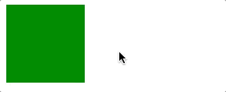

### 1.need to know first

| property   | description                                                  |
| ---------- | ------------------------------------------------------------ |
| animation  | 用于设置动画属性，他是一个简写的属性，包含8个属性            |
| transition | 用于设置元素的样式过度，和animation有着类似的效果，但细节上有很大的不同 |
| transform  | 用于元素进行旋转、缩放、移动或倾斜，和设置样式的动画并没有什么关系,**只能使用在块级元素上** |
| translate  | translate只是transform的一个属性值，即移动                   |

### 2.transform

#### translate

css里面一般用作“平移”，因为translate用于改变html元素的在3d坐标系位置。translate支持在坐标系内任意方向移动（通过任意组合x、y、z方向的向量），单位可以是长度单位和百分比（**百分比是相对于被平移的元素自身尺寸，x轴是相对于width，y轴是相对于height，而在z轴方向由于元素是没有厚度的，所以对于z方向不能用百分比表示**）

```css
transform: translateX(100px) translateY(50%) translateZ(-100px);

trandform: translate(-100%, 100%);

transform: translate3d(100px, 50%, 2em);
```

#### scale

```css
transform: scaleX(2) scaleY(0.5) scaleZ(1);

transform: scale(2,2);

transform: scale3d(2, 0.5, 1);
```

`scale`方法接收任意数字（正负整数、小数、0）作为参数，该参数为缩放系数，系数>1 效果为放大，0<系数<1 效果为缩小，系数为0元素尺寸变为无限小而不可见，系数<0 效果为 >0 时的镜像

#### rotate

Rotate意为“旋转”，支持将元素以x、y、z为轴旋转，旋转正方向为面朝坐标轴正向逆时针方向，可参考上面坐标系示意图。`rotate`方法接收一个角度作为参数，角度>0 正向旋转，角度<0 负向旋转

```css
// 默认绕z轴旋转
transform: rotate(90deg); 
transform: rotateX(30deg) rotateY(60deg) rotateZ(-90deg);
```

与translate和scale不同，rotate不能简写为`transform: rotate3d(30deg, 60deg, 90deg)`的形式，`rotate3d`的用法为：前三个参数为数字，代表x、y、z方向的向量，相加得到向量v，第四个参数为角度，表示以向量v为轴逆时针旋转的角度，语法如下：

```css
transform: rotate3d(1, 2, 3, 90deg);
```

#### skew

```css
transform: skewX(90deg) skewY(90deg);

transform: skew(90deg, 90deg)
```

#### 组合

```css
transform: translateY(200px) rotateZ(90deg) scale(3);
```

**组合方法的执行顺序是从右往左**，即先执行scale，然后rotate，最后translate，产生的效果是逐次累加的。方法书写的顺序对最后效果有很大的影响

### 3.transition

transition翻译为“过渡”，强调的是过程.元素从这个属性(color)的某个值(red)过渡到这个属性(color)的另外一个值(green)，这是一个状态的转变，需要一种条件或事件来触发这种转变，transition为2帧，从from .... to，而animation可以一帧一帧的，比如我们平时用到的:hoever、:focus、:checked、媒体查询或者JavaScript

```css
.cloud{
    width: 240px;
    transition: 1s;
}
.cloud:hover{
    width: 320px;
}
```

transition可以和transform结合使用，比如我们可以让云变大的同时转一圈

```css
.cloud:hover{
    width: 320px;
    transform: rotate(360deg);
}
```

我们可以给不同的效果设置不同的过渡时间

```css
.cloud{
    width: 240px;
    transition: width 1s, transform 0.5s;
}
```

我们也可以给效果设置延时时间，比如我们等宽度增大之后再旋转

```css
.cloud{
    width: 240px;
    transition: width 1s, transform 0.5s 1s;
}
```

我们还可以给每个效果设置不同的timing function，用于控制加速效果

```css
.cloud{
    width: 240px;
    transition: transform 2s ease-in;
}

.cloud:hover{
    transform: rotate(1080deg);
}
```

可以用all代表所有属性

```css
 transition: all 1s;
```

> transition.html

```html
<!DOCTYPE html>
<html lang="en">

<head>
    <title>transition</title>
    <style>
        #box {
            height: 100px;
            width: 100px;
            background: green;
            transition: transform .5s ease-in .5s;
        }

        #box:hover {
            transform: rotate(180deg) scale(.5, .5);
        }
    </style>
</head>

<body>
    <div id="box"></div>
</body>

</html>
```


 

首先transition给元素设置的过渡属性是transform，当鼠标移入元素时，元素的transform发生变化，那么这个时候就触发了transition，产生了动画，当鼠标移出时，transform又发生变化，这个时候还是会触发transition，产生动画，所以transition产生动画的条件是transition设置的property发生变化，这种动画的特点是需要“一个驱动力去触发”，有着以下几个不足：

1. 需要事件触发，所以没法在网页加载时自动发生
2. 是一次性的，不能重复发生，除非一再触发
3. 只能定义开始状态和结束状态，不能定义中间状态，也就是说只有两个状态
4. 一条transition规则，只能定义一个属性的变化，不能涉及多个属性

 语法：**transition: property duration timing-function delay**

| property                   | description                                                  |
| -------------------------- | ------------------------------------------------------------ |
| transition-property        | 规定设置过渡效果的CSS属性的名称(并不是所有的属性都可以动画), 例如：display: none => display:block 无法过渡。一般改用visibility:hidden => visibility: visible |
| transition-duration        | 指定过渡动画的时间（0也要带单位）                            |
| transition-timing-function | 规定速度效果的速度曲线（贝塞尔）常用过渡方式：linear、ease、ease-out、ease-in、ease-in-out |
| transition-delay           | 指定过渡动画的延迟                                           |

**Note**

1. `transition`第一个可以被解析成时间的值会赋给transition-duration
2. `transtionend`事件(DOM2),在每个属性完成过渡时都会触发这个事件
3. 当属性值的列表长度不一致时
    1. 跟时间有关的重复列表
    2. transition-timing-function使用默认值

### 4.animation

animtion能够做出复杂酷炫的效果,animation简写对书写顺序有一定要求（delay要写在duration后面，其他参数无顺序要求，css会通过传入的关键词识别）

- [Animate.css](https://link.juejin.im?target=https%3A%2F%2Fdaneden.github.io%2Fanimate.css%2F)

 >animation.html

```html
<!DOCTYPE html>
<html lang="en">

<head>
    <title>animation</title>
    <style>
        .box {
            height: 100px;
            width: 100px;
            border: 15px solid black;
            animation: changebox 1s ease-in-out 1s infinite alternate running forwards;
        }

        .box:hover {
            animation-play-state: paused;
        }

        @keyframes changebox {
            10% {
                background: red;
            }

            50% {
                width: 80px;
            }

            70% {
                border: 15px solid yellow;
            }

            100% {
                width: 180px;
                height: 180px;
            }
        }
    </style>
</head>

<body>
    <div class="box"></div>
</body>

</html>
```


我们先来看看keyframes这个关键点，它定义了一个动画组合叫changebox，里面的10%，50%，70%，100%代表在变化中不同时间点的属性值，比如这个动画的总时间是1s，那么10%就是在0-0.1s中的动画，通过这个我们可以较精确的控制动画变化中任何一个时间点的属性效果，这大大提高了我们对动画的把控，是做复杂动画的基础

语法：**animation: name duration timing-function delay iteration-count direction fill-mode play-state**

| property        | description                                                  |
| --------------- | ------------------------------------------------------------ |
| name            | 用来调用@keyframes定义好的动画，与@keyframes定义的动画名称一致 |
| duration        | 指定元素播放动画所持续的时间                                 |
| timing-function | 规定速度效果的速度曲线，是针对每一个小动画所在时间范围的变换速率,作用于一个关键帧周期而非整个动画周期 |
| delay           | 定义在浏览器开始执行动画之前等待的时间，整个animation执行之前等待的时间,这是一个动画外的属性 |
| iteration-count | 定义动画的播放次数，可选具体次数或者无限(infinite),（只会管理动画内的属性，动画的延迟不会被循环） |
| direction       | 设置动画播放方向：normal(按时间轴顺序),reverse(时间轴反方向运行),alternate(轮流，即来回往复进行),alternate-reverse(动画先反运行再正方向运行，并持续交替运行),还会影响animation-timing-function的形式 |
| fill-mode       | 控制动画结束后，元素的样式，有四个值：none(回到动画没开始时的状态)，forwards(动画结束后动画停留在结束状态)，backwords(动画回到第一帧的状态)，both(根据animation-direction轮流应用forwards和backwards规则)，注意与iteration-count不要冲突(动画执行无限次) |
| play-state      | 控制元素动画的播放状态，通过此来控制动画的暂停和继续，两个值：running(继续)，paused(暂停) |

#### Chain Animation

```css
.mario {
  ...
  
  animation: drive 3s both infinite linear, jump 0.5s 1.2s ease-in-out infinite;
}

@keyframes jump {
  0% { top: -40px; }
  50% { top: -120px; }
  100% { top: -40px; }
}
```

### 5.summary

简单一次性的动画中推荐使用`transition`，比较逻辑清晰，可维护性较好。如果遇到比较复杂的动画，这个时候便可以拿出`animation`开始你的表演，其实不仅仅用css能实现动画，用js同样可以操控元素的样式实现动画，这个时候你脑海里是不是浮现出`setTimeout`,`setInterval`来控制样式实现动画，当然可以，但是相比新出的`requestAnimationFrame`，它能够更高性能地执行动画