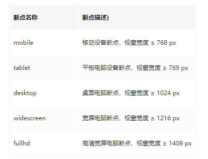
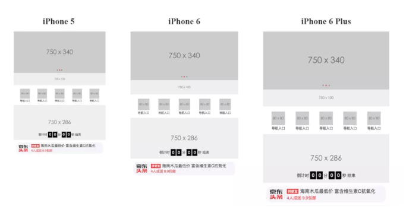

### question
响应式页面开发要求我们解决两大问题：
- 为不同特性(如横屏还是竖屏等)的浏览器视窗使用不同的样式代码
- 让页面元素的尺寸能够依据浏览器视窗尺寸变化而平滑变化

### 1 添加`viewport meta`标签
```html
<meta name="viewport" content="width=device-width, initial-scale=1">
```

### 2 Media Queries
1. 媒体类型
- all     所有媒体（默认值）
- screen  彩色屏幕
- print   打印预览

```
projection     手持设备
tv             电视
braille        盲文触觉设备
embossed       盲文打印机
speech         “听觉”类似的媒体设备
tty            不适用像素的设备
```

2. 媒体属性
```
width			   (可加max min前缀)
height			   (可加max min前缀)
device-width	    (可加max min前缀)
device-pixel-ratio  (可加max min前缀，需要加webkit前缀)
orientation
	portrait竖屏
	landscape横屏
```


3. 操作符，关键字 (only,and,(，or),not)

- only：
	- 防止老旧的浏览器  不支持带媒体属性的查询而应用到给定的样式
	```css
	@media only screen and (min-width:800px ){
		...
	}
	@media screen and (min-width:800px ){
		...
	}
	```
	在老款的浏览器下
	- @media only    --->    因为没有only这种设备 规则被忽略
	- @media screen --->   因为有screen这种设备而且老浏览器会忽略带媒体属性的查询

**建议在每次抒写media query的时候带上only**

- and:
	连接媒体属性 、连接媒体类型
	对于所有的连接选项都要匹配成功才能应用规则
- or:
	对于所有的连接选项只要匹配成功一个就能应用规则
- not:取反

4. 兩种用法

- 使用 link 标签，根据指定特性引入特定的外部样式文件
```html
<link rel="stylesheet" media="(max-width: 640px)" href="max-640px.css">
```

- 直接在 style 标签或 样式文件内使用 @media 规则
```css
@media (max-width: 640px) {
  /*当视窗宽度小于或等于 640px 时，这里的样式将生效*/
}
```

5. 样式断点

依据目标设备的分辨率，制定一套合适的样式断点，并为不同的断点定制必要的 CSS 样式。 移动端优先的页面，可使用 min-width 查询参数从小到大来定义断点,在实际工作中，「样式断点」的制定需要我们同视觉设计师一起沟通确认，因为视觉设计师可能需要根据不同的断点为页面设计不同的视觉表现。



如果针对 tablet 及以上的设备定制样式，我们就可以这样写了：

```css
@media (min-width: 769px) {
  /* tablet 及以上的设备，页面背景色设置为红色 */
  body {
    background-color: red;
  }
}
```

### 3 使用`Viewport`单位及`rem`

#### 仅使用vw作为CSS长度单位
1. 利用 Sass 函数将设计稿元素尺寸的像素单位转换为vw单位
```css
// iPhone 6尺寸作为设计稿基准
$vw_base: 375;
@function vw($px) {
    @return ($px / $vm_base) * 100vw;
}
```

2. 无论是文本字号大小还是布局高宽、间距、留白等都使用vw作为CSS单位
```css
.mod_nav {
    background-color: #fff;
    &_list {
        display: flex;
        padding: vw(15) vw(10) vw(10); // 内间距
        &_item {
            flex: 1;
            text-align: center;
            font-size: vw(10); // 字体大小
            &_logo {
                display: block;
                margin: 0 auto;
                width: vw(40); // 宽度
                height: vw(40); // 高度
                img {
                    display: block;
                    margin: 0 auto;
                    max-width: 100%;
                }
            }
            &_name {
                margin-top: vw(2);
            }
        }
    }
}
```
3. 1物理像素线(也就是普通屏幕下1px,高清屏幕下0.5px的情况)采用 transform属性scale实现
```css
.mod_grid {
    position: relative;
    &::after {
        // 实现1物理像素的下边框线
        content: '';
        position: absolute;
        z-index: 1;
        pointer-events: none;
        background-color: #ddd;
        height: 1px;
        left: 0;
        right: 0;
        top: 0;
        @media only screen and (-webkit-min-device-pixel-ratio: 2) {
            -webkit-transform: scaleY(0.5);
            -webkit-transform-origin: 50% 0%;
        }
    }
    ...
}
```
4. 对于需要保持高宽比的图,改用padding-top实现
```css
.mod_banner {
    position: relative;
    // 使用padding-top 实现宽高比为 100:750 的图片区域
    padding-top: percentage(100/750);
    height: 0;
    overflow: hidden;
    img {
        width: 100%;
        height: auto;
        position: absolute;
        left: 0;
        top: 0;
    }
}
```


####  vw搭配rem,寻找最优解
方法1实现的响应式页面虽然看起来适配得很好，但是你会发现由于它是利用Viewport单位实现的布局，依赖于视窗大小而自动缩放，无论视窗过大还是过小，它也随着视窗过大或者过小，失去了最大最小宽度的限制，有时候不一定是我们所期待的展示效果。试想一下一个750px宽的设计稿在 1920px的大屏显示器上的糟糕样子

1. 给根元素的字体大小设置随着视窗变化而变化的vw单位，这样就可以实现动态改变其大小
2. 其他元素的文本字号大小、布局高宽、间距、留白都使用rem单位
3. 限制根元素字体大小的最大最小值,配合body加上最大宽度和最小宽度，实现布局宽度的最大最小限制

```css
// rem 单位换算：定为 75px 只是方便运算，750px-75px、640-64px、1080px-108px，如此类推
$vw_fontsize: 75; // iPhone 6尺寸的根元素大小基准值
@function rem($px) {
     @return ($px / $vw_fontsize ) * 1rem;
}
// 根元素大小使用 vw 单位
$vw_design: 750;
html {
    font-size: ($vw_fontsize / ($vw_design / 2)) * 100vw;
    // 同时，通过Media Queries 限制根元素最大最小值
    @media screen and (max-width: 320px) {
        font-size: 64px;
    }
    @media screen and (min-width: 540px) {
        font-size: 108px;
    }
}
// body 也增加最大最小宽度限制，避免默认100%宽度的block元素跟随 body而过大过小
body {
    max-width: 540px;
    min-width: 320px;
}
```
