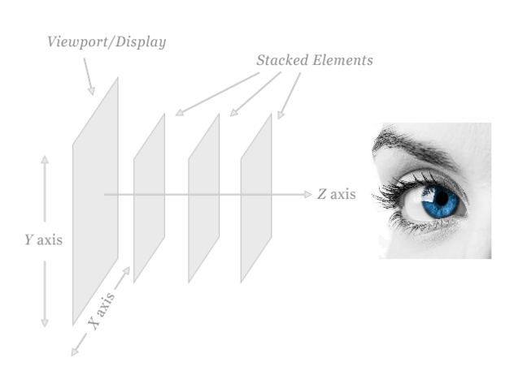
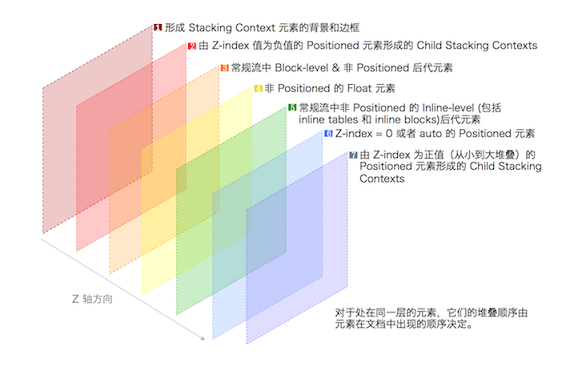
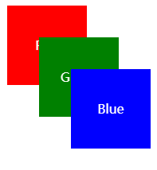
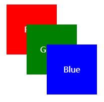
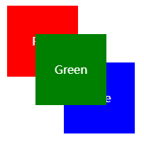
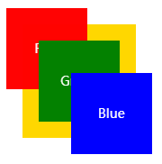

### 层叠上下文 (Stacking Context)



### 如何形成层叠上下文


- 根元素<html></html>
- position值为absolute | relative，且z-index值不为 auto
- position 值为 fixed | sticky
- z-index 值不为 auto 的flex元素，即：父元素display: flex | inline-flex
- opacity 属性值小于 1 的元素
- transform 属性值不为 none的元素
- mix-blend-mode 属性值不为 normal 的元素
- filter、perspective、clip-path、mask、mask-image、mask-border、motion-path 值不为 none 的元素
- perspective 值不为 none 的元素
- isolation 属性被设置为 isolate 的元素
- will-change 中指定了任意 CSS 属性，即便你没有直接指定这些属性的值
- -webkit-overflow-scrolling 属性被设置 touch的元素

总结:
> 层叠上下文可以包含在其他层叠上下文中，并且一起组建了一个有层级的层叠上下文
>
> 每个层叠上下文完全独立于它的兄弟元素，当处理层叠时只考虑子元素，这里类似于BFC
>
> 每个层叠上下文是自包含的：当元素的内容发生层叠后，整个该元素将会在父级叠上下文中按顺序进行层叠

### 层叠顺序
1. 背景和边框：形成层叠上下文的元素的背景和边框。
2. 负z-index值：层叠上下文内有着负z-index值的定位子元素，负的越大层叠等级越低；
3. 块级盒：文档流中块级、非定位子元素；
4. 浮动盒：非定位浮动元素；
5. 行内盒：文档流中行内、非定位子元素；
6. z-index: 0：z-index为0或auto的定位元素， 这些元素形成了新的层叠上下文；
7. 正z-index值：z-index 为正的定位元素，正的越大层叠等级越高；



### demo

#### 普通情况

```html
<span class="red">Red</span>
<span class="green">Green</span>
<span class="blue">Blue</span>
```

```css
.red, .green, .blue {
  position: absolute;
  width: 100px;
  color: white;
  line-height: 100px;
  text-align: center;
}

.red {
/*   z-index: 1; */
  top: 20px;
  left: 20px;
  background: red;
}

.green {
  top: 60px;
  left: 60px;
  background: green;
}

.blue {
  top: 100px;
  left: 100px;
  background: blue;
}
```



#### 在相同层叠上下文的父元素内的情况

```html
<div class='first-box'>
  <span class="red">Red</span>
  <span class="green">Green</span>
</div>
<div class='second-box'>
  <span class="blue">Blue</span>
</div>
```

```css
.first-box{
   // z-index:1;  /* 父元素的层叠上下文一样 */
}

.second-box{
   // z-index:0;  /* 父元素的层叠上下文一样 */
}

div{
  position: relative;
}

.red,
.green,
.blue {
  position: absolute;  /* 都是定位元素 */
  width: 100px;
  color: white;
  line-height: 100px;
  text-align: center;
}

.red {
  top: 20px;
  left: 20px;
  background: red;
  // z-index:3;
}

.green {
  top: 60px;
  left: 60px;
  background: green;
  // z-index:2;
}

.blue {
  top: 100px;
  left: 100px;
  background: blue;
  // z-index:1;
}
```



#### 给子元素增加 z-index
```html
<div class='first-box'>
  <span class="red">Red</span>
  <span class="green">Green</span>
</div>
<div class='second-box'>
  <span class="blue">Blue</span>
  <span class="gold">gold</span>
</div>
```

```css
div{
  position: relative;
}

.red, .green, .blue, .gold {
  position: absolute;
  width: 100px;
  color: white;
  line-height: 100px;
  text-align: center;
}

.red {
  top: 20px;
  left: 20px;
  background: red;
}

.green {
  z-index: 1;     /* 设置了正的z-index */
  top: 60px;
  left: 60px;
  background: green;
}

.blue {
  top: 100px;
  left: 100px;
  background: blue;
}

.gold{
  z-index: -1;     /* 设置了负的z-index */
  width: 140px;
  line-height: 140px;
  top: 40px;
  left: 40px;
  background: gold;
}
```


#### 在不同层叠上下文的父元素内的情况
```html
<div class='first-box'>
  <span class="red">Red</span>
  <span class="green">Green</span>
</div>
<div class='second-box'>
  <span class="blue">Blue</span>
</div>
```

```css
.first-box {
  position: relative;
  z-index: 1; /* 父元素的层叠上下文不一样 */
}

.second-box {
  position: relative;
  z-index: 0; /* 父元素的层叠上下文不一样 */
}

.red,
.green,
.blue {
  position: absolute;
  width: 100px;
  color: white;
  line-height: 100px;
  text-align: center;
}

.red {
  top: 20px;
  left: 20px;
  background: red;
  z-index: 10;
}

.green {
  top: 60px;
  left: 60px;
  background: green;
  z-index: 20;
}

.blue {
  top: 100px;
  left: 100px;
  background: blue;
  z-index: 999; /* 设置
```




#### 给子元素设置 opacity
```html
<div class='first-box'>
  <span class="red">Red</span>
  <span class="green">Green</span>
</div>
<div class='second-box'>
  <span class="blue">Blue</span>
  <span class="gold">gold</span>
</div>
```

```css
.first-box{
  opacity: .99;
}

div{
  position: relative;
}

.red, .green, .blue, .gold {
  position: absolute;
  width: 100px;
  color: white;
  line-height: 100px;
  text-align: center;
}

.red {
  top: 20px;
  left: 20px;
  background: red;
  z-index: 999;    /* 设置了很大的z-index */
}

.green {
  top: 60px;
  left: 60px;
  background: green;
  z-index: 999;    /* 设置了很大的z-index */
}

.blue {
  top: 100px;
  left: 100px;
  background: blue;
}

.gold{
  z-index: -1;     /* 设置了负的z-index */
  width: 140px;
  line-height: 140px;
  top: 40px;
  left: 40px;
  background: gold;
}
```

