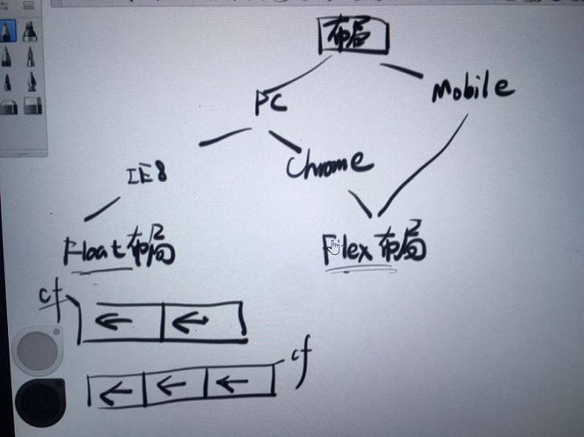
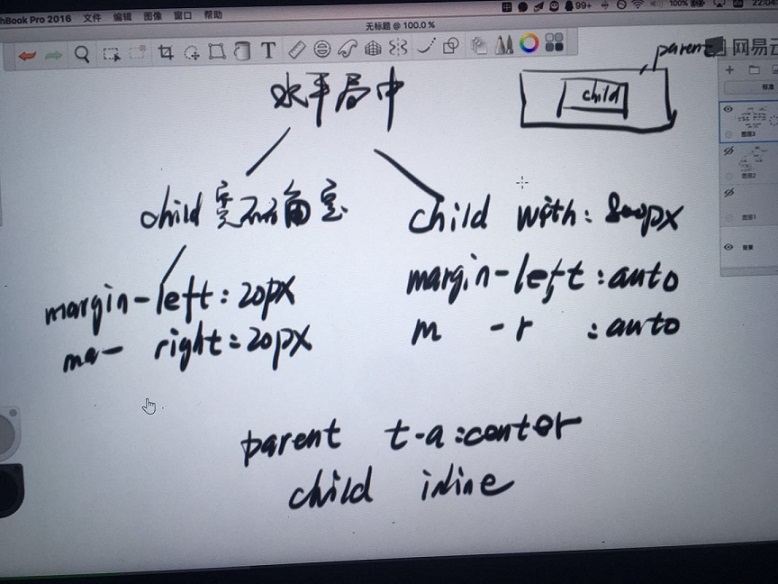
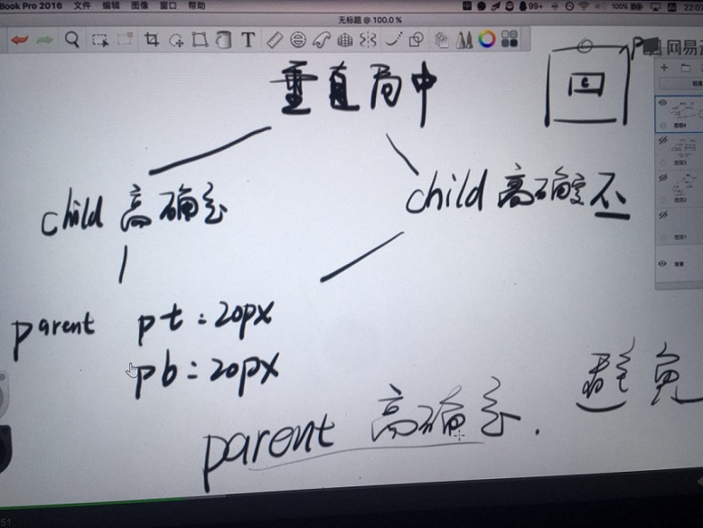
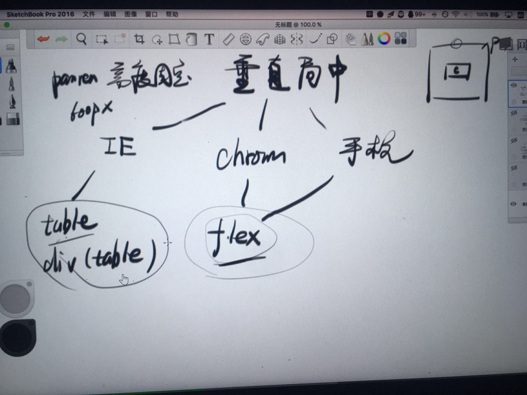
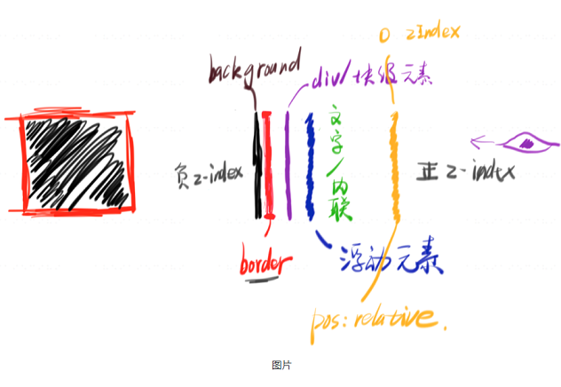
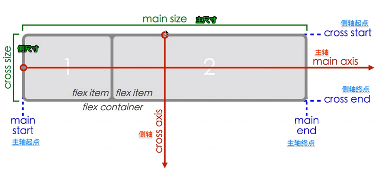
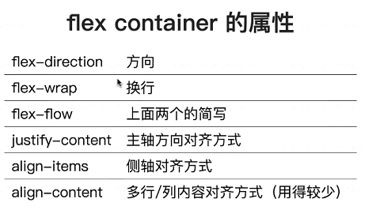
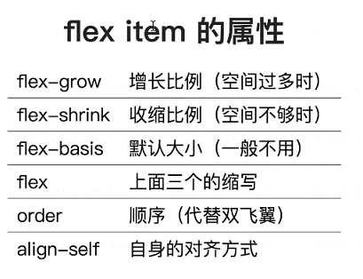
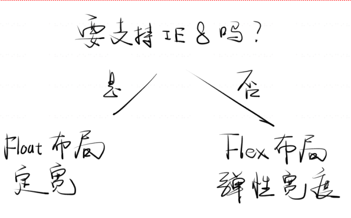

### CSS不正交

#### 各属性间影响
1. margin vs border   margin合并   margin塌陷
2. 小圆点 vs display   li
3. position:absolute vs display:inline

#### 各元素间影响
1. position:fixed vs transform
2. float影响inline元素


### CSS正交
1. 背套路(两种水平居中、三种垂直居中、两种左右结构、两种左中右结构、一行省略、多行省略)

    - 

    - 水平居中

    - 

    - 垂直居中

    ```css
        /*垂直居中时parent千万不要写高度 */
        /*垂直居中时parent千万不要写高度 */
        /*垂直居中时parent千万不要写高度 */
        .demo {
            text-align: center;
            padding: 5px 0;
            line-height: 22px;
        }
    ```

    - 

    - 
2. 工具
    - css3 generator
    - CSS-Tricks
    - animate.css

### 高度与宽度

#### 文档流
1. 内联元素宽高

    - padding和marging、border会影响宽度,但不会影响高度
2. 块级元素宽高(**由内部文档流中元素的高度总和决定的**)
    - 只有内联元素
        1. 一行内容(内联元素)则由行高决定
        2. 多行每行行高加起来
        3. word-break针对单词不换行
        4. **中文对齐**
        5. 内联元素很多则会基于文档流换行
    - 只有块级元素(块的内容+padding+border, margin要看是否合并)
    - 块级+内联

3. 水平居中  [css-tricks](https://css-tricks.com/)
    ```css
    //文字垂直居中,无论多还是单行，不要写高度!!!
    line-height: 24px;
    padding: 8px 0;
    text-align: center
    ```

    ```css
    //DIV里面的DIV绝对居中,父DIV
    display:flex;
    justify-content: center
    align-items: center;

    //或者子DIV
    margin: auto;
    width: 定宽;
    width: 定高;
    position: absolute;
    top: 0;
    right: 0;
    left: 0;
    bott0m: 0;
    ```
4. 垂直居中  [css-tricks](https://css-tricks.com/)
5. 文字溢出省略
    - 一行
    ```css
    white-space: nowrap;
    overflow: hidden;
    text-overflow: ellipsis;
    ```
    - 多行
    ```css
    display: -webkit-box;
    -webkit-line-clamp: 3;
    -webkit-box-orient: vertical;
    overflow: hidden
    ```
#### 盒模型
1. 1比1 DIV

    ```css
    padding-top: 100%;
    ```

2. outline
3. **border 调试大法**

### 堆叠上下文
#### 堆叠顺序


1. background
2. border
3. 块级
4. 浮动
5. 内联
6. z-index: 0
7. z-index: +
如果是兄弟元素重叠，那么后面的盖在前面的身上。
#### 堆叠上下文
- 根元素 (HTML),
- z-index 值不为 "auto"的 绝对/相对定位，
- 一个 z-index 值不为 "auto"的 flex 项目 (flex item)，即：父元素 display: flex|inline-flex，
- opacity 属性值小于 1 的元素（参考 the specification for opacity），
- transform 属性值不为 "none"的元素，
- mix-blend-mode 属性值不为 "normal"的元素，
- filter值不为“none”的元素，
- perspective值不为“none”的元素，
- isolation 属性被设置为 "isolate"的元素，
- position: fixed
- 在 will-change 中指定了任意 CSS 属性，即便你没有直接指定这些属性的值（参考 这篇文章）
- -webkit-overflow-scrolling 属性被设置 "touch"的元素
### icon 全解
- img
    - PS切图 (png的话google)
    > 1. 打开psd
    > 2. 右键选中图层
    > 3. 右键复制图层
    > 4. trim
    > 5. 调整大小
    > 6. export png
- background `background: transparent url(xxx) no-repeat 0 0`
- background 合一法  `CSS sprites generator`
- font
    1. iconfont生成字体url,`style="font-family: iconfont;"`
    2. iconfont-html 生成css link class="xxx"
    3. iconfont-css
        ```css
        .xxx::before {
            content: '\e614'
        }
        ```
        iconfont-html 生成css link class="xxx"
- **SVG**
    - 生成symbol link
    - use svg
- 新手慎用 [cssicon](https://cssicon.space/#/)


### 移动端页面(响应式)
#### media query(注意优先级)
    ```css
        @media (max-width: 320px) {
            body {
                background: red;
            }
        }
        @media (min-width:321px) and (max-width: 375px) {
            body {
                background: orange;
            }
        }
    ```
    <link ref="stylesheet" href="style.css" media="(max-width:320px)">
#### 要设计图(没图不做)
- 实在要做也行，丑可别怪我
#### 手机端要加一个 meta
`<meta name="viewport" content="width=device-width, user-scalable=no, initial-scale=1.0, maximum-scale=1.0, minimum-scale=1.0">`
#### 手机端的交互方式不一样
- 没有 hover
- 有 touch 事件
- 没有 resize
- 没有滚动条

### Flex
以前布局
- normal flow
- float + clear
- position reletive + absolute
- display inline-block
- 负margin

1. flex布局与方向无关
2. 空间自动分配、自动对齐
3. 适用于简单的线性布局，复杂有grid







### layout



#### 原则
- 不到万不得已，不要写死 width 和 height
- 尽量用高级语法，如 calc、flex
- 如果是 IE，就全部写死

#### 口诀

1. float
    - 儿子全加 float
    - 老子加 .clearfix
2. flex
    - 老子加 display: flex
    - 老子加 justify-content: space-between;

如果宽度不够，可以用 margin: 0 -4px;

```css
.clearfix:after{
    content: '';
    display: block;
    clear: both;
}
.clearfix{
    zoom: 1;
}
```

### BFC
一个块格式化上下文（block formatting context） 是Web页面的可视化CSS渲染出的一部分。它是块级盒布局出现的区域，也是浮动层元素进行交互的区域。

一个块格式化上下文由以下之一创建：

-根元素或其它包含它的元素
-浮动元素 (元素的 float 不是 none)
-绝对定位元素 (元素具有 position 为 absolute 或 fixed)
-内联块 (元素具有 display: inline-block)
-表格单元格 (元素具有 display: table-cell，HTML表格单元格默认属性)
-表格标题 (元素具有 display: table-caption, HTML表格标题默认属性)
-具有overflow 且值不是 visible 的块元素，
-**display: flow-root**
-column-span: all 应当总是会创建一个新的格式化上下文，即便具有 column-span: all 的元素并不被包裹在一个多列容器中。
一个块格式化上下文包括创建它的元素内部所有内容，除了被包含于创建新的块级格式化上下文的后代元素内的元素。

块格式化上下文对于定位 (参见 float) 与清除浮动 (参见 clear) 很重要。定位和清除浮动的样式规则只适用于处于同一块格式化上下文内的元素。浮动不会影响其它块格式化上下文中元素的布局，并且清除浮动只能清除同一块格式化上下文中在它前面的元素的浮动。

example:
1. 爸爸管儿子
```html
<!DOCTYPE html>
<html>
<head>
  <meta charset="utf-8">
  <title>JS Bin</title>
</head>
<body>
<div class="baba">
  <div class="erzi">
  </div>
</div>
</body>
</html>
```

```css
.baba{
  border: 10px solid red;
  min-height: 10px;
  display: flow-root; /*触发BFC*/
}
.erzi{
  background: green;
  float:left;
  width: 300px;
  height: 100px;
}
```
2. 兄弟之间划清界限

```html
<!DOCTYPE html>
<html>
<head>
  <meta charset="utf-8">
  <title>JS Bin</title>
</head>
<body>
  <div class="gege">gege</div>
  <div class="didi">1234</div>
</body>
</html>
```
```css
.gege{
  width: 100px;
  min-height: 600px;
  border: 3px solid red;
  float: left;
  margin-right: 20px;
}

.didi{
  min-height: 600px;
  border: 5px solid green;
  display: flow-root;
}
```

### REM (手机专用)
1. px em rem vh vw
> 浏览器默认font-size: 16px
> chrome可以设置font-size默认最小值12px
2. rem vs em
3. 手机端方案的特点
    - 所有手机显示的界面都是一样的，只是大小不同
    - rem == html font-size == viewport width

4. 使用 JS 动态调整 REM
```javascript
<meta name="viewport" content="width=device-width, user-scalable=no, initial-scale=1.0, maximum-scale=1.0, minimum-scale=1.0">
 <script>
     var pageWidth = window.innerWidth
     document.write('<style>html{font-size:'+pageWidth+'px;}</style>')
 </script>
```

5. REM 可以与其他单位同时存在(当数值太小的时候直接px,比如border)
6. 在 SCSS 里使用 PX2REM

### 定位参照于谁块来定位

- 没有定位 :包含块
- 相对: 元素本来的位置
- 绝对: 包含块
    - 如果最近的祖先元素中存在定位元素，则这个定位元素就是包含块
    - 如果没有，包含块为初始包含块
- 固定: 视口
- 初始包含块: 一个视窗大小的矩形，不等于视窗

### 属性默认值

- left top right bottom width height 默认值为auto
- margin padding 默认值 0
- boder-width 如果不存在border-style

### 属性是否可继承

- left top right bottom width height 默认值为auto 不可继承

### 百分比参照于谁

- width margin padding:包含块的width
- height:包含块的height
- left:包含块的width
- top :包含块的height

### 浮动(浮动提升半层)

- 三列布局需求
    - 两边固定，当中自适应
    - 中间列要完整的显示
    - 中间列要优先加载
- 四种实现
    - 定位
    - 浮动
    - 圣杯(推荐)
    - 双飞翼(推荐)

### margin为负值(margin不影响元素的位置)

> 负值:将元素的边界往里收
> 正值:将元素的边界往外扩

### 伪等高布局

### fixed

怎么使用绝对定位来模拟固定定位

1. 禁止系统滚动条
2. 将滚动条加给body
3. 让body的尺寸变为视口的尺寸

### 粘连布局

### BFC

- 两列布局
- margin叠加
- 清浮动

### 文本 字体

### 垂直水平居中

- 已知宽高
    - 绝对定个位盒子的特性
- 未知宽高
- 图片

### css hack(主要针对IE10以下)

1. 溢出显示省略号

```css
div {
    white-space:no-wrap;
    overflow:hidden;
    text-overflow:ellipsis;
}
```

### 如何实现一张图片的垂直水平居中

```css
body:after{
    content: "";
    display: inline-block;
    height: 100%;
    vertical-align: middle;
}
img{
    vertical-align: middle;
}
```