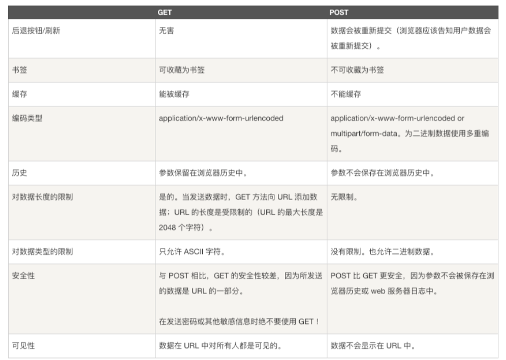

### GET - 从指定资源请求数据
    1. get
    2. delete
    3. head
    4. ...

- 可被缓存（可通过添加random参数避免出现缓存）
- 可保留在浏览器历史记录中
- 可被收藏成书签
- 处理非敏感数据时使用
- 长度限制（基于url地址问号传递参数来实现,POST基于设置请求主体来实现。各大浏览器都有url最大长度限制,超过部分浏览器会舍弃掉）
- 只应用于取回数据
- ==对于GET方式的请求，浏览器会把http，header和data一并发送出去，服务器响应200（返回数据）==
- ==而对于POST，浏览器先发送header，服务器响应100 continue，浏览器再发送data，服务器响应200 OK（返回数据）==

### POST  - 向指定资源提交要被处理的数据

- 请求不会被缓存(除非特殊处理)OK
- POST 请求不会保留在浏览器历史记录中
- POST 不能被收藏为书签
- POST 理论上没有大小限制,一般项目中会做限制

    1. post
    2. put
    3. ...

