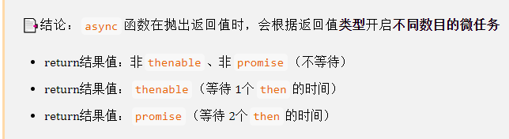
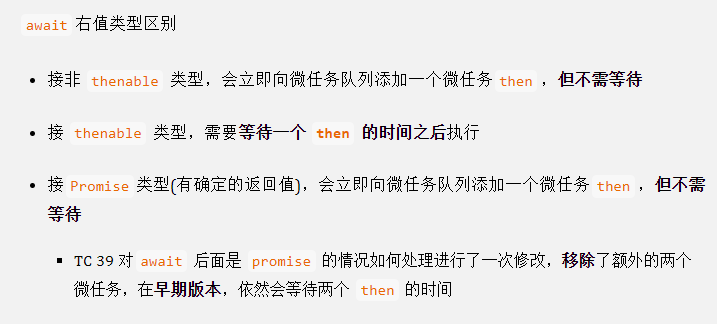

### why async

#### 传统callback方式

```javascript
asyncCallone(() => {
  asyncCallTwo(() => {
    asyncCallThree(() => {
      ...
    })
  })
})
```

#### Promise

- 解决问题

    - 多层嵌套的问题
    - 每种任务的处理结果存在两种可能性（fulfilled or rejected, default is pending），那么需要在每种任务执行结束后分别处理这两种可能性
- 如何解决

    - 回调函数延迟绑定
    - 返回值穿透
    - 错误冒泡
- 缺点

    1. 无法取消Promise,一旦新建它就会立即执行，无法中途取消
    2. 如果不设置回调函数，promise内部抛出的错误，不会反应到外部
    3. 当处于pending状态时，无法得知目前进展到哪一个阶段（刚刚开始还是即将完成）
- API

    - `Promise.resolve`
        - 若参数是`Promise`实例，那么`Promise.resolve`将不做任何修改，原封不动地返回这个实例
        - 若参数是`thenable`对象，`Promise.resolve`方法会将这个对象转为`Promise`对象，然后就立即执行`thenable`对象的`then`方法
        - 若参数是一个原始值，或是一个不具有`then`方法的对象，则`Promise.resolve`方法返回一个新的 `Promise` 对象，状态为`resolved`
        - 若不带有任何参数，直接返回一个`resolved`状态的 `Promise` 对象
    - `Promise.reject`（其参数会原封不动地作为`reject`的理由，变成后续方法的参数,这一点与`Promise.resolve`方法不一致）
    - `Promise.all`（其中任意一个 `promise` 被 `reject` ，`Promise.all` 就会立即被 `reject` ，数组中其它未执行完的 `promise` 依然在执行， `Promise.all` 没有任何措施可以取消它们的执行）
        - 适合场景：彼此相互依赖，其中任何一个被 `reject` ，其它都失去了价值
    - `Promise.allSettled`
        - 适合场景：彼此互不依赖，其中任何一个被 `reject` ，对其它都没有影响

        - 适合场景：期望知道每个 `promise` 的执行结果

    - Promise.any
    - Promise.prototype.then
    - Promise.prototype.finally

        - 由于无法知道`promise`的最终状态，所以`finally`的回调函数中不接收任何参数，仅用于无论最终结果如何都要执行的情况
        - 与`Promise.resolve(2).then(() => {}, () => {})` （resolved的结果为`undefined`）不同，`Promise.resolve(2).finally(() => {})` resolved的结果为2，同样的`Promise.reject(3).finally(() => {})`rejected 的结果为3
- Knowledge Point

    - 三种状态：`pending`、`fulfilled`和`rejected`

    - 初始状态是`pending`, 执行了`resolve`，`Promise`状态会变成`fulfilled`; 执行了`reject`，`Promise`状态会变成`rejected`

    - `Promise`状态不受外界影响

    - Promise只以第一次决议为准，第一次成功就永久为`fulfilled`，第一次失败就永远状态为`rejected`

    - Promise中有`throw`的话，就相当于执行了`reject`

    - Promise里没有执行`resolve`、`reject`以及`throw`的话，这个promise的状态也是`pending`

    - 基于上一条，`pending`状态下的promise不会执行`then`中的回调函数
    
    - 必须给`Promise`对象传入一个执行函数，否则报错

#### Generator

```javascript
function* gen() {
    let a = yield 111;
    console.log(a);
    let b = yield 222;
    console.log(b);
    let c = yield 333;
    console.log(c);
    let d = yield 444;
    console.log(d);
}
let t = gen();
t.next(1); //第一次调用next函数时，传递的参数无效，故无打印结果
t.next(2); // 2
t.next(3); // 3
t.next(4); // 4
t.next(5); // 5
```

#### A/A

- 语法简洁，更像是同步代码，也更符合普通的阅读习惯
- 改进JS中异步操作串行执行的代码组织方式，减少callback的嵌套
- Promise中不能自定义使用try/catch进行错误捕获，但是在Async/await中可以像处理同步代码处理错误

##### async返回值




```javascript
const testA = async () => 1

testA().then(() => console.log(1))
Promise.resolve()
	.then(() => console.log(2))
	.then(() => console.log(3))
```

```javascript
const testB = async () => {
	return {
		then(cb) {
			cb()
		},
	}
}

testB().then(() => console.log(1))
Promise.resolve()
	.then(() => console.log(2))
	.then(() => console.log(3))

```

```javascript
const testC = async () => {
	return new Promise((resolve, reject) => {
		resolve()
	})
}

testC().then(() => console.log(1))
Promise.resolve()
	.then(() => console.log(2))
	.then(() => console.log(3))
	.then(() => console.log(4))

```

##### await 右值类型区别



- `await`后面接非 `thenable` 类型，会立即向微任务队列添加一个微任务`then`，**但不需等待**

###### 非 `thenable`

```javascript
async function test() {
	console.log(1)
	await 1
	console.log(2)
}

test()
console.log(3)
```

```javascript
function func() {
	console.log(2)
}

async function test() {
	console.log(1)
	await func()
	console.log(3)
}

test()
console.log(4)
```

```javascript
async function test() {
	console.log(1)
	await 123
	console.log(2)
}

test()
console.log(3)

Promise.resolve()
	.then(() => console.log(4))
	.then(() => console.log(5))
	.then(() => console.log(6))
	.then(() => console.log(7))
```

###### `thenable`类型

- `await` 后面接 `thenable` 类型，需要**等待一个 `then` 的时间之后**执行

```javascript
async function test() {
	console.log(1)
	await {
		then(cb) {
			cb()
		},
	}
	console.log(2)
}

test()
console.log(3)

Promise.resolve()
	.then(() => console.log(4))
	.then(() => console.log(5))
	.then(() => console.log(6))
	.then(() => console.log(7))
```

###### ==`Promise`类型==

```javascript
async function test() {
	console.log(1)
	await new Promise((resolve, reject) => {
		resolve()
	})
	console.log(2)
}

test()
console.log(3)

Promise.resolve()
	.then(() => console.log(4))
	.then(() => console.log(5))
	.then(() => console.log(6))
	.then(() => console.log(7))
// 1 3 2 4 5 6 7
```

```javascript
async function func() {
	console.log(1)
	await 1
	console.log(2)
	await 2
	console.log(3)
	await 3
	console.log(4)
}

async function test() {
	console.log(5)
	await func()
	console.log(6)
}

test()
console.log(7)

Promise.resolve()
	.then(() => console.log(8))
	.then(() => console.log(9))
	.then(() => console.log(10))
	.then(() => console.log(11))
//5 1 7 2 8 3 9 4 10 6 11
```

###### `await`一定要等到右侧的表达式有**确切的值**才会放行，否则将一直等待

```javascript
function func() {
	return new Promise((resolve) => {
		console.log('B')
		// resolve()
	})
}

async function test() {
	console.log(1)
	await func()
	console.log(3)
}

test()
console.log(4)
// 1 B 4 (永远不会打印3)

//or
async function test() {
	console.log(1)
	await new Promise((resolve) => {
		console.log('B')
		// resolve()
	})
	console.log(3)
}

test()
console.log(4)
// 1 B 4 (永远不会打印3)
```


##### demo

```javascript
async getBookByAuthor(authorId) {
  const books = await bookModel.fetchAll()
  return books.filter(b => b.authorId === authorId)
}
//promise way
getBooksByAuthor2(authorId) {
  return bookModel.fetchAll().then(books => books.filter(b => b.authorId === authorId))
}
```

```javascript
let p1 = Promise.reject(100)
async function fn1() {
  let result = await p1
  console.log(1) //dead code
}
```

### Practices

#### 并行调用

```javascript
//wrong
async getBooksByAuthor(authorId) {
  const books = await bookModel.fetchAll()
  const author = await authorModel.fetch(author)
  return {
    author,
    books: books.filter(book => book.authorId === authorId)
  }
}

//correct
async getBooksByAuthor(authorId) {
  const bookPromise = bookModel.fetchAll()
  const authorPromise = authorModel.fetch(author)
  const book = await bookPromise
  const author = await authorPromise
  return {
    author,
    books: books.filter(book => book.authorId === authorId)
  }
}

async getAuthors(authorIds) {
  //wrong
  const authors = _.map(
    authorIds,
    id => await authorModel.fetch(id)
  )
  //correct
  const promises = _.map(authorIds, id => authorModel.fetch(id))
  const authors = await Promise.all(promises)
}
```

#### 让Promise.all正常执行完成即使出现异常

```javascript
function getBannerList(){
  return new Promise((resolve,reject)=>{
    setTimeout(function(){
      // 假设这里 reject 一个异常
      reject(new Error('error'))
    },300)
  })
}

function getStoreList(){
 // ...
}

function getCategoryList(){
 // ...
}

function initLoad(){
  Promise.all([
    getBannerList().catch(err=>err),
    getStoreList().catch(err=>err),
    getCategoryList().catch(err=>err)
  ]).then(res=>{
    if(res[0] instanceOf Error){
      // 处理异常
    } else {
      // 渲染数据
    }

    if(res[1] instanceOf Error){
      // 处理异常
    } else {
      // 渲染数据
    }

    if(res[2] instanceOf Error){
     // 处理异常
    } else {
      // 渲染数据
    }
  })
}

initLoad()
```

#### race使用场景

- 使用`Promise.race`把异步操作和定时器放到一起，若定时器先触发，认为超时，告知用户
- 图片等资源有多个存放路径，但是不确定哪个路径的资源更快，可以用该方法同时请求多个路径，哪个路径的资源最先拿到，使用哪个资源

```javascript
function requestImg(path){
  return new Promise(function(resolve, reject){
    let img = new Image()
    img.onload = resolve
    img.onerror = reject 
    img.src = path
  })
}

// 定时功能的延迟函数
const timeout = (delay = 3000) => {
  return new Promise(function(resolve, reject){
    setTimeout(function(){
      reject('Picture request timeout')
    }, delay)
  })
}

Promise
.race([requestImg(), timeout(3000)])
.then(function(results){
  // 该资源请求在指定时间内完成
  console.log(results)
})
.catch(function(reason){
  // 该资源请求被在指定时间内没有完成
  console.log(reason)
});
```

#### allSettled使用场景

```javascript
const promises = [
  fetch('/api-1'),
  fetch('/api-2'),
  fetch('/api-3'),
];
const results = await Promise.allSettled(promises)
// 过滤出成功的请求
const successfulPromises = results.filter(p => p.status === 'fulfilled');

// 过滤出失败的请求，并输出原因
const errors = results
  .filter(p => p.status === 'rejected')
  .map(p => p.reason);

removeLoadingIndicator();// 移除加载的滚动图标
```

#### 红黄绿灯

```javascript
const red = () => console.log('red')
const yellow = () => console.log('yellow')
const green = () => console.log('green')

const light = (cb, timeout) => {
	return new Promise((resolve, reject) => {
		setTimeout(() => {
			cb()
			resolve()
		}, timeout)
	})
}

let endCnt = 0
const start = () => {
	if (endCnt++ >= 3) {
		console.log('finish lighting~~')
		return
	}
	Promise.resolve()
		.then(() => {
			return light(red, 3000)
		})
		.then(() => {
			return light(yellow, 2000)
		})
		.then(() => {
			return light(green, 1000)
		})
		.then(() => {
			start()
		})
}

start()
```

#### 异步执行函数

```javascript
const repeat = (cb, times, delay = 1000) => {
	return async function (...args) {
		for (let i = 0; i < times; i++) {
			await new Promise((resolve, reject) => {
				setTimeout(() => {
					cb.call(null, ...args)
					resolve()
				}, delay)
			})
		}
	}
}
const repeatFn = repeat(console.log, 4, 1000)
repeatFn('hello')
```

#### generator实现

```javascript
function* repeatedArr(arr) {
	let i = 0
	while (true) {
		yield arr[i++ % arr.length]
	}
}

let infiniteNameList = repeatedArr(starks)

let sleep = (ms) =>
	new Promise((resolve) => {
		setTimeout(() => {
			resolve()
		}, ms)
	})

;(async () => {
	for (const name of infiniteNameList) {
		await sleep(1000)
		console.log(name)
	}
})()
```

#### PromiseQueue

```javascript
class PromiseQueue {
	constructor(tasks, concurrentCount = 1) {
		this.totals = tasks.length
		this.todo = tasks
		this.count = concurrentCount
		this.running = []
		this.complete = []
	}

	runNext() {
		return this.running.length < this.count && this.todo.length
	}

	run() {
		while (this.runNext()) {
			let promise = this.todo.shift()
			promise.then(() => {
				this.complete.push(this.running.shift())
				this.run()
			})
			this.running.push(promise)
		}
	}
}
```

