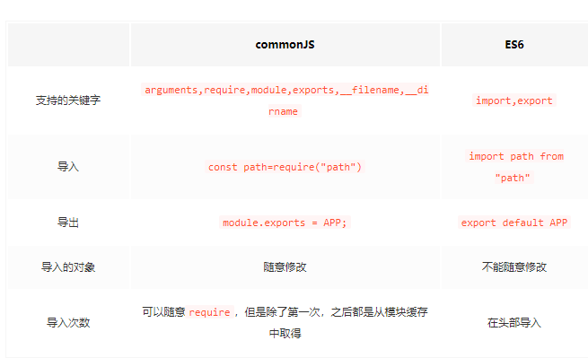

### what is module
- 将一个复杂的程序依据一定的规则(规范)封装成几个块(文件), 并进行组合在一起
- 块的内部数据与实现是私有的,只是向外部暴露一些接口(方法)与外部其它模块通信

### CommonJS(同步加载)
Node 应用由模块组成，采用 CommonJS 模块规范。每个文件就是一个模块，有自己的作用域。在一个文件里面定义的变量、函数、类，都是私有的，对其他文件不可见。在服务器端，模块的加载是运行时同步加载的；在浏览器端，模块需要提前编译打包处理

如果没有写后缀名Node会尝试为文件名添加.js、.json、.node后再搜索

CommonJS规范加载模块是同步的，也就是说，只有加载完成，才能执行后面的操作。

基本语法：

- 暴露模块：`module.exports = value` 或 `exports.xxx = value`
- 引入模块：`require(xxx)`,如果是第三方模块，xxx为模块名；如果是自定义模块，xxx为模块文件路径

但是，CommonJs有一个重大的局限使得它不适用于浏览器环境，那就是require操作是同步的。这对服务器端不是一个问题，因为所有的模块都存放在本地硬盘，可以同步加载完成，等待时间就是硬盘的读取时间。但是，对于浏览器，这却是一个大问题，因为模块都放在服务器端，等待时间取决于网速的快慢，可能要等很长时间，浏览器处于”假死”状态

因此，浏览器端的模块，不能采用”同步加载”（synchronous），只能采用”异步加载”（asynchronous），这就是AMD规范诞生的背景

> CommonJS 模块的特点如下：
>
> 所有代码运行在模块作用域，不会污染全局作用域
>
> 模块可以多次加载，但是只会在第一次加载时运行一次，然后运行结果就被缓存了，以后再加载，就直接读取缓存结果。要想让模块再次运行，必须清除缓存
>
> 模块加载的顺序，按照其在代码中出现的顺序


**CommonJs模块输出的是一个值的拷贝，ES6模块输出的是值的引用**

**CommonJs模块是运行时加载，ES6模块是编译时输出接口**

### AMD(异步加载)
特点：非同步加载模块，允许指定回调函数，浏览器端一般采用AMD规范

代表作：`require.js`
```javascript
//定义没有依赖的模块
define(function(){
   return 模块
})

//定义有依赖的模块
define(['module1', 'module2'], function(m1, m2){
   return 模块
})

//引入使用模块
require(['module1', 'module2'], function(m1, m2){
   //使用m1/m2
})
```
#### 核心实现
```javascript
  function require (url, callback) {
    // url可以换成List，然后遍历；
    var $script = document.createElement('script');
    $script.src = url;

    // 利用onload回调，实现依赖加载
    $script.onload = function (e) {
      // 省略callback 检测
      callback();
    }
    document.body.appendChild($script);
  }
```


### CMD
特点：专门用于浏览器端，模块的加载是异步的，模块使用时才会加载执行

代表作：`Sea.js`

### CMD与AMD区别
AMD和CMD最大的区别是`对依赖模块的执行时机处理不同`，而不是`加载的时机或者方式不同`，二者皆为`异步`加载模块

AMD依赖前置，js可以方便知道依赖模块是谁，立即加载

而CMD就近依赖，需要使用把模块变为字符串解析一遍才知道依赖了那些模块，这也是很多人诟病CMD的一点，牺牲性能来带来开发的便利性，实际上解析模块用的时间短到可以忽略

一句话总结：**两者都是异步加载，只是执行时机不一样。AMD是依赖前置，提前执行，CMD是依赖就近，延迟执行**

### UMD
UMD是AMD和CommonJS的糅合

AMD模块以浏览器第一的原则发展，异步加载模块

CommonJS模块以服务器第一原则发展，选择同步加载，它的模块无需包装(unwrapped modules)

这迫使人们又想出另一个更通用的模式UMD （Universal Module Definition）。希望解决跨平台的解决方案

UMD先判断是否支持Node.js的模块（exports）是否存在，存在则使用Node.js模块模式

在判断是否支持AMD（define是否存在），存在则使用AMD方式加载模块
```javascript
(function (window, factory) {
    if (typeof exports === 'object') {
        module.exports = factory();
    } else if (typeof define === 'function' && define.amd) {
        define(factory);
    } else {
        window.eventUtil = factory();
    }
})(this, function () {
    //module ...
});
```

### ES6模块化
ES6 模块的设计思想是尽量的静态化，使得编译时就能确定模块的依赖关系，以及输入和输出的变量。CommonJS 和 AMD 模块，都只能在运行时确定这些东西。比如，CommonJS 模块就是对象，输入时必须查找对象属性
```javascript
/** 导出模块的方式 **/
var a = 0;
export { a }; //第一种

export const b = 1; //第二种

let c = 2;
export default { c }//第三种

let d = 2;
export default { d as e }//第四种，别名

/** 导入模块的方式 **/
import { a } from './a.js' //针对export导出方式，.js后缀可省略

import main from './c' //针对export default导出方式,使用时用 main.c

import 'lodash' //仅仅执行lodash模块，但是不输入任何值
```

#### 命名式导出与默认导出
- `export {<变量>}`这种方式一般称为`命名式导出`或者`具名导出`，导出的是一个`变量的引用`。`
- `export default`这种方式称为`默认导出`或者`匿名导出`，导出的是一个`值`

```javascript
// a.js
let x = 10
let y = 20
setTimeout(()=>{
    x = 100
    y = 200
},100)
export { x }
export default y

// b.js
import { x } from './a.js'
import y from './a.js'
setTimeout(()=>{
    console.log(x,y) // 100,20
},100)
```

### ES6 模块与 CommonJS 模块的差异
-  CommonJS 模块输出的是一个值的拷贝，ES6 模块输出的是值的引用
-  CommonJS 模块是运行时加载，ES6 模块是编译时输出接口


### 总结
- CommonJS规范主要用于服务端编程，加载模块是同步的，这并不适合在浏览器环境，因为同步意味着阻塞加载，浏览器资源是异步加载的，因此有了AMD、CMD解决方案
- AMD规范在浏览器环境中异步加载模块，而且可以并行加载多个模块。不过，AMD规范开发成本高，代码的阅读和书写比较困难，模块定义方式的语义不顺畅
- CMD规范与AMD规范很相似，都用于浏览器编程，依赖就近，延迟执行，可以很容易在Node.js中运行。不过，依赖SPM打包，模块的加载逻辑偏重
- ES6 在语言标准的层面上，实现了模块功能，而且实现得相当简单，完全可以取代 CommonJS 和 AMD 规范，成为浏览器和服务器通用的模块解决方案