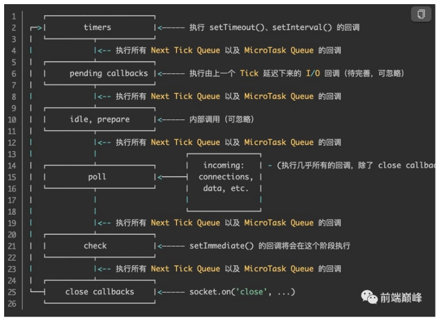

### 大致流程


1. js代码分为同步任务和异步任务
2. 同步任务会进入主线程，异步任务会进入Event Table(事件表),当事件表中的异步任务完成后会在Event Queue(事件队列)中注册回调函数
3. 主线程任务全部完成后,才会完成Event Queue中的任务
4. js解析器会不断地重复检查主线程执行栈是否为空,然后重复第3步,这就是Event Loop(事件循环)
   

### 详细流程


所以通常来说，我们页面中的js执行顺序是这样的:

- 第一轮事件循环
    1. 主线程执行js整段代码（宏任务），将ajax、setTimeout、promise等回调函数注册到Event Queue，并区分宏任务和微任务
    2. 主线程提取并执行Event Queue 中的ajax、promise等所有微任务，并注册微任务中的异步任务到Event Queue


- 第二轮事件循环
    1. 主线程提取Event Queue中的第一个宏任务(通常是setTimeout)
    2. 主线程执行setTimeout宏任务,并注册setTimeout代码中的异步任务到Event Queue(如果有)
    3. 执行Event Queue中的所有微任务，并注册微任务中的异步任务到Event Queue(如果有)


- **简而言之，一次事件循环只执行处于Macrotask队首的任务，执行完成后，立即执行Microtask队列中的所有任务**

### 常见的Macrotask、Microtask
- 宏任务
  - script(整体代码)
  - setTimeout、setInterval、setImmediate (Node.js)
  - 用户交互事件（如鼠标点击、滚动页面、放大缩小等）
  - UI 渲染（如解析 DOM、计算布局、绘制）
  - 网络请求完成、文件读写(I/O操作)完成事件
  - MessageChannel
  - postMessage
- 微任务
  - Promise
  - Object.observe(不推荐使用)
  - MutationObserver
  - process.nextTick(Node.js)
  - queueMicrotask


### async await的理解

```javascript
async function foo() {
  // await 前面的代码
  await bar();
  // await 后面的代码
}
//等于
function foo() {
  // await 前面的代码
  Promise.resolve(bar()).then(() => {
    // await 后面的代码
  });
}
```

1. async 做一件什么事情

**带async关键字的函数，它使得你的函数的返回值必定是promise对象**

如果async关键字函数返回的不是promise，会自动用Promise.resolve()包装

如果async关键字函数显式地返回promise，那就以你返回的promise为准

2. await 在等什么？

await等的是右侧「表达式」的结果，**先计算**出右侧的结果，即执行同步代码，然后看到await后，中断async函数

3. await 等到之后，做了一件什么事情

- 如果不是promise,await会阻塞后面的代码,先执行async外面的同步代码,同步代码执行完,再回到async内部,把这个非promise的东西,作为await表达式的结果
- 如果它等到的是一个promise对象,await也会暂停async后面的代码,先执行async外面的同步代码,等着 Promise对象fulfilled,然后把resolve的参数作为await表达式的运算结果

### Demo1
```javascript
const p1 = new Promise((resolve, reject) => {
  console.log('promise1');
  resolve();
})
  .then(() => {
    console.log('then11');
    new Promise((resolve, reject) => {
      console.log('promise2');
      resolve();
    })
      .then(() => {
        console.log('then21');
      })
      .then(() => {
        console.log('then23');
      });
  })
  .then(() => {
    console.log('then12');
  });

const p2 = new Promise((resolve, reject) => {
  console.log('promise3');
  resolve();
}).then(() => {
  console.log('then31');
});
```

### Demo2
```javascript
const p1 = new Promise((resolve, reject) => {
  console.log('promise1'); // 1
  resolve();
})
  .then(() => {
    console.log('then11'); // 2
    return new Promise((resolve, reject) => {
      console.log('promise2'); // 3
      resolve();
    })
      .then(() => {
        console.log('then21'); // 4
      })
      .then(() => {
        console.log('then23'); // 5
      });
  })
  .then(() => {
    console.log('then12'); //6
  });
```

### Nodejs Event Loop

Node中的`Event Loop`是基于`libuv`实现的，而`libuv`是 Node 的新跨平台抽象层，`libuv`使用异步，事件驱动的编程方式，核心是提供`i/o`的事件循环和异步回调。`libuv`的`API`包含有时间，非阻塞的网络，异步文件操作，子进程等等。

Event Loop就是在`libuv`中实现的。所以关于 Node 的 `Event Loop`学习，有两个官方途径可以学习:

- libuv 文档
- 官网的What is the Event Loop

在学习 Node 环境下的 `Event Loop` 之前呢，我们首先要明确执行环境，nodejs的event是基于libuv，而浏览器的event loop则在html5的规范中明确定义



Node 的 Event Loop 分为 6 个阶段：

- timers：执行`setTimeout()` 和 `setInterval()`中到期的callback
- pending callback: 上一轮循环中有少数的`I/O` callback会被延迟到这一轮的这一阶段执行
- idle, prepare：仅内部使用
- poll: 最为重要的阶段，执行`I/O` callback，在**适当的条件下**会阻塞在这个阶段
- check: 执行`setImmediate`的callback
- close callbacks: 执行`close`事件的callback，例如`socket.on('close'[,fn])`、`http.server.on('close, fn)`
- 上面六个阶段都不包括` process.nextTick()`

#### timers

timers 阶段会执行 `setTimeout` 和 `setInterval` 回调，并且是由 poll 阶段控制的

在 timers 阶段其实使用一个最小堆而不是队列来保存所有的元素，其实也可以理解，因为timeout的callback是按照超时时间的顺序来调用的，并不是先进先出的队列逻辑）。而为什么 timer 阶段在第一个执行阶梯上其实也不难理解。在 Node 中定时器指定的时间也是不准确的，而这样，就能尽可能的准确了，让其回调函数尽快执行

#### pending callbacks

pending callbacks 阶段其实是 `I/O` 的 callbacks 阶段。比如一些 TCP 的 error 回调等

举个栗子：如果`TCP socket ECONNREFUSED`在尝试`connect`时`receives`，则某些Lunix系统希望等待报告错误。这将在pending callbacks阶段执行

#### poll

poll 阶段主要有两个功能：

- 执行 `I/O` 回调
- 处理 poll 队列（poll queue）中的事件

当时Event Loop 进入到 poll 阶段并且 timers 阶段没有任何可执行的 task 的时候（也就是没有定时器回调），将会有以下两种情况

- 如果 poll queue 非空，则 Event Loop就会执行他们，直到为空或者达到system-dependent(系统相关限制)
- 如果 poll queue 为空，则会发生以下一种情况
  - 如果setImmediate()有回调需要执行，则会立即进入到 check 阶段
  - 相反，如果没有setImmediate()需要执行，则 poll 阶段将等待 callback 被添加到队列中再立即执行，这也是为什么我们说 poll 阶段可能会阻塞的原因


一旦 poll queue 为空，Event Loop就回去检查timer 阶段的任务。如果有的话，则会回到 timer 阶段执行回调

#### check

check 阶段在 poll 阶段之后，`setImmediate()`的回调会被加入check队列中，他是一个使用`libuv API` 的特殊的计数器

通常在代码执行的时候，Event Loop 最终会到达 poll 阶段，然后等待传入的链接或者请求等，但是如果已经指定了setImmediate()并且这时候 poll 阶段已经空闲的时候，则 poll 阶段将会被中止然后开始 check 阶段的执行

#### close callbacks

如果一个 socket 或者事件处理函数突然关闭/中断(比如：`socket.destroy()`),则这个阶段就会发生 `close` 的回调执行。否则他会通过 `process.nextTick()` 发出

#### setImmediate() vs setTimeout()

`setImmediate()` 和 `setTimeout()`非常的相似，区别取决于谁调用了它

- `setImmediate`在 poll 阶段后执行，即check 阶段
- `setTimeout` 在 poll 空闲时且设定时间到达的时候执行，在 timer 阶段

计时器的执行顺序将根据调用它们的上下文而有所不同。如果两者都是从主模块中调用的，则时序将受到进程性能的限制

例如，如果我们运行以下不在`I / O`周期（即主模块）内的脚本，则两个计时器的执行顺序是不确定的，因为它受进程性能的约束

```javascript
setTimeout(() => {
  console.log('timeout');
}, 0);

setImmediate(() => {
  console.log('immediate');
});
```

如果在一个`I/O` 周期内移动这两个调用，则始终首先执行立即回调

```javascript
const fs = require('fs');
fs.readFile(__filename, () => {
  setTimeout(() => {
    console.log('timeout');
  }, 0);
  setImmediate(() => {
    console.log('immediate');
  });
});
```

所以与`setTimeout（）`相比，使用`setImmediate（）`的主要优点是，如果在`I / O`周期内安排了任何计时器，则`setImmediate（）`将始终在任何计时器之前执行，而与存在多少计时器无关

#### nextTick queue

可能你已经注意到`process.nextTick（）`并未显示在图中，即使它是异步API的一部分。所以他拥有一个自己的队列：`nextTickQueue`

这是因为`process.nextTick（）`从技术上讲不是Event Loop的一部分。相反，无论当前事件循环的当前阶段如何，都将在当前操作完成之后处理`nextTickQueue`

如果存在 `nextTickQueue`，就会清空队列中的所有回调函数，并且优先于其他 `microtask` 执行

```javascript
setTimeout(() => {
 console.log('timer1')
 Promise.resolve().then(function() {
   console.log('promise1')
 })
}, 0)
//nextTick->nextTick->nextTick->timer1
process.nextTick(() => {
 console.log('nextTick')
 process.nextTick(() => {
   console.log('nextTick')
   process.nextTick(() => {
     console.log('nextTick')
     process.nextTick(() => {
       console.log('nextTick')
     })
   })
 })
})
```

#### process.nextTick() vs setImmediate()

- `process.nextTick（）`在同一阶段立即触发
- `setImmediate（）`在事件循环的以下迭代或“tick”中触发

> 这里还是建议大家尽可能使用setImmediate。因为更加的让程序可控容易推理

至于为什么还是需要 `process.nextTick`，存在即合理。这里建议大家阅读官方文档：why-use-process-nexttick

### comparison


**浏览器环境下，microtask的任务队列是每个macrotask执行完之后执行。而在Node.js中，microtask会在事件循环的各个阶段之间执行，也就是一个阶段执行完毕，就会去执行microtask队列的任务**

```javascript
//为什么6在8后？？？？？？？？？？？？？？？？？
console.log('1')
setTimeout(function () {
	console.log('2')
	process.nextTick(function () {
		console.log('3')
	})
	new Promise(function (resolve) {
		console.log('4')
		resolve()
	}).then(function () {
		console.log('5')
	})
})
process.nextTick(function () {
	console.log('6')
})
new Promise(function (resolve) {
	console.log('7')
	resolve()
}).then(function () {
	console.log('8')
})
setTimeout(function () {
	console.log('9')
	process.nextTick(function () {
		console.log('10')
	})
	new Promise(function (resolve) {
		console.log('11')
		resolve()
	}).then(function () {
		console.log('12')
	})
})
```

