### 大致流程
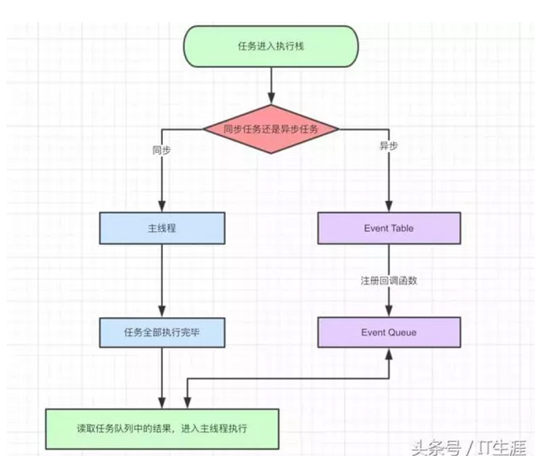

1. js代码分为同步任务和异步任务
2. 同步任务会进入主线程，异步任务会进入Event Table(事件表),当事件表中的异步任务完成后会在Event Queue(事件队列)中注册回调函数
3. 主线程任务全部完成后,才会完成Event Queue中的任务
4. js解析器会不断地重复检查主线程执行栈是否为空,然后重复第3步,这就是Event Loop(事件循环)
   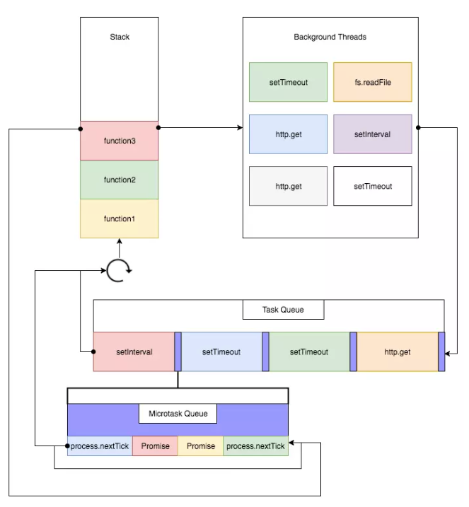

### 详细流程
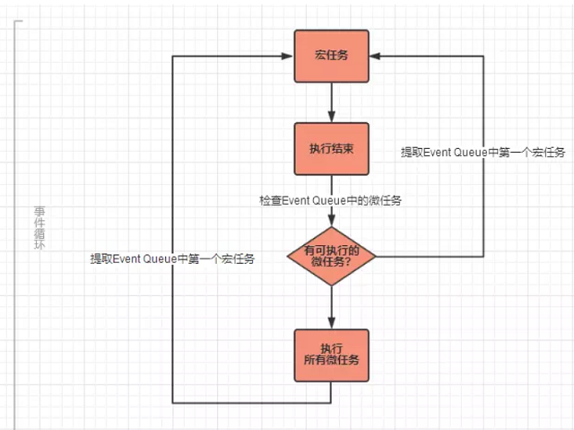

所以通常来说，我们页面中的js执行顺序是这样的:

- 第一轮事件循环:
    1. 主线程执行js整段代码（宏任务），将ajax、setTimeout、promise等回调函数注册到Event Queue，并区分宏任务和微任务
    2. 主线程提取并执行Event Queue 中的ajax、promise等所有微任务，并注册微任务中的异步任务到Event Queue


- 第二轮事件循环:
    1. 主线程提取Event Queue中的第一个宏任务(通常是setTimeout)
    2. 主线程执行setTimeout宏任务,并注册setTimeout代码中的异步任务到Event Queue(如果有)
    3. 执行Event Queue中的所有微任务，并注册微任务中的异步任务到Event Queue(如果有)


- **简而言之，一次事件循环只执行处于Macrotask队首的任务，执行完成后，立即执行Microtask队列中的所有任务**

### 常见的Macrotask和Microtask
- 宏任务：script(整体代码)、setTimeout、setInterval、I/O、事件、postMessage、 MessageChannel、setImmediate (Node.js)、用户交互操作、UI渲染
- 微任务：**Promise**、 process.nextTick (Node.js)、Object.observe(不推荐使用)

### Demo
```javascript
console.log('1');
// 1 6 7 2 4 5 9 10 11 8 3
// 记作 set1
setTimeout(function () {
    console.log('2');
    // set4
    setTimeout(function() {
        console.log('3');
    });
    // pro2
    new Promise(function (resolve) {
        console.log('4');
        resolve();
    }).then(function () {
        console.log('5')
    })
})

// 记作 pro1
new Promise(function (resolve) {
    console.log('6');
    resolve();
}).then(function () {
    console.log('7');
    // set3
    setTimeout(function() {
        console.log('8');
    });
})

// 记作 set2
setTimeout(function () {
    console.log('9');
    // 记作 pro3
    new Promise(function (resolve) {
        console.log('10');
        resolve();
    }).then(function () {
        console.log('11');
    })
})
```

- 第一轮事件循环：
1. 整体script作为第一个宏任务进入主线程，遇到console.log，输出1。
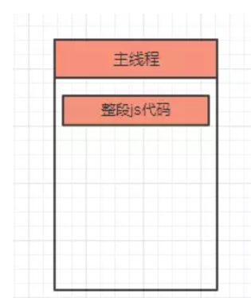

2. 遇到set1，其回调函数被分发到宏任务Event Queue中。
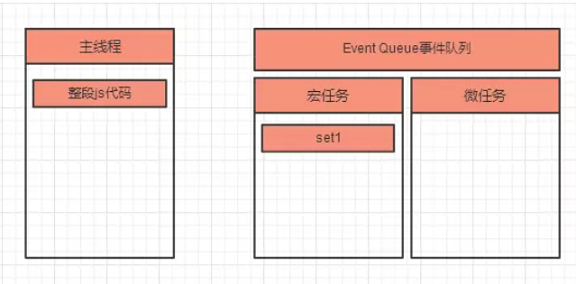

3. 遇到pro1，new Promise直接执行，输出6。then被分发到微任务Event Queue中。
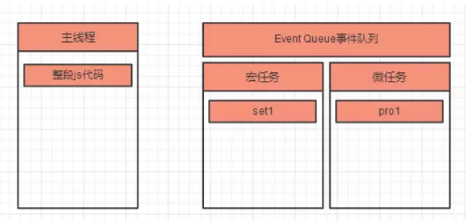

4. 遇到了set2，其回调函数被分发到宏任务Event Queue中。
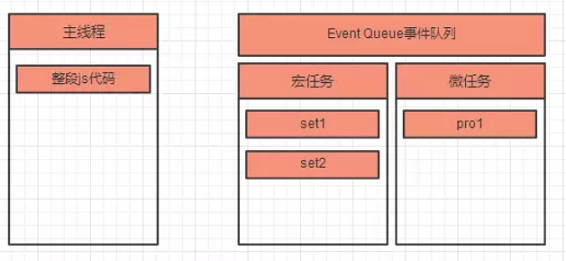
5. 主线程的整段js代码（宏任务）执行完，开始清空所有微任务；主线程执行微任务pro1，输出

6. 遇到set3，注册回调函数。
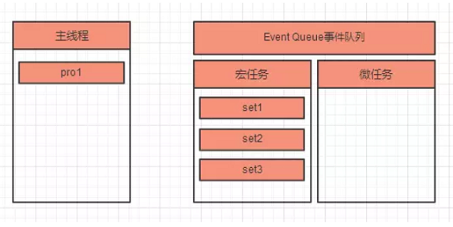

- 第二轮事件循环：

1. 主线程执行队列中第一个宏任务set1，输出2；代码中遇到了set4，注册回调；又遇到了pro2，new promise()直接执行输出4，并注册回调；
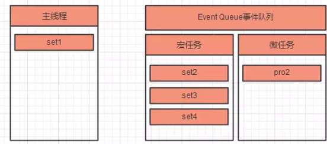
2. set1宏任务执行完毕，开始清空微任务，主线程执行微任务pro2，输出5。
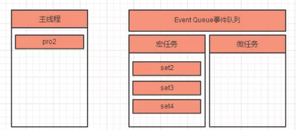

- 第三轮事件循环：

1. 主线程执行队列中第一个宏任务set2，输出9；代码中遇到了pro3，new promise()直接输出10，并注册回调；
2. set2宏任务执行完毕，开始情况微任务，主线程执行微任务pro3，输出11。

- 类似循环...

所以最后输出结果为1、6、7、2、4、5、9、10、11、8、3

### Demo 2

```javascript
async function foo() {
  // await 前面的代码
  await bar();
  // await 后面的代码
}
//等于
function foo() {
  // await 前面的代码
  Promise.resolve(bar()).then(() => {
    // await 后面的代码
  });
}
```


```javascript
async function async1() {
    console.log( 'async1 start' )
    await async2()
    console.log( 'async1 end' )
}

async function async2() {
    console.log( 'async2' )
}

console.log( 'script start' )

setTimeout( function () {
    console.log( 'setTimeout' )
}, 0 )

async1();

new Promise( function ( resolve ) {
    console.log( 'promise1' )
    resolve();
} ).then( function () {
    console.log( 'promise2' )
} )

console.log( 'script end' )
```

```javascript
//after refactor
function async1() {
  console.log('async1 start'); // 2

  Promise.resolve(async2()).then(() => {
    console.log('async1 end'); // 6
  });
}

function async2() {
  console.log('async2'); // 3
}

console.log('script start'); // 1

setTimeout(function() {
  console.log('settimeout'); // 8
}, 0);

async1();

new Promise(function(resolve) {
  console.log('promise1'); // 4
  resolve();
}).then(function() {
  console.log('promise2'); // 7
});
console.log('script end'); // 5
```

#### async await的理解

1. async 做一件什么事情？

**带async关键字的函数，它使得你的函数的返回值必定是promise对象**

如果async关键字函数返回的不是promise，会自动用Promise.resolve()包装

如果async关键字函数显式地返回promise，那就以你返回的promise为准

```javascript
async function fn1(){
    return 123
}

function fn2(){
    return 123
}

console.log(fn1())
console.log(fn2())
```

2. await 在等什么？

**await等的是右侧「表达式」的结果**

```javascript
//从右向左的。先打印async2，后打印的script start
async function async1() {
    console.log( 'async1 start' )
    await async2()
    console.log( 'async1 end' )
}
async function async2() {
    console.log( 'async2' )
}
async1()
console.log( 'script start' )
```

3. await 等到之后，做了一件什么事情？

- 如果不是promise,await会阻塞后面的代码,先执行async外面的同步代码,同步代码执行完,再回到async内部,把这个非promise的东西,作为await表达式的结果
- 如果它等到的是一个promise对象,await也会暂停async后面的代码,先执行async外面的同步代码,等着 Promise对象fulfilled,然后把resolve的参数作为await表达式的运算结果

#### answser

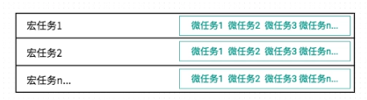

也就是「宏任务」、「微任务」都是队列。

一段代码执行时，会先执行宏任务中的同步代码，

如果执行中遇到setTimeout之类宏任务，那么就把这个setTimeout内部的函数推入「宏任务的队列」中，下一轮宏任务执行时调用。
如果执行中遇到promise.then()之类的微任务，就会推入到「当前宏任务的微任务队列」中，在本轮宏任务的同步代码执行都完成后，依次执行所有的微任务1、2、3, 及清空当前宏任务的微任务队列


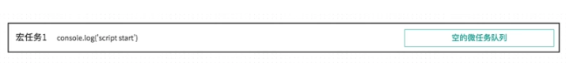

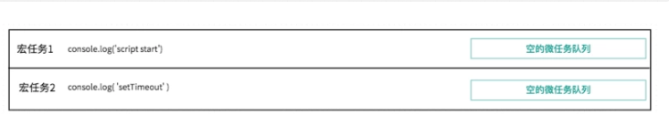

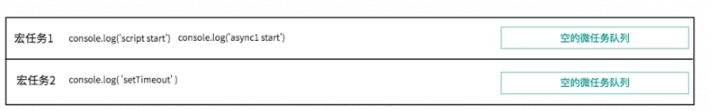

> 分析一下 await async2()
>
> 前文提过await，1.它先计算出右侧的结果，2.然后看到await后，中断async函数
>
> 先得到await右侧表达式的结果。执行async2()，打印同步代码console.log('async2'), 并且return Promise.resolve(undefined)
>
> await后，中断async函数，先执行async外的同步代码
>
> 目前就直接打印 console.log('async2')


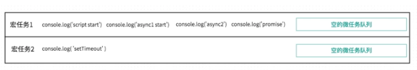

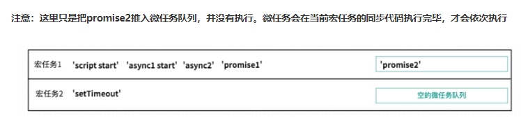

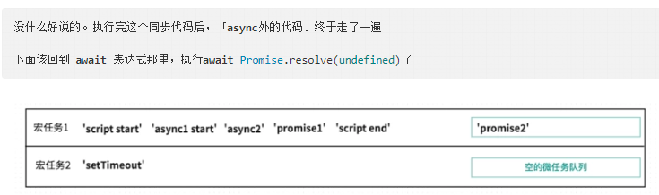

回到async内部，执行await Promise.resolve(undefined), 在我们这个例子中，就是Promise.resolve(undefined)正常处理完成，并返回其处理结果。那么await async2()就算是执行结束了。

目前这个promise的状态是fulfilled，等其处理结果返回就可以执行await下面的代码了。

那何时能拿到处理结果呢？

回忆平时我们用promise，调用resolve后，何时能拿到处理结果？是不是需要在then的第一个参数里，才能拿到结果。（调用resolve时，会把then的参数推入微任务队列，等主线程空闲时，再调用它）

所以这里的 await Promise.resolve() 就类似于

```javascript
Promise.resolve(undefined).then((undefined) => {

})
```

把then的第一个回调参数 (undefined) => {} 推入微任务队列。

then执行完，才是await async2()执行结束。

await async2()执行结束，才能继续执行后面的代码

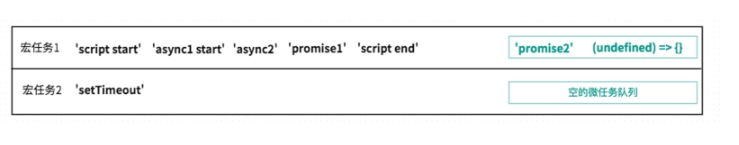

此时当前宏任务1都执行完了，要处理微任务队列里的代码。

微任务队列，先进选出的原则

- 执行微任务1，打印promise2
- 执行微任务2，没什么内容..
    但是微任务2执行后，await async2()语句结束，后面的代码不再被阻塞，所以打印

console.log( 'async1 end' )

宏任务1执行完成后,执行宏任务2,宏任务2的执行比较简单，就是打印

console.log('setTimeout')

### Demo 3
```javascript
const p1 = new Promise((resolve, reject) => {
  console.log('promise1');
  resolve();
})
  .then(() => {
    console.log('then11');
    new Promise((resolve, reject) => {
      console.log('promise2');
      resolve();
    })
      .then(() => {
        console.log('then21');
      })
      .then(() => {
        console.log('then23');
      });
  })
  .then(() => {
    console.log('then12');
  });

const p2 = new Promise((resolve, reject) => {
  console.log('promise3');
  resolve();
}).then(() => {
  console.log('then31');
});
```

### Demo 4
```javascript
const p1 = new Promise((resolve, reject) => {
  console.log('promise1'); // 1
  resolve();
})
  .then(() => {
    console.log('then11'); // 2
    return new Promise((resolve, reject) => {
      console.log('promise2'); // 3
      resolve();
    })
      .then(() => {
        console.log('then21'); // 4
      })
      .then(() => {
        console.log('then23'); // 5
      });
  })
  .then(() => {
    console.log('then12'); //6
  });
```