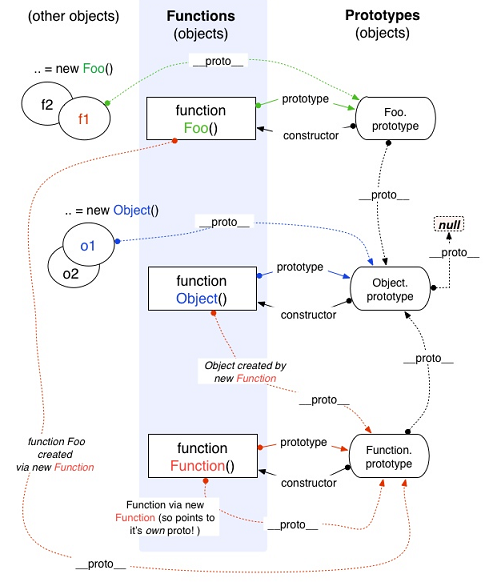
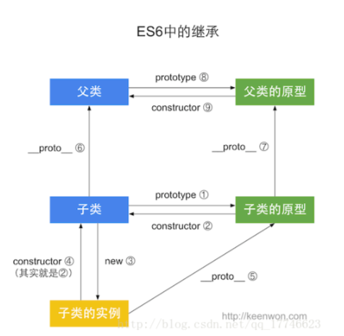
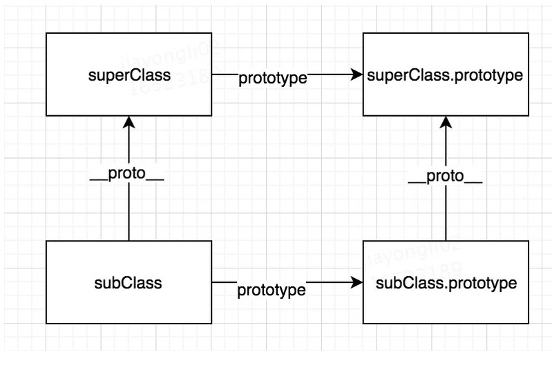

### this
1. `this`是动态决定的,调用函数时,除了传入在函数定义中显式声明的参数外,同时还传入了两个隐式参数:第一个是`this` 且必须是对象,默认`window`,严格模式则为`undefined`，第二个是 `arguments`，没传就是`length`为0的类数组
   - 非严格模式下,`arguments`与函数形参一一映射,严格模式下打破了这种关系
2. 调用函数的方式
   - 函数调用(在非严格模式下,`this`指向全局`window`对象;在严格模式下,`this`指向 `undefined`)
     - DOM事件函数：一般指向绑定事件的DOM元素
   - 方法调用(`this`通常指向调用的对象,而且是**最近的**对象)
   - 构造函数(`this`指向新创建的对象),显式`return`函数或对象,返回值不是新创建的对象,而是显式返回的函数或对象
   - `apply`与`call`(`this`指向`call`或`apply`的第一个参数),严格模式下,绑定到指定的第一个参数,非严格模式下,null和undefined,指向全局对象(浏览器中是window),其余值指向被`new Object()`包装的对象
   - 优先级     new绑定 > 显式绑定（bind）> 隐式绑定 > 默认绑定
3. bind
   - bind后函数的this无法再被改变

#### 箭头函数

- 没有`this`,函数体里面的`this`是箭头函数定义时所在对象,不是运行时（this看上一级,若是箭头函数继续往上找，作用域是栈内存不是堆内存）
- 不能改变this绑定,即使通过call、apply、bind
- 不能用作构造函数
- 没有原型对象
- 没有自己的super和new.target绑定
- 没有arguments,但有...
- 形参名称不能重复
- 返回对象时必须在对象外面加上括号
- 不可用yield,因此不能用Generator函数
- IIFE无论在哪执行`this`都是`window`
- 数组的`forEach map reduce`等函数里面的函数ES5写法this始终是window,箭头函数写法this则取决于外部执行环境

#### practice

```javascript
let a = {
  a: 'a'
}
let obj = {
  getThis: () => this,
  getThis2 () {
    return this
  }
}
obj.getThis3 = obj.getThis.bind(obj)
obj.getThis4 = obj.getThis2.bind(obj)
const answers = [
  obj.getThis(),  //Window
  obj.getThis.call(a),  //Window
  obj.getThis2(), //obj
  obj.getThis2.call(a), // a
  obj.getThis3(), //Window
  obj.getThis3.call(a), //Window
  obj.getThis4(), //obj
  obj.getThis4.call(a) //obj
]
```

```javascript
//class中的this
class Obj {
  getThis = () => this
  getThis2 () {
    return this
  }
}
let obj2 = new Obj()
obj2.getThis3 = obj2.getThis.bind(obj2)
obj2.getThis4 = obj2.getThis2.bind(obj2)
let answers2 = [
  obj2.getThis(), //Obj
  obj2.getThis.call(a), //Obj
  obj2.getThis2(), //Obj
  obj2.getThis2.call(a), //a
  obj2.getThis3(), //Obj
  obj2.getThis3.call(a), //Obj
  obj2.getThis4(), //Obj
  obj2.getThis4.call(a) //Obj
]
```

### prototype
#### ES5


#### ES6
```javascript
class A {}
class B extends A {}
//保证subClass可以直接访问superClass的静态属性，静态方法
console.log(B.__proto__ === A)
//保证了Child instanceof Parent是true,Child的实例可以访问到父类的原型属性
console.log(B.prototype.__proto__ === A.prototype)
```

### inherit




