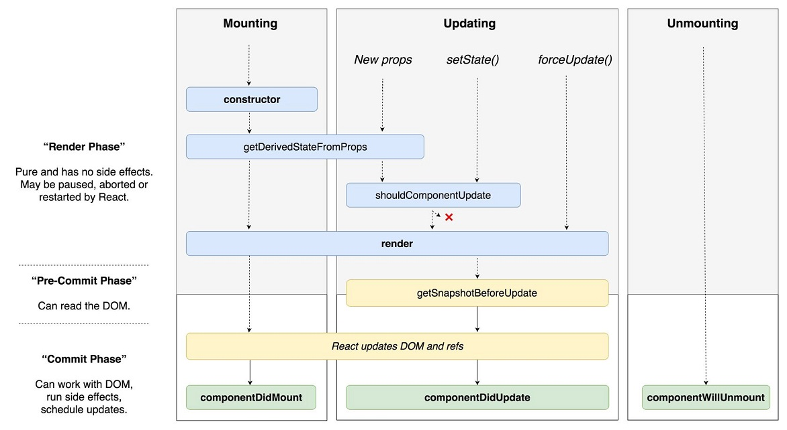
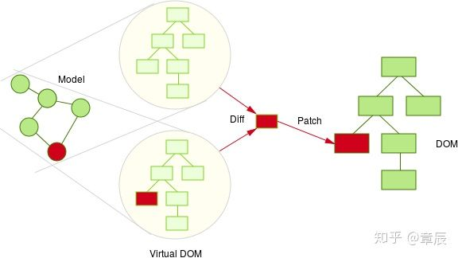

### 基本认识
#### website
1. https://reactjs.org/
2. https://doc.react-china.org/

#### 描述
1. 用于构建用户界面的JS库(只关注于View)
2. 由Facebook开源

#### 特点
1. Declarative(声明式编码)
2. Component-Based(组件化、模块化编码)
3. Learn Once, Write Anywhere(支持客户端与服务器渲染)
4. 高效
   - virtualDOM, 不总是直接操作DOM
   - `DOM Diff`算法, 最小化页面重绘
5. 界面完全由数据驱动(单向数据流)

#### get started
```bash
npm i create-react-app -g

create-react-app test

cd test

npm start
```

### JSX
1. 全称: JavaScript + XML
2. 作用: 用来创建react虚拟DOM(元素)对象
   - let ele = \<h1>Hello JSX!\</h1>
   - 它不是字符串, 也不是HTML/XML标签
   - 它最终产生的就是一个JS对象
3. 标签名任意: HTML标签或其它标签
4. 标签属性任意: HTML标签属性或其它
5. 基本语法规则
    - 遇到`<`开头的代码, 以标签的语法解析: html同名标签转换为html同名元素, 其它标签需要特别解析
    - 遇到以`{`开头的代码,以JS语法解析: 标签中的js代码必须用`{ }`包含
6. JSX变量是数组的话会直接展开
7. 不能是对象`{ {name: "jack"} }`,`if`或者`for`
8. 布尔类型、`Null`以及`Undefined`将会被忽略
```javascript
//以下的 JSX 表达式渲染结果都是相同的
<div />
<div></div>
<div>{ true }</div>
<div>{ null }</div>
<div>{ undefined }</div>
<div>{ true }</div>
```

#### 创建virtualDOM的两种方式
1. React.createElement('h1', {id:'123'}, 'text')
2. **jsx** `<h1 id='myTitle'>{title}</h1>`

### 组件
1. 用来实现特定(局部)功能效果的代码集合(html/css/js)
2. 为什么: 一个界面的功能更复杂
3. 作用: 复用编码, 简化项目编码, 提高运行效率
4. 設計原則
   1. 保持接口小,props数量要少
   2. 根据数据边界来划分组件,充分利用组合(composition)
   3. 把state往上层组件提取,让下层组件只需要实现为纯函数

### React面向组件编程

#### 工厂函数组件(简单组件)
```javascript
function MyComponent() {
    return <h2>factory component</h2>
}
ReactDOM.render(<MyComponent/>, document.getElementById('test'))
```

#### ES6 class组件(复杂组件)
```javascript
class MyComponent2 extends React.Component {
    constructor(props) {
        super(props)
    }
    render() {
        console.log(this)
        return <h2>class component</h2>
    }
}
ReactDOM.render(<MyComponent2/>, document.getElementById('test'))
```

> 1 组件名必须首字母大写
>
> 2 虚拟DOM元素只能有一个根元素或`Fragment`
>
> 3 虚拟DOM元素必须有结束标签

#### 高阶组件
`const EnhanceComponent = higherOrderComponent(WrapperComponent)`

1. 高阶组件不能去修改作为参数的组件,高阶组件必须是一个纯函数,不应该有任何副作用
2. 高阶组件返回的结果必须是一个新的 React 组件,这个新的组件的 JSX 部分肯定会包含作为参数的组件
3. 高阶组件一般需要把传给自己的 props 转手传递给作为参数的组件

### 三大属性
#### state
1. state是组件对象最重要的属性, 值是对象(可以包含多个数据)
2. 组件被称为"状态机", 通过更新组件的state来更新对应的页面显示(重新渲染组件)
```javascript
//1)	初始化状态
constructor (props) {
    super(props)
    this.state = {
        stateProp1 : value1,
        stateProp2 : value2
    }
}

//读取某个状态值
this.state.statePropertyName

//更新状态---->组件界面更新
this.setState({
    stateProp1 : value1,
    stateProp2 : value2
})
```
#### props
1. 每个组件对象都会有props属性
2. 组件标签的所有属性都保存在props中
3. 通过标签属性从组件外向组件内传递变化的数据
4. 组件内部不要修改props数据
```javascript
//内部读取某个属性值
this.props.propertyName

//对props中的属性值进行类型限制和必要性限制
Person.propTypes = {
    name: React.PropTypes.string.isRequired,
    age: React.PropTypes.number.isRequired
}

//扩展属性: 将对象的所有属性通过props传递
<Person {...person}/>

//默认属性值
Person.defaultProps = {
    name: 'Mary'
}

//组件类的构造函数
constructor (props) {
    super(props)
    console.log(props) // 查看所有属性
}
```

#### ref and event
1. 组件内的标签都可以定义ref属性来标识自己`<input type="text" ref={input => this.msgInput = input}/>`
2. 在组件中可以通过`this.msgInput`来得到对应的真实DOM元素
3. 通过`onXxx`属性指定组件的事件处理函数
4. 通过`event.target`得到发生事件的DOM元素对象
```javascript
<input onFocus={this.handleClick.bind(this)}/>
handleFocus(event) {
    event.target  //返回input对象
}
```

### 功能界面的组件化编码流程
1. 拆分组件: 拆分界面,抽取组件
2. 实现静态组件: 使用组件实现静态页面效果
3. 实现动态组件
    - 动态显示初始化数据
    - 交互功能(从绑定事件监听开始)

### 收集表单数据
- 受控组件: 表单项输入数据能自动收集成状态,表单元素状态由使用者维护
- 非受控组件: 需要时才手动读取表单输入框中的数据,表单元素状态DOM自身维护

### 组件生命周期


#### 生命周期流程:
- 第一次初始化渲染显示: ReactDOM.render()
  - constructor(props): 创建对象初始化state(可选)
  - componentWillMount() : 将要插入回调
  - render() : 用于插入虚拟DOM回调
  - componentDidMount() : 已经插入回调
    - 在这里进行`Ajax`调用
    - 如果你需要事件监听器,订阅等功能,可以在此处添加
    - 你可以在这里使用`setState`(但是它会使组件重新渲染)
- 每次更新state: this.setSate({xxx})
  - componentWillUpdate() : 将要更新回调
  - render() : 更新(重新渲染)
  - componentDidUpdate(prevProps, prevState, snapshot): 已经更新回调
    - 在组件刚刚更新完毕时执行(在开始渲染时不会)
    - 有三个可选的参数(以前的props,以前的 state 和只有在你的组件实现 getSnapshotBeforeUpdate 时才会出现的快照 )
    - 仅当shouldComponentUpdate返回true时才会执行
    - If you use setState here, you should guard it or you will land in an infinite loop
    - shouldComponentUpdate(nextProps, nextState)
      - 仅用于性能优化
      - 如果返回false,则不会调用渲染器(如果重写的SCO只是对props/state的浅层比较,可以使用PureComponent)
    - getSnapshotBeforeUpdate()
      - 可用于保存一些与当前 DOM 有关的信息,例如当前的滚动位置,稍后可在 componentDidUpdate 中重用,用来恢复滚动的位置
- 移除组件: ReactDOM.unmountComponentAtNode(containerDom)
  - componentWillUnmount() : 组件将要被移除回调
    - 清除所有仍在进行的东西(Ajax应该被中断,取消订阅,清除定时器等等)
- componentDidCatch(error, info)
  - 应该记录日志错误的地方
  - 可以调用setState,但在以后的版本中,将会在静态方法getDerivedStateFromError(error) 中被删除,它将通过返回一个值来更新状态
- static getDerivedStateFromError(error)
  - 此处提供错误信息
  - 应返回一个对象值,该值将会更新可用于处理错误的状态(通过显示内容)
  - 由于它是静态的,因此无法访问组件实例本身
- static getSnapshotBeforeUpdate(props, state)
  - 应该在props随时间变化的情况下使用 —— 例如根据React docs,它可能用于转换组件
  - 由于它是静态的,因此无法访问组件实例本身


#### 重要的勾子
- render(): 初始化渲染或更新渲染调用
- componentDidMount(): 开启监听, 发送ajax请求
- componentWillUnmount(): 做一些收尾工作, 如: 清理定时器
- componentWillReceiveProps(): 父子钩子
- shouldComponentUpdate()这可以使用生命周期进行性能优化

### DOM Diff


### react ajax
- jQuery
- axios
    - 封装XmlHttpRequest对象的ajax
    - promise风格
    - 可以用在浏览器端和node服务器端
```javascript
axios.get('/user?ID=12345')
  .then(function (response) {
    console.log(response);
  })
  .catch(function (error) {
    console.log(error);
  });

axios.get('/user', {
    params: {
      ID: 12345
    }
  })
  .then(function (response) {
    console.log(response);
  })
  .catch(function (error) {
    console.log(error);
  });

axios.post('/user', {
    firstName: 'Fred',
    lastName: 'Jack'
})
.then(function (response) {
  console.log(response);
})
.catch(function (error) {
  console.log(error);
});

```
- fetch: 原生函数, 但老版本浏览器不支持
    - 不再使用XmlHttpRequest对象提交ajax请求
    - 为了兼容低版本的浏览器, 可以引入兼容库fetch.js
```javascript
fetch(url).then(function(response) {
  return response.json()
}).then(function(data) {
  console.log(data)
}).catch(function(e) {
  console.log(e)
});


fetch(url, {
  method: "POST",
  body: JSON.stringify(data),
}).then(function(data) {
  console.log(data)
}).catch(function(e) {
  console.log(e)
})
```

### 组件间通信
1. props
    - 共同的数据放在父组件上, 特有的数据放在自己组件内部
    - 通过props可以传递一般数据和函数数据, 只能一层一层传递
2. 使用消息订阅(subscribe)-发布(publish)机制`PubSubJS`
```javascript
import PubSub from 'pubsub-js' //引入
PubSub.subscribe('delete', function(data){ }); //订阅
PubSub.publish('delete', data) //发布消息
```
3. redux

### react-ui
1. [material-ui](https://v0.material-ui.com/)
2. ant-design
    - https://ant.design/index-cn
    - https://mobile.ant.design/index-cn