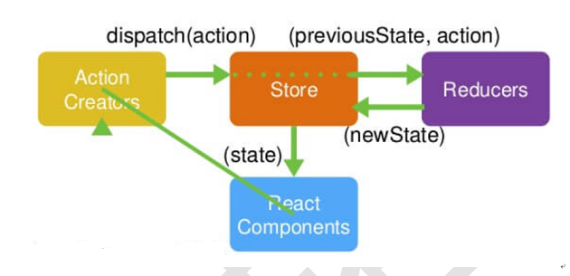
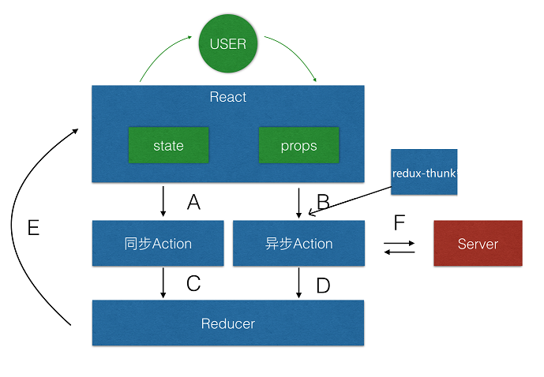

### redux
1. [redux](https://redux.js.org/)
2. [redux cn](http://www.redux.org.cn/)
3. `redux`是一个独立专门用于做状态管理的JS库(不是react插件库),它可以用在`react`, `angular`, `vue`等项目中, 但基本与`react`配合使用
4. 作用: 集中式管理react应用中多个组件共享的状态

#### 流程图


1. action
```
1)	标识要执行行为的对象
2)	包含2个方面的属性
  a.	type: 标识属性, 值为字符串, 唯一, 必要属性
  b.	xxx: 数据属性, 值类型任意, 可选属性
3)	例子:
		const action = {
			type: 'INCREMENT',
			data: 2
		}
4)	Action Creator(创建Action的工厂函数)
		const increment = (number) => ({type: 'INCREMENT', data: number})
```
2. reducer
```
1)	根据老的state和action, 产生新的state的纯函数
2)	样例
		export default function counter(state = defaultState, action) {
		  switch (action.type) {
		    case 'INCREMENT':
		      return state + action.data
		    case 'DECREMENT':
		      return state - action.data
		    default:
		      return state
		  }
		}
3)	注意
  a.	返回一个新的状态
  b.	不要修改原来的状态
```

3. store
```
1)	将state,action与reducer联系在一起的对象
2)	如何得到此对象
		import {createStore} from 'redux'
		import reducer from './reducers'
		const store = createStore(reducer)
3)	此对象的功能
		getState(): 得到state
		dispatch(action): 分发action, 触发reducer调用, 产生新的state
		subscribe(listener): 注册监听, 当产生了新的state时, 自动调用
```

#### 什么情况下需要使用redux
1. 总体原则: 能不用就不用, 如果不用比较吃力才考虑使用
2. 某个组件的状态，需要共享
3. 某个状态需要在任何地方都可以拿到
4. 一个组件需要改变全局状态
5. 一个组件需要改变另一个组件的状态

#### redux的核心API
1. `createStore()`创建包含指定reducer的store对象
```javascript
import {createStore} from 'redux'
import reducer from './reducer'
const store = createStore(
  reducer,
  window.__REDUX_DEVTOOLS_EXTENSION__ && window.__REDUX_DEVTOOLS_EXTENSION__()
)
```

2. `store`对象(redux库最核心的管理对象)
    - 它内部维护着state / reducer
    - getState() / dispatch(action) / subscribe(listener)

```javascript
store.getState()
store.dispatch({type:'INCREMENT', number})
store.subscribe(render)
```

3. `applyMiddleware()`应用上基于redux的中间件(插件库)
```javascript
import {createStore, applyMiddleware} from 'redux'
import thunk from 'redux-thunk'
const store = createStore(
  counter,
  applyMiddleware(thunk)
)
```

4. `combineReducers()`合并多个reducer函数
```javascript
export default combineReducers({
  user,
  chatUser,
  chat
})
```

5. `compose`
6. `bindActionCreators`

### 坑
1. `store`必须唯一``
2. `reducer`必须纯函数
3. 只有`store`能改变`state`内容,`reducer`不能改变

### react-redux
1. 一个react插件库
2. 专门用来简化react应用中使用redux(解耦)

#### React-Redux将所有组件分成两大类
- UI组件
    - 只负责 UI 的呈现，不带有任何业务逻辑
    - 通过props接收数据(一般数据和函数)
    - 不使用任何 Redux 的 API
    - 一般保存在components文件夹下
- 容器组件
    - 负责管理数据和业务逻辑，不负责UI的呈现
    - 使用 Redux 的 API
    - 一般保存在containers文件夹下

#### API
1. Provider
```javascript
//被包裹的组件都可以得到state数据
<Provider store={store}>
  <TodoList />
  <OtherComponent1>
  <OtherComponent2>
  ...
</Provider>
```
2. connect()
```javascript
//用于包装UI组件生成容器组件
import { connect } from 'react-redux'
export default connect(
  mapStateToProps,
  null
)(TodoList)
```
3. mapStateToProps()
```javascript
//将外部的数据（即state对象）转换为UI组件的标签属性
const mapStateToprops = state => {
  return {
    value: state.xxx
  }
}
```
4. mapDispatchToProps()
```javascript
const mapDispatchToProps = dispatch => {
  return {
    changeVal(e) {
      const action = {
        type: 'changeVal',
        value: e.target.value
      }
      dispatch(action)
    }
    ...
}
export default connect(
  mapStateToProps,
  mapDispatchToProps
)(TodoList)
```

###  redux异步编程(默认不支持)
- `npm install --save redux-thunk`
```javascript
//index.js
import { createStore, applyMiddleware, compose} from 'redux'
import reducer from './reducer'
import ReduxThunk from 'redux-thunk'

const composeEnhancers =
  typeof window === 'object' &&
  window.__REDUX_DEVTOOLS_EXTENSION_COMPOSE__ ?
    window.__REDUX_DEVTOOLS_EXTENSION_COMPOSE__({}) : compose

const enhancer = composeEnhancers(
  applyMiddleware(ReduxThunk)
)

const store = createStore(reducer, enhancer)

export default store
```
- `npm install --save redux-saga`
```javascript
//index.js
import { createStore, applyMiddleware, compose} from 'redux'
import reducer from './reducer'
//import ReduxThunk from 'redux-thunk'
import createSagaMiddleware from 'redux-saga'
import mySaga from './sagas'

const sagaMiddleware = createSagaMiddleware()

const composeEnhancers =
  typeof window === 'object' &&
  window.__REDUX_DEVTOOLS_EXTENSION_COMPOSE__ ?
    window.__REDUX_DEVTOOLS_EXTENSION_COMPOSE__({}) : compose

const enhancer = composeEnhancers(
  applyMiddleware(sagaMiddleware)
)

//only accept two params
const store = createStore(reducer, enhancer)

sagaMiddleware.run(mySaga)

export default store


import axios from 'axios'
import {  GET_ITEM_SAGA } from './actionTypes'
import { getItemsAction } from '../store/actionCreator'
import { put, takeEvery } from 'redux-saga/effects'

function* mySaga() {
  yield takeEvery(GET_ITEM_SAGA, fetchData)
}


//saga.js
function* fetchData() {
  const action  = yield axios.get(`https://bird.ioliu.cn/v1/?url=http://api.avatardata.cn/TouTiao/Query?key=e96b23a852f34c8489397cd05f919c8d&type=top`)
                  .then(res => {
                    let tmp = res.data.result.data
                    if (tmp.length > 10) tmp.length = 10
                    return getItemsAction(tmp)
                  })
                  .catch(err => {
                    console.log(err)
                  })
  yield put(action)
}

export default mySaga
```



###  实际开发
1. 抽取`actionTypes.js`
2. 抽取`actionCreator.js`


