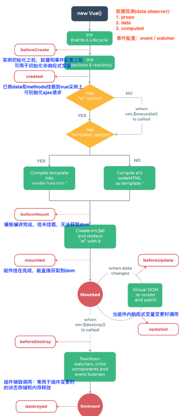
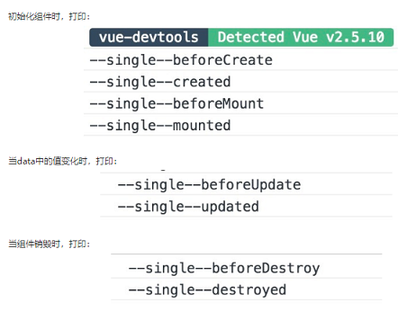
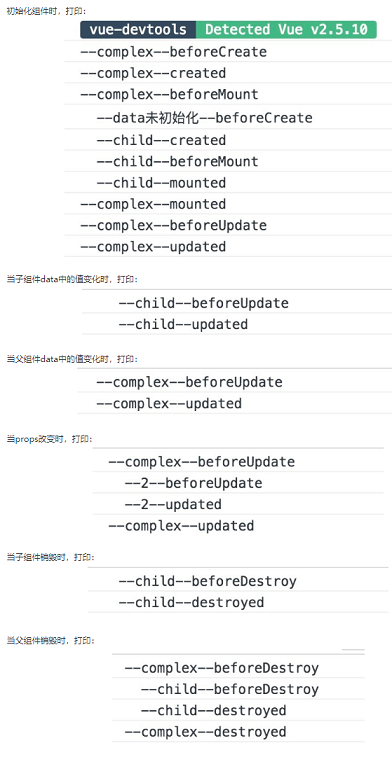
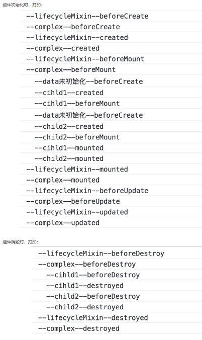

### 生命周期钩子函数




| 生命周期钩子  | 组件状态                                                     | 最佳实践                                                     |
| ------------- | ------------------------------------------------------------ | ------------------------------------------------------------ |
| beforeCreate  | 实例初始化之后，this指向创建的实例，不能访问到data、computed、watch、methods上的方法和数据 | 常用于初始化非响应式变量                                     |
| created       | 实例创建完成，可访问data、computed、watch、methods上的方法和数据，未挂载到DOM，不能访问到\$el属性，​\$ref属性内容为空数组 | 常用于简单的ajax请求，页面的初始化                           |
| beforeMount   | 在挂载开始之前被调用，beforeMount之前，会找到对应的template，并编译成render函数 |                                                              |
| mounted       | 实例挂载到DOM上，此时可以通过DOM API获取到DOM节点，\$el、\$ref属性可以访问 | 常用于获取VNode信息和操作，ajax请求                          |
| beforeUpdate  | 响应式数据更新时调用，发生在虚拟DOM打补丁之前                | 适合在更新之前访问现有的DOM，比如手动移除已添加的事件监听器  |
| updated       | 虚拟 DOM 重新渲染和打补丁之后调用，组件DOM已经更新，可执行依赖于DOM的操作 | 避免在这个钩子函数中操作数据，可能陷入死循环                 |
| beforeDestroy | 实例销毁之前调用。这一步，实例仍然完全可用，this仍能获取到实例 | 常用于销毁定时器、解绑全局事件、销毁插件对象、第三方对象等操作 |
| destroyed     | 实例销毁后调用，调用后，Vue 实例指示的所有东西都会解绑定，所有的事件监听器会被移除，所有的子实例也会被销毁 |                                                              |
| activated     | keep-alive 组件激活时调用                                    |                                                              |
| deactivated   | keep-alive 组件停用时调用                                    |                                                              |
| errorCaptured | 当捕获一个来自子孙组件的错误时被调用。此钩子会收到三个参数：错误对象、发生错误的组件实例以及一个包含错误来源信息的字符串。此钩子可以返回 `false` 以阻止该错误继续向上传播 |                                                              |

**注意**

1. `created`阶段的ajax请求与`mounted`请求的区别：前者页面视图未出现，如果请求信息过多，页面会长时间处于白屏状态
2. `mounted` 不会承诺所有的子组件也都一起被挂载。如果你希望等到整个视图都渲染完毕，可以用`vm.$nextTick`
3. vue2.0之后主动调用`$destroy()`不会移除dom节点,不推荐直接destroy这种做法，如果实在需要这样用可以在这个生命周期钩子中手动移除dom节点
4. 不要使用箭头函数
### 单个组件的生命周期

```vue
<template>
    <div>
        <h3>单组件</h3>
        <el-button @click="dataVar += 1">更新 {{dataVar}}</el-button>
        <el-button @click="handleDestroy">销毁</el-button>
    </div>
</template>
```

```javascript
export default {
    data() {
        return {
            dataVar: 1
        }
    },
    beforeCreate() {
        this.compName = 'single'
        console.log(`--${this.compName}--beforeCreate`)
    },
    created() {
        console.log(`--${this.compName}--created`)
    },
    beforeMount() {
        console.log(`--${this.compName}--beforeMount`)
    },
    mounted() {
        console.log(`--${this.compName}--mounted`)
    },
    beforeUpdate() {
        console.log(`--${this.compName}--beforeUpdate`)
    },
    updated() {
        console.log(`--${this.compName}--updated`)
    },
    beforeDestroy() {
        console.log(`--${this.compName}--beforeDestroy`)
    },
    destroyed() {
        console.log(`--${this.compName}--destroyed`)
    },
    methods: {
        handleDestroy() {
            this.$destroy()
        }
    }
}
```





1. 初始化组件时，仅执行了beforeCreate/Created/beforeMount/mounted四个钩子函数
2. 当改变data中定义的变量（响应式变量）时，会执行beforeUpdate/updated钩子函数
3. 当切换组件（当前组件未缓存）时，会执行beforeDestroy/destroyed钩子函数
4. **初始化和销毁时的生命钩子函数均只会执行一次，beforeUpdate/updated可多次执行**

### 父子组件的生命周期(先外后内再外)

```javascript
props: {
    compName: {
        type: String,
        default: 'single'
    }
},
beforeCreate() {
    // this.compName = 'single'
    // console.log(`--${this.compName}--beforeCreate`)
    console.log(` --data未初始化--beforeCreate`)
},
```


```vue
<template>
    <div class="complex">
        <h3>复杂组件</h3>
        <lifecycle-single compName="child"></lifecycle-single>
    </div>
</template>
```

```javascript
const COMPONENT_NAME = 'complex'

import LifecycleSingle from './LifeCycleSingle'

export default {
    beforeCreate() {
        console.log(`--${COMPONENT_NAME}--beforeCreate`)
    },
    created() {
        console.log(`--${COMPONENT_NAME}--created`)
    },
    beforeMount() {
        console.log(`--${COMPONENT_NAME}--beforeMount`)
    },
    mounted() {
        console.log(`--${COMPONENT_NAME}--mounted`)
    },
    beforeUpdate() {
        console.log(`--${COMPONENT_NAME}--beforeUpdate`)
    },
    updated() {
        console.log(`--${COMPONENT_NAME}--updated`)
    },
    beforeDestroy() {
        console.log(`--${COMPONENT_NAME}--beforeDestroy`)
    },
    destroyed() {
        console.log(`--${COMPONENT_NAME}--destroyed`)
    },
    components: {
        LifecycleSingle
    }
}
```





1. 仅当子组件完成挂载后，父组件才会挂载
2. 当子组件完成挂载后，父组件会主动执行一次beforeUpdate/updated钩子函数（仅首次）
3. 父子组件在data变化中是分别监控的，但是在更新props中的数据是关联的（可实践）
4. 销毁父组件时，先将子组件销毁后才会销毁父组件

### 兄弟组件的生命周期

```vue
<template>
    <div class="complex">
        <h3>复杂组件</h3>
        <lifecycle-single compName="child1"></lifecycle-single>
        <lifecycle-single compName="child2"></lifecycle-single>
        <el-button @click="dataVar += 1">complex更新 {{dataVar}}</el-button>
        <el-button @click="handleDestroy">complex销毁</el-button>
    </div>
</template>
```


1. 组件的初始化（mounted之前）分开进行，挂载是从上到下依次进行
2. 当没有数据关联时，兄弟组件之间的更新和销毁是互不关联的

### 宏mixin的生命周期

添加一个mixin.js文件

```javascript
const COMPONENT_NAME = 'lifecycleMixin'
export default {
    name: COMPONENT_NAME,
    beforeCreate() {
        console.log(`--${COMPONENT_NAME}--beforeCreate`)
    },
    created() {
        console.log(`--${COMPONENT_NAME}--created`)
    },
    beforeMount() {
        console.log(`--${COMPONENT_NAME}--beforeMount`)
    },
    mounted() {
        console.log(`--${COMPONENT_NAME}--mounted`)
    },
    beforeUpdate() {
        console.log(`--${COMPONENT_NAME}--beforeUpdate`)
    },
    updated() {
        console.log(`--${COMPONENT_NAME}--updated`)
    },
    beforeDestroy() {
        console.log(`--${COMPONENT_NAME}--beforeDestroy`)
    },
    destroyed() {
        console.log(`--${COMPONENT_NAME}--destroyed`)
    }
}
```


```javascript
import lifecycleMixin from './mixin'

export default {
    mixins: [lifecycleMixin],
    // ...
}
```





1. mixin中的生命周期与引入该组件的生命周期是紧紧关联的，且**mixin的生命周期优先执行**


### errorCaptured
```javascript
//Child.vue
<template>
  <!-- 省略一些无关代码 -->
</template>
<script>
  export default {
    mounted () {
      // 故意把 console 写错
      consol.log('这里会报错！')
    }
  }
</script>
```

```javascript
//Parent.vue
<template>
  <child></child>
</template>
<script>
  import Child from './Child.vue'
  export default {
    components: [ Child ],
    /**
     * 收到三个参数：
     * 错误对象、发生错误的组件实例
     * 以及一个包含错误来源信息的字符串。
     * 此钩子可以返回 false 以阻止该错误继续向上传播。
     */
    errorCaptured (err, vm, info) {
      console.log(err)
      // -> ReferenceError: console is not defined ...
      console.log(vm)
      // -> {_uid: 1, _isVue: true, $options: {…}, _renderProxy: o, _self: o,…}
      console.log(info)
      // -> `mounted hook`
      // 告诉我们这个错误是在 vm 组件中的 mounted 钩子中发生的

      // 阻止该错误继续向上传播
      return false
    }
  }
</script>
```
