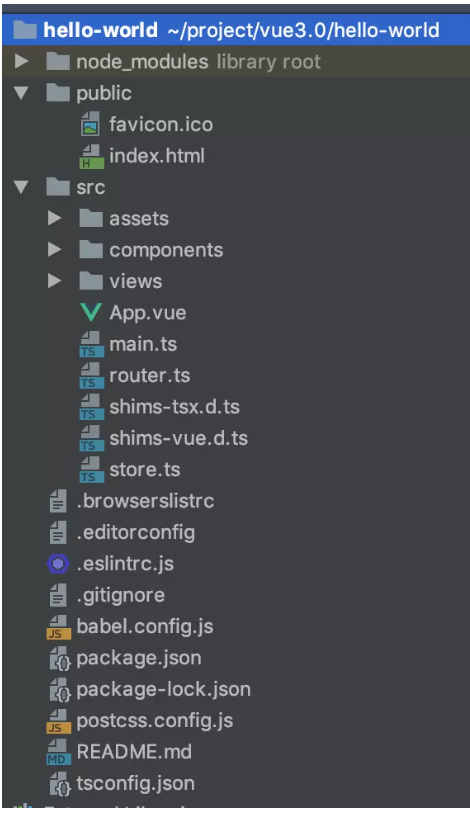

### get started(vue-cli 3.x)
1. npm i -g @vue/cli

2. vue create xxxx or  vue ui

3. cd xxxx

4. npm run serve

5. add plugins(`vue add router、vue add vuex、vue add element-ui`...)

    

### 打包发布
1. 静态服务器
```bash
npm install -g serve
# -s 参数的意思是将其架设在 Single-Page Application 模式下
# 这个模式会处理即将提到的路由问题
serve -s dist
```

2. 动态服务器like tomcat
```javascript
//webpack.prod.config.js
output: {
    publickPath: 'xxx'
}
//修改dist为打包文件夹名
//copy到tomcat下
//visit
```

### vue.config.js example

```javascript
const CompressionPlugin = require("compression-webpack-plugin")  //开启Gzip压缩

module.exports = {
  // 基本路径
  publicPath: process.env.NODE_ENV === 'production' ? '/production-sub-path/' : '/'
  // 输出文件目录
  outputDir: 'dist',
  //放置生成的静态资源 (js、css、img、fonts) 的 (相对于 outputDir 的) 目录
  assetsDir: 'assets',
  // eslint-loader 是否在保存的时候检查
  lintOnSave: true,
  // use the full build with in-browser compiler?
  // https://vuejs.org/v2/guide/installation.html#Runtime-Compiler-vs-Runtime-only
  runtimeCompiler: false,
  // vue-cli内部webpack配置
  chainWebpack: () => {
  	 chainWebpack: config => {
        config.resolve.alias
           .set('@', resolve('src'))
           .set('assets', resolve('src/assets'))
           .set('components', resolve('src/components'))
         
        // 修改静态资源打包方式，下例为超过10k才用文件导入的方式，否则为base64.默认为4k
        // config.module
        //    .rule('images')
        //    .use('url-loader')
        //    .loader('url-loader')
        //    .tap(options => Object.assign(options, { limit: 10240 }))
    }  
  },
  // webpack自定义配置
  configureWebpack: config => {
       config.externals = {
         'vue': 'Vue',
         'element-ui': 'ELEMENT',
         'vue-router': 'VueRouter',
         'vuex': 'Vuex',
         'axios': 'axios'
       }，
       //开启Gzip压缩
       //服务器需配合
       // gzip  on;
       // gzip_min_length 1k;  不压缩临界值，大于1K的才压缩
       // gzip_buffers 4 16k;
       // gzip_http_version 1.0; 默认是HTTP/1.1
       // gzip_comp_level 6; 压缩级别，1-10，数字越大压缩的越好，时间也越长
       // gzip_types text/plain application/javascript application/x-javascript text/javascript text/xml text/css; 压缩的文件类型，JavaScript有两种写法，最好都写上吧
       // gzip_disable "MSIE [1-6]\."; IE6对Gzip不怎么友好，不GZIP
       // gzip_vary on; 跟Squid等缓存服务有关，on的话会在Header里增加"Vary: Accept-Encoding"
       if(process.env.NODE_ENV === 'production'){
            return {
                plugins: [
                    new CompressionPlugin({
                        test:/\.js$|\.html$|.\css/, //匹配文件名
                        threshold: 10240,//对超过10k的数据压缩
                        deleteOriginalAssets: false //不删除源文件
                    })
                ]
            }
        }
   }
  // 生产环境是否生成 sourceMap 文件
  productionSourceMap: true,
  // css相关配置
  css: {
    // 是否使用css分离插件 ExtractTextPlugin
    extract: true,
    // 开启 CSS source maps?
    sourceMap: false,
    // css预设器配置项
    // 共享全局变量
    loaderOptions: {
      sass: {
        // 这里假设你有 `src/variables.scss` 文件
        data: `@import "~@/variables.scss";`
      }
    }
    // 启用 CSS modules for all css / pre-processor files.
    modules: false
  },
  // use thread-loader for babel & TS in production build
  // enabled by default if the machine has more than 1 cores
  parallel: require('os').cpus().length > 1,
  // PWA 插件相关配置
  // see https://github.com/vuejs/vue-cli/tree/dev/packages/%40vue/cli-plugin-pwa
  pwa: {},
  // webpack-dev-server 相关配置
  devServer: {
     open: true,
     host: '0.0.0.0',
     port: 8888,
     https: false,
     hotOnly: false,
     proxy: {
        '^/api': {
           target: 'http://localhost:8081',
           ws: true,
           changeOrigin: true, // 跨域需要
           secure: false  // https接口需要
         },
         '^/data': {
           target: 'http://localhost:3000'
         }
     },
     // mock
     before(app){
        app.get('/api/getUser',(req,res,next)=>{
             res.json(mockData);
        })
     }
  },
  // 第三方插件配置
  pluginOptions: {
     //stylus共享全局变量
    'style-resources-loader': {
        preProcessor: 'stylus',,
        'patterns': [
            //注意：试过不能使用别名路径
            path.resolve(__dirname, 'src/styles/abstracts/*.styl'),
       ]
     }
  }
}
```

### vue add xxxx

### browserslist

### vue ui

### npm run build --report

### multi env


1. 添加

    ```bash
    //除了NODE_ENV和BASE_URL之外，其他自定义属性都必须加上VUE_APP的头缀
    //除了NODE_ENV和BASE_URL之外，其他自定义属性都必须加上VUE_APP的头缀
    NODE_ENV="local"
    VUE_APP_TEST="test"
    ```

2. 然后`package.json`中配置

    ```bash
    "dev": "vue-cli-service serve --mode local"
    "lint": "vue-cli-service lint"
    "debug": "vue-cli-service build --mode development"
    "build": "vue-cli-service build --mode production"
    ```
### 快速开发

1. `npm install -g @vue/cli-service-global`(`vue serve` 和 `vue build` 命令对单个 *.vue 文件进行快速原型开发,但是缺点是需要安装全局依赖，这会使得在不同机器上的不一致性得不到保证，完全独立地开发单文件组件，同时还可以热重载和遍历组件，直到它的核心功能都完成了为止。不需要临时将新组件导入要开发的页面)
2. `vue serve xxx.vue`
3. `vue build —-target lib --name xxxx ./components/views/GoldenRule`(在团队中工作时，你可能希望提取一个特定的组件并与其他组件共享。这就需要 Vue CLI将 Vue 组件导出为库的能力。当被调用时，Vue 将自动构建一个单文件组件，将 CSS 移到一个外部 CSS 文件中（可选的，你也可以内联它），并创建 UMD 和 Common .js 文件，以导入其他 JS 项目)

### vue-cli debug

- Install Chrome、Debugger for chrome extension of vs-code、vue-cli

- Update your webpack configuration

  1. Vue CLI 2.X    `config/index.js`  -->  devtool: 'source-map',

  2. Vue CLI 3.X

  - The `devtool` property needs to be set inside `vue.config.js`

    ```javascript
    module.exports = {
      configureWebpack: {
        devtool: 'source-map'
      }
    }
    ```

- vscode launch.json File
  ```bash
  {
  	"version": "0.2.0",
  	"configurations": [
  		{
  			"type": "chrome",
  			"request": "launch",
  			"name": "vuejs: chrome",
  			"url": "http://localhost:8080",
  			"webRoot": "${workspaceFolder}/src",
  			"breakOnLoad": true,
  			"sourceMapPathOverrides": {
  			    //"webpack:///./src/*": "${webRoot}/*"
  				"webpack:///src/*": "${webRoot}/*"
  			}
  		 }
  	]
  }
  ```