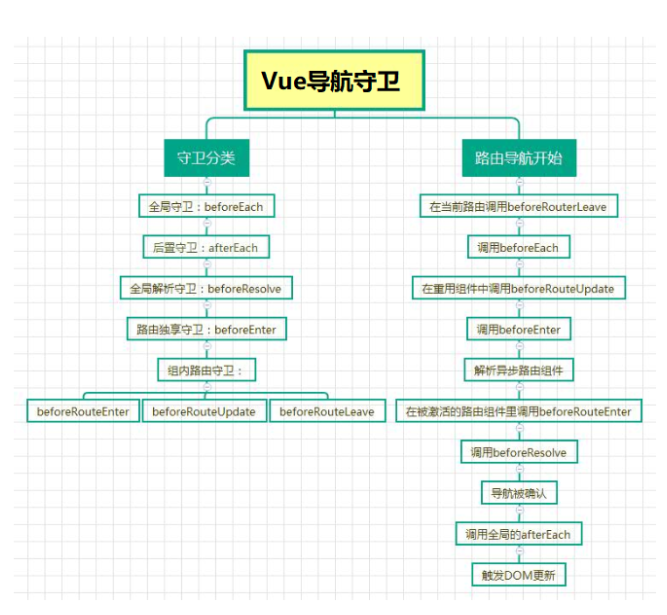

### get started
1. install vue-router

   ```bash
   npm init vite
   npm i vue-router@4 --save
   ```

2. use in Vue根组件(like main.js)

   ```javascript
   import router from './router'
   createApp(App).use(router).mount('#app')
   ```

3. define router/index.js

   ```javascript
   //1. create router folder
   //2. create index.js under router folder
   //Vue2 history Vue3 createWebHistory
   //Vue2 hash Vue3 createWebHashHistory
   //Vue2 abstract Vue3 createMemoryHistory
   import { createRouter, createWebHistory } from 'vue-router'
   import Home from 'xxx'
   import About from 'xxx'
   
   const routes = [
     { path: '/', name: 'Home', component: Home },
     { path: '/about', name: 'About', component: About },
   ]
   
   const router = createRouter({
   	history: createWebHistory(),
   	routes,
   })
   
   export default router
   ```

4. define router related component

5. define \<router-link>  and \<router-view> in components

### 懒加载

```javascript
component: () => import('../views/Login.vue')
```

### 404、重定向和别名

```javascript
const routes = [
	...
	{
		// path: '/:catchAll(.*)',
		path: '/:pathMatch(.*)*',
		name: 'PageNotExist',
		component: () => import('../views/PageNotExist.vue'),
	},
]

//two urls
{ path: '/', name: 'Home', component: Home, alias: '/home' }
//or more
{ path: '', component: UserList, alias: ['/people', 'list'] },


//redirect:'/params/:newsId(\\d+)/:newsTitle'
{ path:'/home', redirect: '/' }
{ path: '/home', redirect: { name: 'Home' }
//advanced usage
 { path: '/users/:id/posts', redirect: to => {
   // 将总是把/users/123/posts重定向到/users/123/profile。
   //return 'profile'
   //return { path: 'profile'}
   return { path: '/search', query: { q: to.params.searchText } 
 } },
```

### 动态路由

```javascript
//params必须结合name使用
path: '/destination/:id/:slug', name: 'destination.show',

<router-link
  v-for="destination in destinations"
  :key="destination.id"
  :to="{name: 'destination.show', params: {id: destination.id, slug: destination.slug}}"
>
//or
<router-link :to="`/home/message/detail/${message.id}`">
```

#### ==动态路由刷新==

#### watch

```javascript
//way 1 in Vue3
async created() {
  this.initData()
  this.$watch(() => this.$route.params, (toParams, previousParams) => this.initData())
}
//way 2
watch: {
  '$route.params':'initData'
},
//or  
watch: {
  '$route'(to, from) {
    this.initData()
  }
}
//more explicit
watch: {
  '$route.params'(toParams, fromParams) {
    this.initData()
  }
}
```

####  **Vue key attribute**

```javascript
<router-view :key="$route.path" />
```

####  vue-router组件内 hook

```javascript
beforeRouteUpdate(to, from) {
  this.$route = to //刷新后需更新this.$rout
  this.initData()
}
```

### path正则匹配

```javascript
path: '/user-:afterUser(.*)', component: UserGeneric }
path: '/example/:id+' 
path: '/example/:id(\\d+)+' 
path:'/example/:id(\\d+)', component: () => import('xxx'), }, 
path: '/user-*'
//goto different page according to the path
path: '/:orderId(\\d+)', name:'orders'
path: '/:productName', name: 'product'
```

### query

```javascript
//params必须结合name使用
//http://127.0.0.1:5173/?a=x&b=y
<router-link :to="`/home/message/detail/id=${message.id}`">
:to="{ path: '/register', query: { plan: 'private' }}
```

### 嵌套路由

```javascript
const routes = [
	{
		path: '/destination/:id/:slug',
		name: 'destination.show',
		component: () => import('../views/DestinationShow.vue'),
		children: [
			{
				path: ':experienceSlug',
				name: 'experience.show',
				component: () => import('../views/ExperienceShow.vue'),
			},
      //没有匹配到也想渲染什么东西
      { path: '', component: UserHome },
		],
	},
]

<section v-if="destination" class="experiences">
  <h2>Top Experiences in {{ destination.name }}</h2>
	<div class="cards">
    <router-link
      v-for="experience in destination.experiences"
      :key="experience.slug"
      :to="{name:'experience.show', params:{experienceSlug: experience.slug}}"
    >
    <ExperienceCard
      :experience="experience"
    />
  	</router-link>
	</div>
  //这是嵌套的router-view
	<router-view />
</section>
```

### 命名视图

```javascript
const routes = [
	{
		path: '/protected',
		name: 'Protected',
    //注意不是component
		components: {
			default: () => import('../views/Protected.vue'),
			LeftSidebar: () => import('../components/LeftSidebar.vue'),
		},
	},
]

<template>
	<Navigation />
	<div class="container">
		<router-view
			class="view left-sidebar"
			name="LeftSidebar"
			v-slot="{ Component }"
		>
		<transition name="fade" mode="out-in">
			<component :is="Component" :key="$route.path"></component>
			</transition>
		</router-view>
		<router-view class="main-view" v-slot="{ Component }">
			<transition name="fade" mode="out-in">
				<component :is="Component" :key="$route.path"></component>
			</transition>
		</router-view>
	</div>
</template>
```

### 路由守卫

#### 全局守卫

- 全局前置

  ```javascript
  //全局前置守卫按照创建顺序调用。守卫是异步解析执行，此时导航在所有守卫 resolve 完之前一直处于等待中
  router.beforeEach((to, from) => {
    ...
    //取消导航
    return false
  })
  
   router.beforeEach(async (to, from) => {
     if (
       // 检查用户是否已登录
       //避免无限重定向
       !isAuthenticated && to.name !== 'Login'
     ) {
       return { name: 'Login' }
     }
   })
  
  //同以上
  router.beforeEach(async (to, from) => {
    // canUserAccess() 返回 `true` 或 `false`
    const canAccess = await canUserAccess(to)
    if (!canAccess) return '/login'
  })
  ```

- 全局解析

  ```javascript
  //获取数据或执行任何其他操作（如果用户无法进入页面时你希望避免执行的操作）的理想位置
  router.beforeResolve(async to => {
    if (to.meta.requiresCamera) {
      try {
        await askForCameraPermission()
      } catch (error) {
        if (error instanceof NotAllowedError) {
          // ... 处理错误，然后取消导航
          return false
        } else {
          // 意料之外的错误，取消导航并把错误传给全局处理器
          throw error
        }
      }
    }
  })
  ```

- 全局后置

  ```javascript
  router.afterEach((to, from) => {
    sendToAnalytics(to.fullPath)
  })
  ```

#### 路由独享守卫

```javascript
//beforeEnter 守卫只在进入路由时触发，不会在 params、query 或 hash 改变时触发
//访问一个不存在的destination.id
const router = new VueRouter({
  routes: [
    {
      path: '/foo',
      component: Foo,
      beforeEnter: (to, from) => {
        const isExist = sourceData.destinations.find((destination) => {
					return destination.id === parseInt(to.params.id)
				})
        //return { name: 'PageNotExist' } 重定向
        //保留url params
        if (!isExist)
          return {
            name: 'PageNotExist',
            params: { pathMatch: to.path.split('/').slice(1) },
            query: to.query,
            hash: to.hash,
         }
      }
    }
  ]
})


//可以传递函数数组
function removeQueryParams(to) {
  if (Object.keys(to.query).length)
    return { path: to.path, query: {}, hash: to.hash }
}

function removeHash(to) {
  if (to.hash) return { path: to.path, query: to.query, hash: '' }
}

const routes = [
  {
    path: '/users/:id',
    component: UserDetails,
    beforeEnter: [removeQueryParams, removeHash],
  },
  {
    path: '/about',
    component: UserDetails,
    beforeEnter: [removeQueryParams],
  },
]
```

#### 路由组件内守卫

```javascript
const UserDetails = {
  template: `...`,
  beforeRouteEnter(to, from, next) {
    // 在渲染该组件的对应路由被验证前调用
    // 不能获取组件实例 `this` ！
    // 因为当守卫执行时，组件实例还没被创建！
    next(vm => {
      // 通过 `vm` 访问组件实例
    })
  },
  beforeRouteUpdate(to, from) {
    // 在当前路由改变，但是该组件被复用时调用
    // 举例来说，对于一个带有动态参数的路径 `/users/:id`，在 `/users/1` 和 `/users/2` 之间跳转的时候，
    // 由于会渲染同样的 `UserDetails` 组件，因此组件实例会被复用。而这个钩子就会在这个情况下被调用。
    // 因为在这种情况发生的时候，组件已经挂载好了，导航守卫可以访问组件实例 `this`
    this.name = to.params.name
  },
  beforeRouteLeave(to, from) {
    // 在导航离开渲染该组件的对应路由时调用
    // 与 `beforeRouteUpdate` 一样，它可以访问组件实例 `this`
    const answer = window.confirm('Do you really want to leave? you have unsaved changes!')
    if (!answer) return false
  },
}
```

#### 完整的导航解析流程

1. 导航被触发
2. 在失活的组件里调用`beforeRouteLeave`守卫
3. 调用全局的 `beforeEach` 守卫
4. 在重用的组件里调用 `beforeRouteUpdate` 守卫 (2.2+)
5. 在路由配置里调用 `beforeEnter`
6. 解析异步路由组件
7. 在被激活的组件里调用 `beforeRouteEnter`
8. 调用全局的 `beforeResolve` 守卫 (2.5+)
9. 导航被确认
10. 调用全局的 `afterEach` 钩子
11. 触发 DOM 更新
12. 调用 `beforeRouteEnter` 守卫中传给 `next` 的回调函数，创建好的组件实例会作为回调函数的参数传入



### 路由元信息

```javascript
const routes = [
	{ path: '/', name: 'Home', component: Home },
	{ path: '/home', redirect: '/' },
	//{ path: '/home', redirect: { name: 'Home' } },
	{
		path: '/protected',
		name: 'Protected',
		components: {
			default: () => import('../views/Protected.vue'),
			LeftSidebar: () => import('../components/LeftSidebar.vue'),
		},
		meta: {
			requireAuth: true,
		},
	},
]
```

### 解耦this.$route

```javascript
const routes = [
	{
		path: '/destination/:id/:slug',
		name: 'destination.show',
		component: () => import('../views/DestinationShow.vue'),
		//props: { newsletterPopup: false } //static prop
		//props: route => ({ newsletterPopup: someExpression ? true ? false })
		//props: route => ({ id: parseInt(route.params.id) }) //过去就是Number否则组件里要自己转
		//props: route => ({ query: route.query.q })
		props: true,  //route.params 将被设置为组件的 props
	},
]

//组件内必须定义
export default {
  props: {
    id: {type: Number, required: true},
    slug: {type: String, required: true}
  },
}


//对于有命名视图的路由，你必须为每个命名视图定义 props 配置
const routes = [
  {
    path: '/user/:id',
    components: { default: User, sidebar: Sidebar },
    props: { default: true, sidebar: false }
  }
]
```

### 编程导航

```javascript
this.$router.go(n)
this.$router.back()

//如果提供了 path，params 会被忽略
//params不能与path一起使用
router.push('/users/eduardo')
router.push({ path: '/users/eduardo' })
router.push({ name: 'user', params: { username: 'eduardo' } })
//  /register?plan=private
router.push({ path: '/register', query: { plan: 'private' } })
//  /about#team
router.push({ path: '/about', hash: '#team' })


import { useRouter } from 'vue-router'
const router = useRouter()

const username = 'eduardo'
// 必须自己处理编码
router.push(`/user/${username}`)
router.push({ path: `/user/${username}` })
// 如果可能的话，使用 `name` 和 `params` 从自动 URL 编码中获益
router.push({ name: 'user', params: { username } })


router.push({ path: '/home', replace: true })
//同上
router.replace({ path: '/home' })
```

### 路由过渡动画

#### Vue3

```javascript
<template>
  <Navigation />
  <div class="container">
    <router-view v-slot="{route,Component}">
      <transition name="fade" mode="out-in">
        //添加key属性强制在复用的视图之间进行过渡
        <component :is="Component" :key="$route.path"></component>
      </transition>
    </router-view>
  </div>
</template>

<style lang="css">
.fade-enter-active,
.fade-leave-active {
  transition: opacity 0.3s;
}
.fade-enter,
.fade-leave-to {
  opacity: 0;
}
</style>

//transition component必须只有一个根标签
```

#### Vue2
```javascript
<transition name="fade">
  <router-view ></router-view>
</transition>

<style scoped>
.fade-enter {
  opacity:0;
}
.fade-leave{
  opacity:1;
}
.fade-enter-active{
  transition:opacity .5s;
}
.fade-leave-active{
  opacity:0;
  transition:opacity .5s;
}
</style>
```

### 路由缓存

- Vue3

  ```javascript
  <router-view v-slot="{ Component }">
    <transition>
      <keep-alive>
        <component :is="Component" />
      </keep-alive>
    </transition>
  </router-view>
  ```

- Vue2

  ```javascript
  <keep-alive>
      <router-view></router-view>
  </keep-alive>
  ```

### 导航故障

- 用户已经位于他们正在尝试导航到的页面
- 一个导航守卫通过调用 `return false` 中断了这次导航
- 当前的导航守卫还没有完成时，一个新的导航守卫会出现了
- 一个导航守卫通过返回一个新的位置，重定向到其他地方 (例如，`return '/login'`)
- 一个导航守卫抛出了一个 `Error`

```javascript
import {isNavigationFailure, NavigationFailureType} from 'vue-router'
export default {
  methods: {
    async triggerRouterError() {
      const navigationFailure = await this.$router.push('/')
      if (isNavigationFailure(navigationFailure, NavigationFailureType.duplicated)) {
        console.log(navigationFailure.to)
        console.log(navigationFailure.from)
      } else {
        console.log('all is well')
      }
    },
  }
}
```

### 总结

- k->v 前端就是组件 后端就是回调函数

- `$route` 只读，指当前路由 `$router` 只写，指路由器

- props: (route) => ({ ...route.params, id: parseInt(route.params.id) }) 注意保留以前的params

- 保留其他route参数

  ```javascript
  this.$router.push({
    name: 'NotFound',
    // 保留当前路径并删除第一个字符，以避免目标 URL 以 `//` 开头。
    params: { pathMatch: this.$route.path.substring(1).split('/') },
    // 保留现有的查询和 hash 值，如果有的话
    query: this.$route.query,
    hash: this.$route.hash,
  })
  ```

### 实战经验

#### 获取数据

```javascript
<template>
  <div class="post">
    <div v-if="loading" class="loading">Loading...</div>

    <div v-if="error" class="error">{{ error }}</div>

    <div v-if="post" class="content">
      <h2>{{ post.title }}</h2>
      <p>{{ post.body }}</p>
    </div>
  </div>
</template>
```

- **导航完成之后获取**：先完成导航，然后在接下来的组件生命周期钩子中获取数据。在数据获取期间显示“加载中”之类的指示

  ```javascript
  export default {
    data() {
      return {
        loading: false,
        post: null,
        error: null,
      }
    },
    created() {
      // watch 路由的参数，以便再次获取数据
      this.$watch(
        () => this.$route.params,
        () => {
          this.fetchData()
        },
        // 组件创建完后获取数据，
        // 此时 data 已经被 observed 了
        { immediate: true }
      )
    },
    methods: {
      fetchData() {
        this.error = this.post = null
        this.loading = true
        // replace `getPost` with your data fetching util / API wrapper
        getPost(this.$route.params.id, (err, post) => {
          this.loading = false
          if (err) {
            this.error = err.toString()
          } else {
            this.post = post
          }
        })
      },
    },
  }
  ```

  **导航完成之前获取**：导航完成前，在路由进入的守卫中获取数据，在数据获取成功后执行导航

```javascript
export default {
  data() {
    return {
      post: null,
      error: null,
    }
  },
  beforeRouteEnter(to, from, next) {
    getPost(to.params.id, (err, post) => {
      next(vm => vm.setData(err, post))
    })
  },
  // 路由改变前，组件就已经渲染完了
  // 逻辑稍稍不同
  async beforeRouteUpdate(to, from) {
    this.post = null
    try {
      this.post = await getPost(to.params.id)
    } catch (error) {
      this.error = error.toString()
    }
  },
}
```

#### 权限控制 hook + meta

```javascript
const routes = [
  {
    path: '/posts',
    component: PostsLayout,
    children: [
      {
        path: 'new',
        component: PostsNew,
        // 只有经过身份验证的用户才能创建帖子
        meta: { requiresAuth: true }
      },
      {
        path: ':id',
        component: PostsDetail
        // 任何人都可以阅读文章
        meta: { requiresAuth: false }
      }
    ]
  }
]

router.beforeEach((to, from) => {
  // 而不是去检查每条路由记录
  // to.matched.some(record => record.meta.requiresAuth)
  if (to.meta.requiresAuth && !auth.isLoggedIn()) {
    return {
      path: '/login',
      // 保存我们所在的位置，以便以后再来
      query: { redirect: to.fullPath },
    }
  }
})
```

#### 增加redirect参数，比如登录后直接跳转到path为redirect的路由界面

```javascript
//先全局beforeEach hook带上query为redirect的对象
router.beforeEach((to, from) => {
	if (to.meta.requireAuth && !window.user) {
		//need to login if not already logged in
		return { name: 'Login', query: { redirect: to.fullPath } }
	}
})

//然后在点击的时候抓取redirect界面路由path
export default {
  ...
  methods: {
    login() {
      //in real App: Auth user against API
      window.user = this.username
      const redirectPath = this.$route.query.redirect || '/protected'
      this.$router.push(redirectPath)
    }
  }
}
```

#### 扩展Router Link for External URLs

```javascript
<template>
  <a v-if="isExternal"
     target="_blank"
     ref="noopener"
  :href="to"><slot /></a>
  <router-link v-else v-bind="$props"><slot /></router-link>
</template>

<script>
import { RouterLink } from 'vue-router'
export default {
  props: {
    ...RouterLink.props
  },
  computed: {
    isExternal() {
      return typeof this.to === 'string' && this.to.startsWith('http')
    }
  }
}
</script>

//main.js
import AppLink from './components/AppLink.vue'
createApp(App).component('AppLink', AppLink).use(router).mount('#app')
```

### others

#### linkActiveClass

```javascript
const router = createRouter({
	...
  linkActiveClass: 'xxx'
})

//在使用的component里加style
```

#### Scroll Behavior

```javascript
const router = createRouter({
	history: createWebHistory(),
	routes,
	scrollBehavior(to, from, savedPosition) {
		return (
			savedPosition ||
       //延迟500是为了动画完了再定位
			new Promise((resolve) => {
				setTimeout(() => resolve({ top: 0, behavior: 'smooth' }), 500)
			})
		)
	},
})


//通过el传递一个 CSS 选择器或一个 DOM 元素。此时top 和 left 将被视为该元素的相对偏移量
const router = createRouter({
  scrollBehavior(to, from, savedPosition) {
    // 始终在元素 #main 上方滚动 10px
    return {
      // 也可以这么写
      // el: document.getElementById('main'),
      el: '#main',
      top: -10,
    }
  },
})

//滚动到锚点
const router = createRouter({
  scrollBehavior(to, from, savedPosition) {
    if (to.hash) {
      return {
        el: to.hash,
      }
    }
  },
})
```

#### Composition API

```javascript
<script>
import { ref } from 'vue'
import { useRouter, useRoute } from 'vue-router'
export default {
  setup() {
    const username = ref('')
    const password = ref('')
    const router = useRouter()
    const route = useRoute()
    const login = () => {
      //in real App: Auth user against API
      window.user = username.value
      const redirectPath = route.query.redirect || '/protected'
      router.push(redirectPath)
    }
    return {username, password, login}
  }
}
</script>

//Route hook example
<script>
import { onBeforeRouteLeave } from 'vue-router'
export default {
  setup() {
    onBeforeRouteLeave((to, from) => {
      const answer = window.confirm('Are you sure to leave?')
      if (!answer) return false
    })
  }
}
</script>
```

#### 动态路由

```javascript
export default {
  methods: {
    addDynamicRouter() {
      const removeDynamicRoute = this.$router.addRoute({
        name: 'dynamic',
        path: '/dynamic',
        component: () => import('./Dynamic.vue')
      })
      //removeDynamicRoute()
      //this.$router.removeRoute('/dynamic')
    }
  }
}
```

#### 不留历史记录

```javascript
<router-link
  replace
  to="xxx"
>

router.replace(xxx)
```

