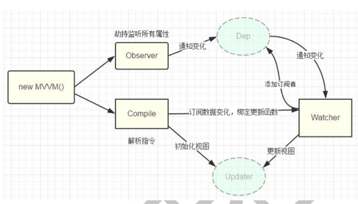

### 1 数据代理

- 通过一个对象代理对另一个对象中属性的操作
- vue数据代理: 通过`vm`对象来代理`data`对象中所有属性的操作,更方便的操作`data`中的数据
- 基本实现流程
    - 通过`Object.defineProperty()`给`vm`添加与`data`对象的属性对应的属性描述符
    - 所有添加的属性都包含`getter/setter`
    - `getter/setter`内部去操作`data`中对应的属性数据
### 2 模板解析

1. 将`el`的所有子节点取出, 添加到一个新建的文档`fragment`对象中
2. 对`fragment`中的所有层次子节点递归进行编译解析处理
   1. 对大括号表达式文本节点进行解析
      1. 根据正则对象得到匹配出的表达式字符串: 子匹配/RegExp.$1 name
      2. 从`data`中取出表达式对应的属性值
      3. 将属性值设置为文本节点的`textContent`
   2. 对元素节点的指令属性进行解析(事件指令/一般指令)
      -  事件指令
         1. 从指令名中取出事件名
         2. 根据指令的值(表达式)从`methods`中得到对应的事件处理函数对象
         3. 给当前元素节点绑定指定事件名和回调函数的`dom`事件监听
         4. 指令解析完后, 移除此指令属性
      -  一般指令
         1. 得到指令名和指令值(表达式) text/html/class
         2. 从`data`中根据表达式得到对应的值
         3. 根据指令名确定需要操作元素节点的什么属性
         4. 将得到的表达式的值设置到对应的属性上(v-text---textContent 属性 v-html---innerHTML 属性 v-class--className 属性)
         5. 移除元素的指令属性
3. 将解析后的`fragment`添加到`el`中显示

### 3 数据绑定(一旦更新了`data`中的某个属性数据, 所有界面上直接使用或间接使用了此属性的节点都会更新)

- 数据劫持是 vue 中用来实现数据绑定的一种技术
- 基本思想: 通过`defineProperty()`来监视`data`中所有属性(任意层次)数据的变化, 一旦变
化就去更新界面

- Observer
  - 用来对`data`所有属性数据进行劫持的构造函数
  - 给`data`中所有属性重新定义属性描述(get/set)
  - 为`data`中的每个属性创建对应的`dep`对象
- Dep(Depend)
    - `data`中的每个属性(所有层次)都对应一个`dep`对象
    - 创建的时机
      - 在初始化`define dat`a `中各个属性时创建对应的`dep`对象
      - 在`data`中的某个属性值被设置为新的对象时
    - 对象的结构
        {
        ​    id, // 每个 dep 都有一个唯一的 id
        ​    subs //包含 n 个对应 watcher 的数组(subscribes 的简写)
        }
    - subs 属性说明
      - 当`watcher`被创建时, 内部将当前`watcher`对象添加到对应的`dep`对象的`subs`中
      - 当此`data`属性的值发生改变时, `subs`中所有的`watcher`都会收到更新的通知

- Compiler
    - 用来解析模板页面的对象的构造函数(一个实例)
    - 利用`compile`对象解析模板页面
    - 每解析一个表达式(非事件指令)都会创建一个对应的`watcher`对象, 并建立`watcher`
与`dep`的关系
    - `complie`与`watcher`关系: 一对多的关系

- Watcher
    - 模板中每个非事件指令或表达式都对应一个`watcher`对象
    - 监视当前表达式数据的变化
    - 创建的时机: 在初始化编译模板时
    - 对象的组成
        {
        vm, //vm 对象
        exp, //对应指令的表达式
        cb, //当表达式所对应的数据发生改变的回调函数
        value, //表达式当前的值
        depIds //表达式中各级属性所对应的 dep 对象的集合对象
        //属性名为 dep 的id,属性值为dep
        }
- 总结`dep`与`watcher`的关系
    - 多对多
    - `data`中的一个属性对应一个`dep`, 一个`dep`中可能包含多个`watcher`(模板中有几个
表达式使用到了同一个属性) {{ a }}/v-text="a"
    - 模板中一个非事件表达式对应一个`watcher`, 一个` watcher`中可能包含多个`dep`(表
达式是多层: a.b)
    - 数据绑定使用到2个核心技术(defineProperty()和消息订阅与发布)
    - 如何建立的? data的属性get()中建立
    - 什么时候建立? 初始化解析模块中表达式创建watcher对象时

### 4 双向数据绑定

- 双向数据绑定是建立在单向数据绑定(model==>View)的基础之上的
- 双向数据绑定的实现流程:
  - 在解析`v-model`指令时, 给当前元素添加`input`监听
  - 当`input`的`value`发生改变时, 将最新的值赋值给当前表达式所对应的`data`属性

### 5 others

- Dep
    - 什么时候创建的? 初始化给的data的属性进行数据劫持时创建的
    - 个数? 与data属性一一对应
    - 结构
        - id标识
        - subs[] n个相关的watcher容器

- Watcher
    - 什么时候创建的? 初始化解析大括号表达式/一般指令时创建
    - 个数? 与模板中表达式(不包括事件指令)一一对应
    - 结构?
        - this.cb = cb 更新界面回调
        - this.vm = vm
        - this.exp = exp
        - this.depIds = {} 相关的n个的ep容器对象
        - this.value = this.get() 当前表达式的value