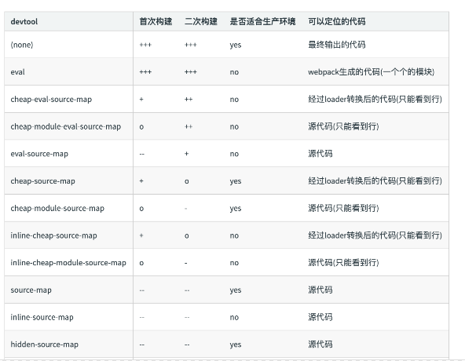
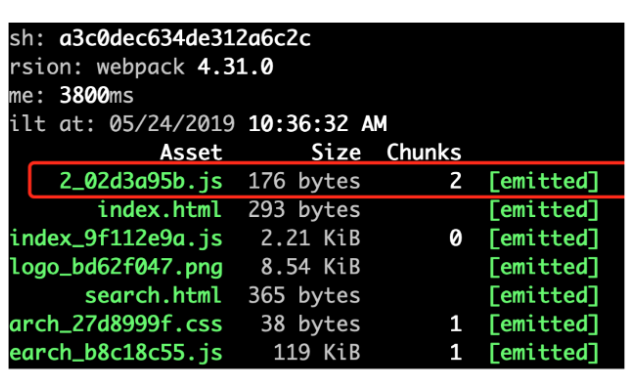
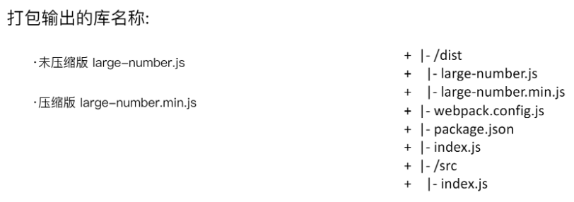

### 1 什么是webpack
构建就是把源代码转换成线上可执行的js、css、html.
- 代码转换ts->js、less->css等
- 文件优化,压缩js、css、html,合并图片
- 代码分割,提取多个页面的公共代码,提取首屏不需要执行的代码异步加载,路由按需加载
- 模块合并
- 监听本地源代码变化,自动重新构建,刷新浏览器
- 代码校验,在代码提交到仓库前校验代码,以及单元测试是否通过
- 自动发布,更新完代码后,自动构建出现上发布代码并传输给发布系统
- Tree-Shaking
- 利用CDN加速,在构建过程中,将引用的静态资源路径修改为CDN上对应的路径

### 2 核心概念
- entry：入口,可抽象成输入,单入口写成字符串,多入口写成对象

- output：输出结果,在webpack经过一系列处理并得出最终想要的代码后输出结果,单出口filename和path,多出口使用占位符`[name].js`

- loader：模块转换器,用于把原生不支持的模块转换成有效的模块,并添加到依赖图中,原生只支持js和json,其本质是一个函数

    > babel-loader
    >
    > css-loader
    >
    > less-loader
    >
    > ts-loader
    >
    > file-loader
    >
    > raw-loader
    >
    > thread-loader

- plugin：在Webpack构建流程中的特定时机注入扩展逻辑来改变构建结果或做你想要的事情,增强webpack功能,作用于整个构建过程,可以简单理解为webpack不能做的事情plugin做

    > CommonsChunkPlugin
    >
    > CleanWebpackPlugin
    >
    > ExractTextWebpackPlugin
    >
    > CopyWebpackPlugin
    >
    > HtmlWebpackPlugin
    >
    > UglifyjsWebpackPlugin
    >
    > ZipWebpackPlugin

- mode: production、development、none

- module：在webpack里一切皆模块,一个模块(css、font、image)对应着一个文件,webpack会从配置的entry开始递归找出所有依赖的模块

- chunk：代码块,一个chunk由多个模块组合而成,用于代码合并与分割


### 3 get started
1. mkdir webpack-demo

2. cd webpack-demo

3. npm init -y

4. `npm i webpack webpack-cli webpack-dev-server(自动打包、监视文件改变、刷新浏览器) -D`

5. 创建和配置webpack.config.js(可以修改名字)

6. 配置npm scripts

    ```bash
    "scripts": {
        //--open --hot --inline --port --config ./webpack.dev.config.js
        "build": "webpack --config webpack.config.js",
        "dev": "webpack-dev-server --open --color --port 9999",
        "dev-simple": "webpack-dev-server",
        "watch": "webpack --watch"
    }
    ```

7. 安装plugin和loader
    ```bash
    npm i html-webpack-plugin clean-webpack-plugin -D
    npm i babel-loader babel-core babel-preset-env (babel-loader)
    npm i babel-polyfill --D  (默认只转换语法,这个转换API )
    npm i babel-plugin-transform-runtime --D  (解决重复引用工具方法导致打包js过大的问题)
    npm i babel-runtime --save  (解决重复引用工具方法导致打包js过大的问题)
    
    npm i -D style-loader css-loader  (css-loader)
    npm i -D npm i file-loader url-loader  (image-loader)
    npm i -D less-loader  less(less-loader)
    npm i -D vue-loader vue-template-compiler(vue-loader)
    ```


### 4 webpack基础

#### 1 resolve es6

- `npm i @babel/core @babel/preset-env babel-loader -D`

```
//.babelrc
{
    "presets": [
        "@babel/preset-env"
    ]
}
```

```javascript
//webpack.config.js
module: {
    rules: [
        {
            test: /.js$/,
            use: 'babel-loader'
        }
    ]
}
```

#### 2 resolve jsx

- `npm i @babel/core babel-loader react react-dom @babel/preset-react -D`
- `"@babel/preset-react"` in .babelrc
- `webpack.config.js`配置`babel-loader`

#### 3 resolve css and less(sass)

- npm i style-loader css-loader less less-loader -D`

```javascript
module: {
    rules: [
        {
            test: /.css$/,
            //注意顺序
            use: ['style-loader','css-loader']
        }
    ]
}
```

#### 4 resolve less(sass)

- `npm i less less-loader -D`

```javascript
module: {
    rules: [
        {
            test: /.less$/,
            use: ['style-loader','css-loader','less-loader']
        }
    ]
}
```

#### 5 file-loader(resolve img and font)

- `npm i file-loader -D`

```javascript
module: {
    rules: [
        {
            test: /.(png|jpg|gif|jpeg)$/,
            use: 'file-loader'
        },
        {
            test: /.(woff|woff2|eot|ttf|otf)$/,
            use: 'file-loader'
        }
    ]
}
```

#### 6 url-loader

```javascript
//打包图片和字体,区别file-loader就是对小于一定体积的文件直接转成base64
module: {
    rules: [
        {
            test: /.(woff|woff2|eot|ttf|otf)$/,
            use: {
                loader: 'url-loader',
                options: {
                    limit:10240
                }
            }
        }
    ]
}
```

#### 7 文件监听

- `package.json`启动`webpack`命令带上`--watch`(需要手动刷新浏览器)

- 在配置`webpack.config.js`中设置`watch: true`

  ```javascript
  module.export = {
    watch: true, //默认不开启
  	//只有开启watch,watchOptions才有意义
    watchOptions: {
        ignored: /node_modules/,//支持正则
        aggregateTimeout: 300,//监听到变化后等300ms再去执行,越大越好
        poll: 1000 //判断文件是否发生变化,不停询问系统指定文件是否有变化,默认每秒询问1000次,越小越好
    }
  }
  ```

#### 8 热更新

##### webpack-dev-server(只能hot组件和css)

- 不输出文件而是放在内存中

- 使用HotModuleReplacementPlugin插件

  ```javascript
  //package.json
  "scripts": {
    "dev": "webpack-dev-server --open"
  }
  
  //webpack.config.js
  const webpack = require('webpack')
  module.export = {
    ...
    mode: 'development',
    ...
    plugins: [
      new webpack.HotModuleReplacementPlugin()
    ],
    devServer: {
      contentBase: './dist',
      hot: true
      //publicPath: '/assets/'
      //host: '0.0.0.0',
      //port: 9000,
      //compress: true,
      //open: true
      //overlay: true,// 如果代码出错,会在浏览器页面弹出“浮动层”类似于vue-cli等脚手架
      proxy: { 
        '/comments': { 
            target: 'https://xxx.cn',
            changeOrigin: true,
            logLevel: 'debug',
            headers: { 
                Cookie: '' 
            } 
        }
      }
      //historyApiFallback
    }
  }
  ```

#####webpack-dev-middleware

- WDM将webpack输出的文件传输给服务器

- 适用于灵活定制的场景

  ```javascript
  const express = require('express')
  const wepback = require('wepback')
  const weppackDevMiddleware = require('weppack-dev-middleware')
  
  const app = expess()
  const config = require('./webpack.config.js')
  const compile = wepback(config)
  
  app.use(weppackDevMiddleware(compile,{
      publicPath:config.output.publicPath
  }))
  
  app.listen(3000,() => {
      console.log('server is runnning on 3000')
  })
  ```

#### 9 文件指纹(不能和热更新一起使用)

- Hash: 和整个项目构建相关,只要项目文件有修改,整个项目构建的hash就会改变

- Chunkhash: 和webpack打包的chunk有关,不同entry生成不同的chunkhash

- Contenthash: 根据文件内容定义hash,文件内容不变则Contenthash不变,一般css用这种

  ```javascript
  const path = require('path')
  //抽取css文件,webpack4的plugin,支持css chunk
  //与style-loader功能互斥,不能一起使用
  const MiniCssExtractPlugin = require('mini-css-extract-plugin')
  
  module.exports = {
      entry: {
          index: './src/index.js',
          search: './src/search.js'
      },
      output: {
          path: path.join(__dirname,'dist'),
          //js文件指纹
          filename: '[name]_[chunkhash:8].js'
          //publicPath : 'dist/js/'  处理图片路径
      },
      mode: 'production',
      module: {
          rules: [
              {
                  test: /.js$/,
                  use: 'babel-loader'
              },
              {
                  test: /.css$/,
                  use: [
                      MiniCssExtractPlugin.loader,
                      'css-loader'
                  ]
              },
              {
                  test: /.less$/,
                  use: [
                      MiniCssExtractPlugin.loader,
                      'css-loader',
                      'less-loader'
                  ]
              },
              {
                  test: /.(png|jpg|gif|jpeg)$/,
                  use: [
                      {
                          loader: 'file-loader',
                          options: {
                              //文件指纹,此hash不同于js的hash,针对的是内容的hash
                              name: '[name]_[hash:8].[ext]'
                          }
                      }
                  ]
              },
              {
                  test: /.(woff|woff2|eot|ttf|otf)$/,
                  use: [
                      {
                          loader: 'file-loader',
                          options: {
                              //文件指纹,此hash不同于js的hash,针对的是内容的hash
                              name: '[name]_[hash:8].[ext]'
                          }
                      }
                  ]
              }
          ]
      },
      plugins: [
          new MiniCssExtractPlugin({
              //css文件指纹
              filename: '[name]_[contenthash:8].css'
          })
      ]
  }
  ```

#### 10 compress html/css/js

- webpack4内置`uglifyjs-weabpack-plugin`

- `optimize-css-assets-webpack-plugin` + `cssnano`压缩CSS文件

  ```javascript
  plugin: [
    new OptimizeCSSAssetsPlugin({
      assetNameRegExp: /\.css$/g,
      cssProcessor: require('cssnano')
    })
  ]
  ```

- `html-webpack-plugin`

  ```javascript
  //一个页面对应一个HtmlWebpackPlugin
  new HtmlWebpackPlugin({
      template: path.join(__dirname,'src/index.html'),
      filename: 'index.html',
      chunks: ['index'],
      inject: true,
      minify: {
          html5: true,
          collapseWhitespace: true,
          preserveLineBreaks: false,
          minifyCSS: true,
          minifyJS: true,
          removeComments: false
      }
   })
  ```

### 5 webpack进阶

#### 1 clear dist folder

- 通过npm scripts `rm -rf./dist && webpack` or `rimraf ./dist && webpack`

- `clean-webpack-plugin`

  ```javascript
  plugin: [
    new CleanWebpackPlugin()
  ]
  ```

#### 2 PostCSS插件autoprefixer

- Trident(-ms)、Geko(-moz)、Webkit(-webkit)、Presto(-o)
- `npm i postcss-loader autoprefixer -D`

```javascript
 {
     test: /.less$/,
     use: [
         MiniCssExtractPlugin.loader,
         'css-loader',
         'less-loader',
         {
             loader: 'postcss-loader',
             options: {
                 plugins: () => [
                     require('autoprefixer')({
                     browsers: ['last 2 version','>1%','ios 7']
                     })
                 ]
             }
         }
     ]
 }
```

#### 3 px convert to rem
- @media

  ```css
  @media screen and (max-width:980px) {
    .header {
      width:900px;
    }
  }
  ```

- `npm i px2rem-loader -D` 

- `npm i lib-flexible -S`(动态计算根元素font-size,打开页面时就计算)

- `font-size: 12px; /*no*/` 不进行rem转换

```javascript
{
    test: /.less$/,
    use: [
        MiniCssExtractPlugin.loader,
        'css-loader',
        'less-loader',
        {
            loader: 'postcss-loader',
            options: {
                plugins: () => [
                    require('autoprefixer')({
                    browsers: ['last 2 version','>1%','ios 7']
                })
                ]
            }
        },
        {
            loader: 'px2rem-loader',
            options: {
                remUnit: 75, //1 rem = 75px
                remPrecision: 8 //小数位数
        	}
        }
    ]
}
```

#### 4 资源内联

- 代码层面
    - 页面框架的初始化脚本
    - 上报相关打点
    - css内联避免页面闪动
- 请求层面
    - 小图片或字体内联(url-loader)

##### html/js内联(raw-loader)

```html
<!-- index.html -->
<!DOCTYPE html>
<html lang="en">
<head>
    <!-- HtmlWebpackPlugin默认使用ejs语法 -->
    ${ require('raw-loader!./meta.html')}
    <title>Document</title>
    <script>${ require('raw-loader!babel-loader!../../node_modules/lib-flexible/flexible.js')}</script>
</head>
<body>
    <div id="root"><!--HTML_PLACEHOLDER--></div>
    <!--INITIAL_DATA_PLACEHOLDER-->
</body>
</html>
```

##### css内联

- `html-inline-css-webpack-plugin`(推荐)

- `style-loader`

    ```javascript
    module.exports = {
        module: {
            rules: [
                {
                    test: /\.scss$/,
                    use: [
                        {
                            loader: 'style-loader',
                            options: {
                                insertAt: 'top',//插入head
                                singleton: true //合并所有style tag
                            }
                        },
                        'css-loader',
                        'scss-loader'
                    ]
                }
            ]
        }
    }
    ```

#### 5 MPA bundle

```javascript
//不通用方案
entry: {
    index: './src/index.js',
    a: './src/a.js'
}
output: {
    filename: '[name].[hash:8].js',
}
plugins: [
    //./src/index.html需要存在
    new HtmlWebpackPlugin({
        filename: 'a.html',//default filename is index
        template: './src/index.html',
        title: 'test webpack',
        hash: true,
        minify: {
            removeAttributeQuotes: true,
            collapseWhitespace: true
        },
        chunks: ['index']
    }),
    new HtmlWebpackPlugin({
        filename: 'b.html',
        template: './src/index.html',
        title: 'test webpack',
        hash: true,
        minify: {
            removeAttributeQuotes: true,
            collapseWhitespace: true
        },
        chunks: ['a']
    })
]
```

```javascript
//通用方案
//约定每个页面是一个文件夹,入口为index.js,模版文件为index.html
// npm i glob -D
const glob = require('glob')
const path = require('path')

//动态获取entry和htmlWebpackPlugins,遵循目录结构
const setMPA = () => {
    const entry = {};
    const htmlWebpackPlugins = [];
    const entryFiles = glob.sync(path.join(__dirname,'./src/*/index.js'));

    Object.keys(entryFiles)
        .map(index => {
            const entryFile = entryFiles[index];
            // /Users/cpselvis/my-project/src/index/index.js

            const match = entryFile.match(/src\/(.*)\/index\.js/);
            const pageName = match && match[1];

            entry[pageName] = entryFile;
            htmlWebpackPlugins.push(
                new HtmlWebpackPlugin({
                    template: path.join(__dirname,`src/${pageName}/index.html`),
                    filename: `${pageName}.html`,
                    //页面上引用需要加chunk的name
                    chunks: ['vendors', pageName],
                    inject: true,
                    minify: {
                        html5: true,
                        collapseWhitespace: true,
                        preserveLineBreaks: false,
                        minifyCSS: true,
                        minifyJS: true,
                        removeComments: false
                    }
                })
            );
        });

    return {
        entry,
        htmlWebpackPlugins
    }
}

const { entry,htmlWebpackPlugins } = setMPA()

module.exports = {
    entry: entry,
    output: {
        path: path.join(__dirname,'dist'),
        filename: '[name]_[chunkhash:8].js'
    },
    mode: 'production',
    module: {
			...
    },
    plugins: [
        ...
        new CleanWebpackPlugin()
    ].concat(htmlWebpackPlugins)
};
```

#### 6 source map(开发环境启用,线上关闭)

- eval: 使用eval包括模块代码
- source map: 产生.map文件
- cheap: 不包含列信息
- inline: 将.map作为DataURI嵌入,不单独生成.map
- module: 包含loader的source map



```javascript
module.exports={
  mode: 'none', //JS不会压缩
  devtool: 'cheap-module-eval-source-map'
  //开发环境推荐: cheap-module-eval-source-map
  //生产环境推荐: cheap-module-source-map
}
```

#### 7 提取公共资源

- `html-webpack-externals-plugin`

```javascript
//手动html引入CDN
const HtmlWebpackExternalsPlugin = require('html-webpack-externals-plugin')

plugins: [
	...
    new HtmlWebpackExternalsPlugin({
        externals: [
            {
                module: 'react',
                entry: 'https://11.url.cn/now/lib/16.2.0/react.min.js',
                global: 'React',
            },
            {
                module: 'react-dom',
                entry: 'https://11.url.cn/now/lib/16.2.0/react-dom.min.js',
                global: 'ReactDOM',
            },
        ]
    })
]
```

- SplitChunksPlugin(代替webpack3的CommonsChunkPlugin)

```javascript
//分离vue、react基础包
module.exports = {
    optimization: {
        splitChunks: {
            cacheGroups: {
                commons: {
                    test: /(react|react-dom)/,
                    name: 'vendors',
                    chunks: 'all' //async / initial / all
                }
            }
        }
    }
}
```

```javascript
//分离页面公共文件
module.exports = {
    optimization: {
        splitChunks: {
            minSize: 0, //分离的包体积大小
            cacheGroups: {
                commons: {
                    name: 'common',
                    chunks: 'all',//async initial all
                    minChunks: 2 // 最小引用次数
                }
            }
        }
    }
}
```

#### 8 tree shaking(静态分析)

- **必须是ES6的语法,CJS不支持**
- DCE(代码不可到达,代码执行结果不会被用到,代码只影响死变量(只写不读))
- 函数必须是纯函数
- `mode:productio/none`
- 原理
    - 只能作为模块顶层的语句出现
    - import的模块名只能是字符串常量
    - import binding是immutable的
    - uglify阶段删除无用代码

#### 9 scope hoisting

- 现象：构建后的代码存在大量闭包
- 导致问题：大量作用域包裹代码体积变大,运行代码时创建的函数作用域变多,内存开销变大
- 原理：将所有模块的代码按照所引用顺序放在一个函数作用域里,然后适当的重命名一些变量以防止变量名冲突
- **必须是ES6语法,CJS不支持**
- `mode:productio/none`
- webpack3需要使用`new webpack.optimize.ModuleConcatenationPlugin()`

#### 10 code split and dynamic import

##### 1 意义

- 抽离相同代码到一个`chunk`
- 脚本懒加载,初始化代码更小(比如首屏)

##### 2 方式

- CJS: require.ensure

- ES6: 动态import(需要babel转换)

    ```javascript
    //npm i @babel/plugin-syntax-dynamic-import -D
    //.babelrc
    {
      "plugins": ["@babel/plugin-syntax-dynamic-import"],
      ...
}
    ```
    
    

#### 11 webpack integrate eslint

- eslint-config-airbnb、eslint-config-airbnb-base

- integrate with CI/CD 

- integrate with webpack

    ```javascript
    //npm i eslint-loader -D
    module.exports = {
        module: {
            rules: [
                test: /\.js$/,
                exclude: /node_modules/,
                use: [
                    "babel-loader",
                    "eslint-loader"
                ]
            ]
        }
    }
    
    //.eslintrc.js
    // npm i babel-eslint -D
    module.exports = {
        parser: "babel-eslint",
        "extends": "airbnb",
        "env": {
            "browser": true,
            "node",true
        },
        "rules": {
            "semi": "error",
            //0 1 2
            "indent": ["error",4]
        }
    }
    ```

- precommit hook

    ```javascript
    //package.json
    //npm i husky - D
    "script": {
        "precommit": "lint-staged"
    },
    "lint-stage": {
        "linters": {
            "*.{js.scss}": ["eslint --fix","git add"]
        }
    }
    ```

#### 12 webpack打包库和基础组建

```javascript
const TerserPlugin = require('terser-webpack-plugin')

module.exports = {
    entry: {
        'large-number': './src/index.js',
        'large-number.min': './src/index.js'
    },
    output: {
        filename: '[name].js',
        library: 'largeNumber',
        libraryTarget: 'umd',
        libraryExport: 'default'
    },
    mode: 'none',
    optimization: {
        minimize: true,
        minimizer: [
            new TerserPlugin({
                include: /\.min\.js$/,
            })
        ]
    }
    
}
```

#### 13 SSR


#### 12 构建输出日志

- stats: 'error-only'  //none mininal normal verbose,devServer里面也需要加
- friendly-errors-webpack-plugin(`plugins: [new FriendlyErrorsWebpackPlugin()]`)  +  `stats: 'error-only'`

#### 13 others

- ProvidePlugin or expose-loader

    ```javascript
    new webpack.ProvidePlugin({
      $: 'jquery',
      jQuery: 'jquery'
    });
    
    $('#item'); // <= just works
    jQuery('#item'); // <= just works
    ```

- `webpack-merge`

- `DefinePlugin` //配置全局变量

    ```javascript
    new webpack.DefinePlugin({
      'process.env': {
        NODE_ENV: JSON.stringify(process.env.NODE_ENV)
      }
    })
    
    //source code
    if(process.env.NODE_ENV === 'production'){
        console.log('你在生产环境')
        doSth();
    }else{
        console.log('你在开发环境')
        doSthElse();
    }
    ```

- `UglifyjsWebpackPlugin`

- `IgnorePlugin`

    ```javascript
    new webpack.IgnorePlugin(/^\.\/locale$/,/moment$/)
    ```

- PrefetchPlugin

- webpack-md5-hash

- webpack-manifest-plugin && assets-webpack-plugin

- image-webpack-loader

#### 14 some examples

##### 1 delete useless css

```javascript
//npm i purifycss-webpack purify-css glob -D
const PurifycssWebpack = require('purifycss-webpack')
const glob = require('glob')

plugins: [
    //删除没用到的css,一定绝对路径,一定放到HtmlWebpackPlugin之后
    new PurifycssWebpack({
        paths: glob.sync(path.resolve(src/*.html))
    })
]
```

##### 2 抽离style from js to css link文件

```javascript
//同mini-css-extract-plugin
//webpack3,不支持css chunk
const ExtractTextWebpackPlugin = require('extract-text-webpack-plugin')
module: {
    rules: [
        {
            test: /\.css$/,
            //顺序从右往左
            use: ExtractTextWebpackPlugin.extract({
                use: [
                    {loader: 'css-loader',options:{}}
                ]
            })
        },
        {
            test: /\.less$/,
            use: ExtractTextWebpackPlugin.extract({
                use: [
                    {loader: 'css-loader'},
                    {loader: 'less-loader'}
                ]
            })
        }
    ],
    plugins: [
        new ExtractTextWebpackPlugin({
            filename: 'css/index.css'
        })
    ]
}
```

##### 3 抽离css和less到单独文件

```javascript
const ExtractTextWebpackPlugin = require('extract-text-webpack-plugin')
const lessExtract = new ExtractTextWebpackPlugin('css/less.css')
const cssExtract = new ExtractTextWebpackPlugin('css/css.css')
module: {
    rules: [
        {
            test: /\.css$/,
            use: cssExtract.extract({
                use: [
                    {loader: 'css-loader'}
                ]
            })
        },
        {
            test: /\.less$/,
            use: lessExtract.extract({
                use: [
                    {loader: 'css-loader'},
                    {loader: 'less-loader'}
                ]
            })
        }
    ],
    plugins: [
        lessExtract,
        cssExtract
    ]
}
```

##### 4 解决抽离后css不热更新问题,开发时需要

```javascript
const lessExtract = new ExtractTextWebpackPlugin({
    filename: 'css/less.css',
    disable: true
})
use: cssExtract.extract({
    fallback: 'style-loader',
    use: [
        {loader: 'css-loader',options:{}}
    ]
})
```

##### 5 拷贝静态图片

```javascript
const CopyWebpackPlugin = require('copy-webpack-plugin')
plugins: [
    new CopyWebpackPlugin([
        {
            from: './src/doc',
            to: 'public'
        }
    ])
]
```

##### 6 在html中使用图片

```javascript
//npm i html-withimg-loader -D
<div class="img-container "></div>

{
    test:/\.(html|html)$/,
    use:'html-withimg-loader',
    include:path.join(__dirname,'./src'),
    exclude:/node_modules/
}
```

### 8 魔法注释

```javascript
//chrome ctrl+shift+p-> 查看代码coverage
//source code
document.addEventListener('click',function() {
  import(/* webpackChunkName: 'use-lodash'*/ 'lodash').then(function(_) {
    console.log(_.join(['3','4']))
  })
})

document.addEventListener('click',() => {
  import(/* webpackPrefetch: true */ './click.js').then(({ default: func }) => {
    func()
  })
})

//webpack.config.js
plugins: [
    new webpack.optimize.CommonsChunkPlugin(/* chunkName= */'vendor',/* filename= */'vendor.js')
]
```


### 9 webpack-bundle-analyzer

`npm run build --report`


### 10 webpack打包库和组件



- 支持ESM `import * as xxx from 'yyy'`

- 支持CJS `const a = require(x)`

- 支持AMD `require([x],function(x) {...})`

- script引入

    ```javascript
    //webpack.config.js
    const TerserPlugin = require('terser-webpack-plugin');
    
    module.exports = {
        entry: {
            'large-number': './src/index.js',
            'large-number.min': './src/index.js'
        },
        //排除因为已使用<script>标签引入而不用打包的代码,noParse是排除没使用模块化语句的代码
        //externals: ['lodash'],防止打包两遍但前提必须import lodash from lodash引入
        output: {
            filename: '[name].js',
            library: 'largeNumber',
            libraryTarget: 'umd',
            libraryExport: 'default'
        },
        mode: 'none',
        optimization: {
            minimize: true,
            minimizer: [
                new TerserPlugin({
                    include: /\.min\.js$/,
                })
            ]
        }
        
    }
    
    //script.json
    {
      "name": "large-number",
      "version": "1.0.1",
      "description": "大整数加法打包",
      "main": "index.js",
      "scripts": {
        "test": "echo \"Error: no test specified\" && exit 1",
        "build": "webpack",
        "prepublish": "webpack"
      },
      "keywords": [],
      "author": "",
      "license": "ISC",
      "devDependencies": {
        "terser-webpack-plugin": "^1.3.0",
        "webpack": "^4.34.0",
        "webpack-cli": "^3.3.4"
      }
    }
    
    //设置入口文件index.js
    if (process.env.NODE_ENV === 'production') {
        module.exports = require('./dist/large-number.min.js');
    } else {
        module.exports = require('./dist/large-number.js');
    }
    ```

### 11 SSR

- 客户端渲染：html->css / js -> data -> 渲染后的html 
- SSR: 一个html返回所有资源,减少请求数量,优化白屏时间,友好SEO

```javascript
//webpack.ssr.js
...
const setMPA = () => {
    const entry = {};
    const htmlWebpackPlugins = [];
    const entryFiles = glob.sync(path.join(__dirname,'./src/*/index-server.js'));

    Object.keys(entryFiles)
        .map((index) => {
            const entryFile = entryFiles[index];
            // '/Users/cpselvis/my-project/src/index/index.js'

            const match = entryFile.match(/src\/(.*)\/index-server\.js/);
            const pageName = match && match[1];

            if (pageName) {
                entry[pageName] = entryFile;
                htmlWebpackPlugins.push(
                    new HtmlWebpackPlugin({
                        inlineSource: '.css$',
                        template: path.join(__dirname,`src/${pageName}/index.html`),
                        filename: `${pageName}.html`,
                        chunks: ['vendors',pageName],
                        inject: true,
                        minify: {
                            html5: true,
                            collapseWhitespace: true,
                            preserveLineBreaks: false,
                            minifyCSS: true,
                            minifyJS: true,
                            removeComments: false
                        }
                    })
                );
            }
        });

    return {
        entry,
        htmlWebpackPlugins
    }
}
...


//index-server.js
use strict';

// import React from 'react';
// import largeNumber from 'large-number';
// import logo from './images/logo.png';
// import './search.less';
const React = require('react');
const largeNumber = require('large-number');
const logo = require('./images/logo.png');
require('./search.less');

class Search extends React.Component {

    constructor() {
        super(...arguments);

        this.state = {
            Text: null
        };
    }

    loadComponent() {
        import('./text.js').then((Text) => {
            this.setState({
                Text: Text.default
            });
        });
    }

    render() {
        const { Text } = this.state;
        const addResult = largeNumber('999','1');
        return <div className="search-text">
            {
                Text ? <Text /> : null
            }
            { addResult }
            搜索文字的内容
        </div>;
    }
}

module.exports = <Search />;


//server/index.js
if (typeof window === 'undefined') {
    global.window = {};
}

const fs = require('fs');
const path = require('path');
const express = require('express');
const { renderToString } = require('react-dom/server');
const SSR = require('../dist/search-server');
const template = fs.readFileSync(path.join(__dirname,'../dist/search.html'),'utf-8');
const data = require('./data.json');

const server = (port) => {
    const app = express();

    app.use(express.static('dist'));
    app.get('/search',(req,res) => {
        const html = renderMarkup(renderToString(SSR));
        res.status(200).send(html);
    });

    app.listen(port,() => {
        console.log('Server is running on port:' + port);
    });
};

server(process.env.PORT || 3000);

const renderMarkup = (str) => {
    const dataStr = JSON.stringify(data);
    return template.replace('<!--HTML_PLACEHOLDER-->',str)
        .replace('<!--INITIAL_DATA_PLACEHOLDER-->',`<script>window.__initial_data=${dataStr}</script>`);
}
```

### 12 构建是否成功

- echo $?

- compiler每次构建后触发done hook

    ```javascript
    plugins: [
        function() {
            //this.plugin('done'  webpack3写法,webpack3不会抛出错误码
            this.hooks.done.tap('done',(stats) => {
                if (stats.compilation.errors && stats.compilation.errors.length && process.argv.indexOf('--watch') == -1)
                {
                    console.log('build error');
                    process.exit(1);
                }
            })
        }   
    ]
    ```

### 13 打包优化

1. 缩小loader文件的搜索范围

    ```javascript
    {
      // 如果项目源码中只有js文件,就不要写成/\.jsx?$/,以提升正则表达式的性能
      test: /\.js$/,
      // babel-loader支持缓存转换出的结果,通过cacheDirectory选项开启
      loader: 'babel-loader?cacheDirectory',
      // 只对项目根目录下的src 目录中的文件采用 babel-loader
      include: [resolve('src')],
      // 排除
      exclude: /(node_modules|bower_components)/
    }
    ```

2. 优化resolve.modules

    ```javascript
    module.exports = {
      //...
      resolve: {
        modules: [path.resolve(__dirname,'node_modules')]
      }
    }
    ```

3. 优化resolve.alias

    ```javascript
    module.exports = {
      //...
      resolve: {
        alias: {
          Utilities: path.resolve(__dirname,'src/utilities/'),
          Templates: path.resolve(__dirname,'src/templates/'),
          '@': resolve('src'),
          //配置别名将库指向同一个版本
          'moment$': path.resolve('node_modules/moment/moment'),
        }
      }
    };
    ```

4. 优化resolve.extensions

    ```javascript
    module.exports = {
      //...
      resolve: {
        //尝试列表最小化
        //优先的放到最前面
        //在源码中写导入语句时,要尽可能带上后缀,从而可以避免寻找过程.例如在确定的情况下将 require(’.       // /data ’)写成require(’. /data.json ’),可以结合enforceExtension和enforceModuleExtension开     // 启使用来强制开发者遵守这条优化
        extensions: ['.wasm','.mjs','.js','.json']
      }
    }
    ```

5. `resolve.mainFields:['main']` //一般main字段描述入口文件的位置

6. resolve.noParse(忽略依赖库的解析)

    ```javascript
    module.exports = {
      //...
      module: {
        //noParse: (content) => /jquery|lodash/.test(content)
        noParse:[/jquery|chartjs/,/react\.min\.js$/] //react.min.js经过构建,已经是可以直接运行在浏览器的、非模块化的文件
      }
    };
    ```

    ```javascript
    //webpack 检查到 entry.js 文件对 moment 的请求
    //请求被 alias 重定向,转而请求 moment/min/moment-with-locales.min.js
    //noParse 规则中的 /moment-with-locales/ 一条生效,所以 webpack 就直接把依赖打包进了 bundle.js
    resolve: {
        alias: {
            moment: "moment/min/moment-with-locales.min.js"
        }
    },
    module: {
        noParse: [/moment-with-locales/]
    }
    ```

7. `optimize-css-assets-webpack-plugin`  and  `terser-webpack-plugin`

8. optimization

9. `@babel/plugin-syntax-dynamic-import`

10. `thread-loader` or `happtpack`多进程解析和处理文件(`thread-loader`不可以和 `mini-css-extract-plugin` 结合使用)

11. DllPlugin && DllReferencePlugin  && autodll-webpack-plugin //dllPlugin将模块预先编译,DllReferencePlugin 将预先编译好的模块关联到当前编译中,当webpack解析到这些模块时,会直接使用预先编译好的模块

12. [ParallelUglifyPlugin](<https://github.com/gdborton/webpack-parallel-uglify-plugin>)多进程压缩代码文件

13. hard-source-webpack-plugin && cache-loader   //模块编译缓存,加快编译速度

14. `speed-measure-webpack-plugin` 速度分析

15. `webpack-bundle-analyzer`  体积分析

16. code aspect (async module)

17. ContextReplacementPlugin or IgnorePlugin

      ```javascript
        //moment.js for example
        new webpack.ContextReplacementPlugin(
          /moment[/\]locale$/,
          /de|fr|hu/
        )
      
        //IgnorePlugin
        new Webpack.IgnorePlugin(/.\/locale/,/moment/)
        //忽略后源码需要手动引入
        import 'moment/locale/zh-cn';
      
      ```

18. ModuleConcatenationPlugin / HashedModuleIdsPlugin

        ```javascript
        mode：'production',
        optimization : {
            moduleIds: 'hashed',
        }
        ```
        
        > 默认情况下,webpack会为每个模块用数字做为ID,这样会导致同一个模块在添加删除其他模块后,ID会发生变化,不利于缓存
        >
        > 为了解决这个问题,有两种选择：`NamedModulesPlugin`和`HashedModuleIdsPlugin`,前者会用模块的文件路径作为模块名,后者会对路径进行md5处理.因为前者处理速度较快,而后者打包出来的文件体积较小,所以应该开发环境时选择前者,生产环境时选择后者.
        > `ModuleConcatenationPlugin`主要是作用域提升,将所有模块放在同一个作用域当中,一方面能提高运行速度,另一方面也能降低文件体积.前提是你的代码是用es模块写的.
        > 在 webpack4 中,只需要optimization的配置项中设置 `moduleIds` 为 `hashed`或者`named`,设置`mode`为`production`即可

19. 配置performance参数可以输出文件的性能检查配置

20. 配置profile：true,是否捕捉Webpack构建的性能信息,用于分析是什么原因导致构建性能不佳

21. 配置cache：true,是否启用缓存来提升构建速度

22. 使用url-loader把小图片转换成base64嵌入到JS或CSS中,减少加载次数

23. 通过imagemin-webpack-plugin压缩图片,通过webpack-spritesmith or sprite-webpack-plugin制作雪碧图

24. 开发环境下将devtool设置为cheap-module-eval-source-map,因为生成这种source map的速度最快,能加速构建.在生产环境下将devtool设置为cheap-module-source-map