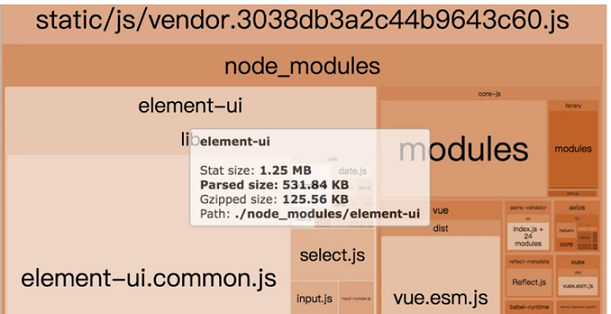

### 1 什么是webpack
构建就是把源代码转换成线上可执行的js、css、html
- 代码转换ts->js、less->css等
- 文件优化 压缩js、css、html 合并图片
- 代码分割 提取多个页面的公共代码 提取首屏不絮语奥执行的代码异步加载
- 模块合并
- 自动刷新 监听本地源代码变化 自动重新构建 刷新浏览器
- 代码校验 在代码提交到仓库前校验代码 以及单元测试是否通过
- 自动发布 更新完代码后 自动构建出现上发布代码并传输给发布系统
- 删除死代码 Tree-Shaking
- 按照路由拆分代码，实现按需加载，提取公共代码
- 利用CDN加速。在构建过程中，将引用的静态资源路径修改为 CDN 上对应的路径
- 压缩代码。删除多余的代码、注释、简化代码的写法等等方式

### 2 核心概念
- entry：入口，webpack执行构建的第一步将从entry开始，可抽象成输入,单入口写成字符串,多入口写成对象

- output：输出结果，在webpack经过一系列处理并得出最终想要的代码后输出结果，单出口filename和path,多出口使用占位符`[name].js`

- loader：模块转换器，用于把原生不支持的模块转换成有效的模块，并添加到依赖图中,原生只支持js和json，其本质是一个函数 

    > babel-loader
    >
    > css-loader
    >
    > less-loader
    >
    > ts-loader
    >
    > file-loader
    >
    > raw-loader
    >
    > thread-loader

- plugin：扩展插件，在Webpack构建流程中的特定时机注入扩展逻辑来改变构建结果或做你想要的事情，增强webpack功能，作用于整个构建过程，可以简单理解为webpack不能做的事情plugin可以做

    > CommonsChunkPlugin
    >
    > CleanWebpackPlugin
    >
    > ExractTextWebpackPlugin
    >
    > CopyWebpackPlugin
    >
    > HtmlWebpackPlugin
    >
    > UglifyjsWebpackPlugin
    >
    > ZipWebpackPlugin

- mode: production、development、none

- module：在webpack里一切皆模块，一个模块（css、font、image）对应着一个文件,webpack会从配置的entry开始递归找出所有依赖的模块

- chunk：代码块，一个Chunk由多个模块组合而成，用于代码合并与分割


### 3 how to use
1. mkdir webpack-demo
2. cd webpack-demo
3. npm init -y
4. npm i webpack webpack-cli webpack-dev-server(自动打包、监视文件改变、刷新浏览器) -D
5. 创建和配置webpack.config.js(可以修改名字)
6. 配置npm scripts
    ```bash
    "scripts": {
        //--open --hot --inline --port --config ./webpack.dev.config.js
        "build": "webpack --config webpack.config.js", //真实文件
        "dev": "webpack-dev-server --open --color --port 9999", //内存
        "dev-simple": "webpack-dev-server",
        "watch": "webpack --watch"
    }
    ```
7. 安装plugin和loader
    ```bash
    npm i html-webpack-plugin clean-webpack-plugin -D
    npm i babel-loader babel-core babel-preset-env (babel-loader)
    npm i babel-polyfill --D  (默认只转换语法,这个转换API )
    npm i babel-plugin-transform-runtime --D  (解决重复引用工具方法导致打包js过大的问题)
    npm i babel-runtime --save  (解决重复引用工具方法导致打包js过大的问题)
            cacheDirectory: true   //给babel增加打包缓存目录
    ```

    ```bash
    npm i --D style-loader css-loader  (css-loader)
    npm i --D npm i file-loader url-loader  (image-loader)
    npm i --D less-loader  less(less-loader)
    npm i --D vue-loader vue-template-compiler(vue-loader)
    ```

### 4 webpack使用

#### 1 resolve es6

- `npm i @babel/core @babel/preset-env babel-loader -D`

- ```bash
    //.babelrc
    {
        "presets": [
            "@babel/preset-env"
        ]
    }
    ```

- ```bash
    //webpack.config.js
    module: {
        rules: [
            {
                test: /.js$/,
                use: 'babel-loader'
            }
        ]
    }
    ```

#### 2 resolve jsx(@babel/core、babel-loader已安装,并且webpack.config.js配置)

- `npm i react react-dom @babel/preset-react -D`
- `"@babel/preset-react"`

#### 3 resolve css

- npm i style-loader css-loader -D`

- ```
    module: {
        rules: [
            {
                test: /.css$/,
                //注意顺序
                use: ['style-loader','css-loader']
            }
        ]
    }
    ```

#### 4 resolve less or sass

- `npm i less less-loader -D`

- ```
    module: {
        rules: [
            {
                test: /.less$/,
                //注意顺序
                use: ['style-loader','css-loader','less-loader']
            }
        ]
    }
    ```

#### 5 file-loader

- `npm i file-loader -D`

- ```
    //resolve img and font
    module: {
        rules: [
            {
                test: /.(png|jpg|gif|jpeg)$/,
                use: 'file-loader'
            },
            {
                test: /.(woff|woff2|eot|ttf|otf)$/,
                use: 'file-loader'
            }
        ]
    }
    ```

#### 6 url-loader

```
//也可以打包图片和字体，区别就是对小于一定体积的文件直接转成base64
module: {
    rules: [
        {
            test: /.(woff|woff2|eot|ttf|otf)$/,
            use: {
                loader: 'url-loader',
                options: {
                    limit:10240
                }
            }
        }
    ]
}
```

#### 7 不打包第三方js

1. jQuery引入到index.html

2. 配置文件不要打包jquery到main.js

    ```bash
    externals: {
       //key 包名
       //value 全局jQuery导出的接口对象
       jquery: 'jQuery',
       vue: 'Vue',
       element-ui: 'ELEMENT',
       axios: 'axios'
    }
    ```

#### 8 source map

#### 9 resolve

##### extensions

指定extension之后可以不用在`require`或是`import`的时候加文件扩展名,会依次尝试添加扩展名进行匹配

```javascript
resolve: {
    //自动补全后缀，注意第一个必须是空字符串,后缀一定以点开头
    extensions: [" ",".js",".css",".json"],
```

##### alias

配置别名可以加快webpack查找模块的速度

- 每当引入jquery模块的时候，它会直接引入jqueryPath,而不需要从node_modules文件夹中按模块的查找规则查找
- 不需要webpack去解析jquery.js文件

```javascript
const bootstrap=path.join(__dirname,'node_modules/bootstrap/dist/css/bootstrap.css')

resolve: {
    alias: {
        'bootstrap': bootstrap
    }
}
```

### 5 webpack.config.js

#### 1 watch(需要手动刷新浏览器)

- watch:true

- package.js 加 --watch

    ```bash
    //只有开启watch,watchOptions才有意义
    watchOptions: {
        ignored: /node_modules/, //支持正则
        aggregateTimeout: 300, //默认等待时间
        poll: 1000 //默认每秒1000次
    }
    ```

### 6 webpack-dev-server

```javascript

const webpack = require('webpack')

mode:development,
plugins: [
    new webpack.HotModuleReplacementPlugin()
],
devServer: {
    contentBase: './dist',
    hot: true
}
```


 ```javascript
const path = require('path')
const HtmlWebpackPlugin = require('html-webpack-plugin')
//打包前先清空输出目录
const CleanWebpackPlugin = require('clean-webpack-plugin')
module.exports = {
    //多入口单出口
    //entry: ['./src/index.js', './src/a.js']
    entry: 'xxxx.js', //相对路径
    output: {
    filename: 'bundle.[hash:8].js',
    //publicPath : 'dist/js/'  处理图片路径
    //必须是绝对路径
    path: path.resolve(__dirname, 'dist/js')
    },
    mode: 'development',
    devServer: {
        contentBase: path.join(__dirname, 'dist'),
        port: 9000，
        compress: true,
        open: true
    },
    //默认只模块js
    //style-loader css-loader -D //css-loader自带hot
    //less less-loader -D
    //stylus stylus-loader -D
    //node-sass sass-loader -D
    module: {
        //属性名后面版本roles
          loaders: [
             {
                 test: /\.css$/,
                 //use: [
                 //  'style-loader',
                 //  'css-loader'
                 //]
                 //对象配置
                 //use: [
                 //  {loader: 'style-loader', options:{}}
                 //  {loader: 'css-loader', options:{}}
                 //]
                 //顺序从右往左
                 loader: 'style-loader!css-loader'，
                 include:path.join(__dirname,'./src'),
                 exclude:/node_modules/
             },
             {
                 //file-loader 解决CSS等文件中的引入图片路径问题
                 //url-loader 当图片较小的时候会把图片BASE64编码，大于limit参数的时候还是使用file-loader进行拷贝
                 test: /\.(jpg|png|gif|svg)$/,
                 //?后面加属性
                 //若图片大于limit 生成文件
                 //若图片小于生成base64,会有30%增大
                 //建议比较小的图片用base64
                 //options: {
                    //limit: 1024,
                    //指定打包后图片位置
                    //outputPath: 'images/'
                 //}
                 loader: 'url-loader?limit=4096'
              },
              {
                  test: /\.less$/,
                  loader: 'style-loader!css-loader!less-loader'
               },
               {
                   test: /\.js$/,
                   loader: 'babel-loader',
                   exclude: /node_modules/,
                   options: {
                       presets: ['env'], //处理关键字
                       plugins: ['transform-runtime'] //处理函数
                   }
                },
                {
                    test: /\.vue$/,
                    loader: 'vue-loader'
                }
          ]
    },
    plugins: [
        //./src/index.html需要存在
        new HtmlWebpackPlugin({
            template: './src/index.html'，
            title: 'test webpack',
            hash: true,
            minify: {
                removeAttributeQuotes: true,
                collapseWhitespace: true
            }
        }),
        //support regex
        new CleanWebpackPlugin(['./dist', 'a']))
    ],
    resolve:{}
}

import './xxx.css'
import xxx from './xxx.js'
import img from './xxx.jpg'
 ```

```javascript
//package.json
"script": {
	//--open --hot --inline --port
	"dev": "webpack-dev-server --open --config ./webpack.dev.config.js"
    "dev": "webpack --config ./webpack.dev.config.js"
    "prod": "webpack --config ./webpack.prod.config.js"
}
开发安装  npm i
生产安装  npm i --production
```

#### 多入口多出口 对应html引用对应的js
```javascript
entry: {
    index: './src/index.js',
    a: './src/a.js'
}
output: {
    filename: '[name].[hash:8].js',
}
plugins: [
    //./src/index.html需要存在
    new HtmlWebpackPlugin({
        filename: 'a.html', //default filename is index
        template: './src/index.html'，
        title: 'test webpack',
        hash: true,
        minify: {
            removeAttributeQuotes: true,
            collapseWhitespace: true
        },
        chunks: ['index']
    }),
    new HtmlWebpackPlugin({
        filename: 'b.html',
        template: './src/index.html'，
        title: 'test webpack',
        hash: true,
        minify: {
            removeAttributeQuotes: true,
            collapseWhitespace: true
        },
        chunks: ['a']
    })
]
```

#### 只更新局部 不刷新界面 默认刷新界面，只能hot组件和css
```javascript
const webpack = require('webpack')
module.exports = {
    devServer: {
        hot: true
    }
    plugins: [
        new webpack.HotModuleReplacementPlugin()
    ]
}

//index.js
if (module.hot) {
    module.hot.accept()
}
```

#### 抽离style from js to css link文件
```javascript
//MiniCssExtractPlugin
const ExtractTextWebpackPlugin = require('extract-text-webpack-plugin')
module: {
    rules: [
        {
            test: /\.css$/,
            //顺序从右往左
            use: ExtractTextWebpackPlugin.extract({
                use: [
                    {loader: 'css-loader', options:{}}
                ]
            })
        },
        {
            test: /\.less$/,
            use: ExtractTextWebpackPlugin.extract({
                use: [
                    {loader: 'css-loader'},
                    {loader: 'less-loader'}
                ]
            })
        }
    ],
    plugins: [
        new ExtractTextWebpackPlugin({
            filename: 'css/index.css'
        })
    ]
}
```

#### 抽离css和less到单独文件
```javascript
const ExtractTextWebpackPlugin = require('extract-text-webpack-plugin')
const lessExtract = new ExtractTextWebpackPlugin('css/less.css')
const cssExtract = new ExtractTextWebpackPlugin('css/css.css')
module: {
    rules: [
        {
            test: /\.css$/,
            use: cssExtract.extract({
                use: [
                    {loader: 'css-loader'}
                ]
            })
        },
        {
            test: /\.less$/,
            use: lessExtract.extract({
                use: [
                    {loader: 'css-loader'},
                    {loader: 'less-loader'}
                ]
            })
        }
    ],
    plugins: [
        lessExtract,
        cssExtract
    ]
}
```

#### 解决抽离后css不热更新问题，开发时需要
```javascript
const lessExtract = new ExtractTextWebpackPlugin({
    filename: 'css/less.css',
    disable: true
})
use: cssExtract.extract({
    fallback: 'style-loader',
    use: [
        {loader: 'css-loader', options:{}}
    ]
})
```

#### 删除没用的css
```javascript
//npm i purifycss-webpack purify-css glob -D
const PurifycssWebpack = require('purifycss-webpack')
const glob = require('glob')

plugins: [
    //删除没用到的css，一定绝对路径，一定放到HtmlWebpackPlugin之后
    new PurifycssWebpack({
        paths: glob.sync(path.resolve(src/*.html))
    })
]
```

#### css加前缀(如transform)
```javascript
//npm i postcss-loader autoprefixer -D
rules: [
    {
        test: /\.css$/,
        use: cssExtract.extract({
            use: [
                {loader: 'css-loader'}
                {loader: 'postcss-loader'}
            ]
        })
    }
]

//create postcss.config.js
module.exports = {
    plugin: [
        require('autoprefixer')
    ]
}
```

#### 拷贝静态文件
```javascript
const CopyWebpackPlugin = require('copy-webpack-plugin')
plugins: [
    new CopyWebpackPlugin([
        {
            from: './src/doc',
            to: 'public'
        }
    ])
],
```

#### other
- ProvidePlugin
- expose-loader

#### 在html中使用图片
```javascript
//npm i html-withimg-loader -D
<div class="img-container "></div>

{
    test:/\.(html|html)$/,
    use:'html-withimg-loader',
    include:path.join(__dirname,'./src'),
    exclude:/node_modules/
}
```

### 7 webpack-bundle-analyzer`npm run build --report`


