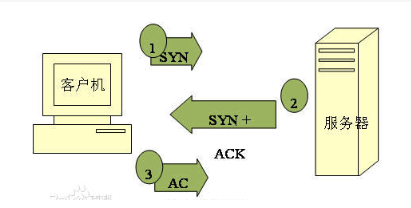
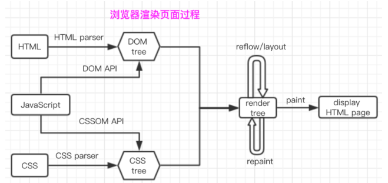

### TPC
TCP：Transmission Control Protocol， 传输控制协议，是一种面向连接的、可靠的、基于字节流的传输层通信协议。

这其实就是一种最简单的连接通信，两人通过一根线连接起来，声音从这边的纸杯发出通过线传输到另一个纸杯接收，扩展到现在家家户户都有的固定电话也是如此，它的通信也是建立在双方可接受并且信任的基础上进行，如：

>A拿起电话，拨通0775-6532122，开始呼叫B
>
>B听到电话声响起，拿起电话，此时A收到B已经拿起电话的声音
>
>双方开始讲话

回到我们的tcp协议，其实它和上面所说的电话协议差不多，只不过电话的协议是服务于电话通信，而tcp是服务于网络通讯的一种协议，类似的，通讯双方建立一次tcp连接，也需要经过三个步骤（握手）

>客户端发送syn包(syn=j)到服务器，并进入SYN_SEND状态，等待服务器确认
>
>服务器收到syn包，必须确认客户的SYN（ack=j+1），同时自己也发送一个SYN包（syn=k），即SYN+ACK包，此时服务器进入>SYN_RECV状态
>
>客户端收到服务器的SYN＋ACK包，向服务器发送确认包ACK(ack=k+1)，此包发送完毕，客户端和服务器进入ESTABLISHED状态，完成三次握手。

>SYN:synchronous 建立联机
>
>ACK:acknowledgement 确认
>
>SYN_SENT:请求连接
>
>SYN_RECV:服务端被动打开后,接收到了客户端的SYN并且发送了ACK时的状态。再进一步接收到客户端的ACK就进入ESTABLISHED状态。

**tcp在握手过程中并不携带数据，(就像你打电话给酒店订房时，在确认对方是酒店客服人员之前，你也不会马上把身份证号码报给他吧？)，而是在三次握手完成之后，才会进行数据传送**

至于它的应用场景，其实是根据它本身的特点而定的，比如对网络通讯质量有要求，需要保证数据准确性时，就需要用到TCP协议了，如HTTP、ftp等文件传输协议、或一些邮件传输协议（SMTP、pop等）

### UDP
UDP ：User Datagram Protocol 用户数据报协议
相比于TCP的面向连接需要反复确认的繁琐步骤，UDP是一中性格特立独行并且主观性超强的非面向连接的协议，使用udp协议经常通信并不需要建立连接，它只是负责把数据尽可能快的发送出去，简单粗暴，并且不可靠，而在接收端，UDP把每个消息断放入队列中，接收端程序从队列中读取数据。

有人会说，UDP协议这么不可靠，为啥还会造出来呢？
话说回来，天底下没有无用之人，只有你不懂用的人而已，虽然UDP不可靠，但是它的传输速度快，效率高，在一些对数据准确性要求不高的场景，UDP就变得很有用了，比如qq语音、qq视频。

### 套接字socket
为什么要说嵌套字？
那是因为就像前面说的，TCP或UDP都是一种协议，也就是计算机网络通信中在传输层的一种协议，简单地说，就是一种约定，就像合作双方的合同一样，然后合同是死的，只有履行合同才是实质性的行动，因此无论是TCP还是UDP要产生作用，都需要有实际的行为去执行才能体现协议的作用，
那么，有什么办法让这些协议作用呢？
这就要说到socket了。

socket：也叫嵌套字 ，是一组实现TCP/UDP通信的接口API，也就是说无论TCP还是UDP，通过对socket的编程，都可以实现TCP/UCP通信，作为一个通信链的句柄，它包含网络通信必备的5种信息：

>连接使用的协议
>
>本地主机的IP地址
>
>本地进程的协议端口
>
>远地主机的IP地址
>
>远地进程的协议端口

可见，socket包含了通信本方和对方的ip和端口以及连接使用的协议（TCP/UDP）。通信双方中的一方（暂称：客户端）通过socket（嵌套字）对另一方（暂称：服务端）发起连接请求，服务端在网络上监听请求，当收到客户端发来的请求之后，根据socket里携带的信息，定位到客户端，就相应请求，把socket描述发给客户端，双方确认之后连接就建立了。
因此套接字之间的连接过程有三个步骤：

>服务器监听:服务器实时监控网络状态等待客户端发来的连接请求
>
>客户端请求:客户端根据远程主机服务器的IP地址和协议端口向其发起连接请求
>
>连接确认:服务端收到套接字的连接请求之后，就响应请求，把服务端套接字描述发给客户端，客户端收到后一旦确认，则双方建立连接，进行数据交互

通常情况下socket连接就是TCP连接，因此socket连接一旦建立,通讯双方开始互发数据进行通信，直到其中一方或双方断开连接为止。

socket在即时通讯（qq等各种聊天软件）等应用上应用广泛。

### HTTP协议
HTTP协议：Hypertext Transfer Protocol 也叫超文本传送协议 ，它是一种基于TCP/IP协议栈、在表示层和应用层上的协议（TCP在传输层的协议），通俗一点说就是：

>TCP/IP是位于传输层上的一种协议，用于在网络中传输数据
>
>HTTP协议是应用层协议，基于TCP协议，用于包装数据，程序使用它进行通信，可以简单高效的处理通信中数据的传输和识别处理

而在现在应用非常广泛的HTTP连接则是建立在HTTP协议上的、处于应用层中的一种具体应用。
上面说到socket连接一旦建立就保持连接状态，而HTTP连接则不一样，它基于tcp协议的短连接，也就是客户端发起请求，服务器响应请求之后，连接就会自动断开，不会一直保持。

### URL
前面讲了tcp、udp、http...等等都是为了讲一个具体问题而做的知识点铺垫，那就是：我们开发的web应用中请求的发起和响应，是一个怎样的底层原理。
我们都知道，web应用绝大部分都是通过HTTP来进行请求的，而URL则是HTTP用来做连接建立和传输数据的一种具体实现，因此在此要简单讲一下URL。

URL：Uniform Resource Locator 统一资源定位符。说白了就是网络上用来标识具体资源的一个地址，包含了用户查找该资源的信息，HTTP使用它来传输数据和建立连接
一个URL有以下组成部分：

>协议
>
>服务器地址（域名或IP+端口）
>
>路径
>
>文件名

>https://是一种协议 当然，HTTP也是 ftp也是...
>
>www.baidu.com是服务器地址，当然你知道百度的IP也可以,例如我用ping命令得到百度的ip
>
>14.215.177.39，那么我可以用http://14.215.177.39打开百度
>
>index.html包含了路径和文件名，当然通常index.html是可以省略的，所以你打开百度时，并没有看到这个

### DNS

DNS:Domain Name Server，域名服务器。
是进行域名(domain name)和与之相对应的IP地址 (IP address)转换的服务器。DNS中保存了一张域名(domain name)和与之相对应的IP地址 (IP address)的表，以解析消息的域名。
在平时我们进行开发时，后端提供的接口地址通常是有IP地址加上端口号（8080什么鬼的）组成的，但是当我们把网站发布出去时，通常都需要把IP改成用域名。
为什么呢？
你想想哦，比如谷歌的地址是89.12.21.221:9090,百度的地址是132.21.33.221:8766。。。
这么一看你根本没有欲望是记住这些乱七八糟的数字吧？
但是域名就不一样了，比如谷歌的google.com，百度的baidu.com 是不是一遍就记住了呢？
所以为了处理这个问题，就需要用域名去映射IP地址，达到易记易用的目的。

因此，当用户在浏览器输入https://www.baidu.com回车时，它经历了以下步骤：

>浏览器根据地址去本身缓存中查找dns解析记录，如果有，则直接返回IP地址，否则浏览器会查找操作系统中（hosts文件）是否有该域名的dns解析记录，如果有则返回
>
>如果浏览器缓存和操作系统hosts中均无该域名的dns解析记录，或者已经过期，此时就会向域名服务器发起请求来解析这个域名
>
>请求会先到LDNS（本地域名服务器），让它来尝试解析这个域名，如果LDNS也解析不了，则直接到根域名解析器请求解析
>
>根域名服务器给LDNS返回一个所查询余的主域名服务器（gTLDServer）地址
>
>此时LDNS再向上一步返回的gTLD服务器发起解析请求
>
>gTLD服务器接收到解析请求后查找并返回此域名对应的Name Server域名服务器的地址，这个Name Server通常就是你注册的域名服务器（比如阿里dns、腾讯dns等）
>
>Name Server域名服务器会查询存储的域名和IP的映射关系表，正常情况下都根据域名得到目标IP记录，连同一个TTL值返回给DNS Server域名服务器
>
>返回该域名对应的IP和TTL值，Local DNS Server会缓存这个域名和IP的对应关系，缓存的时间有TTL值控制
>
>把解析的结果返回给用户，用户根据TTL值缓存在本地系统缓存中，域名解析过程结束

### HTTP请求发起和响应
如果这篇文章的主题是网络通信，那到这里已经可以告一段落了，但今天我们要讲的是web应用中请求的发起和响应以及页面渲染的原理，因此以上只是铺垫。
在一个web程序开发中，一般都有前端和后端之分，前端负责向后端请求数据和展示页面，后端负责接收请求和做出响应发回给前端，他们之间的协作的桥梁是什么呢？
是API
API是什么？不就是一个URL吗？
URL又是啥呢？上面说到就是HTTP连接的一种具体的载体
因此，
无论对于前端或者是后端，理解HTTP，无论是对自身对编程的理解，还是和同事协作，都是好处大大的，
下面，根据上面各个知识点的理解，我们来整理一下并解决一下上面提到的第一个问题：
从用户输入URL，到浏览器呈现给用户页面，经过了什么过程

>用户输入URL，浏览器获取到URL
>
>浏览器(应用层)进行DNS解析（如果输入的是IP地址，此步骤省略）
>
>根据解析出的IP地址+端口，浏览器（应用层）发起HTTP请求，请求中携带（请求头header（也可细分为请求行和请求头）、请求体body）

>header包含：
>
>请求的方法（get、post、put..）
>
>协议（http、https、ftp、sftp...）
>
>目标url（具体的请求路径已经文件名）
>
>一些必要信息（缓存、cookie之类）
>
>body包含：
>
>请求的内容
>
>请求到达传输层，tcp协议为传输报文提供可靠的字节流传输服务，它通过三次握手等手段来保证传输过程中的安全可靠。通过对大块数据的分割成一个个报文段的方式提供给大量数据的便携传输
>
>到网络层， 网络层通过ARP寻址得到接收方的Mac地址，IP协议把在传输层被分割成一个个数据包传送接收方
>
>数据到达数据链路层，请求阶段完成
>
>接收方在数据链路层收到数据包之后，层层传递到应用层，接收方应用程序就获得到请求报文
>
>接收方收到发送方的HTTP请求之后，进行请求文件资源（如HTML页面）的寻找并响应报文
>
>发送方收到响应报文后，如果报文中的状态码表示请求成功，则接受返回的资源（如HTML文件），进行页面渲染

### 页面的渲染

当一个请求的发起和响应都完成之后，浏览器就会收到响应内容，但浏览器收到的是一串串的代码或URL链接，怎么把这些代码转化成用户可以看得懂的界面呈现出来，就是浏览器的工作了。
目前市场上的浏览器已经不下百种，各个浏览器根据内核又可以分成几大类，每一类浏览器对页面的渲染原理和过程有所差异。

但总的来说，各个浏览器渲染页面都基本遵循如下图的流程：

>HTML parser：HTML解析器，其本质是将HTML文本解释成DOM tree
>
>CSS parser：CSS解析器，其本质是讲DOM中各元素对象加入样式信息
>
>JavaScript引擎：专门处理JavaScript脚本的虚拟机，其本质是解析JS代码并且把逻辑（HTML和CSS的操作）应用到布局中，从而按程序要的要求呈现相应的结果
>
>DOM tree:文档对象模型树，也就是浏览器通过HTMLparser解析HTML页面生成的HTML树状结构以及相应的接口
>
>render tree：渲染树，也就是浏览器引擎通过DOM Tree和CSS Rule Tree构建出来的一个树状结构，和dom tree不一样的是，它只有要最终呈现出来的内容，像<head>或者带有display:none的节点是不存在render tree中的
>
>layout：也叫reflow 重排，渲染中的一种行为。当rendertree中任一节点的几何尺寸发生改变了，render tree都会重新布局
>
>repaint：重绘，渲染中的一种行为。render tree中任一元素样式属性（几何尺寸没改变）发生改变了，render tree都会重新画，比如字体颜色、背景等变化

所以，根据关键词汇的解释以及顺着流程图的流程，可以总结出，浏览器解析渲染页面主要包括以下过程：

>浏览器通过HTMLParser根据深度遍历的原则把HTML解析成DOM Tree
>
>将CSS解析成CSS Rule Tree（CSSOM Tree）
>
>根据DOM树和CSSOM树来构造render Tree
>
>layout：根据得到的render tree来计算所有节点在屏幕的位置
>
>paint：遍历render树，并调用硬件图形API来绘制每个节点
