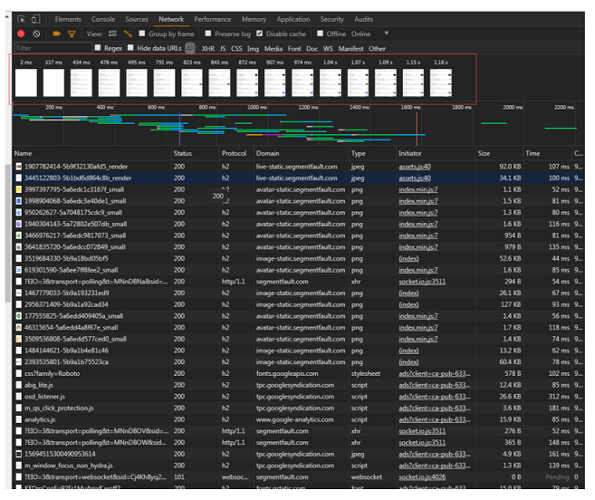
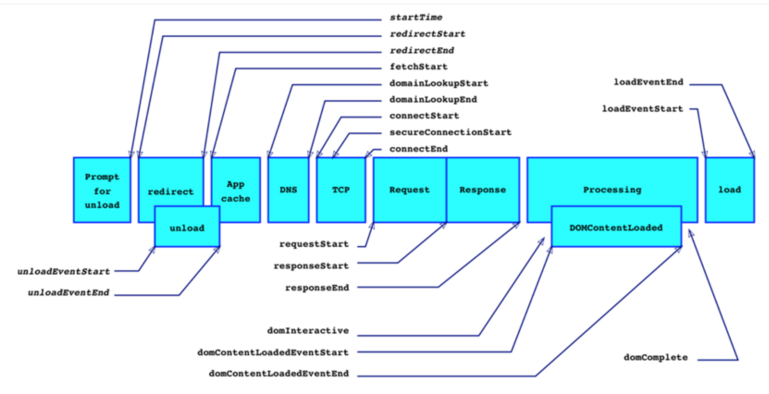
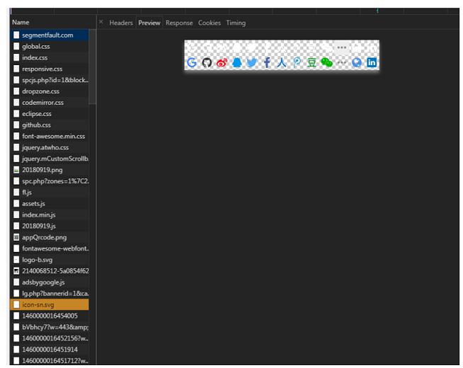
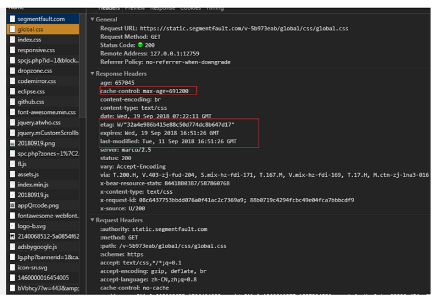
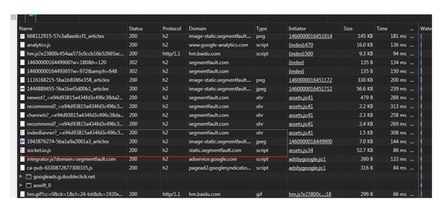
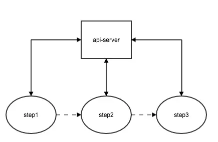
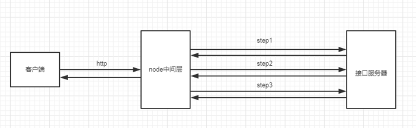

### 页面性能分析与测速

#### 性能分析

- [Chrome Devtool Performance](https://zhuanlan.zhihu.com/p/29879682)
- [google PageSpeed Insights](https://developers.google.com/speed/pagespeed/insights/?hl=zh-CN&utm_source=PSI&utm_medium=incoming-link&utm_campaign=PSI)

#### 测速上报

- 测速的关键指标

一般来说,我们打开一个页面,期望的是页面的响应和呈现速度和流畅的交互体验。所以,页面的测速指标可以大致概括为： 白屏时间,首屏时间,可交互时间



- 如何计算

window.performance 是 w3c 提供的用来测量网页和 Web 应用程序的性能 api。其中 performance timing 提供了延时相关的性能信息,可以高精度测量网站性能。timing 的整体结构如下图所示:



- 白屏时间=页面开始展示的时间点(PerformanceTiming.domLoading)-开始请求时间点(PerformanceTiming.navigationStart)
- 首屏时间=首屏内容渲染结束时间点(视业务具体情况而定)-开始请求时间点(PerformanceTiming.navigationStart)
- 可交互时间=用户可以正常进行事件输入时间点（PerformanceTIming.domInteractive）-开始请求时间点(PerformanceTiming.navigationStart)

### 页面性能优化

关于性能优化,涉及的方向太广了,从网络请求到数据库,整条链路都有其可优化的地方。这里我只总结一下前端比较需要关注的一些优化点。这里从两个维度进行讨论：

#### 网络请求优化(宗旨:减少 HTTP 请求次数和大小)

从上文可知,浏览器渲染网页的前提是下载相关的资源,html 文档、css 文档、图片资源等。这些资源是客户端基于 HTTP 协议,通过网络请求从服务器端请求下载的,大家都知道,有网络,必定有延迟,而资源加载的网络延迟,是页面缓慢的一个重要因素。所以,如何使资源更快、更合理的加载,是性能优化的必修课

1. 静态资源

- 拼接、合并、压缩、制作雪碧图、懒加载

由于 HTTP 的限制,在建立一个 tcp 请求时需要一些耗时,所以,我们对资源进行合并、压缩,其目的是减少 http 请求数和减小包体积,加快传输速度。

- 拼接、合并、压缩： 在现代的前端工程化开发流程中,相信大家都有使用 webpack 或者 gulp 等打包工具对资源（js、css、图片等）进行打包、合并、去重、压缩。在这基础上,我们需要根据自身的业务,合理的对公共代码,公共库,和首屏代码进行单独的打包压缩
- 按需加载

```javascript
// about.js
export default render

// main.js
document.getElementById('about').addEventListener(
	'click',
	(e) => {
		import('./about').then(({ default: render }) => {
			// 渲染页面
			render()
		})
	},
	!1
)
```

- 雪碧图：对于图片资源,我们可以制作雪碧图,即对一些页面上的 icon 和小图标,集成到一张图片上,css 使用背景图定位来使用不同的 icon,这样做可以有效的减少图片的请求数,降低网络延迟。而它的缺点也很明显,由于集成在同一张图片上,使用其中的一个图标,就需要将整张图片下载下来,所以,雪碧图不能盲目的使用



- 缓存（HTTP 缓存、浏览器缓存、应用缓存）

缓存的范围很广,比如协议层的 DNS 解析缓存、代理服务器缓存,到客户端的浏览器本地缓存,再到服务端的缓存。一个网络链路的每个环节都有被缓存的空间。缓存的目的是简化资源的请求路径,比如某些静态资源在客户端已经缓存了,再次请求这个资源,只需要使用本地的缓存,而无需走网络请求去服务端获取



- 分片
  分片指得是将资源分布到不同的主机,这是为了突破浏览器对同一台主机建立 tcp 连接的数量限制,一般为 6~8 个。现代网站的资源数量有 50~100 个很常见,所以将资源分布到不同的主机上,可以建立更多的 tcp 请求,降低请求耗时,从而提升网页速度



1. 升级协议：

可以升级我们的网络协议,比如使用 HTTP2,quic 之类的,代替之前的 http1.1,从协议层优化资源的加载。可以参考我之前的文章。

2. 业务数据
   虽然做好了静态数据的加载优化,但是还是会出现一种情景,即静态数据已经加载完毕,但页面还是在转菊花,页面还没有进入可交互状态,这是因为现如今的网站开发模式,前后端分离已经成为主流,不再由 php 或 jsp 服务端渲染前端页面,而是前端先加载静态数据,再通过 ajax 异步获取服务器的数据,进而重新渲染页面。这就导致了异步从接口获取数据也是网页的一个性能瓶颈。响应缓慢,不稳定的接口,会导致用户交互体验极差,页面渲染速度也不理想。比如点击一个提交数据的按钮,接口速度慢,页面上菊花需要转好久才能交换完数据。

- 首屏直出
  为了提升用户体验,我们认为首屏的渲染速度是极为重要的,用户进来页面,首页可见区域的加载可以由服务端渲染,保证了首屏加载速度,而不可见的部分则可以异步加载,甚至做到子路由页面的预加载。业界已经有很多同构直出的方案,比如 vue 的 nuxt , react 的 beidou 等。

- 接口合并

前端经常有这样的场景,完成一个功能需要先请求第一个接口获得数据,然后再根据数据请求第二个接口获取第二个数据,然后第三、第四...前端通常需要通过 promise 或者回调,一层一层的 then 下去,这样显然是很消耗性能的



通常后台接口都按一定的粒度存在的,不可能一个接口满足所有的场景。这是不可避免的,那么如何做到只发送一个请求就能实现功能呢？有一种不错的方案是,代理服务器实现请求合并,即后台的接口只需要保证健壮和分布式,而由 nodejs（当然也可以使用其他语言）建设一层代理中间层,流程如下图所示：



前端只需要按找约定的规则,向代理服务器发起一次请求,由代理服务器向接口服务器发起三次请求,再将目标数据返回给客户端。这样做的好处是：一方面是代理服务器代替前端做了接口合并,减少了前端的请求数量；另一方面代理服务器可以脱离 HTTP 的限制,使用更高效的通信协议与服务器通信

3. 避免使用空的 href 和 src

   当 link 标签的 href 属性为空,或 script、 img、iframe 标签的 src 属性为空时,浏览器在渲染的过程中仍会将 href 属性或 src 属性中的空内容进行加载,直至加载失败,这样就阻塞了页面中其他资源的下载进程,而且最终加载到的内容是无效的,因此要尽量避免

4. 将 CSS 或 JavaScript 放到外部文件中,避免使用 script 标签直接引入

   在 HTML 文件中引用外部资源可以有效利用浏览器的静态资源缓存

5. 为 HTML 指定 Cache-Control 或 Expires

   为 HTML 内容设置 Cache-Control 或 Expires 可以将 HTML 内容缓存起来,避免频繁向服务器端发送请求。前面讲到,在页面 Cache-Control 或 Expires 头部有效时,浏览器将直接从缓存中读取内容,不向服务器端发送请求。比如：

   `<meta http-equiv="Cache -Control" content="max-age=7200" />`

6. 合理设置 Etag 和 Last-Modified

   合理设置 Etag 和 Last-Modified 使用浏览器缓存,对于未修改的文件,静态资源服务器会向浏览器端返回 304,让浏览器从缓存中读取文件,减少 Web 资源下载的带宽消耗并降低服务器负载

7. 减少页面重定向

   页面每次重定向都会延长页面内容返回的等待延时,一次重定向大约需要 600 毫秒的时间开销,为了保证用户尽快看到页面内容,要尽量避免页面重定向。

8. 使用静态资源分域存放来增加下载并行数

   浏览器在同一时刻向同一个域名请求文件的并行下载数是有限的,因此可以利用多个域名的主机来存放不同的静态资源,增大页面加载时资源的并行下载数,缩短页面资源加载的时间。通常根据多个域名来分别存储 JavaScript、CSS 和图片文件

9. 使用静态资源 CDN 来存储文件

   如果条件允许,可以利用 CDN 网络加快同一个地理区域内重复静态资源文件的响应下载速度,缩短资源请求时间

10. 使用可缓存的 AJAX

    对于返回内容相同的请求,没必要每次都直接从服务端拉取,合理使用 AJAX 缓存能加快 AJAX 响应速度并减轻服务器压力。比如：

    ```javascript
    const cachedFetch = (url, options) => {
    	let cacheKey = url

    	let cached = sessionStorage.getItem(cacheKey)
    	if (cached !== null) {
    		let response = new Response(new Blob([cached]))
    		return Promise.resolve(response)
    	}

    	return fetch(url, options).then((response) => {
    		if (response.status === 200) {
    			let ct = response.headers.get('Content-Type')
    			if (ct && (ct.match(/application\/json/i) || ct.match(/text\//i))) {
    				response
    					.clone()
    					.text()
    					.then((content) => {
    						sessionStorage.setItem(cacheKey, content)
    					})
    			}
    		}
    		return response
    	})
    }
    ```

11. 使用 CDN Combo 下载传输内容

    CDN Combo 是在 CDN 服务器端将多个文件请求打包成一个文件的形式来返回的技术,这样可以实现 HTTP 连接传输的一次性复用,减少浏览器的 HTTP 请求数,加快资源下载速度。比如：

12. 使用 GET 来完成 AJAX 请求

    使用 XMLHttpRequest 时,浏览器中的 POST 方法发送请求首先发送文件头,然后发送 HTTP 正文数据。而使用 GET 时只发送头部,所以在拉取服务端数据时使用 GET 请求效率更高

13. 减少 Cookie 的大小并进行 Cookie 隔离

    HTTP 请求通常默认带上浏览器端的 Cookie 一起发送给服务器,所以在非必要的情况下,要尽量减少 Cookie 来减小 HTTP 请求的大小。对于静态资源,尽量使用不同的域名来存放,因为 Cookie 默认是不能跨域的,这样就做到了不同域名下静态资源请求的 Cookie 隔离

14. 缩小 favicon.ico 并缓存

    这样有利于 favicon.ico 的重复加载,因为一般一个 Web 应用的 favicon.ico 是很少改变的

15. 推荐使用异步 JavaScript 资源

    异步的 JavaScript 资源不会阻塞文档解析,所以允许在浏览器中优先渲染页面,延后加载脚本执行。使用 async 时,加载和渲染后续文档元素的过程和 main.js 的加载与执行是并行的。使用 defer 时,加载后续文档元素的过程和 main.js 的加载也是并行的,但是 main.js 的执行要在页面所有元素解析完成之后才开始执行。

    使用异步 Javascript,加载的先后顺序被打乱,要注意依赖问题
    `defer`属性是并发下载，延迟同步执行,`async`属性是并发下载，异步执行

    ```html
    <script src="main.js" defer></script>
    <script src="main.js" async></script>
    ```

16. 消除阻塞渲染的 CSS 及 JavaScript

    对于页面中加载时间过长的 CSS 或 JavaScript 文件,需要进行合理拆分或延后加载,保证关键路径的资源能快速加载完成

17. 避免使用 CSS import 引用加载 CSS

    CSS 中的@import 可以从另一个样式文件中引入样式,但应该避免这种用法,因为这样会增加 CSS 资源加载的关键路径长度,带有@import 的 CSS 样式需要在 CSS 文件串行解析到@import 时才会加载另外的 CSS 文件,大大延后 CSS 渲染完成的时间

18. 首屏数据请求提前,避免 JavaScript 文件加载后才请求数据

    针对移动端,为了进一步提升页面加载速度,可以考虑将页面的数据请求尽可能提前,避免在 JavaScript 加载完成后才去请求数据。通常数据请求是页面内容渲染中关键路径最长的部分,而且不能并行,所以如果能将数据请求提前,可以极大程度.上缩短页面内容的渲染完成时间

19. 首屏加载和按需加载,非首屏内容滚屏加载,保证首屏内容最小化

    由于移动端网络速度相对较慢,网络资源有限,因此为了尽快完成页面内容的加载,需要保证首屏加载资源最小化,非首屏内容使用滚动的方式异步加载。一般推荐移动端页面首屏数据展示延时最长不超过 3 秒。目前中国联通 3G 的网络速度为 338KB/s (2.71Mb/s), 不能保证客户都是流畅的 4G 网络,所以推荐首屏所有资源大小不超过 1014KB,即大约不超过 1MB

20. 模块化资源并行下载

    在移动端资源加载中,尽量保证 JavaScript 资源并行加载,主要指的是模块化 JavaScript 资源的异步加载,使用并行的加载方式能够缩短多个文件资源的加载时间

21. inline 首屏必备的 CSS 和 JavaScript

    通常为了在 HTML 加载完成时能使浏览器中有基本的样式,需要将页面渲染时必备的 CSS 和 JavaScript 通过 style 内联到页面中,避免页面 HTML 载入完成到页面内容展示这段过程中页面出现空白。比如百度：

    ```html
    <!Doctype html><html xmlns=http://www.w3.org/1999/xhtml><head>
    <meta http-equiv=Content-Type content="text/html;charset=utf-8">
    <meta http-equiv=X-UA-Compatible content="IE=edge,chrome=1">
    <meta content=always name=referrer>
    <link rel="shortcut icon" href=/favicon.ico type=image/x-icon>
    <link rel=icon sizes=any mask href=//www.baidu.com/img/baidu_85beaf5496f291521eb75ba38eacbd87.svg>
    <title>百度一下,你就知道 </title>
    <style id="style_super_inline">
    body,h1,h2,h3,h4,h5,h6,hr,p,blockquote,dl,dt,dd,ul,ol,li,pre,form,fieldset,legend,button,input,textarea,th,td{margin:0;padding:0}html{color:#000;overflow-y:scroll;overflow:-moz-scrollbars}body,button,input,select,textarea{font:12px arial}
    ...
    ```

22. meta dns prefetch 设置 DNS 预解析

    设置文件资源的 DNS 预解析,让浏览器提前解析获取静态资源的主机 IP,避免等到请求时才发起 DNS 解析请求。通常在移动端 HTML 中可以采用如下方式完成

    ```html
    <!-- cdn域名预解析-->
    <meta http-equiv="x-dns-prefetch-control" content="on" />
    <link rel="dns-prefetch" href="//cdn.domain.com" />
    ```

23. 资源预加载

    对于移动端首屏加载后可能会被使用的资源,需要在首屏完成加载后尽快进行加载,保证在用户需要浏览时已经加载完成,这时候如果再去异步请求就显得很慢

24. 合理利用 MTU 策略

    通常情况下,我们认为 TCP 网络传输的最大传输单元（Maximum Transmission Unit, MTU）为 1500B,即一个 RTT ( Round-Trip Time,网络请求往返时间）内可以传输的数据量最大为 1500 字节。因此,在前后端分离的开发模式中,尽量保证页面的 HTML 内容在 1KB 以内,这样整个 HTML 的内容请求就可以在一个 RTT 内请求完成,最大限度地提高 HTML 载入速度

#### 页面渲染优化

1. 防止阻塞渲染

页面中的 css 和 js 会阻塞 html 的解析,因为他们会影响 dom 树和 render 树。为了避免阻塞,我们可以做这些优化：

css 放在首部,提前加载,这样做的原因是： 通常情况下 CSS 被认为是阻塞渲染的资源,在 CSSOM 构建完成之前,页面不会被渲染,放在顶部让样式表能够尽早开始加载。但如果把引入样式表的 link 放在文档底部,页面虽然能立刻呈现出来,但是页面加载出来的时候会是没有样式的,是混乱的。当后来样式表加载进来后,页面会立即进行重绘,这也就是通常所说的闪烁了。
js 文件放在底部,防止阻塞解析

一些不改变 dom 和 css 的 js 使用 `defer` 和 `async` 属性告诉浏览器可以异步加载,不阻塞解析

- defer 是在 HTML 解析完之后才会执行,如果是多个,按照加载的顺序依次执行
- async 是在加载完之后立即执行,如果是多个,执行顺序和加载顺序无关

2. 不要在 HTML 中直接缩放图片

   在 HTML 中直接缩放图片会导致页面内容的重排重绘,此时可能会使页面中的其他操作产生卡顿,因此要尽量减少在页面中直接进行图片缩放

3. 减少 DOM 元素数量和深度

   HTML 中标签元素越多,标签的层级越深,浏览器解析 DOM 并绘制到浏览器中所花的时间就越长,所以应尽可能保持 DOM 元素简洁和层级较少

4. 尽量避免使用 table、iframe 等慢元

   table 内容的渲染是将 table 的 DOM 渲染树全部生成完并一次性绘制到页面上的,所以在长表格渲染时很耗性能,应该尽量避免使用它,可以考虑使用列表元素 ul 代替。尽量使用异步的方式动态添加 iframe,因为 iframe 内资源的下载进程会阻塞父页面静态资源的下载与 CSS 及 HTML DOM 的解析

5. 避免运行耗时的 JavaScript

   长时间运行的 JavaScript 会阻塞浏览器构建 DOM 树、DOM 渲染树、渲染页面。所以,任何与页面初次渲染无关的逻辑功能都应该延迟加载执行,这和 JavaScript 资源的异步加载思路是一致的

6. 避免使用 CSS 表达式(如 cal)或 CSS 滤镜

   CSS 表达式或 CSS 滤镜的解析渲染速度是比较慢的,在有其他解决方案的情况下应该尽量避免使用

7. 使用 Viewport 固定屏幕渲染,可以加速页面渲染内容

   在移动端设置 Viewport 可以加速页面的渲染,同时可以避免缩放导致页面重排重绘。比如

   ```html
   <meta
   	name="viewport"
   	content="width=device-width, initial-scale=1.0, maximum-scale=1.0,
   user-scalable=no"
   />
   ```

8. 使用 CSS3 动画,开启 GPU 加速

   使用 CSS3 动画时可以设置 `transform: translateZ(0)` 来开启移动设备浏览器的 GPU 图形处理,加速,让动画过程更加流畅

9. 合理使用 Canvas 和 requestAnimationFrame

   选择 Canvas 或 requestAnimationFrame 等更高效的动画实现方式,尽量避免使用 setTimeout、setInterval 等方式来直接处理连续动画

10. SVG 代替图片

    部分情况下可以考虑使用 SVG 代替图片实现动画,因为使用 SVG 格式内容更小,而且 SVG DOM 结构方便调整

11. 不滥用 float

    在 DOM 渲染树生成后的布局渲染阶段,使用 float 的元素布局计算比较耗性能,推荐使用固定布局或 flex-box 弹性布局的方式来实现页面元素布局

12. 减少重绘和回流

重绘和回流在实际开发中是很难避免的,我们能做的就是尽量减少这种行为的发生

- js 尽量少访问 dom 节点和 css 属性
- 尽可能的为产生动画的 HTML 元素使用 fixed 或 absolute 的 position ,那么修改他们的 CSS 是不会 Reflow 的
- img 标签要设置高宽,以减少重绘重排
- 把 DOM 离线后修改,如将一个 dom 脱离文档流,比如`display：none` ,再修改属性,这里只发生一次回流
- 尽量用 transform 来做形变和位移,不会造成回流
- 批量改变样式`el.style.cssText = 'border-left: 1px; border-right: 2px; padding: 20px';`
- 避免频繁操作 dom，创建一个 documentFragment，在他上面应用所有的 dom 操作，最后再把他添加到文档中
- 缓存布局信息

```javascript
//缓存布局信息
let current = el.offsetLeft
current++
el.style.left = current + 'px'
if (current > 300) {
	stop()
}
```

- 慎用`:hover`
- 使用事件委托（通过事件冒泡实现）来减少事件处理器的数量，减少内存和处理时间

```javascript
function delegation(e, selector, callback) {
	e = e || window.event
	var target = e.target || e.srcElement

	if (
		target.nodeName !== selector ||
		target.className !== selector ||
		target.id !== selector
	) {
		return
	}
	if (typeof e.preventDefault === 'function') {
		e.preventDefault()
		e.stopPropagation()
	} else {
		e.returnValue = false
		e.cancelBubble = true
	}

	callback()
}
```

1.  提高代码质量

这最能体现一个前端工程师的水平了,高性能的代码能在实现功能的同时,还兼顾性能。下面是一些好的实践：

**html**

- 避免再 HTML 中直接写 css 代码
- 使用 Viewport 加速页面的渲染
- 使用语义化标签,减少 css 的代码,增加可读性和 SEO。
- dom 的层级尽量不要太深,否则会增加 dom 树构建的时间,js 访问深层的 dom 也会造成更大的负担
- meta 标签里需要定义文档的编码,便于浏览器解析
- 为文件头指定 Expires 或 Cache-Control ,使内容具有缓存性
- 避免 src、href 等的值为空
- 减少 dns 查询的次数

**css**

- css 放 head
- 压缩文件
- 减少 CSS 嵌套层级和选择适当的选择器,可参考[如何提高 css 选择器性能](https://www.jianshu.com/p/268c7f3dd7a6)

```javascript
// 不推荐
.one {
  .two {
    .three {}
  }
}

// 好
.one .two {}
.one {}
```

- 选择器合并：把有共同的属性内容的一系列选择器组合到一起,能压缩空间和资源开销
- 精准样式：尽可能减少不必要的属性设置,比如你只要设置`padding-left:10px`的值,那就避免`padding:0 0 0 10px`这样的写法
- 减少必须进行样式计算的元素的数量。本质上,直接对一些元素进行样式更改,而不是使整个页面无效
- 避免通配符：.a .b _{} 像这样的选择器,根据从右到左的解析顺序在解析过程中遇到通配符（_）回去遍历整个 dom 的,这样性能问题就大大的了
- 对于首屏的关键 css 可以使用 style 标签内联。可参考[什么是关键 css](https://juejin.im/entry/59ccb4c76fb9a00a6c12c645)
- 避免使用 CSS 表达式
- 用 \<link> 代替 @import
- 避免使用滤镜
- 雪碧图：在合理的地方把一些小的图标合并到一张图中,这样所有的图片只需要一次请求,然后通过定位的方式获取相应的图标,这样能避免一个图标一次请求的资源浪费
- 少用 Float:Float 在渲染时计算量比较大,尽量减少使用
- 0 值去单位：对于为 0 的值,尽量不要加单位,增加兼容性
- 原生 css 动画代替 js 动画

**js：**

- 尽可能把 script 标签放到 body 之后,避免页面需要等待 js 执行完成之后 dom 才能继续执行,最大程度保证页面尽快的展示出来
- 尽可能合并 script 代码
- css 能干的事情,尽量不要用 JavaScript 来干。毕竟 JavaScript 的解析执行过于直接和粗暴,而 css 效率更高
- 尽可能压缩的 js 文件,减少资源下载的负担
- 减少作用域链上的查找次数

```javascript
function getTitle() {
	var doc = document
	var h1 = doc.getElementByTagName('h1')
	for (var i = 0, len = h1.length; i < len; i++) {
		h1[i].innerHTML = doc.title + ' 测试 ' + i
	}
}
```

- 批量元素绑定事件,可以使用事件委托

```javascript
window.onload = function () {
	var oBox = document.getElementById('box')
	oBox.onclick = function (ev) {
		var ev = ev || window.event
		var target = ev.target || ev.srcElement
		if (target.nodeName.toLocaleLowerCase() == 'input') {
			switch (target.id) {
				case 'add':
					alert('添加')
					break
				case 'remove':
					alert('删除')
					break
				case 'move':
					alert('移动')
					break
				case 'select':
					alert('选择')
					break
			}
		}
	}
}
```

- 避免不必要的 DOM 操作,尽量使用 ID 选择器：ID 选择器是最快的,避免一层层地去查找节点
- 类型转换 `("" + ) > String() > .toString() > new String()`
- 尽量少用全局变量,尽量使用局部变量。全局变量如果不手动销毁,会一直存在,造成全局变量污染,可能很产生一些意想不到的错误,而局部变量运行完成后,就被会被回收

```
var globalVar = 1;
function myCallback(info){
    for( var i = 100000; i--;){
        globalVar += i;
        //每次访问 globalVar 都需要查找到作用域链最顶端，本例中需要访问100000次
    }
}
```

- 减少通过 JavaScript 代码修改元素样式,尽量使用修改 class 名方式操作样式或动画
- 访问 dom 节点时需要对 dom 节点转存,防止循环中重复访问 dom 节点造成性能损耗。
- 尽量使用离线 DOM,而不是真实的网面 DOM,来改变元素样式。比如,操作 Document Fragment 对象,完成后再把这个对象加入 DOM。再比如,使用 cloneNode(bool) 方法,在克隆的节点上进行操作,然后再用克隆的节点替换原始节点。
- 先将元素设为`display: none`（需要 1 次重排和重绘）,然后对这个节点进行 100 次操作,最后再恢复显示（需要 1 次重排和重绘）。这样一来,你就用两次重新渲染,取代了可能高达 100 次的重新渲染。
- 只在必要的时候,才将元素的 display 属性为可见,因为不可见的元素不影响重排和重绘。另外,`visibility : hidden`的元素只对重绘有影响,不影响重排。
- 使用 window.requestAnimationFrame()、window.requestIdleCallback() 这两个方法调节重新渲染
- position 属性为`absolute`或`fixed`的元素,重排的开销会比较小,因为不用考虑它对其他元素的影响。
- 慎用定时器和计时器, 使用完后需要销毁
- 用于复杂计算的 js 代码可以放在 worker 进程中运行
- 对于一些高频的回调需要对其节流和消抖,就是 debounce 和 throttle 这两个函数。比如 scroll 和 touch 事件
- `script`标签的`defer` 和`async`
- 动态加载 js

```javascript
function laodScript(url, callback) {
	var script = document.createElement('script')
	script.type = 'text/javascript'

	if (script.readyState) {
		// ie
		script.onreadystatechange = function () {
			if (script.readyState == 'loaded' || script.readyState == 'complete') {
				script.onreadystatechange = null
				callback()
			}
		}
	} else {
		script.onload = function () {
			callback()
		}
	}
	script.src = url
	document.getElementsByTagName('head')[0].appendChild(script)
}

// 使用
loadScript('./a.js', function () {
	loadScript('./b.js', function () {
		loadScript('./c.js', function () {
			console.log('加载完成')
		})
	})
})
```

- 使 AJAX 可缓存
- 使用 GET 来完成 AJAX 请求
- 延迟加载
- 预加载
- 优化图像
- 原生 js 代替第三方库
- 使用第三方库时,用子模块代替整个包`import forEach from 'lodash/forEach';`
- 避免使用 setTimeout 或 setInterval 进行可视更新。 这些将在帧中的某个点调用 callback,可能在最后。我们想要做的是在帧开始时触发视觉变化而不是错过它
- 将长时间运行的 JavaScript 计算转移到 Web Workers
- 使用微任务在多个帧中变更 DOM。这是在任务需要访问 DOM 时使用的, Web Worker 无法访问 DOM。这基本上意味着你要把一个大任务分解成更小的任务,然后根据任务的性质在 requestAnimationFrame,setTimeout,setInterval 中运行它们
- 修改样式时，可以使用 div.style.cssText 来一起修改样式，或者使用类来修改
- 使用 document.querySelector 和 document.querySelectorAll("div.warning,div.notice")来快速查找。因为它们返回一个 NodeList——由符合条件的节点构成的类数组对象，而不是 HTML 集合（总是表现出存在性），避免了它所固有的性能问题（以及存在的逻辑问题）
- 使用 element.cloneNode(bool)复制节点，bool 为 false 表示浅复制，只复制当前节点，bool 为 true 时，表示深复制，还会复制其子节点。这种方式比 document.createElement()速度要快一些
- 用 innerHTML 代替 DOM 操作，减少 DOM 操作次数，优化 javascript 性能
- 用延时数组分割耗时任务

```javascript
function multistep(steps, args, callback) {
	var tasks = steps.concat()

	setTimeout(function () {
		var task = tasks.shift()
		task.apply(null, args || [])

		if (tasks.length > 0) {
			setTimeout(arguments.callee, 25)
		} else {
			callback()
		}
	}, 25)
}
```

#### 缓存类

1. 合理利用浏览器缓存

   除了上面说到的使用 Cache-Control、Expires、 Etag 和 Last-Modified 来设置 HTTP 缓存外,在移动端还可以使用 localStorage 等来保存 AJAX 返回的数据,或者使用 localStorage 保存 CSS 或 JavaScript 静态资源内容,实现移动端的离线应用,尽可能减少网络请求,保证静态资源内容的快速加载

2. 静态资源离线方案

   对于移动端或 Hybrid 应用,可以设置离线文件或离线包机制让静态资源请求从本地读取,加快资源载入速度,并实现离线更新

#### 图片类

1. 图片压缩处理

   在移动端,通常要保证页面中一切用到的图片都是经过压缩优化处理的,而不是以原图的形式直接使用的,因为那样很消耗流量,而且加载时间更长

2. 使用较小的图片,合理使用 base64 内嵌图片

   在页面使用的背景图片不多且较小的情况下,可以将图片转化成 base64 编码嵌入到 HTML 页面或 CSS 文件中,这样可以减少页面的 HTTP 请求数。需要注意的是,要保证图片较小,一般图片大小超过 2KB 就不推荐使用 base64 嵌入显示了

3. 使用更高压缩比格式的图片

   使用具有较高压缩比格式的图片,如 webp 等。在同等图片画质的情况下,高压缩比格式的图片体积更小,能够更快完成文件传输,节省网络流量。不过注意 webp 的兼容性,除了 Chrome 其他浏览器支持不好

4. 图片懒加载

   为了保证页面内容的最小化,加速页面的渲染,尽可能节省移动端网络流量,页面中的图片资源推荐使用懶加载实现,在页面滚动时动态载入图片。比如京东首页滚动

5. 使用 Media Query 或 srcset 根据不同屏幕加载不同大小图片

   介绍响应式时说过,针对不同的移动端屏幕尺寸和分辨率,输出不同大小的图片或背景图能保证在用户体验不降低的前提下节省网络流量,加快部分机型的图片加载速度,这在移动端非常值得推荐

6. 使用 iconfont 代替图片图标

   在页面中尽可能使用 iconfont 来代替图片图标,这样做的好处有以下几个：使用 iconfont 体积较小,而且是矢量图,因此缩放时不会失真；可以方便地修改图片大小尺寸和呈现颜色。

   但是需要注意的是,iconfont 引用不同 webfont 格式时的兼容性写法,根据经验推荐尽量按照以下顺序书写,否则不容易兼容到所有的浏览器上

   ```css
   @font-face {
   	font-family: iconfont;
   	src: url('./iconfont.eot');
   	src: url('./iconfont.eot?#iefix') format('eot'), url('./iconfont.woff')
   			format('woff'), url('./iconfont.ttf') format('truetype');
   }
   ```

7. 定义图片大小限制

   加载的单张图片一般建议不超过 30KB,避免大图片加载时间长而阻塞页面其他资源的下载,因此推荐在 10KB 以内。如果用户,上传的图片过大,建议设置告警系统 。

#### 脚本类

- 尽量使用 id 选择器
- 合理缓存 DOM 对象
- 页面元素尽量使用事件代理,避免直接事件绑定
- 使用 touchstart 代替 click
- 避免 touchmove、scroll 连续事件处理,设置事件节流
- 推荐使用 ECMAScript 6 的字符串模板连接字符串
- 尽量使用新特性

#### 架构协议类

1. 尝试使用 SPDY 和 HTTP 2

   在条件允许的情况下可以考虑使用 SPDY 协议来进行文件资源传输,利用连接复用加快传输过程,缩短资源加载时间。HTTP2 在未来也是可以考虑尝试的

2. 使用后端数据渲染

   使用后端数据渲染的方式可以加快页面内容的渲染展示,避免空白页面的出现,同时可以解决移动端页面 SEO 的问题。如果条件允许,后端数据渲染是一个很不错的实践思路

3. 使用 NativeView 代替 DOM 的性能劣势可以尝试使用 Native View 等来避免 HTML DOM 性能慢的问题,目前使用 React Native、Weex 等已经可以将页面内容渲染体验做到接近客户端 Native 应用的体验了。

   这里列举了一部分优化的策略,世界上没有十全十美的事情,在做到了极致优化的同时也会付出很大的代价,这也是前端优化的一个问题。理论上这些优化都是可以实现的,但是作为工程师,要懂得权衡。优化提升了用户体验,使数据加载更快,但是项目代码却可能打乱,异步内容要拆分出来,首屏的一个雪碧图可能要分成两个,页面项目代码的数量和维护成本可能成倍增加,项目结构也可能变得不够清晰。

   任何一部分优化都可以做得很深入,但不一定都值得,在优化的同时也要尽量考虑性价比,这才是处理前端优化时应该具有的正确思维

**rollup**
**prepack**
