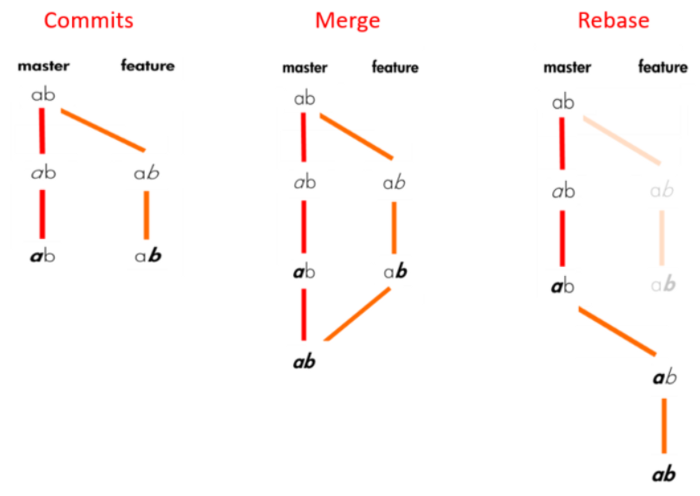

### 1. concept


- Workspace：工作区（clone或者原始内容）
- Index/Stage：暂存区（有增删改查后add到临时区）
- Repository：本地仓库（保存了本地的增删改查记录）
- Remote：远程仓库（本地的记录提交到远端,供团队所有人查看使用）

### 2. git核心对象(tree、blob、commit)

- git cat-file [-t|-p] id    //t是type  p是内容

    

### 3. note

1. 分离头指针一定要跟branch或tag绑在一起，否则会丢掉 `git checkout commit-SHA`

2. if meet unnormal

   ```bash
   git rm -r --cached .
   git add .
   ```
3. **git help [--web] command**

4. **gitk --all**

5. git 中部分选项解释

    ```bash
    -f --force：强制
    -d --delete：删除
    -D --delete --force
    -m --move：移动或重命名
    -M --move --force
    -r --remote
    -a --all
    -h help
    ```

6. how to write git comment

> add / feature  添加新功能
> fix  缺陷修复
> hotfix  紧急的缺陷修复
> update  对已有功能进行更改或优化
> remove / rm / delete  删除部分代码、功能
> refactor. 重构了一些代码、功能
> workflow  工作流程更改
> chore  琐碎的修改

```bash
git commit -m 'add: 上传文件功能' 
# 修复了一个线上问题 
$ git commit -m 'fix: **页面数字取值问题' 
# 对某些代码进行了重构 
$ git commit -m 'refactor: 重构商品列表页'
# docs 表示这是对文档进行的修改
$ git commit -m 'docs: 更新接口文档'
```

### 4. config

```bash
# create new SSH key
ssh-keygen -t rsa -C "youremail@example.com"
# copy then goto git to add this rsa
pbcopy < ~/.ssh/id_rsa.pub
# Testing your SSH connection
ssh -T git@github.com
# Checking for existing SSH keys
ls -al ~/.ssh

# --local  对某个仓库有效，缺省值
# --system 对系统所有登录用户有效
# --global
git config [--global] -l
# check value
git config [--global] xxx
git config [--global] user.name "Your Name"
git config [--global] user.email "Your email"

# unset
git config --global --unset user.name
```

### 5. init
```bash
git init [-y]
git clone url
```

### 6. status 

```bash
git status
```

### 7. add/rm file

```bash
# 把当前目录及其子目录下所有变更都加入到暂存区
git add .

# 把仓库内所有变更都假如到暂存区
git add -A

git add file1 file2...

# 添加指定目录到暂存区,包括子目录
git add dir

# 删除工作区文件,并将删除放入暂存区
git rm file1 file2...

# rename file
git mv name1 name2

# 查看哪些文件没有被Git管控
git ls-files --others
```

### 8. commit
```bash
git commit -m "message"

git commit file1 file2 ... -m "message"

# 直接提交
git commit -am "message"

# 修改最近一个commit
git commit --amend -m "message"

# 修改以前的commit，注意rebase只能针对自己的local repo
git rebase -i ee1d9ee（被rebase的父commid）里面选择r

# combine continuous commit
git rebase -i ee1d9ee（被rebase的父commid）里面选择s

# combine discontinuous commit
git rebase -i ee1d9ee（被rebase的父commid）里面选择s,还需要调整顺序，手动增加父节点
```

### 9. branch
```bash
# 列出所有本地分支
git branch -v

# 列出所有远端分支
git branch -rv

# 列出所有本地分支和远端分支
git branch -av

# 新建一个分支,但依然停留在当前分支
git branch newBranchName

# 新建一个分支,并切换到该分支
git checkout -b newBranchName

# 切换到指定分支,并更新工作区
git checkout branchName

# 基于远端分支创建本地分支
git checkout -b name origin/xxxx

# 基于某个commit创建分支
git branch newBranchName commit-SHA

# 基于指定分支创建新分支
git branch newBranchName existBranchName

# 建立追踪关系,在现有分支与指定的远程分支之间
git branch --set-upstream name origin/name

# 删除本地分支
git branch -d｜-D branchName

# 删除远程分支
git push origin --delete branchName
git branch -dr remote/branch

# 删除远端origin已不存在的所有本地分支
git remote prune origin
```

### 10. merge

```bash
#  A分支合入到当前分支，且为merge创建commit
git merge A分支

# 把A分支合入到B分支，且为Merge创建commit
git merge A分支 B分支

# 合并指定分支到当前分支
git merge origin/branchName
```

### 11. rebase

```bash
# 把A分支合入到B分支，且为Merge创建commit
git rebase B分支 A分支

# 用mergetool解决冲突
git mergetool
```

> rebase过程中,也许会出现conflict
>
> - git会停止rebase,需要解决冲突
> - 解决完,使用git add添加冲突的文件,更新暂存区
> - `git rebase --continue`继续剩下的rebase
> - `git rebase --abort`终止rebase行为,回到rebase开始之前的状态

### 12. diff

```bash
# 比较commit差异，带file是diff某文件
git diff commit-SHA1 commit-SHA2 [somefile]
git diff HEAD HEAD^1 [somefile]
git diff HEAD HEAD^1^1 [somefile]
git diff HEAD HEAD~1 [somefile]
git diff HEAD HEAD~n [somefile]
git diff master temp [-- index.html]

# 比较暂存区与HEAD，带file是diff某文件
git diff --cached [somefile]

# 比较工作区与暂存区
git diff [fileName1] [fileName2]

# 显示今天你写了多少行代码
git diff --shortstat "@{0 day ago}"

# 显示某次提交的元数据和内容变化
git show commit-SHA

# 显示某次提交发生变化的文件
git show --name-only commit-SHA

# 显示某次提交时,某个文件的内容
git show commit-SHA:filename
```

### 13. log

```bash
# 显示所有提交过的版本信息
git log [file]
git log --oneline -n2 --all --graph

# 查看所有分支的所有操作记录（包括已经被删除的 commit 记录和 reset 的操作）
git reflog

# 搜索提交历史,根据关键词
git log -S [keyword]

# 显示某个commit之后的所有变动
git log (tag-name||commit-SHA) HEAD

# 显示某个文件的版本历史,包括文件改名
git log --follow file
git whatchanged file

# 显示所有提交过的用户,按提交次数排序
git shortlog -sn

# 显示指定文件是什么人在什么时间修改过
git blame file
```

### 14. remote sync

```bash
# 取回远程仓库的变化,并与本地分支合并
git pull origin branchName

# 上传本地指定分支到远程仓库
git push origin branchName
git push [origin localbranch:remotebranch]

# 工作环境慎用！
git push origin --force

# 下载远程仓库的所有变动
git fetch origin

# 把远端所有分支和标签的变更都拉到本地
git fetch remote

# 显示所有远程仓库
git remote -av

# 显示某个远程仓库的信息
git remote show origin

git remote add name url地址
git remote remove remote的名称
git remote rename 旧名称 新名称

# 删除远端分支
git push remote --delete 远端分支名
```

### 15. 撤销
```bash
# 恢复暂存区指定文件到工作区
git checkout file...
git checkout .

# 恢复某个commit的指定文件到暂存区和工作区
git checkout commit-SHA file

# 重置暂存区的指定文件,与上一次commit保持一致,但工作区不变
git reset HEAD|fileName|commit

# 重置暂存区和工作区到某个commit，并消除commit记录，慎用！
git reset --hard [commit-SHA]

# 新建一个commit,用来撤销指定commit，后者的所有变化都将被前者抵消,并且应用到当前分支
git revert commit-SHA

# 用difftool比较任意两个commit差异
git difftool commit1 commit2
```

### 16. .gitignore
- 空行 或 # 开头的行会被忽略
- 可以使用标准的glob模式匹配
    - 0个或任意个字符
    - [abc] 任意其中一个字符
    - ? 匹配一个字符
    - [0-9] 表示匹配任意中间的字符
    - ** 两个星表示任意中间目录 a/**/c a/b/c a/d/c
- 以/开头防止递归
- 以/结尾指定目录
- 用!反向选择


### 17. alias

```bash
git config --global alias.s status
git config --global alias.c commit
git config --global alias.a add
git config --global alias.l "log --color --graph --pretty=format:'%Cred%h%Creset -%C(yellow)%d%Creset %s %Cgreen(%cr) %C(bold blue)<%an>%Creset' --abbrev-commit"
```

### 18. tags

```bash
git tag

# 新建一个tag在当前commit
git tag tag-name

# 新建一个tag在指定commit
git tag tag-name commit-SHA

# 删除本地tag
git tag -d tag-name

# 删除远程tag
git push origin :refs/tags/tag-Name

# 查看tag信息
git show tag-name

# 提交指定tag
git push origin tag-name

# 提交所有tag
git push origin --tags

# 新建一个分支,指向某个tag
git checkout -b branch-name tag-name
```

### 19. stash

```bash
# 把未处理完的变更先保存到stash中
git stash

git stash list

# 命令可以通过名字指定那个stash,默认指定最近的（stash@{0}）
# 不同于pop它不移除
git stash apply 

# 相当于出栈,并将对应修改应用到当前的工作目录中
git stash pop

# 取回某次 stash 的变更
git stash pop stash @{数字n}

# 移除相应的stash
git stash drop xxx

# 清空所有stash
git stash clear
```

> 默认情况下,git stash会缓存：
>     添加到暂存区的修改（staged changes ）
>     Git跟踪但并未添加到暂存区的修改（unstaged changes）
> 但不会缓存：
>     在工作目录中新的文件（untracked files）
>     被忽略的文件（ignored files）
>     此时,使用-u或者--include-untracked可以stash untracked文件；使用-a或者--all可以stash当前目录下的所有修改(慎用)

### 20. Merge vs Rebase


merge


rebase




### 21. Reset、Revert、 Checkout

- reset和checkout可以作用于commit或者文件,revert只能作用于commit
- reset 将一个分支的末端指向另一个提交,可以用来移除当前分支的一些提交
    - --soft：stage和workspace都不会被改变
    - --mixed（默认）：stage和你指定的提交同步,但workspace不受影响
    - --hard：stage和workspace都同步到你指定的提交
- checkout 提交层面上的checkout可以切换分支,同一分支,可以切换当前HEAD。文件层面上不会移动HEAD指针,也不会切换到其他分支上,只是更改workspace,而不是stage
- revert 撤销一个提交的同时会创建一个新的提交

| 命令         | 作用域   | 常用情景                           |
| ------------ | -------- | ---------------------------------- |
| git reset    | 提交层面 | 在私有分支上舍弃一些没有提交的更改 |
| git reset    | 文件层面 | 将文件从缓存区中移除               |
| git checkout | 提交层面 | 切换分支或查看旧版本               |
| git checkout | 文件层面 | 舍弃工作目录中的更改               |
| git revert   | 提交层面 | 在公共分支上回滚更改               |
| git revert   | 文件层面 | （然而并没有）                     |

#### Reset、Revert、 Checkout

reset和checkout可以作用于commit或者文件,revert只能作用于commit

##### commit级别的操作

###### reset

```
git checkout hotfix
git reset HEAD~2
```


**git reset用于撤销未被提交到remote的改动,即撤销local的修改**。除了移动当前分支的HEAD,还可以更改workspace和index：

- --soft：修改HEAD,不修改index和workspace
- --mixed：修改HEAD和index,不修改workspace。默认行为
- --hard：修改HEAD、index、workspace

###### checkout

checkout作用于commit级别时,只是移动HEAD到不同的commit。如果有unstaged的文件,git会阻止操作并提示。如果使用commit-SHA作为参数,可能会导致野指针

###### revert

```
git checkout hotfix
git revert HEAD^^
```


revert通过新建一个commit来撤销一次commit所做的修改,是一种安全的方式,并没有修改commit history

**revert用于撤销committed changes,reset用于撤销uncommitted changes**

##### file级别的操作

###### reset

git reset <commit> <filename>只修改index去匹配某次commit

git reset HEAD filename把文件从index退回workspace，并将更改保存在workspace中

###### checkout

git checkout <commit> <filename>只修改workspace去匹配某次commit

git checkout HEAD filename抹掉文件在workspace的修改

##### 总结

| Command      | Scope        | Common use cases                                                      |
| ------------ | ------------ | --------------------------------------------------------------------- |
| git reset    | Commit-level | Discard commits in  a private beanch or throw away uncommited changes |
| git reset    | File-level   | Unstage a file                                                        |
| git checkout | Commit-level | Switch between branches or inspect old snapshots                      |
| git checkout | File-level   | Discord changes in the working directory                              |
| git revert   | Commit-level | Undo cimmits in a pulic branch                                        |
| git revert   | File-level   | N/A                                                                   |

### 22. 搭建Git服务器

其实就是搭建私有仓库,推荐使用Linux服务器如Ubuntu或Debian,假设你有sudo权限的账号

1. sudo apt-get install git    # 安装Git
2. sudo adduser git    # 创建一个Git用户,用来运行Git服务
3. 创建证书登录：# 收集所有需要登录的用户的公钥,就是他们自己的id_rsa.pub文件,把所有公钥导入到/home/git/.ssh/authorized_keys文件里,一行一个
4. 初始化Git仓库  # 先选定一个目录作为Git仓库,在该目录下输入命令（比如目录：/srv）：
    sudo git init --bare sample.git
    sudo chown -R git:git sample.git
5. 禁用shell登录,通过编辑/etc/passwd文件完成
    git:x:1001:1001:,,,:/home/git:/bin/bash
    改为：
    git:x:1001:1001:,,,:/home/git:/usr/bin/git-shell
6. 克隆远程仓库：
    git clone git@server:/srv/sample.git

### 23. resolve git clone too slow
```bash
git config --global http.postBuffer 524288000
# 1086 is shadowsocks's socks5 port
# note: only can use https way to clone repo!!!!!
git config --global http.https://github.com.proxy socks5://127.0.0.1:1086
git config --global https.https://github.com.proxy socks5://127.0.0.1:1086

# or change hosts file
nslookup github.global.ssl.fastly.Net
nslookup github.com
# then add config like below in hosts file
74.86.228.110   github.global.ssl.fastly.net
52.74.223.119   github.com
# refresh cache
sudo dscacheutil -flushcache
```