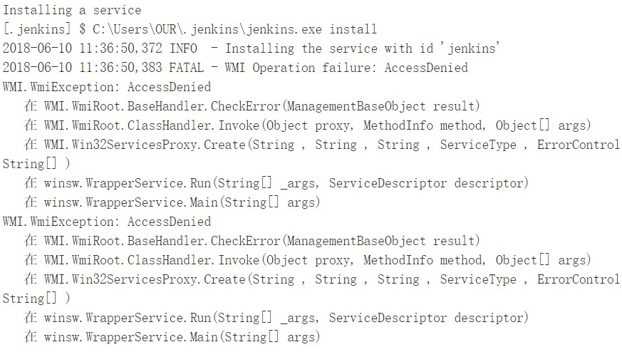

### 1 [Jenkins系列文章 ](https://wiki.eryajf.net/pages/2415.html)

### 2.Start Exit Reload Restart

- http://localhost:8888/restart
- http://localhost:8888/reload
- http://localhost:8888/exit
- locate jenkins.war folder，run cmd : `java -jar jenkins.war --httpPort=8888

### 3.Configure

#### 1 plugin related

- 替换升级站点

- 必装插件
  - Email Extension Plugin
  - Git
  - Workspace Cleanup
  - Mailer
  - Email Extension

#### 2 change httpPort

> locate  jenkins.xml-->  change --httpPort=8888

#### 3 disable the deprecated protocols

> This Jenkins instance uses deprecated protocols: JNLP3-connect. It may impact stability of the instance. If newer protocol versions are supported by all system components (agents, CLI and other clients), it is highly recommended to disable the deprecated protocols
>
> protocol Configuration→Agents→unselect deprecated protocols

#### 4 smtp server 

==Note: sys-administror's email must be same as below user name==

535 用户名和密码不对

### 4.TroubleShooting

1. install windows service fail

   locate jenkins.war folder, run cmd as administrator, then install

### 5.Env_variable

- JAVA_HOME        javac
- ANT_HOME         ant -v
- GRADLE_HOME    gradle -v
- MAVEN_HOME      mvn -v

### 6.Item

命名规则：项目前缀_说明-Job类型

