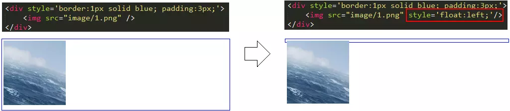
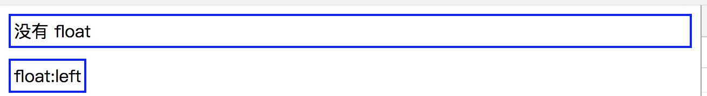
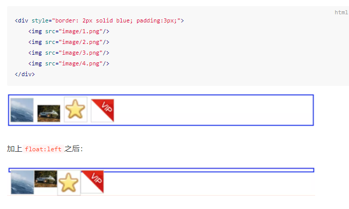
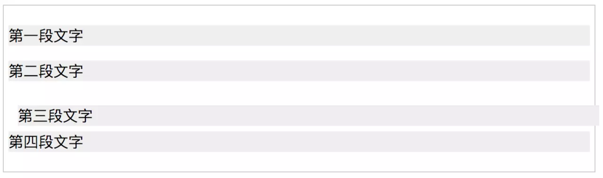
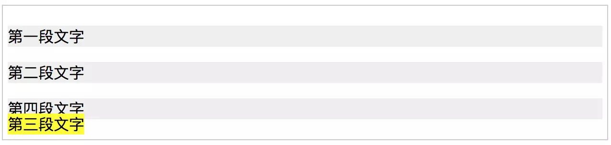
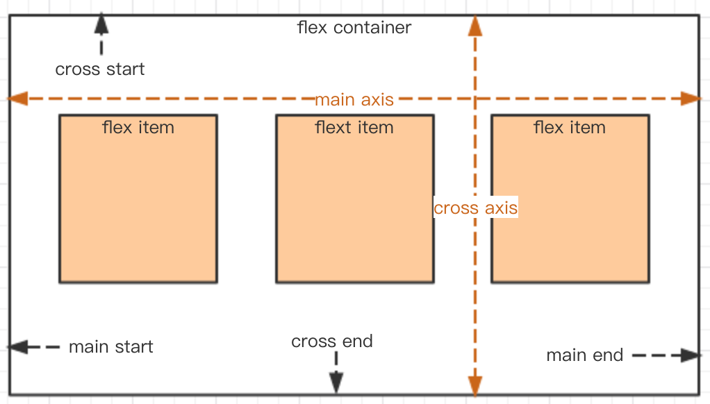

### 选择器的权重和优先级

- 代表内联样式，如style="xxx"，权值为 1000；
- 代表 ID 选择器，如#content，权值为 100；
- 代表类、伪类和属性选择器，如.content、:hover、[attribute]，权值为 10；
- 代表元素选择器和伪元素选择器，如div、p，权值为 1

**通用选择器（*）、子选择器（>）和相邻同胞选择器（+）并不在这四个等级中，所以他们的权值都为 0**。 权重值大的选择器其优先级也高，相同权重的优先级又遵循后定义覆盖前面定义的情况

### 盒模型

**在盒子模型中，我们设置的宽度都是内容宽度，不是整个盒子的宽度。而整个盒子的宽度是：（内容宽度 + border宽度 + padding宽度 + margin宽度）之和**

默认情况下，div是display:block，宽度会充满整个父容器

`box-sizing:border-box`的宽度是内容 + padding + 边框的宽度（不包括margin），这样就比较符合我们的实际要求了

### 纵向 margin 重叠

### float
本意文字环绕效果
#### 破坏性 父标签出现了坍塌现象

#### 包裹性

#### 清空格

#### clearfix
所有 float 元素的父容器，一般情况下都应该加clearfix这个 class。
```css
.clearfix:after {
    content: '';
    display: table;
    clear: both;
}
.clearfix {
    *zoom: 1; /* 兼容 IE 低版本 */
}
<div class="clearfix">
    
    
</div>
```
[圣杯与双飞翼布局](https://juejin.im/entry/5a8868cdf265da4e7e10c133?utm_source=gold_browser_extension)

### position

#### relative （会导致自身位置的相对变化，而不会影响其他元素的位置、大小）
```html
<p>第一段文字</p>
<p>第二段文字</p>
<p style="position:relative; top: 10px; left: 10px">第三段文字</p>
<p>第四段文字</p>
```

- 第三个`<p>`发生了位置变化，分别向右向下移动了10px
- 其他的三个`<p>`位置没有发生变化，这一点也很重要

#### absolute

```html
<p>第一段文字</p>
<p>第二段文字</p>
<p style="background: yellow">第三段文字</p>
<p>第四段文字</p>
```

- absolute 元素脱离了文档结构。和 relative 不同，其他三个元素的位置重新排列了。只要元素会脱离文档结构，它就会产生破坏性，导致父元素坍塌。（此时你应该能立刻想起来，float 元素也会脱离文档结构。）
- absolute 元素具有“包裹性”。之前<p>的宽度是撑满整个屏幕的，而此时<p>的宽度刚好是内容的宽度。
- absolute 元素具有“跟随性”。虽然 absolute 元素脱离了文档结构，但是它的位置并没有发生变化，还是老老实实地呆在它原本的位置，因为我们此时没有设置 top、left 的值。
- absolute 元素会悬浮在页面上方，会遮挡住下方的页面内容

这里需要注意的是，设置了 top、left 值时，元素是相对于最近的定位上下文来定位的，而不是相对于浏览器定位。

#### fixed

其实 fixed 和 absolute 是一样的，唯一的区别在于：absolute 元素是根据最近的定位上下文确定位置，而 fixed 根据 window （或者 iframe）确定位置

#### 总结
1. relative 元素的定位永远是相对于元素自身位置的，和其他元素没关系，也不会影响其他元素。
2. fixed 元素的定位是相对于 window （或者 iframe）边界的，和其他元素没有关系。但是它具有破坏性，会导致其他元素位置的变化
3. absolute 的定位相对于前两者要复杂许多。如果为 absolute 设置了 top、left，浏览器会根据什么去确定它的纵向和横向的偏移量呢？答案是浏览器会递归查找该元素的所有父元素，如果找到一个设置了position:relative/absolute/fixed的元素，就以该元素为基准定位，如果没找到，就以浏览器边界定位

### flex



#### 设置主轴的方向flex-direction
- row（默认值）：主轴为水平方向，起点在左端。
- row-reverse：主轴为水平方向，起点在右端。
- column：主轴为垂直方向，起点在上沿。
- column-reverse：主轴为垂直方向，起点在下沿。

#### 设置主轴的对齐方式justify-content
- flex-start（默认值）：向主轴开始方向对齐。
- flex-end：向主轴结束方向对齐。
- center： 居中。
- space-between：两端对齐，项目之间的间隔都相等。
- space-around：每个项目两侧的间隔相等。所以，项目之间的间隔比项目与边框的间隔大一倍

#### 交叉轴的对齐方式align-items
- flex-start：交叉轴的起点对齐。
- flex-end：交叉轴的终点对齐。
- center：交叉轴的中点对齐。
- baseline: 项目的第一行文字的基线对齐。
- stretch（默认值）：如果项目未设置高度或设为 auto，将占满整个容器的高度。

### 水平居中

inline 元素用text-align: center

```css
.container {
   text-align: center;
}
```

block 元素可使用margin: auto
```css
.container {
    text-align: center;
}
.item {
    width: 1000px;
    margin: auto;
}
```

绝对定位元素可结合left和margin实现，但是必须知道宽度。
```css
.container {
    position: relative;
    width: 500px;
}
.item {
    width: 300px;
    height: 100px;
    position: absolute;
    left: 50%;
    margin: -150px;
}
```

### 垂直居中

inline 元素可设置line-height的值等于height值，如单行文字垂直居中：
```css
.container {
   height: 50px;
   line-height: 50px;
}
```

绝对定位元素，可结合left和margin实现，但是必须知道尺寸
- 优点：兼容性好
- 缺点：需要提前知道尺寸

```css
.container {
    position: relative;
    height: 200px;
}
.item {
    width: 80px;
    height: 40px;
    position: absolute;
    left: 50%;
    top: 50%;
    margin-top: -20px;
    margin-left: -40px;
}
```

绝对定位可结合transform实现居中。
```css
.container {
    position: relative;
    height: 200px;
}
.item {
    width: 80px;
    height: 40px;
    position: absolute;
    left: 50%;
    top: 50%;
    transform: translate(-50%, -50%);
    background: blue;
}
```
绝对定位结合margin: auto，不需要提前知道尺寸，兼容性好。
```css
.container {
    position: relative;
    height: 300px;
}
.item {
    width: 100px;
    height: 50px;
    position: absolute;
    left: 0;
    top: 0;
    right: 0;
    bottom: 0;
    margin: auto;
}
```

### 理解语义化

### CSS3 动画
```css
@keyframes testAnimation
{
    0%   {background: red; left:0; top:0;}
    25%  {background: yellow; left:200px; top:0;}
    50%  {background: blue; left:200px; top:200px;}
    75%  {background: green; left:0; top:200px;}
    100% {background: red; left:0; top:0;}
}
```

```css
div {
    width: 100px;
    height: 50px;
    position: absolute;

    animation-name: myfirst;
    animation-duration: 5s;
}
```
- animation-timing-function：规定动画的速度曲线。默认是ease
- animation-delay：规定动画何时开始。默认是 0
- animation-iteration-count：规定动画被播放的次数。默认是 1
- animation-direction：规定动画是否在下一周期逆向地播放。默认是normal
- animation-play-state ：规定动画是否正在运行或暂停。默认是running
- animation-fill-mode：规定动画执行之前和之后如何给动画的目标应用，默认是none，保留在最后一帧可以用forwards

> CSS 的transition和animation有何区别？
>
> 首先transition和animation都可以做动效，从语义上来理解，transition是过渡，由> 一个状态过渡到另一个状态，比如高度100px过渡到200px；而animation是动画，即更专> 业做动效的，animation有帧的概念，可以设置关键帧keyframe，一个动画可以由多个关> 键帧多个状态过渡组成，另外animation也包含上面提到的多个属性。

### 重绘和回流

- 重绘：指的是当页面中的元素不脱离文档流，而简单地进行样式的变化，比如修改颜色、背景等，浏览器重新绘制样式
- 回流：指的是处于文档流中DOM的尺寸大小、位置或者某些属性发生变化时，导致浏览器重新渲染部分或全部文档的情况

相比之下，回流要比重绘消耗性能开支更大。另外，一些属性的读取也会引起回流，比如读取某个DOM的高度和宽度，或者使用getComputedStyle方法。在写代码的时候要避免回流和重绘。比如在笔试中可能会遇见下面的题目：

```javascript
var data = ['string1', 'string2', 'string3'];
for(var i = 0; i < data.length; i++){
    var dom = document.getElementById('list');
    dom.innerHTML += '<li>' + data[i] + '</li>';
}s
```