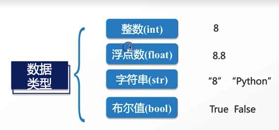
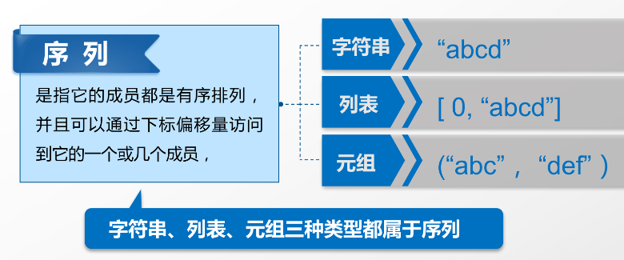

### Basic Concept

1. Version（2.7 / 3.x）

- 标准版(解释程序 + 标准库)
- 发行版(集成许多第三方库anaconda)

2. 解释器

- CPython 、IPython、PyPy、Jython、IronPython

3. 区分大小写
4. 标识符可以包括英文、数字以及下划线(_)，但不能以数字开头
5. 语句无分号，但有这个操作符
6. **.py起名不要和系统文件重名**
7. 单行注释#加个空格，多行注释    """xxxxx"""
8. 冒号缩进代替开始和结束大括号, 4个空格
9. 弱类型(变量或参数无需声明)（整数、浮点数、字符串（转义\、unicode、格式化）布尔值、空值None）
   - `r'' `     不转义
   - `'''...'''`  多行
   - `r'''...'''`  混用
   - 布尔值（True  False）（and or not 与或非运算符）
   - 字符串   不变   使用+连接

10. 变量

```python
a = b = c = 1
a, b, c = 1, 2, "john"
global xxxx
```

11. 常量大写

12. //取整 （算数  比较  赋值 逻辑 位  成员in / not in 身份is / is not 优先级）

13. **is 用于判断两个变量引用对象是否为同一个， ==用于判断引用变量的值是否相等**

14. pydoc.exe

    > python -m pydoc -p 1111

15. ``#!/usr/bin/env python3      # -*- coding: utf-8 -*-``

### 基础数据类型



- 单双引号对字符串都可以,当字符串有单引号时使用双引号

### 序列和元组




- 列表可改变，元组不可变

### 字典

- **dict**(类似于map)   /    set   **dict的key必须是不可变对象(str int 元组)  set也只能放不可变对象**

  > 和list比较，dict有以下几个特点(dict的key必须是不可变对象(str int))
  >
  > 查找和插入的速度极快，不会随着key的增加而变慢
  > 需要占用大量的内存，内存浪费多
  >
  > 而list相反：
  > 查找和插入的时间随着元素的增加而增加
  > 占用空间小，浪费内存很少

###字典/列表推导式

```python
vec = [2, 4, 6]
[3*x for x in vec]
[[x, x**2] for x in vec]
[3*x for x in vec if x > 3]

freshfruit = [' banana', ' loganberry ', 'passion fruit ']
[weapon.strip() for weapon in freshfruit]
```

### Data Type

Python3 中有六个标准的数据类型：

- Number（数字）  (int bool float complex)
- String（字符串）
- List（列表）
- Tuple（元组）
- Sets（集合）
- Dictionary（字典）

Python3 的六个标准数据类型中：

- **不可变数据（四个）：**Number（数字）、String（字符串）、Tuple（元组）、Sets（集合）；
- **可变数据（两个）：**List（列表）、Dictionary（字典）

 None是个特殊值

### 控制语句

if(express value **只要x是非零数值、非空字符串、非空list()等，就判断为True，否则为False**)、for、while、break、continue

```python
count = 0
while count < 5:
   print count, " is  less than 5"
   count = count + 1
else:
   print count, " is not less than 5"
```

### 文件操作

- open()、read([x])、readline()、readlines()、write()、close()
- tell()
- seek(x, [y]) // y为0表示文件开头，1当前位置，2文件结尾

### 异常

```python
try:
    print('try...')
    r = 10 / int('2c')
    print('result:', r)
#exception基类BaseException
except ValueError as e:
    print('ValueError:', e)
except ZeroDivisionError as e:
    print('ZeroDivisionError:', e)
#捕获所有异常
except:
    #raise ValueError('input error!')
    raise
else:
    print('no error!')
finally:
    print('finally...')
```

### Function

1. 定义

2. **pass**

3. 可以返回多个值,其实是一个tuple

4. no return返回的是None

5. 变量作用域

   ```python
   var1 = 123
   
   def func():
       global var1
       var1 = 456
       print(var1)
   
   func()
   print(var1)
   ```

   

6. **param**

   1. 位置参数

      ```python
      def printinfo(name, age):
         print("Name: ", name)
         print("Age ", age)
         return;

      printinfo(age=50, name="miki")
      ```
      
      2. 默认参数

         **默认参数必须指向不变对象！**默认值只被赋值一次

         ```python
         def f(a, L=[]):
             L.append(a)
             return L
         
         print(f(1))
         print(f(2))
         print(f(3))
         
         [1]
         [1, 2]
         [1, 2, 3]
         ```

      3. 可变参数

         ```python
         def calc(*numbers):
             sum = 0
             for n in numbers:
                 sum = sum + n * n
             return sum
         
         nums = [1, 2, 3]
         print(calc(*nums))
         ```

   4. 关键字参数

      ```python
      def person(name, age, **kw):
          print('name:', name, 'age:', age, 'other:', kw)
      
      extra = {'city': 'Beijing', 'job': 'Engineer'}
      #person('Jack', 24, city=extra['city'], job=extra['job'])
      person('Jack', 24, **extra)
      ```

   5. 命名关键字参数

      ```python
      def person(name, age, *, city='Beijing', job):
          print(name, age, city, job)
      person('Jack', 24, city='Beijing', job='Engineer')
      
      def person(name, age, *args, city, job):
          print(name, age, args, city, job)
      ```

   6. **参数定义的顺序**：必选参数、默认参数、可变参数、命名关键字参数和关键字参数

      7. 对于任意函数,都可以通过`func(*args, **kw)`的形式调用它,无论它的参数是如何定义的

         ```python
         def f1(a, b, c=0, *args, **kw):
             print('a =', a, 'b =', b, 'c =', c, 'args =', args, 'kw =', kw)
         
         def f2(a, b, c=0, *, d, **kw):
             print('a =', a, 'b =', b, 'c =', c, 'd =', d, 'kw =', kw)
         
         f1(1, 2)
         f1(1, 2, c=3)
         f1(1, 2, 3, 'a', 'b')
         f1(1, 2, 3, 'a', 'b', x=99)
         f2(1, 2, d=99, ext=None)
         
         args = (1, 2, 3, 4)
         kw = {'d': 99, 'x': '#'}
         f1(*args, **kw)
         
         args = (1, 2, 3)
         kw = {'d': 88, 'x': '#'}
         f2(*args, **kw)
         ```

7. iter

   ```python
   L = [1, 2, 3]
   it = iter(L)
   
   print(next(it))
   print(next(it))
   print(next(it))
   
   def float_range(start, stop, step):
       x = start
       while x < stop:
           yield x
           x += step
   
   for i in float_range(10, 20, 0.5):
       print(i)
   ```

8. lambda

   ```python
   def ccc():
     return True
   lambda : True
   
   def add(x, y):
     return x + y
   lambda x,y: x + y
   ```

9. some butild-in functions

- **help(funcName) **

- int()  hex()  oct()  bin()  str()  repr()  bool()  bytearray()  bytes()  float()  set()  range()  list()   dict()  tuple()  sort()  slice() all() any()  filter()  reversed()

- abs() min()  sum() pow() max() round()

- id()  object()  **isinstance**()  **type()** **enumerate**()  **iter()** **dir()**  super()  issubclass() property()  frozenset()  classmethod() staticmethod()  **hasattr()  delattr() hash() setattr()   getattr()**

- next()   divmod()  exec()  callable()  locals()  globals()  compile() complex() memoryview()

- ord() chr()  **len()**  **print() **format()  encode()  decode() ascii()

- input()  eval()   open()

- **zip() map() reduce() filter()**

  ```python
  a = [1, 2, 3]
  b = [4, 5, 6]
  list(filter(lambda x:x>2, a))
  list(map(lambda x,y:x+y, a,b))
  
  from functools import reduce
  reduce(lambda x,y: x + y, [2, 3, 4], 1)
  
  for i in zip((1,2,3), (4,5,6))
  		print(i)
  ```

  

### Advance Function

1. 闭包

   ```python
   def a_line(a, b):
       return lambda x: a * x + b
   
   line1 = a_line(3, 5)
   line2 = a_line(5, 10)
   print(line1(10))
   print(line2(10))
   ```

2. 装饰器

   ```python
   import time
   
   
   def timmer(fn):
       def wrapper():
           start = time.time()
           fn()
           end = time.time()
           print('耗时', end - start, 'seconds')
       return wrapper
   
   
   @timmer
   def fun_sleep():
       time.sleep(2)
   
   
   fun_sleep()
   ```

3. 自定义上下文管理器`with`

4. **切片**

   ```python
   L = [1,2,3,4,5]
   L[0:3]   =  L[:3]
   L[-2:]
   #倒数切片第一个索引是-1
   L[-3:-1]
   L[:10]
   L[-10:]
   L[10:20]
   L[:10:2]
   L[::5]
   L[:]
   (0, 1, 2, 3, 4, 5)[:3]
   'ABCDEFG'[:3]
   ```

5. **列表生成式**

6. 迭代器

7. 生成器

**总结**：

- 凡是可作用于`for`循环的对象都是`Iterable`类型
-  凡是可作用于`next()`函数的对象都是`Iterator`类型，它们表示一个惰性计算的序列
-   集合数据类型如`list`、`dict`、`str`等是`Iterable`但不是`Iterator`，不过可以通过`iter()`函数获得一个`Iterator`对象
-  Python的`for`循环本质上就是通过不断调用`next()`函数实现的


### Module

1. 模块名要遵循Python变量命名规范，不要使用中文、特殊字符

2. 模块名不要和系统模块名冲突，通过在Python交互环境检查`import xxx`，若成功则说明系统存在此模块

3. 作用域：_开头是private的变量或函数,目的是隐藏

   ```python
   #文件名fibo.py
   import fibo [as f]
   fibo.fib(1000)
   
   from fibo import fib, fib2
   fib(500)
   
   from fibo import *
   
   #运行脚本
   python fibo.py <args>
   
   if __name__ == "__main__":
       import sys
       fib(int(sys.argv[1]))
   
   python fibo.py 50
   ```


### Package

1. 包中的 __init__.py 代码定义了一个名为 __all__ 的列表,__all__ = ["echo", "surround", "reverse"]

2. `from Package import func1 [,fun2....]`


### Class

```python
class Player():
    def __init__(self, name, age):
        self.__name = name
        self.__age = age

    def show(self):
        print('name is', self.__name, 'age is', self.__age)


p1 = Player('jack', 33)
p2 = Player('feifei', 22)

p1.show()
p2.show()
```

1. 前后双下划线表示特殊变量,可以直接访问

2. __xx限制外部访问,但可以强制访问

   > \_\_xxx\_\_: 定义的是特殊方法，一般是系统定义名字 ，类似 \_\_init\_\_之类
   >
   > \_xxx: 表示protected类型的变量，即保护类型只能允许其本身与子类进行访问，不能用于from module import *
   >
   > \_\_xxx: 表示私有类型(private)的变量, 只能是允许这个类本身进行访问

3. 继承和多态`super().__init__(hp)`

4. type() 可以动态创建类

   ```python
   type(123) == type(456)
   type(123) == int
   type('abc') == type('123')
   type('abc')==str
   
   import types
   type(fn)==types.FunctionType
   type(abs)==types.BuiltinFunctionType
   type(lambda x: x)==types.LambdaType
   type((x for x in range(10)))==types.GeneratorType
   ```

5. isinstance()（**总是优先使用isinstance()判断类型**，可以将指定类型及其子类“一网打尽”）

   ```python
   # 判断多个
   isinstance([1, 2, 3], (list, tuple))
   
   class A:
       pass
   
   class B(A):
       pass
   
   isinstance(A(), A)  # returns True
   type(A()) == A      # returns True
   isinstance(B(), A)    # returns True
   type(B()) == A        # returns False
   ```

6. **dir()  /  dir(built-in)**

7. 实例属性 、类属性

   - 不要对实例属性和类属性使用相同的名字,因为相同名称的实例属性将屏蔽掉类属性


### Advance Class

1. 动态绑定方法到类或实例

2. \__slot__

3. @property

4. 多重继承      [当心掉进Python多重继承里的坑](https://www.jianshu.com/p/71c14e73c9d9)

5. 定制类

6. 枚举类

7. 元类 metaclass

8. decorator

   - @classmethod
   - @property
   - @staticmethod
   - @test

### 多线程

```python
import threading
from threading import current_thread


class Mythread(threading.Thread):
    def run(self):
        print(current_thread().getName(), 'start')
        print('run')
        print(current_thread().getName(), 'stop')


t1 = Mythread()
t1.start()
t1.join()

print(current_thread().getName(), 'end')
```

### 常用内建模块

1. re

2. time、datetime

3. math、random

4. pathlib、os.path、glob、shutil 文件和目录访问

5. tarfile zlib gzip bz2 lzma  zipfile  数据压缩和归档

6. os、logging、argparse 通用操作系统

   ```python
   os.environ 一个dictionary 包含环境变量的映射关系
   os.environ["HOME"] 可以得到环境变量HOME的值
   os.chdir(dir) 改变当前目录 os.chdir('d:\\outlook')
   注意windows下用到转义
   os.getcwd() 得到当前目录
   os.getegid() 得到有效组id os.getgid() 得到组id
   os.getuid() 得到用户id os.geteuid() 得到有效用户id
   os.setegid os.setegid() os.seteuid() os.setuid()
   os.getgruops() 得到用户组名称列表
   os.getlogin() 得到用户登录名称
   os.getenv 得到环境变量
   os.putenv 设置环境变量
   os.umask 设置umask
   os.system(cmd) 利用系统调用，运行cmd命令
   ```

7. threading、queue 多线程

8. base64 、json、urllib、http   Internet数据处理

9. html、xml 结构化标记处理工具

10. unitest

11. timeit 调试工具

12. venv  软件包发布

13. 运行服务的\_\_main\_\_

14. collections

    1. namedtuple
    2. deque
    3. defaultdict
    4. OrderedDict
    5. Counter

15. itertools

    - count()
    - cycle()
    - repeat()
    - takewhile()
    - chain()
    - groupby()

16. contextlib

    - with
    - @contextmanager
    - @closing

17. others

    - struct
    - hashlib
    - hmac
    - configparser 读取配置文件
    - pickle 序列化
    - uuid  生成唯一码
    - inspect  提供自省和反射功能
    - importlib 支持动态导入
    - fcntl 操作文件描述符

18. sys  命令行参数

    > sys.argv 是一个 list,包含所有的命令行参数
    > sys.stdout sys.stdin sys.stderr 分别表示标准输入输出,错误输出的文件对象
    > sys.stdin.readline() 从标准输入读一行 sys.stdout.write("a")
    > sys.exit(exit_code) 退出程序 0正常退出
    > sys.modules 是一个dictionary，表示系统中所有可用的module
    > sys.platform 得到运行的操作系统环境
    > sys.path 是一个list,指明所有查找module，package的路径

19. 系统直接调用函数

    ```python
    help(obj) # 在线帮助, obj可是任何类型
    callable(obj) # 查看一个obj是不是可以像函数一样调用
    repr(obj) # 得到obj的表示字符串，可以利用这个字符串eval重建该对象的一个拷贝
    eval_r(str) # 表示合法的python表达式，返回这个表达式
    dir(obj) # 查看obj的name space中可见的name
    hasattr(obj,name) # 查看一个obj的name space中是否有name
    getattr(obj,name) # 得到一个obj的name space中的一个name
    setattr(obj,name,value) # 为一个obj的name space中的一个name指向vale这个object
    delattr(obj,name) # 从obj的name space中删除一个name
    vars(obj) # 返回一个object的name space。用dictionary表示
    locals() # 返回一个局部name space,用dictionary表示
    globals() # 返回一个全局name space,用dictionary表示
    type(obj) # 查看一个obj的类型
    isinstance(obj,cls) # 查看obj是不是cls的instance
    issubclass(subcls,supcls) # 查看subcls是不是supcls的子类
    
    # 类型转换
    chr(i) # 把一个ASCII数值,变成字符
    ord(i) # 把一个字符或者unicode字符,变成ASCII数值
    oct(x) # 把整数x变成八进制表示的字符串
    hex(x) # 把整数x变成十六进制表示的字符串
    str(obj) # 得到obj的字符串描述
    list(seq) # 把一个sequence转换成一个list
    tuple(seq) # 把一个sequence转换成一个tuple
    dict(),dict(list) # 转换成一个dictionary
    int(x) # 转换成一个integer
    float(x) # 转换成一个浮点数
    complex(x) # 转换成复数
    max(...) # 求最大值
    min(...) # 求最小值
    ```

### 常用第三方模块

1. requests
2. BeautifulSoup
3. Pillow
4. chardet
5. psutil    系统性能参数
6. demjson
7. pyperclip  右键粘贴
8. other
   - jinja2
   - aiomysql
   - aiohttp

### PEP8

- `pip3 install autopep8`
- integrate with PyCharm

### PIP

- pip list [--outdated]
- pip install xxx
- pip install --upgrade xxx
- pip show --files xxxx
- pip uninstall xxx
- pip -h

### Debug

- print()
- assert
- import logging
- IDE

### Unit Test

1. 单元测试可以有效地测试某个程序模块的行为，是未来重构代码的信心保证
2. 单元测试的测试用例要覆盖常用的输入组合、边界条件和异常
3. 单元测试代码要非常简单，如果测试代码太复杂，那么测试代码本身就可能有bug
4. 单元测试通过了并不意味着程序就没有bug了，但是不通过程序肯定有bug
5. `python -m unittest mydict_test`
6. `pip install nose`
7. `pip install pytest  `

### virtualenv(“隔离”Python运行环境)

1. pip install virtualenv

2. virtualenv xxxx

   virtualenv ``-``p ``/``usr``/``local``/``bin``/``python3 venv

3. xxxxxxxx\venv\Scripts\activate    //goto scripts folder, activate  vitualenv, note add prefix to cmd

4. pip list  /   pip install request

5. rm -rf xxxx

6. deactivate

7. original python.exe ---> pip install virtualenvwrapper-win    //  linux下运行pip install virtualenvwrapper

8. set  WORKON_HOME env param.   add to path

9. mkvirtualenv xxxxxx  //因为设置了WORKON_HOME，所有虚拟环境将安装到其目录下

   mkvirtualenv -p C:\Users\T5810\AppData\Local\Programs\Pyt
   hon\Python37\python.exe env37

10. workon  //这里不能查看到virtualenv创建的虚拟环境，只能查看mkvirtualenv创建的虚拟环境

11. workon xxxxxx  // go in one mkvirtualenv

12. rmvirtualenv xxxxxx

13. deactivate

### pipenv

### 图形界面

### 网络编程

### 电子邮件

### 访问数据库

### Web开发

### 异步IO

> open()、close()、write()、read()、readline()、tell()、seek()

### 最佳实践

- 使用4空格缩进,而非TAB

- 折行以确保其不会超过79个字符

- 使用空行分隔函数和类,以及函数中的大块代码

- 可能的话,注释独占一行

- 使用文档字符串

- 把空格放到操作符两边,以及逗号后面,但是括号里侧不加空格：`a = f(1, 2) + g(3, 4)`

- 统一函数和类命名

- 不要使用花哨的编码,如果你的代码的目的是要在国际化环境。Python的默认情况下,UTF-8甚至普通的ASCII总是工作的最好

- 同样,也不要使用非ASCII字符的标识符,除非是不同语种的会阅读或者维护代码

- 不要使用`from xxx import *`

- ```python
  with open('/path/to/file', 'r') as f:
      print f.read()
  ```

