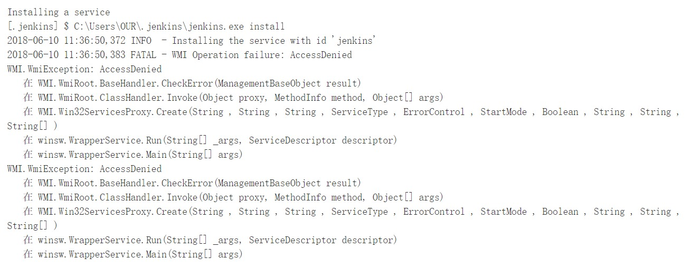

### 1.Start Exit Reload Restart

- http://localhost:8082/restart
- http://localhost:8082/reload
- http://localhost:8082/exit
- locate jenkins.war folder，run cmd : `java -jar jenkins.war --httpPort=8082

### 2.Configure

1. change httpPort while starting as windows service

> locate  jenkins.xml-->  change --httpPort=8082

2. This Jenkins instance uses deprecated protocols: JNLP3-connect. It may impact stability of the instance. If newer protocol versions are supported by all system components (agents, CLI and other clients), it is highly recommended to disable the deprecated protocols

>  protocol Configuration→Agents→unselect deprecated protocols

3. smtp server (==Note: sys-administror's email must be same as below user name==)

    535 用户名和密码不对

   

4.  install Locale plugin to change language (zh_CN)

   

### 3.TroubleShooting

1. install windows service fail

​       solution:  locate jenkins.war folder, run cmd as administrator, then install

2. Jenkins cannot restart itself as currently configured.

solution:  上面问题解决就可以了

### 4.Env_variable

- JAVA_HOME        javac
- ANT_HOME         ant -v
- GRADLE_HOME    gradle -v
- MAVEN_HOME      mvn -v

### 5.Item

1. 项目前缀_说明-Job类型

