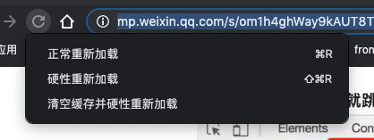

### 1.Chrome hotkey
- `ctrl + +|-|0`
- `ctrl + 1~9`
- `ctrl + T`
- `ctrl + <-|->`

### 2.Hotkey
- `ctrl + p`
- `ctrl + shift + p`
- `ctrl + f`
- `ctrl + shift + f`
- `sources panel -> ctrl + shift + p -> coverage (red section is useless)`

### 3.ELements (right click on a dom element)
1. Styles
   - :hov
   - color selector
   - shift + click to change color between rgba、hsl and hexadecimal
2. Computed
3. Event Listeners
    - show function define
4. Properties
5. DOM Breakpoints

### 4.Console
1. 直接.可以出现对应对象的方法
2. abbreviation(support jQuery selector)
  > `$()` : document.querySelector()的缩写，返回本页第一个与之匹配的CSS选择器的元素,$$(selector,[startNode])
  >
  > `\$\$()` : document.querySelectorAll()的缩写，返回一个数组，里面是与之匹配的CSS选择器的元素,$$(selector,[startNode])
  >
  > `\$0–4` : 依次返回五个最近你在元素面板选择过的DOM元素的历史记录，$0是最新的记录，以此类推
  >
  > `\$_`  检索最后一个结果的值

- `\$x("//p")`     locate by xpath,$x(selector,[startNode])

- `dir() / keys() / values()`

- `console.time() timeEnd() / group() groupEnd() / profile() profileEnd()`
- `console.log() / warn() / error()`
- `console.assert()` //对输入的表达式进行断言，只有表达式为false时，才输出相应的信息到控制台
- `console.trace()`
- `console.count('xxx')`
- `table()`
- `copy(obj)`
- `clear()`
2. 将浏览器转换为编辑器(`document.body.contentEditable=true`)

3. 查找与DOM中的元素关联的事件(`getEventListeners($(‘selector’))`)

4. 监控事件
- `monitorEvents($(‘selector’))` 将监视与选择器的元素关联的所有事件，然后在它们被触发时打印到控制台
- `monitorEvents($(‘selector’),’eventName’)` 将打印与元素绑定的特定事件
- `monitorEvents($(selector)，[eventName1, ...'])`将根据您自己的需求记录多个事件
- `unmonitorEvents($(selector))`这将停止监视和打印控制台中的事件
- `monitor/unmonitor`

### 5.Sources
- {} => format
- Filesystem
- Snippets
- blackbox script
- condition breakpoint
- pause on exception

### 6.Network
- block request
- copy response
- filter(`larger-than`  `status-code` `mine-type`)
- initiator
- block request  URL
- Preserve log
- right click refresh

### 7.Application
- local storage
- session storage
- cookie

### 8.Settings
- Show user agent shadow DOM
- Log XMLHttprequests