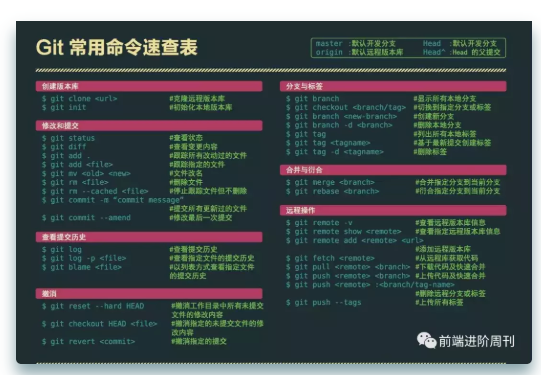

### 常用基础指令

- git init 初始化项目
- git add 添加项目到暂存区
- git commit -m '备注' 提交项目到版本库（必须写上备注）
- git status 查看当前仓库状态
- git diff 查看修改仓库内容
    - git diff --cached比较暂存区与最新本地版本库差别
    - git diff HEAD 比较工作区和最新版本库的差别
    - git diff commit-id 比较工作区与指定commitId版本的差异
    - git diff --cached commit-id 比较暂存区与指定commitId版本的差异
    - git diff commit-id1 commit-id2 比较两个commitId版本之间的差异
- git rev-parse HEAD 获取完整commitID

### 远程常用指令
- git clone 远程地址 克隆远程项目
- git pull 拉取远程项目
- git fetch 拉取远程项目（但不会和本地合并）
- git push 推送远程项目

### 分支管理
- git checkout -b 分支名 创建新分支
- git checkout 分支名 切换分支
- git branch 查看本地分支
- git branch -r 查看远程分支
- git reset --hard HEAD/commitId 切换分支版本
- git log [--pretty=oneline] 查看提交历史记录,可选参数--pretty=oneline
- git log --graph --pretty=oneline --abbrev-commit 以时间轴形式展示简洁提交记录信息
- git merge [-m '备注' --no-ff] 分支名 合并分支（默认以Fast-forward 模式合并）
- git push -u origin 分支名 关联远程分支
- git push origin --delete 分支名 删除指定远程分支（或使用git push origin :分支名）

### 标签操作
- git tag <tagName>创建轻量标签
- git tag -a <tagName> -m '备注' 创建附注标签
- git tag查看所有标签
- git show <tagName> 查看带说明的某个标签
- git checkout <tagName> 切换到某个标签分支
- git tag -d <tagName> 删除本地某个标签
- git push origin <tagName> 推送单个标签到远程
- git push origin --tags 推送所有标签到远程
- git push origin --delete tag <tagName> 删除远程某个标签（v1.7.0版本后）