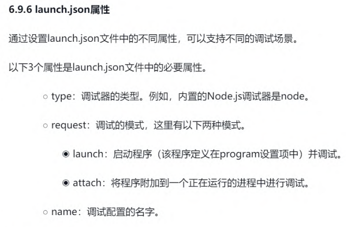
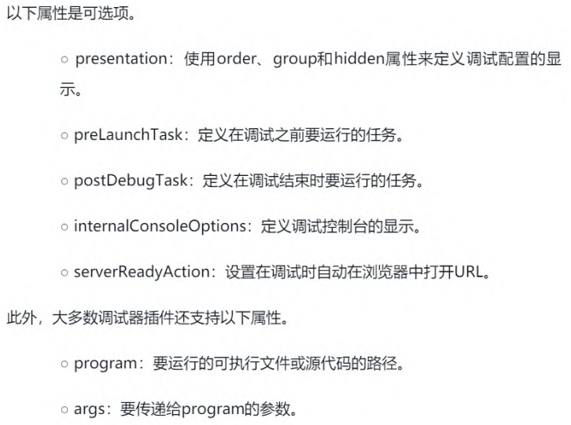
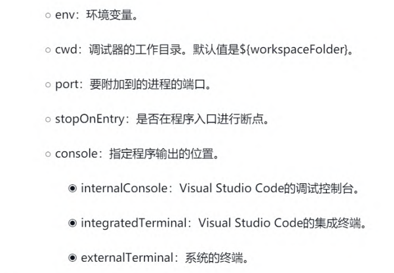
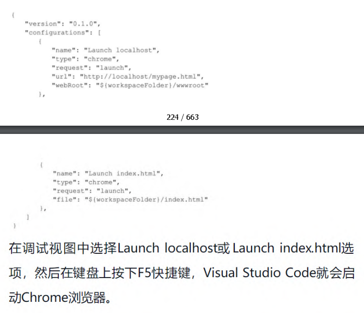
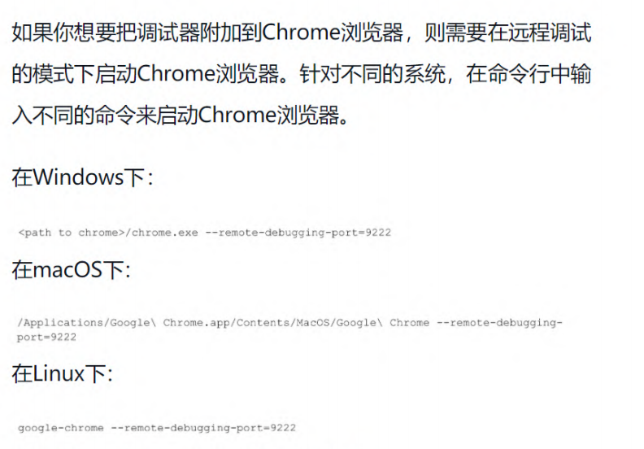
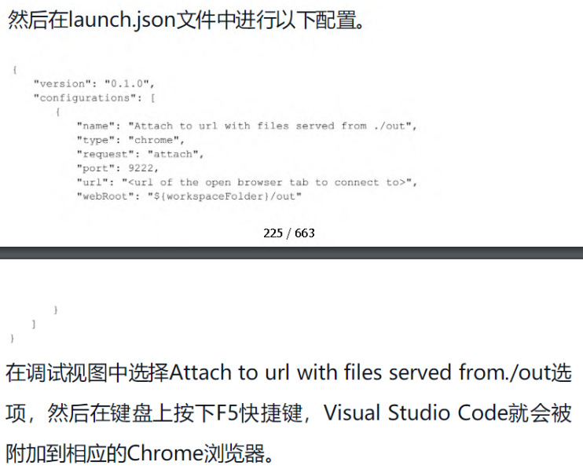

### vscode

#### Hotkey
- `F1` or `Ctrl[Command] + Shift + p`
- `Ctrl[Command] + p` file jump
- `Ctrl[Command] + Tab` open file jump
- `Alt + left/right` 前后操作记录跳转
- `Ctrl[Command] + g` go to file target line
- `Ctrl[Command] + d` find same content one by one
- `Ctrl[Command] + Shift + l` find multi content in one time
- `Alt[option] + up/down`  change line
- `Alt[option] + Shift + up/down` copy line
- `Ctrl[Command] + \`  分屏
- `Ctrl[Command] + [Shift] + /` 注释
- `Ctrl[Command] + [Shift] + f/h`
- `Alt + click / Shift + Alt[Option] + up/down` select block
- `Ctrl[Command] + [Shift] + space` intellisense
- `Ctrl + backspace | Option + delete` delete previous word

#### debug




- compound 多目标调试
- 附加调试
- 远程调试
- 客户端调试

#### 预定义变量
- \${workspaceRoot} 当前打开的文件夹的绝对路径+文件夹的名字
- \${workspaceRootFolderName} 当前打开的文件夹的名字
- \${workspaceRootFolder}
- \${env:USERNAME}
- \${file} 当前打开正在编辑的文件名，包括绝对路径，文件名，文件后缀名
- \${relativeFile} 从当前打开的文件夹到当前打开的文件的路径 如 当前打开的是test文件夹，当前的打开的是main.c，并有test / first / second / main.c 那么此变量代表的是 first / second / main.c
- \${fileBasename} 当前打开的文件名+后缀名，不包括路径
- \${fileBasenameNoExtension} 当前打开的文件的文件名，不包括路径和后缀名
- \${fileDirname} 当前打开的文件所在的绝对路径，不包括文件名
- \${fileExtname} 当前打开的文件的后缀名
- \${cwd} the task runner's current working directory on startup 不知道怎么描述，这是原文解释， 跟 cmd 里面的 cwd 是一样的
- \${lineNumber} 当前打开的文件，光标所在的行数

#### very useful extensions

##### 1. [Sync](https://marketplace.visualstudio.com/items?itemName=Shan.code-settings-sync)

##### 2. Code Runner

##### 3. quokka
##### 4. Markdown Preview Enhanced

##### 5. Bookmarks

##### 6. vs-code-faker

##### 7. Gitlens

##### 8. Trailing Spaces

##### 9. REST Client(more than postman)
- support cURL and RFC2616
- .http 和 .res结尾的文件
- generate code snippet for different languages
- advanced functions
    - identity authentication
    - support cookies
    - support http 3xx
    - variables
##### 10. live server

##### 11. JSON Tools
##### 12. cssrem

##### 13. Debugger for Chrome



##### 14. eslint

1. install node.js

2. npm install -g eslint

3. eslint --init (below json version)

    ```
    {
        "extends": "eslint:recommended",
        "env": {
            "browser": true
        },
        "rules": {
            "no-console": 0,
            "indent": ["error", 4],
            "linebreak-style": "off",
            "semi": ["error", "always"],
            "quotes": ["error", "single"]
        },
        "overrides": [{
            "files": ["bin/*.js", "lib/*.js","test.js","test1.js"],
            "excludedFiles": ["test1.js"],
            "rules": {
                "indent": ["error", 2]
            }
        }],
        "plugins": []
    }
    ```

4. invoke : eslint index.js

     eslint index.js --fix

5. .eslintignore

    ```
    # /node_modules/* and /bower_components/* in the project root are ignored by default

    # Ignore built files except build/index.js
    build/*
    !build/index.js
    ```

6. [rules](http://eslint.cn/docs/rules/) [doc](http://eslint.cn/docs/user-guide/configuring)
