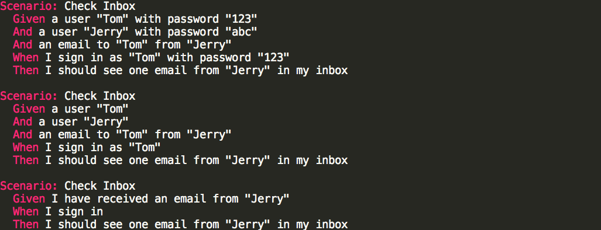
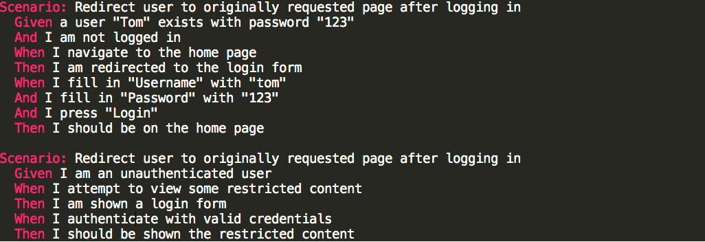
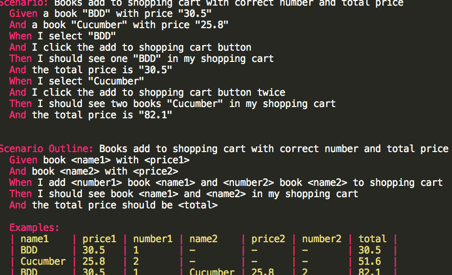

[如何说服你的同事使用TDD](https://zhuanlan.zhihu.com/p/31662844)

[TDD与BDD的差别](http://ilucas.me/2016/03/07/difference-between-tdd-and-bdd/)

### TDD (test driven development)
测试驱动开发是敏捷开发中的一项核心实践和技术。TDD的原理是在开发功能代码之前，先编写单元测试用例代码，测试代码确定需要编写什么产品代码。TDD的基本思路就是通过测试来推动整个开发的进行，但测试驱动开发并不只是单纯的测试工作，而是把需求分析，设计，质量控制量化的过程。TDD首先考虑使用需求（对象、功能、过程、接口等），主要是编写测试用例框架对功能的过程和接口进行设计，而测试框架可以持续进行验证。

#### concept
TDD 有广义和狭义之分，常说的是狭义的 TDD，也就是 UTDD（Unit Test Driven Development）。广义的 TDD 是 ATDD（Acceptance Test Driven Development），包括 BDD（Behavior Driven Development）和 Consumer-Driven Contracts Development 等。

简单的说，即在写任何功能代码之前，先写它的测试代码。具体步骤：
- 根据需要编写一个测试用例
- 运行这些测试，但这些测试明显都会失败，因为你并没有实现代码细节
- 编写功能代码，以让刚才的测试用例通过
- 逐步补充测试用例
- 修改功能代码使新增的测试用例和原来的都通过
- 重构，包括功能代码和测试用例

#### 为什么使用TDD
- 提前澄清需求
- 降低开发者负担
- 提高代码质量
- 快速反馈
- 改进设计
- 为功能代码提供了良好的文档，并能维护代码和文档的同步
- 在一定程度上可代替程序调试

传统编码方式
- 需求分析，想不清楚细节，管他呢，先开始写
- 发现需求细节不明确，去跟业务人员确认
- 确认好几次终于写完所有逻辑
- 运行起来测试一下，靠，果然不工作，调试
- 调试好久终于工作了
- 转测试，QA 测出 bug，debug， 打补丁
- 终于，代码可以工作了
- 一看代码烂的像坨屎，不敢动，动了还得手工测试，还得让 QA 测试，还得加班...

TDD 编码方式
- 先分解任务，分离关注点
- 列Example，用实例化需求，澄清需求细节
- 写测试，只关注需求，程序的输入输出，不关心中间过程
- 写实现，不考虑别的需求，用最简单的方式满足当前这个小需求即可
- 重构，用手法消除代码里的坏味道
- 写完，手动测试一下，基本没什么问题，有问题补个用例，修复
- 转测试，小问题，补用例，修复
- 代码整洁且用例齐全，信心满满地提交

#### TDD是测试，更是设计
当开始写单元测试代码时，其实也正在开发。在编写功能代码前，站在功能代码的使用者角度设计测试用例，运用针对接口编程等原则降低耦合度，改进设计。由此可见，TDD也是面向对象的分析，设计和开发方法。在贯彻TDD的开发过程中，对于每个类分别进行测试，对于每部分都进行简单设计，频繁重构，最终形成了一整套可运行的测试用例集，TDD体现持续改进的过程，是一种增量式设计。

#### TDD 的三条规则
1. 除非是为了使一个失败的unit test通过，否则不允许编写任何产品代码
2. 在一个单元测试中，只允许编写刚好能够导致失败的内容（编译错误也算失败）
3. 只允许编写刚好能够使一个失败的unit test通过的产品代码

### BDD (behavior driven development)
1. 关注的是业务领域，而不是技术：BDD强调用领域特定语言（DSL, domain specific language）描述用户行为，定义业务需求，而不会关心系统的技术实现。
2. 不是工具，强调的是一种协作方式：BDD要求各个角色共同参与系统行为的挖掘和定义，以实现对业务价值的一致理解。
3. 不是关于测试的：BDD源自TDD，又不同于TDD，重点不是关于测试的，但可以指导更好的做自动化测试。
4. 全栈敏捷方法：BDD促使团队所有角色从需求到最后的测试验证，进行高度的协作和沟通，以交付最有价值的功能。

TDD是测试驱动开发，ATDD是验收测试驱动开发，都是关于测试的，是与所开发的系统紧密联系的。而BDD则不同，前面提到过BDD不是关于测试的，着重关注需求、关注客户的业务价值，所描述的需求用例是可以独立于软件系统存在的，因为客户的业务是始终存在的，不取决于是否有软件系统来支撑。

#### 为什么使用BDD
1. 业务层抽取，业务语言描述
2. 技术人员可懂，自动化友好
3. 数据驱动，需求实例化

场景一：检查收件箱，可以看出第三个清晰明了且能体现业务价值，比较符合上面的要求

场景二：限制非法用户查看某些受限内容，BDD要强调什么（What），而不是怎么（How），第二个写的比较好

场景三：添加图书到购物车并计算总额

